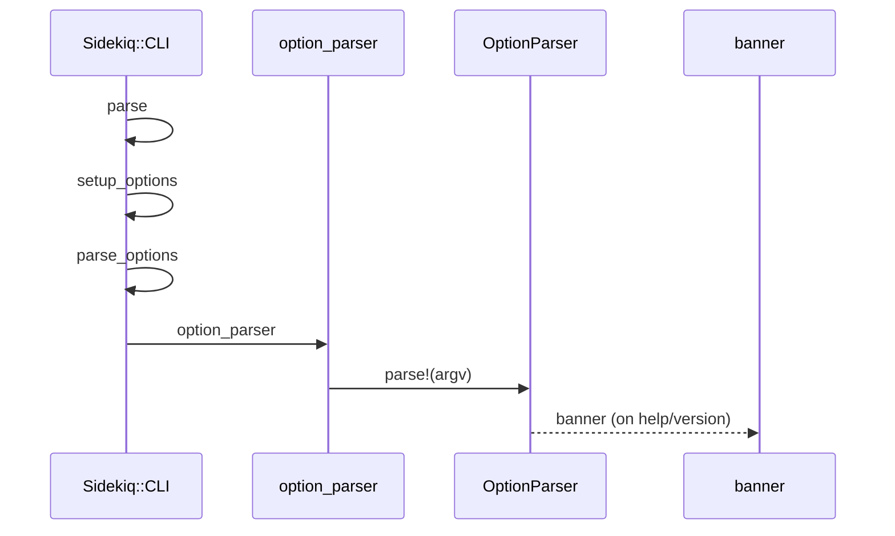
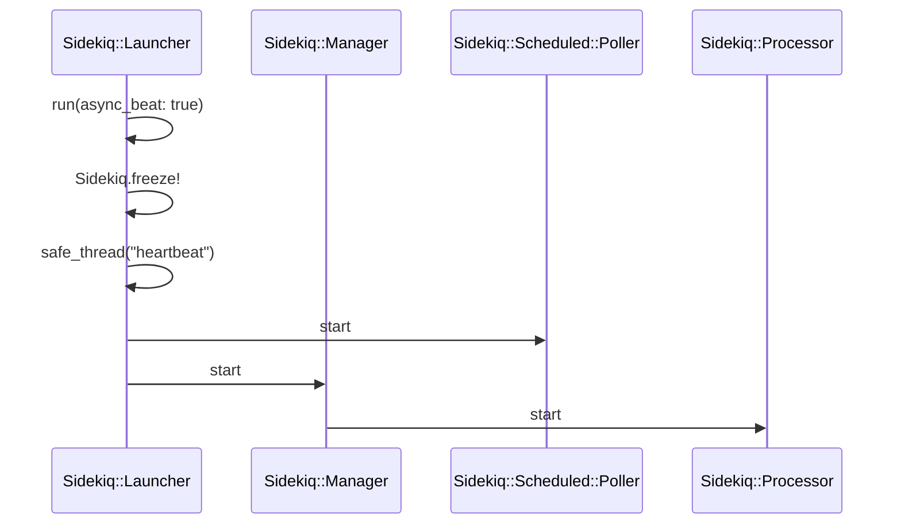
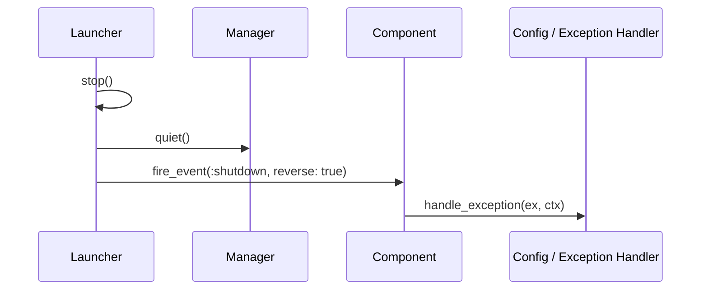

# Process Lifecycle

<details>
<summary>Relevant source files</summary>

The following files were used as context for generating this wiki page:

- [lib/sidekiq/cli.rb](https://github.com/sidekiq/sidekiq/blob/main/lib/sidekiq/cli.rb)
- [lib/sidekiq/launcher.rb](https://github.com/sidekiq/sidekiq/blob/main/lib/sidekiq/launcher.rb)
- [lib/sidekiq/processor.rb](https://github.com/sidekiq/sidekiq/blob/main/lib/sidekiq/processor.rb)
- [lib/sidekiq/api.rb](https://github.com/sidekiq/sidekiq/blob/main/lib/sidekiq/api.rb)
- [lib/sidekiq/manager.rb](https://github.com/sidekiq/sidekiq/blob/main/lib/sidekiq/manager.rb)
- [lib/sidekiq/tui.rb](https://github.com/sidekiq/sidekiq/blob/main/lib/sidekiq/tui.rb)
- [lib/sidekiq/monitor.rb](https://github.com/sidekiq/sidekiq/blob/main/lib/sidekiq/monitor.rb)
- [lib/sidekiq/sd_notify.rb](https://github.com/sidekiq/sidekiq/blob/main/lib/sidekiq/sd_notify.rb)
- [docs/internals.md](https://github.com/sidekiq/sidekiq/blob/main/docs/internals.md)
- [lib/sidekiq.rb](https://github.com/sidekiq/sidekiq/blob/main/lib/sidekiq.rb)
- [lib/sidekiq/embedded.rb](https://github.com/sidekiq/sidekiq/blob/main/lib/sidekiq/embedded.rb)
- [docs/capsule.md](https://github.com/sidekiq/sidekiq/blob/main/docs/capsule.md)
- [lib/sidekiq/rails.rb](https://github.com/sidekiq/sidekiq/blob/main/lib/sidekiq/rails.rb)
- [bare/boot.rb](https://github.com/sidekiq/bare/boot.rb)
- [myapp/config/puma.rb](https://github.com/sidekiq/myapp/config/puma.rb)
- [myapp/app/sidekiq/exit_job.rb](https://github.com/sidekiq/myapp/app/sidekiq/exit_job.rb)
- [myapp/app/jobs/exit_job.rb](https://github.com/sidekiq/myapp/app/jobs/exit_job.rb)
- [myapp/config/initializers/sidekiq.rb](https://github.com/sidekiq/myapp/config/initializers/sidekiq.rb)
- [lib/sidekiq/loader.rb](https://github.com/sidekiq/sidekiq/blob/main/lib/sidekiq/loader.rb)
- [lib/sidekiq/component.rb](https://github.com/sidekiq/sidekiq/blob/main/lib/sidekiq/component.rb)
</details>

## Overview

The process lifecycle governs how Sidekiq initializes options, coordinates execution threads, responds to system signals, and safely terminates workloads. By orchestrating components through structured startup, telemetry heartbeat loops, and graceful quiescence phases, Sidekiq ensures reliable background job processing across standalone deployments and embedded application runtimes.

Sources: [lib/sidekiq/cli.rb#L23-L143](https://github.com/sidekiq/sidekiq/blob/main/lib/sidekiq/cli.rb#L3-L143), [lib/sidekiq/launcher.rb#L25-L73](https://github.com/sidekiq/sidekiq/blob/main/lib/sidekiq/launcher.rb#L25-L73), [docs/internals.md#L15-L55](https://github.com/sidekiq/sidekiq/blob/main/docs/internals.md#L15-L55)

## CLI Boot and Option Parsing

### Overview

The Sidekiq command line interface boot sequence starts with argument parsing, loads YAML configuration files processed through ERB templates, resolves the execution environment, and validates critical path requirements before starting the worker infrastructure.

Sources: [lib/sidekiq/cli.rb#L23-L29](https://github.com/sidekiq/sidekiq/blob/main/lib/sidekiq/cli.rb#L23-L29), [lib/sidekiq/cli.rb#L261-L306](https://github.com/sidekiq/sidekiq/blob/main/lib/sidekiq/cli.rb#L261-L306)

### Call-Chain Execution Walkthroughs

Option parsing, option evaluation, and configuration loading proceed through explicit internal call chains:

1. `parse` initiates parsing by calling `setup_options`.

   Sources: [lib/sidekiq/cli.rb#L23-L29](https://github.com/sidekiq/sidekiq/blob/main/lib/sidekiq/cli.rb#L23-L29)
2. `setup_options` invokes `parse_options` to parse command-line arguments.

   Sources: [lib/sidekiq/cli.rb#L261-L265](https://github.com/sidekiq/sidekiq/blob/main/lib/sidekiq/cli.rb#L261-L265)
3. `parse_options` calls `option_parser` to construct the parser structure.

   Sources: [lib/sidekiq/cli.rb#L341-L346](https://github.com/sidekiq/sidekiq/blob/main/lib/sidekiq/cli.rb#L341-L346)
4. `option_parser` builds `OptionParser` rules and invokes `banner` when help or version flags trigger termination.

   Sources: [lib/sidekiq/cli.rb#L347-L396](https://github.com/sidekiq/sidekiq/blob/main/lib/sidekiq/cli.rb#L347-L396), [lib/sidekiq/cli.rb#L176-L190](https://github.com/sidekiq/sidekiq/blob/main/lib/sidekiq/cli.rb#L176-L190)

1. `parse` triggers configuration loading via `setup_options`.

   Sources: [lib/sidekiq/cli.rb#L23-L29](https://github.com/sidekiq/sidekiq/blob/main/lib/sidekiq/cli.rb#L23-L29)
2. `setup_options` evaluates `parse_config` when a YAML configuration file path is supplied.

   Sources: [lib/sidekiq/cli.rb#L285-L287](https://github.com/sidekiq/sidekiq/blob/main/lib/sidekiq/cli.rb#L285-L287)
3. `parse_config` reads the ERB template file, loads YAML data, and invokes symbolization helpers.

   Sources: [lib/sidekiq/cli.rb#L407-L423](https://github.com/sidekiq/sidekiq/blob/main/lib/sidekiq/cli.rb#L407-L423)
4. `symbolize_keys_deep!` recursively converts hash keys to symbols and calls `delete` to replace string keys.

   Sources: [lib/sidekiq/cli.rb#L250-L256](https://github.com/sidekiq/sidekiq/blob/main/lib/sidekiq/cli.rb#L250-L256)



Sources: [lib/sidekiq/cli.rb#L23-L29](https://github.com/sidekiq/sidekiq/blob/main/lib/sidekiq/cli.rb#L23-L29), [lib/sidekiq/cli.rb#L261-L306](https://github.com/sidekiq/sidekiq/blob/main/lib/sidekiq/cli.rb#L261-L306), [lib/sidekiq/cli.rb#L341-L396](https://github.com/sidekiq/sidekiq/blob/main/lib/sidekiq/cli.rb#L341-L396)

### Command-Line Options Table

| Flag | Long Flag | Description | Argument Type |
| :--- | :--- | :--- | :--- |
| `-c` | `--concurrency` | Processor threads to use | `INT` |
| `-e` | `--environment` | Application environment | `ENV` |
| `-g` | `--tag` | Process tag for procline | `TAG` |
| `-q` | `--queue` | Queues to process with optional weights | `QUEUE[,WEIGHT]` |
| `-r` | `--require` | Location of Rails app or file to require | `[PATH\|DIR]` |
| `-t` | `--timeout` | Shutdown timeout | `NUM` |
| `-v` | `--verbose` | Print more verbose output | None |
| `-C` | `--config` | Path to YAML config file | `PATH` |
| `-V` | `--version` | Print version and exit | None |
| `-h` | `--help` | Show help | None |

Sources: [lib/sidekiq/cli.rb#L349-L393](https://github.com/sidekiq/sidekiq/blob/main/lib/sidekiq/cli.rb#L349-L393)

### CLI Design Trade-Offs

| Design Choice | Benefit | Cost |
| :--- | :--- | :--- |
| ERB-evaluated YAML configuration files | Enables dynamic environment-based configuration values in deployment files | Requires parsing overhead and executing arbitrary embedded Ruby code blocks |
| Deep key symbolization on loaded options | Allows consistent hash lookup regardless of string or symbol keys from file inputs | Recurses through entire nested hash structures during startup initialization |
| Sequential fallback chain for environment variables (`APP_ENV`, `RAILS_ENV`, `RACK_ENV`) | Seamless compatibility across Rails, Sinatra, and custom rack application setups | Implicit precedence rules can obscure misconfigured environment sources |

Sources: [lib/sidekiq/cli.rb#L241-L248](https://github.com/sidekiq/sidekiq/blob/main/lib/sidekiq/cli.rb#L241-L248), [lib/sidekiq/cli.rb#L250-L256](https://github.com/sidekiq/sidekiq/blob/main/lib/sidekiq/cli.rb#L250-L256), [lib/sidekiq/cli.rb#L407-L423](https://github.com/sidekiq/sidekiq/blob/main/lib/sidekiq/cli.rb#L407-L423)

> [!NOTE]
> Environment fallback resolution prioritizes `APP_ENV`, then `RAILS_ENV`, then `RACK_ENV`, before defaulting to `"development"`.
> 
> Sources: [lib/sidekiq/cli.rb#L241-L248](https://github.com/sidekiq/sidekiq/blob/main/lib/sidekiq/cli.rb#L241-L248)

> [!WARNING]
> If a configuration file is not explicitly passed via `-C`, Sidekiq searches for `sidekiq.yml` or `sidekiq.yml.erb` inside the `config` directory derived from the require path.
> 
> Sources: [lib/sidekiq/cli.rb#L268-L283](https://github.com/sidekiq/sidekiq/blob/main/lib/sidekiq/cli.rb#L268-L283)

## Launcher Orchestration and Component Setup

### Overview

`Sidekiq::Launcher` acts as the top-level orchestrator that transitions the global configuration and capsule definitions into active runtime threads, processes, and poller schedules. During initialization, the Launcher receives a `Sidekiq::Config` instance and maps every configured capsule into a dedicated `Sidekiq::Manager`, while also instantiating a `Sidekiq::Scheduled::Poller`. Once invoked via `run`, it freezes the configuration state, starts the heartbeat thread (unless embedded), boots the scheduled job poller, and instructs each manager to start its worker pool.

Sources: [lib/sidekiq/launcher.rb#L25-L44](https://github.com/sidekiq/sidekiq/blob/main/lib/sidekiq/launcher.rb#L25-L44), [docs/capsule.md#L64-L66](https://github.com/sidekiq/sidekiq/blob/main/docs/capsule.md#L64-L66)

### Initialization and Execution Call Chain

When the process bootstrap finishes option parsing, execution flows directly into launcher instantiation and thread startup through the following call sequence:

1. `Sidekiq::Launcher#initialize(config, embedded: false)` — Iterates over `config.capsules.values` and constructs a `Sidekiq::Manager.new(cap)` for each capsule, while creating `Sidekiq::Scheduled::Poller.new(@config)`.

   Sources: [lib/sidekiq/launcher.rb#L25-L33](https://github.com/sidekiq/sidekiq/blob/main/lib/sidekiq/launcher.rb#L25-L33)

2. `Sidekiq::Launcher#run(async_beat: true)` — Freezes global configuration via `Sidekiq.freeze!`, spawns the heartbeat thread using `safe_thread("heartbeat", &method(:start_heartbeat))` when `async_beat` is true, starts the poller with `@poller.start`, and boots workers via `@managers.each(&:start)`.

   Sources: [lib/sidekiq/launcher.rb#L38-L44](https://github.com/sidekiq/sidekiq/blob/main/lib/sidekiq/launcher.rb#L38-L44)

3. `Sidekiq::Manager#start` — Iterates over its `@workers` set, invoking `Processor#start` on each worker instance to begin job fetching loops.

   Sources: [lib/sidekiq/manager.rb#L39-L41](https://github.com/sidekiq/manager.rb#L39-L41)

4. `Sidekiq::Component#safe_thread(name, priority: nil, &block)` — Wraps block execution inside a `Thread.new`, assigns `Thread.current.name = "sidekiq.#{name}"`, routes unhandled exceptions through `watchdog`, and sets thread priority using `config.thread_priority` or `DEFAULT_THREAD_PRIORITY` (-1).

   Sources: [lib/sidekiq/component.rb#L44-L49](https://github.com/sidekiq/sidekiq/blob/main/lib/sidekiq/component.rb#L44-L49)



Sources: [lib/sidekiq/launcher.rb#L38-L44](https://github.com/sidekiq/sidekiq/blob/main/lib/sidekiq/launcher.rb#L38-L44), [lib/sidekiq/manager.rb#L39-L41](https://github.com/sidekiq/manager.rb#L39-L41), [lib/sidekiq/component.rb#L44-L49](https://github.com/sidekiq/sidekiq/blob/main/lib/sidekiq/component.rb#L44-L49)

### Component Registry and Proctitle Structure

`Sidekiq::Launcher` and `Sidekiq::Manager` rely on shared component mixins and manage process telemetry through process title procs and lifecycle structures.

| Component Class / Constant | Attribute / Method | Purpose / Value |
| :--- | :--- | :--- |
| `Sidekiq::Launcher` | `STATS_TTL` | 5 years (`5 * 365 * 24 * 60 * 60`) expiration TTL for daily stats counters in Redis |
| `Sidekiq::Launcher` | `BEAT_PAUSE` | 10-second sleep pause between heartbeat iterations in `start_heartbeat` |
| `Sidekiq::Launcher` | `PROCTITLES` | Array of procs formatting `$0` process title (`sidekiq`, version, tag, busy worker count, stopping state) |
| `Sidekiq::Manager` | `PAUSE_TIME` | Dynamic pause time (`0.1` for tty/$stdout, `0.5` otherwise) used in shutdown `wait_for` loops |
| `Sidekiq::Component` | `DEFAULT_THREAD_PRIORITY` | `-1` (50ms timeslice) to mitigate thread starvation under high CPU concurrency |

Sources: [lib/sidekiq/launcher.rb#L13-L21](https://github.com/sidekiq/sidekiq/blob/main/lib/sidekiq/launcher.rb#L13-L21), [lib/sidekiq/launcher.rb#L87-L93](https://github.com/sidekiq/launcher.rb#L87-L93), [lib/sidekiq/manager.rb#L121-L122](https://github.com/sidekiq/manager.rb#L121-L122), [lib/sidekiq/component.rb#L19-L19](https://github.com/sidekiq/sidekiq/blob/main/lib/sidekiq/component.rb#L19-L19)

> [!WARNING]
> Once passed to `Sidekiq::Launcher`, the global configuration (`Sidekiq::Config`) and all associated capsules (`Sidekiq::Capsule`) must be treated as frozen and immutable. Modifying capsules after launching runtime worker pools can cause race conditions in Redis connection pools and queue bindings.
> 
> Sources: [docs/capsule.md#L64-L66](https://github.com/sidekiq/sidekiq/blob/main/docs/capsule.md#L64-L66)

> [!NOTE]
> `Sidekiq::Manager` monitors worker processors dynamically. If a processor terminates abnormally, its `processor_result` callback locks `@plock`, removes the dead worker, and spawns a replacement processor (`Processor.new`) as long as the manager is not stopping and active workers are below capsule concurrency.
> 
> Sources: [lib/sidekiq/manager.rb#L69-L79](https://github.com/sidekiq/manager.rb#L69-L79)

## Signal Handling and Heartbeat Telemetry

### Overview

Sidekiq traps system signals during CLI execution using an `IO.pipe` bridge. When a signal arrives, the trap handler writes the signal name to `self_write`. The main loop blocks on `self_read.wait_readable`, reads the signal name, and dispatches it via `handle_signal(signal)`. The registered signal handlers include `INT` and `TERM` which raise `Interrupt`, `TSTP` which quiets the launcher, and `TTIN` (along with legacy `INFO`) which dumps thread backtraces.

Sources: [lib/sidekiq/cli.rb#L50-L68](https://github.com/sidekiq/sidekiq/blob/main/lib/sidekiq/cli.rb#L50-L68), [lib/sidekiq/cli.rb#L127-L130](https://github.com/sidekiq/sidekiq/blob/main/lib/sidekiq/cli.rb#L127-L130), [lib/sidekiq/cli.rb#L193-L224](https://github.com/sidekiq/sidekiq/blob/main/lib/sidekiq/cli.rb#L193-L224)

Periodic heartbeat telemetry executes via `Sidekiq::Launcher#start_heartbeat`, looping every `BEAT_PAUSE` (10 seconds) to invoke `beat`. The `beat` method updates the process title (`$0`) using `PROCTITLES`, flushes accumulated stats counters (`Processor::PROCESSED` and `Processor::FAILURE`) to Redis, writes executing job states (`#{key}:work`), calculates round-trip time (RTT) to Redis via `check_rtt`, samples RSS memory usage, and updates the process hash in Redis with concurrency, busy count, and timestamps while popping any pending process-level signals.

Sources: [lib/sidekiq/launcher.rb#L87-L100](https://github.com/sidekiq/sidekiq/blob/main/lib/sidekiq/launcher.rb#L87-L100), [lib/sidekiq/launcher.rb#L141-L202](https://github.com/sidekiq/sidekiq/blob/main/lib/sidekiq/launcher.rb#L141-L202)

```mermaid
sequenceDiagram
    participant OS as Operating System
    participant TRAP as Signal Trap
    participant PIPE as IO.pipe
    participant LOOP as Launch Loop
    participant HNDLR as handle_signal

    OS->>TRAP: Send signal (TERM, TSTP, TTIN)
    TRAP->>PIPE: self_write.puts(sig)
    LOOP->>PIPE: self_read.wait_readable / gets
    PIPE-->>LOOP: signal string
    LOOP->>HNDLR: handle_signal(signal)
    HNDLR->>HNDLR: Lookup SIGNAL_HANDLERS and execute
```

Sources: [lib/sidekiq/cli.rb#L50-L68](https://github.com/sidekiq/sidekiq/blob/main/lib/sidekiq/cli.rb#L50-L68), [lib/sidekiq/cli.rb#L127-L130](https://github.com/sidekiq/sidekiq/blob/main/lib/sidekiq/cli.rb#L127-L130), [lib/sidekiq/cli.rb#L193-L231](https://github.com/sidekiq/sidekiq/blob/main/lib/sidekiq/cli.rb#L193-L231)

### Signal Handlers and Systemd Integration

The CLI maps incoming system signals to specific runtime actions through `SIGNAL_HANDLERS`. Additionally, `Sidekiq::SdNotify` provides a pure-Ruby implementation of `sd_notify(3)` to communicate lifecycle states directly to the systemd service manager over a Unix domain socket specified by `NOTIFY_SOCKET`.

Sources: [lib/sidekiq/cli.rb#L193-L224](https://github.com/sidekiq/sidekiq/blob/main/lib/sidekiq/cli.rb#L193-L224), [lib/sidekiq/sd_notify.rb#L30-L51](https://github.com/sidekiq/sd_notify.rb#L30-L51)

| Signal / Notification Constant | Action / State String | Purpose / Description |
| :--- | :--- | :--- |
| `"INT"` | `raise Interrupt` | Triggers graceful shutdown via keyboard interrupt (`Ctrl-C`) |
| `"TERM"` | `raise Interrupt` | Triggers graceful shutdown sent by orchestrators like Heroku or systemd |
| `"TSTP"` | `cli.launcher.quiet` | Stops accepting new work by putting capsule managers into quiet mode |
| `"TTIN"` | Thread backtrace dump | Logs thread IDs, names, and backtraces for debugging stuck threads |
| `"INFO"` | Thread backtrace dump | Legacy signal for backtrace dumps (warns that it does not work on Linux) |
| `Sidekiq::SdNotify::READY` | `"READY=1"` | Notifies systemd that service startup is complete |
| `Sidekiq::SdNotify::RELOADING`| `"RELOADING=1"` | Notifies systemd that the service is reloading configuration |
| `Sidekiq::SdNotify::STOPPING` | `"STOPPING=1"` | Notifies systemd that the service is beginning shutdown |

Sources: [lib/sidekiq/cli.rb#L193-L224](https://github.com/sidekiq/sidekiq/blob/main/lib/sidekiq/cli.rb#L193-L224), [lib/sidekiq/sd_notify.rb#L43-L50](https://github.com/sidekiq/sd_notify.rb#L43-L50)

> [!NOTE]
> Signal handlers in Ruby cannot safely invoke logging frameworks or perform heavy allocations. Sidekiq bypasses this limitation by writing signal names into an `IO.pipe` inside the trap block, allowing the main thread to read and process signals synchronously in a safe context.
> 
> Sources: [lib/sidekiq/cli.rb#L50-L65](https://github.com/sidekiq/sidekiq/blob/main/lib/sidekiq/cli.rb#L50-L65)

> [!WARNING]
> If Redis RTT readings exceed `RTT_WARNING_LEVEL` (50,000 microseconds) across five consecutive samples stored in `RTT_READINGS`, Sidekiq emits a warning log advising network optimization or concurrency reduction.
> 
> Sources: [lib/sidekiq/launcher.rb#L204-L232](https://github.com/sidekiq/sidekiq/blob/main/lib/sidekiq/launcher.rb#L204-L232)

## Quiescence and Graceful Shutdown Lifecycle

### Overview

The quiescence and graceful shutdown lifecycle handles the orderly transition of a Sidekiq process from active work processing to termination. This phase is orchestrated across `Sidekiq::Launcher`, `Sidekiq::Manager`, and `Sidekiq::Processor`, managing thread termination, fetcher shutdown, drain timeouts, and signal-based exceptions.

Sources: [lib/sidekiq/launcher.rb#L46-L72](https://github.com/sidekiq/sidekiq/blob/main/lib/sidekiq/launcher.rb#L46-L72), [lib/sidekiq/manager.rb#L43-L67](https://github.com/sidekiq/manager.rb#L43-L67), [lib/sidekiq/processor.rb#L45-L62](https://github.com/sidekiq/processor.rb#L45-L62)

### Call-Chain Execution Walkthrough

1. `stop` — Initiated on the `Sidekiq::Launcher`, calculates a deadline using `Process.clock_gettime(Process::CLOCK_MONOTONIC) + @config[:timeout]`, invokes `quiet`, spawns threads to call `mgr.stop(deadline)` for each capsule manager, fires the `:shutdown` event, joins stopper threads, clears the heartbeat, and fires the `:exit` event.

   Sources: [lib/sidekiq/launcher.rb#L56-L72](https://github.com/sidekiq/sidekiq/blob/main/lib/sidekiq/launcher.rb#L56-L72)

2. `quiet` — Sets `@done = true` on the launcher, loops through managers to call `mgr.quiet`, terminates the scheduled poller via `@poller.terminate`, and invokes `fire_event(:quiet, reverse: true)`.

   Sources: [lib/sidekiq/launcher.rb#L46-L54](https://github.com/sidekiq/sidekiq/blob/main/lib/sidekiq/launcher.rb#L46-L54)

3. `fire_event` — Looks up the array of blocks registered for a given lifecycle event (`event`), reverses the array order if `reverse: true` is set, and iterates over each block to execute it while rescuing and passing exceptions to `handle_exception`.

   Sources: [lib/sidekiq/component.rb#L82-L97](https://github.com/sidekiq/sidekiq/blob/main/lib/sidekiq/component.rb#L82-L97)

4. `handle_exception` — Delegates exception reporting directly to `config.handle_exception(ex, ctx)`.

   Sources: [lib/sidekiq/component.rb#L78-L80](https://github.com/sidekiq/sidekiq/blob/main/lib/sidekiq/component.rb#L78-L80)



Sources: [lib/sidekiq/launcher.rb#L56-L72](https://github.com/sidekiq/sidekiq/blob/main/lib/sidekiq/launcher.rb#L56-L72), [lib/sidekiq/component.rb#L78-L97](https://github.com/sidekiq/sidekiq/blob/main/lib/sidekiq/component.rb#L78-L97)

### Manager and Processor Shutdown Mechanics

When `Sidekiq::Manager#quiet` runs, it marks `@done = true` and invokes `Processor#terminate` on all worker threads, causing workers that fetch a new job to requeue it and exit rather than process it. During `stop(deadline)`, the manager pauses briefly via `PAUSE_TIME`, waits for worker threads to empty until the deadline is reached, and executes a `hard_shutdown` if workers remain busy.

Sources: [lib/sidekiq/manager.rb#L43-L64](https://github.com/sidekiq/manager.rb#L43-L64)

> [!WARNING]
> If busy worker threads do not finish processing within the configured shutdown timeout, `hard_shutdown` bulk-requeues their current jobs back to Redis to satisfy Sidekiq's at-least-once execution contract before calling `processor.kill` with a `Sidekiq::Shutdown` exception.
> 
> Sources: [lib/sidekiq/manager.rb#L87-L112](https://github.com/sidekiq/manager.rb#L87-L112)

| Method / Constant | Owner Class | Purpose / Action |
| :--- | :--- | :--- |
| `quiet` | `Sidekiq::Launcher` | Stops accepting new work, terminates poller, fires `:quiet` event |
| `stop` | `Sidekiq::Launcher` | Calculates timeout deadline, invokes `quiet`, stops managers, clears heartbeat |
| `terminate` | `Sidekiq::Processor` | Sets `@done = true`, joins thread if `wait` is true |
| `kill` | `Sidekiq::Processor` | Raises `Sidekiq::Shutdown` interrupt on the worker thread |
| `hard_shutdown` | `Sidekiq::Manager` | Bulk-requeues unfinished jobs to Redis and kills remaining busy threads |
| `PAUSE_TIME` | `Sidekiq::Manager` | TTY-dependent sleep interval (`0.1` for tty, `0.5` otherwise) for test/dev speed |

Sources: [lib/sidekiq/launcher.rb#L46-L72](https://github.com/sidekiq/sidekiq/blob/main/lib/sidekiq/launcher.rb#L46-L72), [lib/sidekiq/processor.rb#L45-L61](https://github.com/sidekiq/sidekiq/blob/main/lib/sidekiq/processor.rb#L45-L61), [lib/sidekiq/manager.rb#L43-L122](https://github.com/sidekiq/manager.rb#L43-L122)

### Shutdown Interrupt Handling Example

Processors wrap job execution in nested `Thread.handle_interrupt` blocks to control when `Sidekiq::Shutdown` exceptions take effect.

```ruby
IGNORE_SHUTDOWN_INTERRUPTS = {Sidekiq::Shutdown => :never}
ALLOW_SHUTDOWN_INTERRUPTS = {Sidekiq::Shutdown => :immediate}

Thread.handle_interrupt(IGNORE_SHUTDOWN_INTERRUPTS) do
  Thread.handle_interrupt(ALLOW_SHUTDOWN_INTERRUPTS) do
    # Job dispatch and execution run with immediate shutdown interrupt handling
    dispatch(job_hash, queue, jobstr) do |instance|
      config.server_middleware.invoke(instance, job_hash, queue) do
        execute_job(instance, job_hash["args"])
      end
    end
  end
end
```

Sources: [lib/sidekiq/processor.rb#L162-L195](https://github.com/sidekiq/sidekiq/blob/main/lib/sidekiq/processor.rb#L162-L195)

> [!NOTE]
> `Sidekiq::Processor#kill` raises `Sidekiq::Shutdown` asynchronously into the worker thread. The nested interrupt handlers ensure that critical sections can defer or immediately accept the shutdown signal depending on execution state.
> 
> Sources: [lib/sidekiq/processor.rb#L51-L61](https://github.com/sidekiq/processor.rb#L51-L61), [lib/sidekiq/processor.rb#L188-L195](https://github.com/sidekiq/processor.rb#L188-L195)

## Embedded Process and Application Integration

### Overview

Sidekiq supports running runners directly within arbitrary host processes, such as Puma web server workers, through `Sidekiq::Embedded`. Instead of utilizing `Sidekiq::CLI` to handle option parsing, application bootstrapping, and signal trapping, the hosting process assumes full responsibility for environment lifecycle management while Ruby code initializes and controls the embedded runner instance.

Sources: [lib/sidekiq/embedded.rb#L8-L24](https://github.com/sidekiq/embedded.rb#L8-L24), [docs/internals.md#L42-L48](https://github.com/sidekiq/sidekiq/blob/main/docs/internals.md#L42-L48)

### Puma and Application Process Integration

In environments like Puma, the integration is wired into cluster hooks. During worker boot via `on_worker_boot`, the application calls `Sidekiq.configure_embed` to configure queues and concurrency, and invokes `.run` on the returned component. Upon shutdown via `on_worker_shutdown`, `.stop` is invoked to cleanly terminate the embedded launcher.

Sources: [myapp/config/puma.rb#L45-L57](https://github.com/sidekiq/sidekiq/blob/main/myapp/config/puma.rb#L45-L57)

```ruby
x = nil
on_worker_boot do
  x = Sidekiq.configure_embed do |config|
    config.queues = %w[critical default low]
    config.concurrency = 2
  end
  x&.run
end

on_worker_shutdown do
  x&.stop
end
```

Sources: [myapp/config/puma.rb#L44-L57](https://github.com/sidekiq/sidekiq/blob/main/myapp/config/puma.rb#L44-L57)

### Embedded Initialization Call-Chain

When an embedded runner is executed, `Sidekiq::Embedded` executes a strict initialization sequence: `housekeeping` → `fire_event(:startup)` → `Sidekiq::Launcher.new` → `@launcher.run`.

Sources: [lib/sidekiq/embedded.rb#L15-L24](https://github.com/sidekiq/embedded.rb#L15-L24)

1. `housekeeping`: Sets default tags, logs Ruby descriptions and license info, touches connection pools by invoking `config.redis_info`, enforces a minimum Redis version requirement of `7.0.0`, warns if `maxmemory_policy` is not set to `noeviction`, and logs client/server middleware classes.

   Sources: [lib/sidekiq/embedded.rb#L16](https://github.com/sidekiq/embedded.rb#L16), [lib/sidekiq/embedded.rb#L36-L62](https://github.com/sidekiq/embedded.rb#L36-L62)
2. `fire_event(:startup, reverse: false, reraise: true)`: Fires startup hooks without reversing block execution order.

   Sources: [lib/sidekiq/embedded.rb#L17](https://github.com/sidekiq/embedded.rb#L17)
3. `Sidekiq::Launcher.new(@config, embedded: true)`: Instantiates the launcher with the `embedded: true` flag set.

   Sources: [lib/sidekiq/embedded.rb#L18](https://github.com/sidekiq/embedded.rb#L18)
4. `@launcher.run`: Spawns internal management threads and capsule managers.

   Sources: [lib/sidekiq/embedded.rb#L19](https://github.com/sidekiq/embedded.rb#L19)

> [!WARNING]
> Because embedded mode shares the Ruby process thread pool with the host web server (such as Puma), Sidekiq defaults embedded concurrency to a conservative value of `2`. Overloading thread counts relative to available CPU cores can severely degrade application performance.
> 
> Sources: [docs/internals.md#L49-L55](https://github.com/sidekiq/sidekiq/blob/main/docs/internals.md#L49-L55)

## Related

- [[Worker Processing]]
- [[Systemd Integration]]

