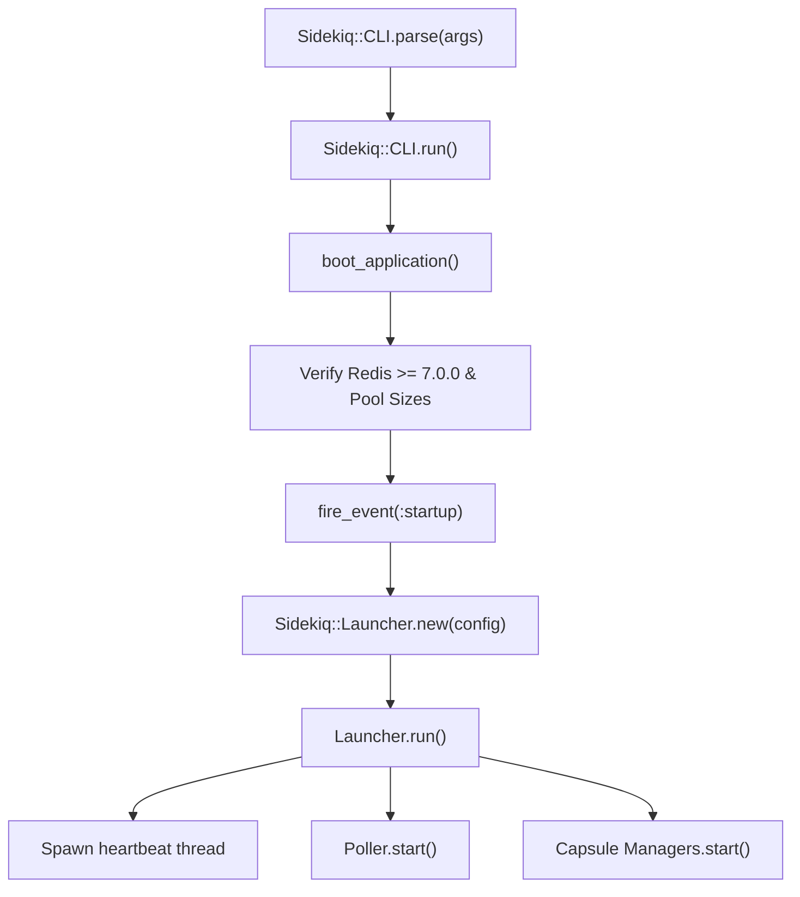
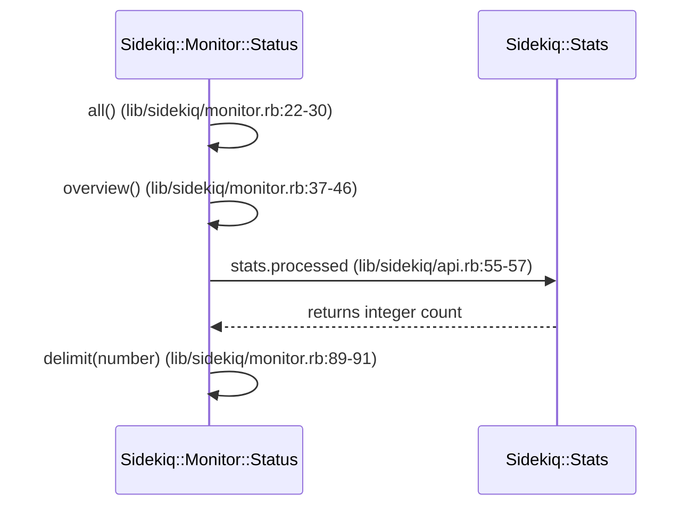

# Process Monitoring

<details>
<summary>Relevant source files</summary>

The following files were used as context for generating this wiki page:

- [lib/sidekiq/cli.rb](https://github.com/sidekiq/sidekiq/blob/main/lib/sidekiq/cli.rb)
- [lib/sidekiq/web/application.rb](https://github.com/sidekiq/sidekiq/blob/main/lib/sidekiq/web/application.rb)
- [lib/sidekiq/api.rb](https://github.com/sidekiq/sidekiq/blob/main/lib/sidekiq/api.rb)
- [lib/sidekiq/launcher.rb](https://github.com/sidekiq/sidekiq/blob/main/lib/sidekiq/launcher.rb)
- [lib/sidekiq/tui/tabs/busy.rb](https://github.com/sidekiq/sidekiq/blob/main/lib/sidekiq/tui/tabs/busy.rb)
- [lib/sidekiq/monitor.rb](https://github.com/sidekiq/sidekiq/blob/main/lib/sidekiq/monitor.rb)
- [lib/sidekiq/processor.rb](https://github.com/sidekiq/sidekiq/blob/main/lib/sidekiq/processor.rb)
- [lib/sidekiq/manager.rb](https://github.com/sidekiq/sidekiq/blob/main/lib/sidekiq/manager.rb)
- [README.md](https://github.com/sidekiq/sidekiq/blob/main/README.md)
- [lib/sidekiq/tui/tabs/home.rb](https://github.com/sidekiq/sidekiq/blob/main/lib/sidekiq/tui/tabs/home.rb)
- [lib/sidekiq/metrics/tracking.rb](https://github.com/sidekiq/sidekiq/blob/main/lib/sidekiq/metrics/tracking.rb)
- [docs/internals.md](https://github.com/sidekiq/sidekiq/blob/main/docs/internals.md)
- [myapp/config/initializers/sidekiq.rb](https://github.com/sidekiq/sidekiq/blob/main/myapp/config/initializers/sidekiq.rb)
- [lib/sidekiq/scheduled.rb](https://github.com/sidekiq/sidekiq/blob/main/lib/sidekiq/scheduled.rb)
- [lib/sidekiq/sd_notify.rb](https://github.com/sidekiq/sidekiq/blob/main/lib/sidekiq/sd_notify.rb)
- [lib/sidekiq/systemd.rb](https://github.com/sidekiq/sidekiq/blob/main/lib/sidekiq/systemd.rb)
- [lib/sidekiq/ring_buffer.rb](https://github.com/sidekiq/sidekiq/blob/main/lib/sidekiq/ring_buffer.rb)
- [lib/sidekiq/profiler.rb](https://github.com/sidekiq/sidekiq/blob/main/lib/sidekiq/profiler.rb)
</details>

## Overview

Process monitoring in Sidekiq manages process registration, periodic heartbeats, system state tracking, resource consumption monitoring, and lifecycle signal processing across worker clusters. At runtime, background instances run multiple worker threads organized into capsules while coordinating with Redis to publish status metadata, monitor network round-trip times (RTT), and report service states to external supervisors like systemd.

The primary objective of process monitoring is to guarantee fault isolation, prevent abandoned work, and maintain real-time visibility into cluster capacity without introducing high overhead. By leveraging heartbeat timeouts, atomic counter flushes, ring buffers for latency tracking, and Unix datagram notifications (`sd_notify`), Sidekiq enables automated process lifecycle management, quiet-down phases before shutdown, and live operational inspection through CLI, Web, and Terminal User Interfaces (TUI).

Sources: [lib/sidekiq/cli.rb:42-139](https://github.com/sidekiq/sidekiq/blob/main/lib/sidekiq/cli.rb#L42-L139), [lib/sidekiq/launcher.rb:25-72](https://github.com/sidekiq/sidekiq/blob/main/lib/sidekiq/launcher.rb#L25-L72), [lib/sidekiq/api.rb:984-1105](https://github.com/sidekiq/sidekiq/blob/main/lib/sidekiq/api.rb#L984-L1105), [docs/internals.md:15-55](https://github.com/sidekiq/sidekiq/blob/main/docs/internals.md#L15-L55)

## Process Bootstrapping and Startup Workflow

### Initialization Sequence

The entry point for process bootstrapping begins in `Sidekiq::CLI#parse`, which initializes logger settings, parses CLI flags or YAML configuration files, and validates mandatory configuration parameters.

Sources: [lib/sidekiq/cli.rb:23-29](https://github.com/sidekiq/sidekiq/blob/main/lib/sidekiq/cli.rb#L23-L29), [lib/sidekiq/cli.rb:261-306](https://github.com/sidekiq/sidekiq/blob/main/lib/sidekiq/cli.rb#L261-L306)

Process execution proceeds through `Sidekiq::CLI#run`, which orchestrates application booting, Redis pool verification, process identity assignment, and thread spawning:

```
boot_application → verify Redis version (>= 7.0.0) → verify pool sizes → cache identity → touch server_middleware → fire_event(:startup) → launch
```

Sources: [lib/sidekiq/cli.rb:42-115](https://github.com/sidekiq/sidekiq/blob/main/lib/sidekiq/cli.rb#L42-L115)

In `Sidekiq::CLI#launch`, the process instantiates a `Sidekiq::Launcher` and invokes `launcher.run`. `Launcher#run` freezes the configuration (`Sidekiq.freeze!`), spawns the asynchronous heartbeat thread (`start_heartbeat`), starts the scheduled poller (`@poller.start`), and starts processor managers across all defined capsules (`@managers.each(&:start)`).

Sources: [lib/sidekiq/cli.rb:117-125](https://github.com/sidekiq/sidekiq/blob/main/lib/sidekiq/cli.rb#L117-L125), [lib/sidekiq/launcher.rb:38-44](https://github.com/sidekiq/sidekiq/blob/main/lib/sidekiq/launcher.rb#L38-L44)

> [!NOTE]
> Pool sizes are strictly guarded prior to thread spawning: `@config.capsules.each_pair` enforces that every capsule's Redis connection pool size is at least equal to its concurrency setting (`raise ArgumentError, "Pool size too small..." if cap.redis_pool.size < cap.concurrency`), preventing connection starvation under parallel thread execution.

Sources: [lib/sidekiq/cli.rb:95-97](https://github.com/sidekiq/sidekiq/blob/main/lib/sidekiq/cli.rb#L95-L97)



Sources: [lib/sidekiq/cli.rb:23-115](https://github.com/sidekiq/sidekiq/blob/main/lib/sidekiq/cli.rb#L23-L115), [lib/sidekiq/launcher.rb:38-44](https://github.com/sidekiq/sidekiq/blob/main/lib/sidekiq/launcher.rb#L38-L44)

## Signal Handling and Systemd Integration

### Signal Trapping via Self-Pipe Pattern

Sidekiq trap signals directly within `Sidekiq::CLI#run` using an `IO.pipe` (`self_read`, `self_write`). Signal handlers catch Unix signals and write the signal string to `self_write`. The main thread blocks on `self_read.wait_readable` inside `launch` and delegates execution to `handle_signal(signal)`.

Sources: [lib/sidekiq/cli.rb:50-68](https://github.com/sidekiq/sidekiq/blob/main/lib/sidekiq/cli.rb#L50-L68), [lib/sidekiq/cli.rb:127-130](https://github.com/sidekiq/sidekiq/blob/main/lib/sidekiq/cli.rb#L127-L130)

| Signal | Map Key | Action / Handler Function | Behavior / Purpose |
| :--- | :--- | :--- | :--- |
| `INT` | `"INT"` | `->(cli) { raise Interrupt }` | Triggers graceful shutdown via launcher stop sequence |
| `TERM` | `"TERM"` | `->(cli) { raise Interrupt }` | Triggers graceful shutdown (default process termination) |
| `TSTP` | `"TSTP"` | `->(cli) { cli.launcher.quiet }` | Stops accepting new work across all capsule managers |
| `TTIN` | `"TTIN"` | `->(cli) { Thread.list.each ... }` | Logs thread IDs and current backtraces for debugging |
| `INFO` | `"INFO"` | `->(cli) { cli.logger.error ... }` | Emits deprecation warning on Linux, then dumps backtraces |

Sources: [lib/sidekiq/cli.rb:193-224](https://github.com/sidekiq/sidekiq/blob/main/lib/sidekiq/cli.rb#L193-L224)

### Systemd Datagram Socket Protocol

Sidekiq integrates with systemd using `Sidekiq::SdNotify`, sending UNIX datagram messages to the socket specified by `ENV["NOTIFY_SOCKET"]`.

| State Constant | String Value | Method | Description |
| :--- | :--- | :--- | :--- |
| `READY` | `"READY=1"` | `SdNotify.ready` | Informs systemd that boot and initialization are complete |
| `RELOADING` | `"RELOADING=1"` | `SdNotify.reloading` | Informs systemd that configuration is reloading |
| `STOPPING` | `"STOPPING=1"` | `SdNotify.stopping` | Informs systemd that process shutdown has started |
| `STATUS` | `"STATUS="` | `SdNotify.status(msg)` | Updates service state description string in systemd |
| `WATCHDOG` | `"WATCHDOG=1"` | `SdNotify.watchdog` | Keep-alive ping sent to systemd watchdog service |

Sources: [lib/sidekiq/sd_notify.rb:43-50](https://github.com/sidekiq/sidekiq/blob/main/lib/sidekiq/sd_notify.rb#L43-L50), [lib/sidekiq/sd_notify.rb:52-114](https://github.com/sidekiq/sidekiq/blob/main/lib/sidekiq/sd_notify.rb#L52-L114)

> [!WARNING]
> In `Sidekiq.start_watchdog`, the watchdog interval (`WATCHDOG_USEC`) is converted to seconds and halved (`ping_f = sec_f / 2`). If `WATCHDOG_USEC` is less than `1_000_000` microseconds (1 second), the method logs an error (`usec < 1_000_000`) and aborts thread creation to avoid overwhelming the systemd notification socket.

Sources: [lib/sidekiq/systemd.rb:10-26](https://github.com/sidekiq/sidekiq/blob/main/lib/sidekiq/systemd.rb#L10-L26)

## Heartbeat Mechanics and Ring Buffer Diagnostics

### Heartbeat Loop Mechanics

The heartbeat loop in `Sidekiq::Launcher#start_heartbeat` executes every 10 seconds (`BEAT_PAUSE = 10`), invoking `beat` which calls `❤`. When process titles are supported, `beat` formats `$0` using `PROCTITLES`.

Sources: [lib/sidekiq/launcher.rb:87-100](https://github.com/sidekiq/sidekiq/blob/main/lib/sidekiq/launcher.rb#L87-L100), [lib/sidekiq/launcher.rb:15-21](https://github.com/sidekiq/sidekiq/blob/main/lib/sidekiq/launcher.rb#L15-L21)

Inside `❤`, the process executes a multi-step update sequence:
1. Reaps idle Redis connections in capsule pools if `:redis_idle_timeout` is set.
2. Flushes accumulated job counters (`flush_stats`) to Redis keys `stat:processed` and `stat:failed`.
3. Snapshots current worker thread states from `Processor::WORK_STATE` and writes serialized JSON strings to the Redis hash `#{identity}:work`.
4. Measures Redis round-trip latency (`check_rtt`).
5. Fetches process memory usage (`memory_usage(::Process.pid)`).
6. Executes a Redis `multi` transaction updating the `processes` set and setting process metadata in key `identity` with a 60-second expiration (`expire(key, 60)`).
7. Checks for pending signals pushed to `#{identity}-signals` and fires process signals via `::Process.kill(signal, ::Process.pid)` if running non-embedded.

Sources: [lib/sidekiq/launcher.rb:141-194](https://github.com/sidekiq/sidekiq/blob/main/lib/sidekiq/launcher.rb#L141-L194)

### Ring Buffer and RTT Latency Monitoring

Redis latency is monitored during each heartbeat using `Sidekiq::RingBuffer`, a fixed-length circular buffer.

Sources: [lib/sidekiq/launcher.rb:207-233](https://github.com/sidekiq/sidekiq/blob/main/lib/sidekiq/launcher.rb#L207-L233), [lib/sidekiq/ring_buffer.rb:6-31](https://github.com/sidekiq/sidekiq/blob/main/lib/sidekiq/ring_buffer.rb#L6-L31)

```ruby
# Diagnostic RTT check in Sidekiq::Launcher
RTT_READINGS = RingBuffer.new(5)
RTT_WARNING_LEVEL = 50_000 # 50,000 microseconds (50ms)

def check_rtt
  a = b = 0
  redis do |x|
    a = ::Process.clock_gettime(::Process::CLOCK_MONOTONIC, :microsecond)
    x.ping
    b = ::Process.clock_gettime(::Process::CLOCK_MONOTONIC, :microsecond)
  end
  rtt = b - a
  RTT_READINGS << rtt
  if RTT_READINGS.all? { |x| x > RTT_WARNING_LEVEL }
    logger.warn "Your Redis network connection appears to be performing poorly..."
    RTT_READINGS.reset
  end
  rtt
end
```

Sources: [lib/sidekiq/launcher.rb:207-233](https://github.com/sidekiq/sidekiq/blob/main/lib/sidekiq/launcher.rb#L207-L233)

> [!NOTE]
> `RingBuffer#<<` uses modulo arithmetic (`@buf[@index % @size] = element`) to maintain a constant memory footprint without reallocating arrays during continuous monitoring.

Sources: [lib/sidekiq/ring_buffer.rb:18-22](https://github.com/sidekiq/sidekiq/blob/main/lib/sidekiq/ring_buffer.rb#L18-L22)

## Process Status and Web Monitoring API

### Status Reporting Call-Chain Execution Walkthrough

When generating a process and cluster status report via `Sidekiq::Monitor::Status#display("all")`, execution follows the verified call chain: `all` → `overview` → `delimit`.

1. `Sidekiq::Monitor::Status#all` ([lib/sidekiq/monitor.rb:22-30](https://github.com/sidekiq/sidekiq/blob/main/lib/sidekiq/monitor.rb#L22-L30)) executes `version`, prints newlines, calls `overview`, calls `processes`, and finally calls `queues`.
2. `Sidekiq::Monitor::Status#overview` ([lib/sidekiq/monitor.rb:37-46](https://github.com/sidekiq/sidekiq/blob/main/lib/sidekiq/monitor.rb#L37-L46)) queries cluster statistics from `stats` (`Sidekiq::Stats.new`) including `processed`, `failed`, `workers_size`, `enqueued`, `retry_size`, `scheduled_size`, and `dead_size`.
3. For each retrieved numerical statistic, `overview` invokes `delimit(number)` ([lib/sidekiq/monitor.rb:89-91](https://github.com/sidekiq/sidekiq/blob/main/lib/sidekiq/monitor.rb#L89-L91)), which formats integers into comma-delimited strings using `number.to_s.reverse.scan(/.{1,3}/).join(",").reverse`.



Sources: [lib/sidekiq/monitor.rb:22-46](https://github.com/sidekiq/sidekiq/blob/main/lib/sidekiq/monitor.rb#L22-L46), [lib/sidekiq/monitor.rb:89-91](https://github.com/sidekiq/sidekiq/blob/main/lib/sidekiq/monitor.rb#L89-L91), [lib/sidekiq/api.rb:55-57](https://github.com/sidekiq/sidekiq/blob/main/lib/sidekiq/api.rb#L55-L57)

### Web Application Monitoring Endpoints

The Web UI application in `Sidekiq::Web::Application` exposes HTTP routes to query metrics and control process states asynchronously.

| HTTP Method & Route | Action / Handler | Operation Description |
| :--- | :--- | :--- |
| `GET /stats` | `get "/stats"` | Returns JSON with Sidekiq stats (`processed`, `failed`, `busy`, `enqueued`, queue latency) and Redis metrics. |
| `GET /busy` | `get "/busy"` | Fetches current process set and active workset jobs, paginating results for display. |
| `POST /busy` | `post "/busy"` | Sends asynchronous `quiet!` or `stop!` signals to target process identities via Redis. |
| `GET /queues` | `get "/queues"` | Lists all active Redis queues, sizes, and default queue latencies. |

Sources: [lib/sidekiq/web/application.rb:91-125](https://github.com/sidekiq/sidekiq/blob/main/lib/sidekiq/web/application.rb#L91-L125), [lib/sidekiq/web/application.rb:348-368](https://github.com/sidekiq/sidekiq/blob/main/lib/sidekiq/web/application.rb#L348-L368)

### Process Control Signal Dispatch

When issuing process signals via the Web UI (`POST /busy`) or the `Sidekiq::Process` API, signals are stored in Redis lists instead of directly killing processes across hosts:

```ruby
# Sidekiq::Process signal dispatch implementation
def signal(sig)
  key = "#{identity}-signals"
  Sidekiq.redis do |c|
    c.multi do |transaction|
      transaction.lpush(key, sig)
      transaction.expire(key, 60)
    end
  end
end
```

Sources: [lib/sidekiq/api.rb:1225-1233](https://github.com/sidekiq/sidekiq/blob/main/lib/sidekiq/api.rb#L1225-L1233)

> [!CAUTION]
> Embedded processes cannot be quieted or stopped remotely via API or Web UI. Methods `Process#quiet!` and `Process#stop!` explicitly check `embedded?` and raise an error (`raise "Can't quiet an embedded process" if embedded?`), requiring the host application lifecycle to manage process termination.

Sources: [lib/sidekiq/api.rb:1190-1204](https://github.com/sidekiq/sidekiq/blob/main/lib/sidekiq/api.rb#L1190-L1204)

### Design Trade-offs in Monitoring Architecture

| Design Choice | Benefit | Cost |
| :--- | :--- | :--- |
| Asynchronous Redis signal queues (`#{identity}-signals`) | Allows cross-host process control without SSH or direct network IPC | Signals take up to 10 seconds (one heartbeat interval) to be processed |
| Self-pipe pattern for process signal handling | Avoids unsafe operations inside Ruby signal traps by deferring to main loop | Requires dedicated pipe IO waiting loop on main process thread |
| Pipelined Redis hash fetches in `ProcessSet#each` | Minimizes network round-trips when fetching metadata across worker nodes | Consumes client memory when parsing large pipeline result sets |

Sources: [lib/sidekiq/cli.rb:50-68](https://github.com/sidekiq/sidekiq/blob/main/lib/sidekiq/cli.rb#L50-L68), [lib/sidekiq/api.rb:1040-1066](https://github.com/sidekiq/sidekiq/blob/main/lib/sidekiq/api.rb#L1040-L1066), [lib/sidekiq/api.rb:1225-1233](https://github.com/sidekiq/sidekiq/blob/main/lib/sidekiq/api.rb#L1225-L1233)

## Execution Profiling and Performance Metrics

### Execution Metrics Pipeline

Sidekiq tracks job execution times using `Sidekiq::Metrics::ExecutionTracker` and server middleware `Sidekiq::Metrics::Middleware`.

Sources: [lib/sidekiq/metrics/tracking.rb:10-153](https://github.com/sidekiq/sidekiq/blob/main/lib/sidekiq/metrics/tracking.rb#L10-L153)

```
Job Execution -> ExecutionTracker#track -> Measure mono_ms -> Job Block Execution -> track_time(klass, time_ms) -> Record in Histogram
```

Sources: [lib/sidekiq/metrics/tracking.rb:21-51](https://github.com/sidekiq/sidekiq/blob/main/lib/sidekiq/metrics/tracking.rb#L21-L51)

`ExecutionTracker#track` captures monotonic start and finish times (`mono_ms`). Successful executions invoke `track_time`, which updates timing histograms (`@grams[klass].record_time`) and updates execution totals inside a `Mutex` lock (`@lock.synchronize`). Flushes occur on `:beat` and `:exit` events, writing metrics into short-term (8 hours) and mid-term (3 days) Redis keys.

Sources: [lib/sidekiq/metrics/tracking.rb:21-100](https://github.com/sidekiq/sidekiq/blob/main/lib/sidekiq/metrics/tracking.rb#L21-L100), [lib/sidekiq/metrics/tracking.rb:147-152](https://github.com/sidekiq/sidekiq/blob/main/lib/sidekiq/metrics/tracking.rb#L147-L152)

### On-Demand Job Profiling

When a job hash contains a `"profile"` token, `Processor` delegates execution to `Sidekiq::Profiler#call`.

Sources: [lib/sidekiq/processor.rb:123-126](https://github.com/sidekiq/sidekiq/blob/main/lib/sidekiq/processor.rb#L123-L126), [lib/sidekiq/profiler.rb:20-63](https://github.com/sidekiq/sidekiq/blob/main/lib/sidekiq/profiler.rb#L20-L63)

```ruby
# Profiling execution in Sidekiq::Profiler
def call(job, &block)
  return yield unless job["profile"]
  token = job["profile"]
  type = job["wrapped"] || job["class"]
  jid = job["jid"]
  started_at = Time.now

  rundata = {
    started_at: started_at.to_i,
    token: token,
    type: type,
    jid: jid,
    filename: File.join(@vernier_output_dir, "#{token}-#{type}-#{jid}-#{started_at.strftime("%Y%m%d-%H%M%S")}.json.gz")
  }
  profiler_options = profiler_options(job, rundata)

  require "vernier"
  begin
    a = Time.now
    rc = Vernier.profile(**profiler_options, &block)
    b = Time.now

    key = "#{token}-#{jid}"
    data = File.read(rundata[:filename])
    redis do |conn|
      conn.multi do |m|
        m.zadd("profiles", Time.now.to_f + EXPIRY, key)
        m.hset(key, rundata.merge(elapsed: (b - a), data: data, size: data.bytesize))
        m.expire(key, EXPIRY)
      end
    end
    rc
  ensure
    FileUtils.rm_f(rundata[:filename])
  end
end
```

Sources: [lib/sidekiq/profiler.rb:20-63](https://github.com/sidekiq/sidekiq/blob/main/lib/sidekiq/profiler.rb#L20-L63)

> [!TIP]
> Profiler results are automatically cleaned up from disk in an `ensure` block (`FileUtils.rm_f(rundata[:filename])`), ensuring profile data exists on the filesystem only during reading and Redis persistence.

Sources: [lib/sidekiq/profiler.rb:59-61](https://github.com/sidekiq/sidekiq/blob/main/lib/sidekiq/profiler.rb#L59-L61)

## Terminal Interface Process Monitoring

### Interactive TUI Process Monitoring

Sidekiq provides an interactive Terminal User Interface tab (`Sidekiq::TUI::Tabs::Busy`) for live process oversight.

Sources: [lib/sidekiq/tui/tabs/busy.rb:6-104](https://github.com/sidekiq/sidekiq/blob/main/lib/sidekiq/tui/tabs/busy.rb#L6-L104)

```ruby
# TUI Data Refresh Loop for Active Processes
def refresh_data
  refresh_data_for_stats
  busy = []
  table_row_ids = []

  Sidekiq::ProcessSet.new.each do |p|
    name = "#{p["hostname"]}:#{p["pid"]}"
    name += " ⭐️" if p.leader?
    name += " 🛑" if p.stopping?
    busy << [
      selected?(p) ? "✅" : "",
      name,
      Time.at(p["started_at"]).utc,
      format_memory(p["rss"].to_i),
      number_with_delimiter(p["concurrency"]),
      number_with_delimiter(p["busy"])
    ]
    table_row_ids << p.identity
  end

  @data[:busy] = busy
  @data[:table] = {row_ids: table_row_ids}
end
```

Sources: [lib/sidekiq/tui/tabs/busy.rb:30-53](https://github.com/sidekiq/sidekiq/blob/main/lib/sidekiq/tui/tabs/busy.rb#L30-L53)

### TUI Keyboard Controls

| Key Shortcut | Modifier | Action | Executed Code Path |
| :--- | :--- | :--- | :--- |
| `Q` | `shift` | Quiet Process | `each_selection { \|id\| Sidekiq::Process.new("identity" => id).quiet! }` |
| `T` | `shift` | Terminate Process | `each_selection { \|id\| Sidekiq::Process.new("identity" => id).stop! }` |

Sources: [lib/sidekiq/tui/tabs/busy.rb:11-28](https://github.com/sidekiq/sidekiq/blob/main/lib/sidekiq/tui/tabs/busy.rb#L11-L28)

## Programmatic API Example

The following runnable example demonstrates how to use `Sidekiq::ProcessSet`, `Sidekiq::WorkSet`, and `Sidekiq::Stats` to programmatically monitor process health, calculate utilization percentages, and inspect active worker threads.

```ruby
require "sidekiq"
require "sidekiq/api"

# 1. Fetch cluster-wide aggregate statistics
stats = Sidekiq::Stats.new
puts "Cluster Stats:"
puts "  Processed : #{stats.processed}"
puts "  Failed    : #{stats.failed}"
puts "  Enqueued  : #{stats.enqueued}"
puts "  Processes : #{stats.processes_size}"
puts "  Workers   : #{stats.workers_size}"

# 2. Iterate through registered active Sidekiq processes
puts "\nRegistered Processes:"
processes = Sidekiq::ProcessSet.new
processes.each do |process|
  puts "Process Identity : #{process.identity}"
  puts "  Hostname       : #{process['hostname']} (PID: #{process['pid']})"
  puts "  Concurrency    : #{process['concurrency']}"
  puts "  Busy Threads   : #{process['busy']}"
  puts "  Memory (RSS)   : #{process['rss']} KB"
  puts "  Stopping?      : #{process.stopping?}"
end

# 3. Calculate cluster capacity utilization
total_concurrency = processes.total_concurrency
active_work = Sidekiq::WorkSet.new.size
utilization = total_concurrency.zero? ? 0 : ((active_work / total_concurrency.to_f) * 100).round(1)

puts "\nCluster Utilization: #{utilization}% (#{active_work}/#{total_concurrency} threads busy)"
```

Sources: [lib/sidekiq/api.rb:42-213](https://github.com/sidekiq/sidekiq/blob/main/lib/sidekiq/api.rb#L42-L213), [lib/sidekiq/api.rb:984-1105](https://github.com/sidekiq/sidekiq/blob/main/lib/sidekiq/api.rb#L984-L1105), [lib/sidekiq/api.rb:1255-1301](https://github.com/sidekiq/sidekiq/blob/main/lib/sidekiq/api.rb#L1255-L1301)

## Related

- [[Process Lifecycle]]
- [[Metrics Query Collection]]

