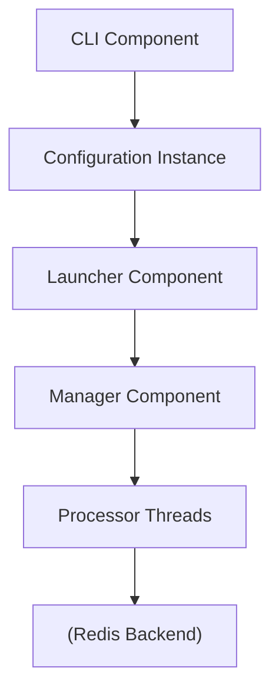
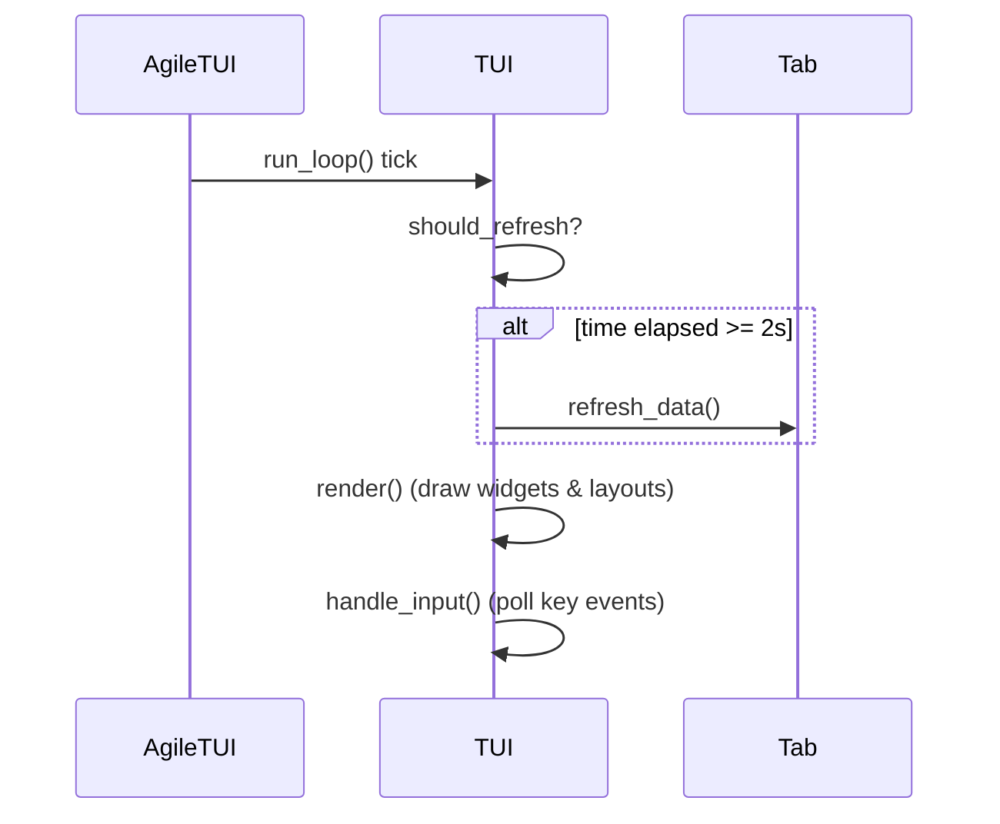

# Project Structure

<details>
<summary>Relevant source files</summary>

The following files were used as context for generating this wiki page:

- [lib/sidekiq/web/application.rb](https://github.com/sidekiq/sidekiq/blob/main/lib/sidekiq/web/application.rb)
- [lib/sidekiq/tui.rb](https://github.com/sidekiq/sidekiq/blob/main/lib/sidekiq/tui.rb)
- [lib/sidekiq/web.rb](https://github.com/sidekiq/sidekiq/blob/main/lib/sidekiq/web.rb)
- [lib/sidekiq/api.rb](https://github.com/sidekiq/sidekiq/blob/main/lib/sidekiq/api.rb)
- [lib/sidekiq/tui/tabs/home.rb](https://github.com/sidekiq/sidekiq/blob/main/lib/sidekiq/tui/tabs/home.rb)
- [lib/sidekiq/monitor.rb](https://github.com/sidekiq/sidekiq/blob/main/lib/sidekiq/monitor.rb)
- [lib/sidekiq/web/helpers.rb](https://github.com/sidekiq/sidekiq/blob/main/lib/sidekiq/web/helpers.rb)
- [web/assets/javascripts/application.js](https://github.com/sidekiq/sidekiq/blob/main/web/assets/javascripts/application.js)
- [lib/sidekiq/middleware/chain.rb](https://github.com/sidekiq/sidekiq/blob/main/lib/sidekiq/middleware/chain.rb)
- [docs/internals.md](https://github.com/sidekiq/sidekiq/blob/main/docs/internals.md)
- [lib/sidekiq/web/config.rb](https://github.com/sidekiq/sidekiq/blob/main/lib/sidekiq/web/config.rb)
- [lib/sidekiq/rails.rb](https://github.com/sidekiq/sidekiq/blob/main/lib/sidekiq/rails.rb)
- [docs/sdlc.md](https://github.com/sidekiq/sidekiq/blob/main/docs/sdlc.md)
- [lib/sidekiq/web/action.rb](https://github.com/sidekiq/sidekiq/blob/main/lib/sidekiq/web/action.rb)
- [lib/sidekiq/web/router.rb](https://github.com/sidekiq/sidekiq/blob/main/lib/sidekiq/web/router.rb)
- [lib/sidekiq/tui/tabs/base_tab.rb](https://github.com/sidekiq/sidekiq/blob/main/lib/sidekiq/tui/tabs/base_tab.rb)
- [lib/sidekiq.rb](https://github.com/sidekiq/sidekiq/blob/main/lib/sidekiq.rb)
- [lib/sidekiq/tui/tabs.rb](https://github.com/sidekiq/sidekiq/blob/main/lib/sidekiq/tui/tabs.rb)
- [docs/webui.md](https://github.com/sidekiq/sidekiq/blob/main/docs/webui.md)
- [docs/menu.md](https://github.com/sidekiq/sidekiq/blob/main/docs/menu.md)
- [lib/sidekiq/tui/controls.rb](https://github.com/sidekiq/sidekiq/blob/main/lib/sidekiq/tui/controls.rb)
- [lib/sidekiq/tui/tabs/retries.rb](https://github.com/sidekiq/sidekiq/blob/main/lib/sidekiq/tui/tabs/retries.rb)
- [lib/sidekiq/tui/tabs/scheduled.rb](https://github.com/sidekiq/sidekiq/blob/main/lib/sidekiq/tui/tabs/scheduled.rb)
- [lib/sidekiq/tui/tabs/dead.rb](https://github.com/sidekiq/sidekiq/blob/main/lib/sidekiq/tui/tabs/dead.rb)
- [docs/capsule.md](https://github.com/sidekiq/capsule.md)
- [myapp/config/routes.rb](https://github.com/sidekiq/myapp/config/routes.rb)
- [README.md](https://github.com/sidekiq/sidekiq/blob/main/README.md)
- [lib/sidekiq/test_api.rb](https://github.com/sidekiq/sidekiq/blob/main/lib/sidekiq/test_api.rb)
</details>

## Overview

The project structure of Sidekiq is organized around a clean separation of concerns, dividing runtime execution, persistent data manipulation, web management interfaces, and terminal tooling into dedicated modules and namespaces under the `lib/` directory. At the foundation, core architectural concepts organize system execution and resource pools. Surrounding this core engine are specialized subsystems including the data layer (`lib/sidekiq/api.rb`), the Rack-based Web UI (`lib/sidekiq/web.rb`), the Ratatui-backed Terminal User Interface (`lib/sidekiq/tui.rb`), and extensible middleware execution chains (`lib/sidekiq/middleware/chain.rb`).

This modular architecture encapsulates Redis connections, logger instances, and middleware stacks within bounded components. Architectural design decisions emphasize performance and safety: server-side execution avoids data querying utilities entirely to interact with Redis with maximum efficiency, while the Web UI leverages strict separation between route parameters and query parameters to prevent injection vulnerabilities. Additionally, per-request Content-Security-Policy nonces protect web assets, and modular tab architectures in both web and TUI layers make it straightforward to extend Sidekiq with custom monitoring panels or administrative extensions.

Sources: [lib/sidekiq/api.rb:8-16](https://github.com/sidekiq/sidekiq/blob/main/lib/sidekiq/api.rb#L8-L16)

Sources: [lib/sidekiq/web.rb:11-30](https://github.com/sidekiq/sidekiq/blob/main/lib/sidekiq/web.rb#L11-L30)

Sources: [docs/capsule.md:15-38](https://github.com/sidekiq/sidekiq/blob/main/docs/capsule.md#L15-L38)

## Core Engine and Configuration Architecture

The core engine layout centres on initialization, thread management, and resource isolation. The top-level `lib/sidekiq.rb` file establishes runtime environment requirements (requiring Ruby 3.2+), synchronizes major version checks for commercial extensions (`sidekiq-pro` and `sidekiq-ent`), and defines helper methods for global configuration, JSON serialization, and Redis connection pooling. 

Sources: [lib/sidekiq.rb:2-84](https://github.com/sidekiq/sidekiq/blob/main/lib/sidekiq.rb#L2-L84)

The transition toward encapsulated configurations is anchored by configuration and component modules. Resources represent the set of resources necessary to process a set of queues. Each component manages its own Redis connection pool along with an independent middleware chain.

Sources: [docs/capsule.md:46-71](https://github.com/sidekiq/sidekiq/blob/main/docs/capsule.md#L46-L71)



Sources: [docs/internals.md:26-37](https://github.com/sidekiq/sidekiq/blob/main/docs/internals.md#L26-L37)

> [!NOTE]
> Sidekiq enforces an iron-clad rule: all execution components within a single Sidekiq process must interact with the exact same Redis instance. Processing jobs across multiple separate Redis backends requires running entirely separate Sidekiq processes.

Sources: [docs/capsule.md:67-71](https://github.com/sidekiq/capsule.md#L67-L71)

## Data API and Object Models

The data management code implemented in `lib/sidekiq/api.rb` provides a comprehensive Ruby object model over Sidekiq's persistent Redis keys. It exposes classes for inspecting queues, job sets, active worker threads, and process health. To maintain maximum performance during job execution, server-side worker threads never use this API; data manipulation is executed directly against Redis primitives.

Sources: [lib/sidekiq/api.rb:8-16](https://github.com/sidekiq/sidekiq/blob/main/lib/sidekiq/api.rb#L8-L16)

The object model organizes Redis structures into cohesive classes such as stats wrappers, queue wrappers, job record wrappers, sorted entries, job sets, process sets, and work sets. 

Sources: [lib/sidekiq/api.rb:44-85](https://github.com/sidekiq/sidekiq/blob/main/lib/sidekiq/api.rb#L44-L85)

| Class / Module | Underlying Redis Key / Structure | Primary Purpose |
| :--- | :--- | :--- |
| Stats Utility | `stat:processed`, `stat:failed`, `schedule`, `retry`, `dead`, `processes`, `queues` | Aggregates cluster-wide runtime metrics and queue lengths via pipelined Redis queries. |
| Queue Utility | `queue:{name}`, `queues` | Enumerates pending jobs in a specific queue and calculates real-time latency. |
| Job Record | JSON payload string | Represents an immutable job instance, extracting attributes like `jid`, `klass`, `args`, and backtraces. |
| Sorted Entry | Sorted sets (`schedule`, `retry`, `dead`) | Represents timed entries in sorted sets supporting rescheduling, deletion, or manual enqueuing. |
| Process Set | `processes`, `{identity}` hash | Tracks active Sidekiq processes via 5-second heartbeats and process metadata. |
| Work Set | `{identity}:work` hash | Inspects real-time worker thread execution status across processes. |

Sources: [lib/sidekiq/api.rb:273-312](https://github.com/sidekiq/sidekiq/blob/main/lib/sidekiq/api.rb#L273-312)

## Middleware Chain Subsystem

Middleware execution is structured around `lib/sidekiq/middleware/chain.rb`, mirroring the architectural patterns of Rack middleware. Middleware components execute surrounding client-side job pushes and server-side job execution. 

Sources: [lib/sidekiq/middleware/chain.rb:6-10](https://github.com/sidekiq/middleware/chain.rb#L6-L10)

When configuring middleware, developers add classes to client or server chains. Sidekiq instantiates a clean copy of each middleware class for every job execution to prevent state leakage across threads.

Sources: [lib/sidekiq/middleware/chain.rb:12-15](https://github.com/sidekiq/middleware/chain.rb#L12-L15)

```ruby
Sidekiq.configure_server do |config|
  config.server_middleware do |chain|
    chain.add MyServerHook
    chain.insert_before ActiveRecord, MyPrecedingHook
  end
end
```

Sources: [lib/sidekiq/middleware/chain.rb:25-33](https://github.com/sidekiq/middleware/chain.rb#L25-L33)

The traversal logic relies on recursive block yielding. When `invoke` runs, it retrieves instantiated middleware objects and passes execution down the chain:

Sources: [lib/sidekiq/middleware/chain.rb:167-174](https://github.com/sidekiq/middleware/chain.rb#L167-L174)

```ruby
def traverse(chain, index, args, &block)
  if index >= chain.size
    yield
  else
    chain[index].call(*args) do
      traverse(chain, index + 1, args, &block)
    end
  end
end
```

Sources: [lib/sidekiq/middleware/chain.rb:178-186](https://github.com/sidekiq/middleware/chain.rb#L178-L186)

> [!WARNING]
> Client middleware must explicitly return the result of `yield`, otherwise the job push to Redis will be aborted and suppressed.

Sources: [lib/sidekiq/middleware/chain.rb:64-66](https://github.com/sidekiq/middleware/chain.rb#L64-L66)

## Web UI and Application Routing

The Sidekiq Web UI is structured across `lib/sidekiq/web.rb`, `lib/sidekiq/web/application.rb`, `lib/sidekiq/web/router.rb`, `lib/sidekiq/web/action.rb`, and `lib/sidekiq/web/helpers.rb`. It is built as a modular Rack application mounted into host frameworks like Rails or bare Rack setups.

Sources: [lib/sidekiq/web.rb:11-15](https://github.com/sidekiq/sidekiq/blob/main/lib/sidekiq/web.rb#L11-L15)

Routing is managed by routing extension modules, which parse HTTP methods (`GET`, `POST`, `PUT`, `PATCH`, `DELETE`, `HEAD`) and compile URL patterns containing named segments (such as `/queues/:name`) into regular expressions:

Sources: [lib/sidekiq/web/router.rb:7-27](https://github.com/sidekiq/sidekiq/blob/main/lib/sidekiq/web/router.rb#L7-L27)

```ruby
def compile
  if pattern.match?(NAMED_SEGMENTS_PATTERN)
    p = pattern.gsub(NAMED_SEGMENTS_PATTERN, '/\1(?<\2>[^$/]+)')
    Regexp.new("\\A#{p}\\Z")
  else
    pattern
  end
end
```

Sources: [lib/sidekiq/web/router.rb:68-76](https://github.com/sidekiq/sidekiq/blob/main/lib/sidekiq/web/router.rb#L68-L76)

Security is enforced at the routing and action layer. Web action handlers strictly distinguish parameter types: query parameters are accessed exclusively via string keys (`url_params("count")`), while route parameters are accessed exclusively via symbol keys (`route_params(:name)`). This prevents parameter collision attacks where query parameters might override path variables. Furthermore, CSP header templates enforce nonces on inline scripts and styles.

Sources: [lib/sidekiq/web/action.rb:52-62](https://github.com/sidekiq/sidekiq/blob/main/lib/sidekiq/web/action.rb#L52-L62)

## Terminal User Interface (TUI)

The Sidekiq TUI, located in `lib/sidekiq/tui.rb` and its companion files under `lib/sidekiq/tui/`, provides a terminal-based monitoring dashboard using the `ratatui_ruby` gem. 

Sources: [lib/sidekiq/tui.rb:4-16](https://github.com/sidekiq/sidekiq/blob/main/lib/sidekiq/tui.rb#L4-L16)

The TUI runtime loop executes at a controlled frame rate (throttled to 10 FPS to conserve CPU), refreshing queue statistics and tab states every 2 seconds:

Sources: [lib/sidekiq/tui.rb:21-57](https://github.com/sidekiq/sidekiq/blob/main/lib/sidekiq/tui.rb#L21-57)



Sources: [lib/sidekiq/tui.rb:48-56](https://github.com/sidekiq/sidekiq/blob/main/lib/sidekiq/tui.rb#L48-L56)

Tabs are modularized under `lib/sidekiq/tui/tabs/`, including `Home`, `Busy`, `Queues`, `Scheduled`, `Retries`, `Dead`, and `Metrics`. Input control handling (`lib/sidekiq/tui/controls.rb`) establishes global hotkeys (`?` for help, `q` for quit, arrow keys for tab navigation) and shared table behaviors like row navigation (`j`/`k`), multi-row selection (`x`, `A`), and incremental filtering (`/`).

Sources: [lib/sidekiq/tui/tabs.rb:1-13](https://github.com/sidekiq/sidekiq/blob/main/lib/sidekiq/tui/tabs.rb#L1-13)

During the render cycle (`run_loop` → `render` → `render_controls` → `controls_line`), control hints are mapped and formatted into text spans reflecting active hotkeys and translations.

Sources: [lib/sidekiq/tui.rb:162-234](https://github.com/sidekiq/sidekiq/blob/main/lib/sidekiq/tui.rb#L162-L234)

## Frontend Assets and JavaScript Integration

Client-side interactivity in the Web UI is managed by `web/assets/javascripts/application.js`, which integrates `timeago.js` for dynamic fuzzy timestamps, live polling triggers, bulk checkbox selectors, and table keyboard enhancements.

Sources: [web/assets/javascripts/application.js:1-10](https://github.com/sidekiq/sidekiq/blob/main/web/assets/javascripts/application.js#L1-L10)

The asset script establishes DOM event listeners upon document readiness:

Sources: [web/assets/javascripts/application.js:12-45](https://github.com/sidekiq/sidekiq/blob/main/web/assets/javascripts/application.js#L12-45)

```javascript
var ready = (callback) => {
  if (document.readyState != "loading") callback();
  else document.addEventListener("DOMContentLoaded", callback);
}

ready(addListeners)
```

Sources: [web/assets/javascripts/application.js:7-12](https://github.com/sidekiq/sidekiq/blob/main/web/assets/javascripts/application.js#L7-L12)

Key frontend features include live polling callbacks that periodically fetch current page HTML via `fetch()` and swap out DOM elements without full page reloads, shift-click range selection for job checkboxes, and automatic number formatting utilizing data attributes (`[data-nwp]`).

Sources: [web/assets/javascripts/application.js:82-176](https://github.com/sidekiq/sidekiq/blob/main/web/assets/javascripts/application.js#L82-L176)

## Rails Integration and Test Frameworks

Integration with Ruby on Rails and Active Job is orchestrated by `lib/sidekiq/rails.rb`. When Railties is present, Sidekiq registers as a Rails engine. 

Sources: [lib/sidekiq/rails.rb:3-10](https://github.com/sidekiq/sidekiq/blob/main/lib/sidekiq/rails.rb#L3-L10)

Key responsibilities of the Rails integration include wrapping execution in reloader hooks, adding backtrace cleaners, and broadcasting logger messages.

Sources: [lib/sidekiq/rails.rb:10-58](https://github.com/sidekiq/sidekiq/blob/main/lib/sidekiq/rails.rb#L10-58)

For testing environments, test API modules provide test modes managed per thread via testing configuration helpers.

Sources: [lib/sidekiq/test_api.rb:7-30](https://github.com/sidekiq/sidekiq/blob/main/lib/sidekiq/test_api.rb#L7-30)

## Related

- [[Overview]]
- [[Web UI Routing]]
- [[Terminal UI Layout]]

