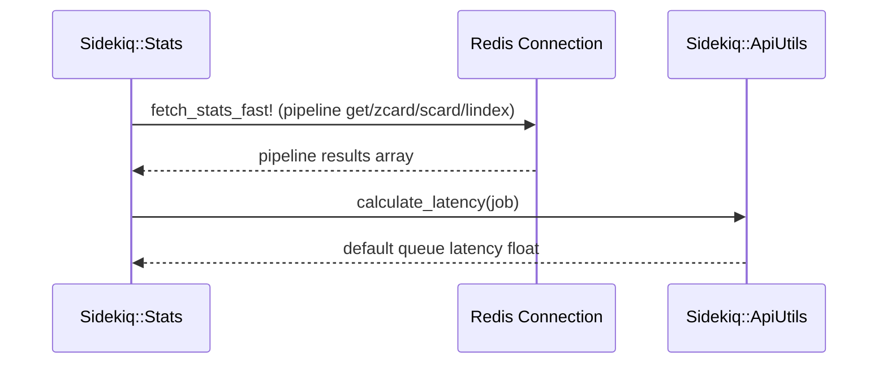
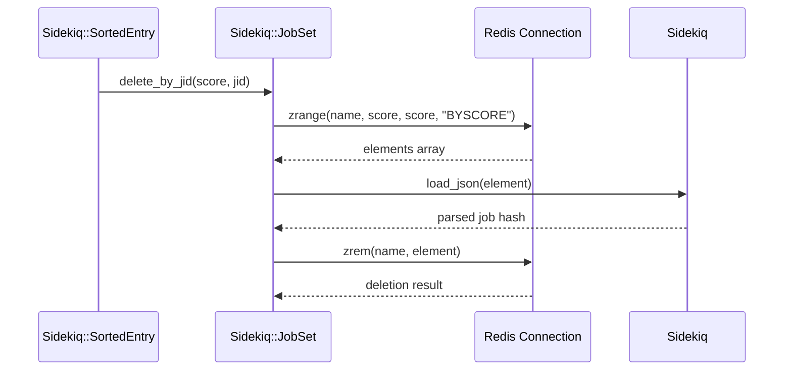
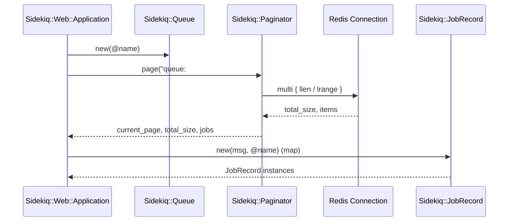
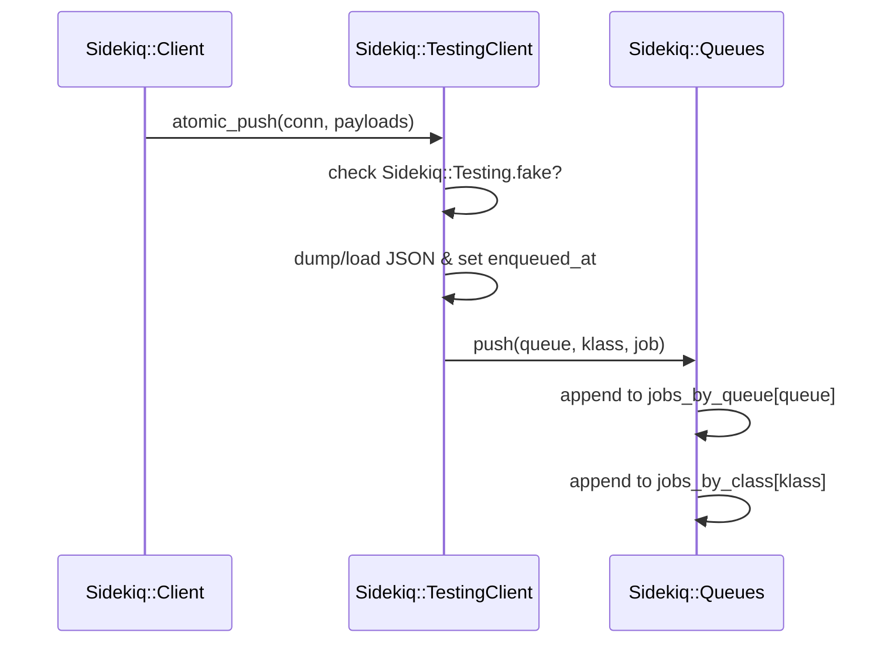

# Queue Management API

Relevant source files

The following files were used as context for generating this wiki page:

- [lib/sidekiq/api.rb](https://github.com/sidekiq/sidekiq/blob/main/lib/sidekiq/api.rb)
- [lib/sidekiq/web/application.rb](https://github.com/sidekiq/sidekiq/blob/main/lib/sidekiq/web/application.rb)
- [lib/sidekiq/tui/tabs/set_tab.rb](https://github.com/sidekiq/sidekiq/blob/main/lib/sidekiq/tui/tabs/set_tab.rb)
- [lib/sidekiq/tui/tabs/queues.rb](https://github.com/sidekiq/sidekiq/blob/main/lib/sidekiq/tui/tabs/queues.rb)
- [lib/sidekiq/client.rb](https://github.com/sidekiq/sidekiq/blob/main/lib/sidekiq/client.rb)
- [lib/sidekiq/test_api.rb](https://github.com/sidekiq/sidekiq/blob/main/lib/sidekiq/test_api.rb)
- [lib/sidekiq/metrics/query.rb](https://github.com/sidekiq/metrics/query.rb)
- [lib/sidekiq/scheduled.rb](https://github.com/sidekiq/sidekiq/blob/main/lib/sidekiq/scheduled.rb)
- [lib/sidekiq/redis_client_adapter.rb](https://github.com/sidekiq/sidekiq/blob/main/lib/sidekiq/redis_client_adapter.rb)
- [docs/menu.md](https://github.com/sidekiq/sidekiq/blob/main/docs/menu.md)
- [lib/sidekiq/paginator.rb](https://github.com/sidekiq/paginator.rb)
- [docs/7.0-API-Migration.md](https://github.com/sidekiq/sidekiq/blob/main/docs/7.0-API-Migration.md)
- [lib/sidekiq.rb](https://github.com/sidekiq/sidekiq/blob/main/lib/sidekiq.rb)

## Overview

The Queue Management API provides a robust Ruby object model layered directly over Sidekiq's persistent runtime data structures stored in Redis. Designed specifically for inspection, maintenance, and administrative control, this API empowers tools like the Sidekiq Web UI and terminal user interfaces to query queues, manage sorted sets, calculate latency, and execute bulk job operations without embedding business logic within application code. Sources: [lib/sidekiq/api.rb](https://github.com/sidekiq/sidekiq/blob/main/lib/sidekiq/api.rb#L9-L16), [docs/menu.md](https://github.com/sidekiq/sidekiq/blob/main/docs/menu.md#L19-L23)

By abstracting Redis interactions into intuitive classes such as `Sidekiq::Queue`, `Sidekiq::JobSet`, and `Sidekiq::Stats`, the API solves the challenge of safely monitoring and manipulating real-time asynchronous workloads. It encapsulates complex operations—including paging, filtering, enqueuing, and cleanups—while establishing clear design separation, ensuring server processes bypass the data API entirely to maximize performance and efficiency at every Redis callsite. Sources: [lib/sidekiq/api.rb](https://github.com/sidekiq/sidekiq/blob/main/lib/sidekiq/api.rb#L9-L16), [lib/sidekiq/api.rb](https://github.com/sidekiq/sidekiq/blob/main/lib/sidekiq/api.rb#L273-L284), [lib/sidekiq/api.rb](https://github.com/sidekiq/sidekiq/blob/main/lib/sidekiq/api.rb#L671-L676)

## Core Queue and Set Data Structures

### Overview

The Sidekiq API module offers programmatic inspection and manipulation of runtime data structures maintained in Redis. These classes model standard Redis queues as lists and deferred workflows as sorted sets, exposing methods for enumeration, scoring, filtering, and deletion. Sources: [lib/sidekiq/api.rb](https://github.com/sidekiq/sidekiq/blob/main/lib/sidekiq/api.rb#L9-L16), [lib/sidekiq/api.rb](https://github.com/sidekiq/sidekiq/blob/main/lib/sidekiq/api.rb#L273-L285), [lib/sidekiq/api.rb](https://github.com/sidekiq/sidekiq/blob/main/lib/sidekiq/api.rb#L671-L676)

### Core Data Structure Classes

Sidekiq defines a hierarchy of classes representing queues and sorted sets, supporting methods like enumeration, clearing, and pagination.

| Class Name | Superclass | Redis Key / Pattern | Purpose |
| :--- | :--- | :--- | :--- |
| `Sidekiq::Queue` | `Object` (`Enumerable`) | `queue:#{name}` | Represents a standard queue storing pending job JSON strings in a Redis list. Sources: [lib/sidekiq/api.rb](https://github.com/sidekiq/sidekiq/blob/main/lib/sidekiq/api.rb#L273-L285), [lib/sidekiq/api.rb](https://github.com/sidekiq/sidekiq/blob/main/lib/sidekiq/api.rb#L303-L303) |
| `Sidekiq::JobRecord` | `Object` | Payload string/hash | Represents an individual pending job item, exposing attributes like `jid`, `klass`, `args`, and `latency`. Sources: [lib/sidekiq/api.rb](https://github.com/sidekiq/sidekiq/blob/main/lib/sidekiq/api.rb#L388-L393), [lib/sidekiq/api.rb](https://github.com/sidekiq/sidekiq/blob/main/lib/sidekiq/api.rb#L430-L527) |
| `Sidekiq::SortedEntry` | `Sidekiq::JobRecord` | Sorted set member | Represents an individual entry within a time-ordered sorted set, supporting `reschedule`, `retry`, `kill`, and `add_to_queue`. Sources: [lib/sidekiq/api.rb](https://github.com/sidekiq/sidekiq/blob/main/lib/sidekiq/api.rb#L590-L592), [lib/sidekiq/api.rb](https://github.com/sidekiq/sidekiq/blob/main/lib/sidekiq/api.rb#L614-L657) |
| `Sidekiq::SortedSet` | `Object` (`Enumerable`) | Arbitrary sorted set | Base class for Redis sorted sets, implementing `scan`, `size`, and `clear`. Sources: [lib/sidekiq/api.rb](https://github.com/sidekiq/sidekiq/blob/main/lib/sidekiq/api.rb#L671-L676), [lib/sidekiq/api.rb](https://github.com/sidekiq/sidekiq/blob/main/lib/sidekiq/api.rb#L685-L713) |
| `Sidekiq::JobSet` | `Sidekiq::SortedSet` | Job-bearing sorted sets | Intermediate base class for sets containing job entries, implementing pagination, `fetch`, `find_job`, and `remove_job`. Sources: [lib/sidekiq/api.rb](https://github.com/sidekiq/sidekiq/blob/main/lib/sidekiq/api.rb#L726-L726), [lib/sidekiq/api.rb](https://github.com/sidekiq/sidekiq/blob/main/lib/sidekiq/api.rb#L730-L873) |
| `Sidekiq::ScheduledSet` | `Sidekiq::JobSet` | `schedule` | Represents deferred jobs scheduled to execute at a specific future timestamp. Sources: [lib/sidekiq/api.rb](https://github.com/sidekiq/sidekiq/blob/main/lib/sidekiq/api.rb#L910-L913), [lib/sidekiq/api.rb](https://github.com/sidekiq/sidekiq/blob/main/lib/sidekiq/api.rb#L911-L912) |
| `Sidekiq::RetrySet` | `Sidekiq::JobSet` | `retry` | Represents failed jobs waiting to be retried according to backoff parameters. Sources: [lib/sidekiq/api.rb](https://github.com/sidekiq/sidekiq/blob/main/lib/sidekiq/api.rb#L920-L923), [lib/sidekiq/api.rb](https://github.com/sidekiq/sidekiq/blob/main/lib/sidekiq/api.rb#L921-L922) |
| `Sidekiq::DeadSet` | `Sidekiq::JobSet` | `dead` | Represents terminally failed jobs that have exhausted all retry attempts, subject to trimming by `dead_timeout` and `dead_max_jobs`. Sources: [lib/sidekiq/api.rb](https://github.com/sidekiq/sidekiq/blob/main/lib/sidekiq/api.rb#L931-L934), [lib/sidekiq/api.rb](https://github.com/sidekiq/sidekiq/blob/main/lib/sidekiq/api.rb#L936-L946) |

Sources: [lib/sidekiq/api.rb](https://github.com/sidekiq/sidekiq/blob/main/lib/sidekiq/api.rb#L273-L285), [lib/sidekiq/api.rb](https://github.com/sidekiq/sidekiq/blob/main/lib/sidekiq/api.rb#L388-L393), [lib/sidekiq/api.rb](https://github.com/sidekiq/sidekiq/blob/main/lib/sidekiq/api.rb#L590-L592), [lib/sidekiq/api.rb](https://github.com/sidekiq/sidekiq/blob/main/lib/sidekiq/api.rb#L671-L676), [lib/sidekiq/api.rb](https://github.com/sidekiq/sidekiq/blob/main/lib/sidekiq/api.rb#L726-L726), [lib/sidekiq/api.rb](https://github.com/sidekiq/sidekiq/blob/main/lib/sidekiq/api.rb#L910-L913), [lib/sidekiq/api.rb](https://github.com/sidekiq/sidekiq/blob/main/lib/sidekiq/api.rb#L920-L923), [lib/sidekiq/api.rb](https://github.com/sidekiq/sidekiq/blob/main/lib/sidekiq/api.rb#L931-L934)

### Design Trade-Offs in Queue and Set Management

| Design Choice | Benefit | Cost |
| :--- | :--- | :--- |
| Separate API module layer (`Sidekiq::ApiUtils`, `Sidekiq::Queue`, etc.) | Keeps server runtime code unpolluted by heavy data-inspection abstractions; decouples UI/CLI logic. Sources: [lib/sidekiq/api.rb](https://github.com/sidekiq/sidekiq/blob/main/lib/sidekiq/api.rb#L9-L16) | Requires distinct data fetching code paths from those used by the high-performance worker execution engine. Sources: [lib/sidekiq/api.rb](https://github.com/sidekiq/sidekiq/blob/main/lib/sidekiq/api.rb#L13-L17) |
| Paged `lrange` iteration inside `Sidekiq::Queue#each` | Avoids blocking Redis with massive `LRANGE` calls on large queues by fetching records in page increments (`page_size = 50`). Sources: [lib/sidekiq/api.rb](https://github.com/sidekiq/sidekiq/blob/main/lib/sidekiq/api.rb#L334-L353) | Vulnerable to shifting indices if jobs are concurrently pushed or popped while iteration is in progress, requiring length-delta adjustments (`deleted_size = initial_size - size`). Sources: [lib/sidekiq/api.rb](https://github.com/sidekiq/sidekiq/blob/main/lib/sidekiq/api.rb#L351-L351) |
| `ZSCAN` usage in `Sidekiq::JobSet#find_job` and `SortedSet#scan` | Prevents long-running blocking queries across large sorted sets by utilizing non-blocking cursor-based scanning. Sources: [lib/sidekiq/api.rb](https://github.com/sidekiq/sidekiq/blob/main/lib/sidekiq/api.rb#L696-L705), [lib/sidekiq/api.rb](https://github.com/sidekiq/sidekiq/blob/main/lib/sidekiq/api.rb#L824-L833) | Finding a specific JID is an $O(n)$ traversal operation that must parse job JSON payloads during iteration. Sources: [lib/sidekiq/api.rb](https://github.com/sidekiq/sidekiq/blob/main/lib/sidekiq/api.rb#L824-L833) |

Sources: [lib/sidekiq/api.rb](https://github.com/sidekiq/sidekiq/blob/main/lib/sidekiq/api.rb#L9-L16), [lib/sidekiq/api.rb](https://github.com/sidekiq/sidekiq/blob/main/lib/sidekiq/api.rb#L334-L353), [lib/sidekiq/api.rb](https://github.com/sidekiq/sidekiq/blob/main/lib/sidekiq/api.rb#L696-L705), [lib/sidekiq/api.rb](https://github.com/sidekiq/sidekiq/blob/main/lib/sidekiq/api.rb#L824-L833)

> [!WARNING]
> Sidekiq's Data API objects reflect real-time runtime state in Redis and change moment by moment. Relying on `#size` followed immediately by an `#each` loop or attempting to use these classes for core application business logic will result in race conditions, missed records, or degraded performance. Sources: [lib/sidekiq/api.rb](https://github.com/sidekiq/sidekiq/blob/main/lib/sidekiq/api.rb#L9-L16), [lib/sidekiq/api.rb](https://github.com/sidekiq/sidekiq/blob/main/lib/sidekiq/api.rb#L275-L277)

> [!IMPORTANT]
> When removing or modifying entries in a `JobSet`, concurrent jobs with identical scores require partition matching via `Sidekiq::JobSet#remove_job`. The method uses `conn.multi` to inspect and modify elements, ensuring that non-matching jobs sharing the exact same score timestamp are correctly preserved and pushed back into the sorted set via `conn.zadd`. Sources: [lib/sidekiq/api.rb](https://github.com/sidekiq/sidekiq/blob/main/lib/sidekiq/api.rb#L835-L873)

## Enqueueing and Client Job Submission

### Overview

Job submission and client-side processing in Sidekiq are orchestrated through `Sidekiq::Client` and backed by `Sidekiq::RedisClientAdapter`. The client interface serializes job dictionaries into JSON payloads, processes them through the client middleware chain, and pushes them to Redis lists or sorted sets.
Sources: [lib/sidekiq/client.rb](https://github.com/sidekiq/sidekiq/blob/main/lib/sidekiq/client.rb#L33-L37), [lib/sidekiq/client.rb](https://github.com/sidekiq/sidekiq/blob/main/lib/sidekiq/client.rb#L101-L111)

### Client Initialization and Sharding

`Sidekiq::Client` instances accept keyword arguments for configuration (`:config`), connection pools (`:pool`), or explicit middleware chains (`:chain`). Deprecated single-argument pool initialization logs a warning and falls back to default configuration values. Sharding across multiple Redis instances is supported using `Sidekiq::Client.via(pool)`, which temporarily overrides `Thread.current[:sidekiq_redis_pool]` for the duration of the execution block.
Sources: [lib/sidekiq/client.rb](https://github.com/sidekiq/sidekiq/blob/main/lib/sidekiq/client.rb#L45-L58), [lib/sidekiq/client.rb](https://github.com/sidekiq/sidekiq/blob/main/lib/sidekiq/client.rb#L199-L206)

> [!NOTE]
> `Sidekiq::Client.new(pool)` without keyword arguments is deprecated. Always pass explicit keyword options such as `Sidekiq::Client.new(pool: pool)` or rely on the thread-local pool or default container configuration.
> Sources: [lib/sidekiq/client.rb](https://github.com/sidekiq/sidekiq/blob/main/lib/sidekiq/client.rb#L45-L48)

### Job Submission Call Chain and Execution Path

The pushing of single or bulk jobs follows a strict, sequential pipeline from entry point down to raw atomic Redis execution. 

Adding an entry: `push(item)` or `push_bulk(items)` → `normalize_item(item)` → `middleware.invoke` → `verify_json(payload)` → `raw_push(payloads)` → `conn.pipelined` → `atomic_push(conn, payloads)` — where `atomic_push` conditionally writes to the `"schedule"` sorted set via `zadd` when an `"at"` timestamp is present, or updates the `"queues"` set via `sadd` and pushes to the specific queue list via `lpush`.
Sources: [lib/sidekiq/client.rb](https://github.com/sidekiq/sidekiq/blob/main/lib/sidekiq/client.rb#L101-L111), [lib/sidekiq/client.rb](https://github.com/sidekiq/sidekiq/blob/main/lib/sidekiq/client.rb#L162-L182), [lib/sidekiq/client.rb](https://github.com/sidekiq/sidekiq/blob/main/lib/sidekiq/client.rb#L260-L304)

### Redis Client Adapter and Compat Methods

`Sidekiq::RedisClientAdapter` wraps `redis-client` and initializes connection builders depending on whether sentinels (`:sentinels`), clusters (`:nodes`), or standalone servers are configured. It also defines `CompatClient` decorated with `CompatMethods`, which maps a predefined set of Redis commands directly to `@client.call` while routing unlisted or deprecated commands through `method_missing` with warning notices for deprecated operations.
Sources: [lib/sidekiq/redis_client_adapter.rb](https://github.com/sidekiq/sidekiq/blob/main/lib/sidekiq/redis_client_adapter.rb#L14-L55), [lib/sidekiq/redis_client_adapter.rb#L62-L76)

| Configuration Option | Default / Transformation | Purpose |
| :--- | :--- | :--- |
| `reconnect_attempts` | `1` | Ensures automatic reconnection attempts to prevent silent dropped connections on `LPUSH`. Sources: [lib/sidekiq/redis_client_adapter.rb](https://github.com/sidekiq/sidekiq/blob/main/lib/sidekiq/redis_client_adapter.rb#L108-L108) |
| `driver_info` | `"sidekiq_v#{Sidekiq::VERSION}"` | Identifies client connections in Redis via `CLIENT SETINFO` for monitoring and debugging. Sources: [lib/sidekiq/redis_client_adapter.rb](https://github.com/sidekiq/sidekiq/blob/main/lib/sidekiq/redis_client_adapter.rb#L112-L112) |
| `network_timeout` | Converted to `:timeout` | Standardizes network timeout option compatibility across client adapters. Sources: [lib/sidekiq/redis_client_adapter.rb](https://github.com/sidekiq/sidekiq/blob/main/lib/sidekiq/redis_client_adapter.rb#L94-L97) |
| `master_name` | Converted to `:name` | Specifies the master name for Redis Sentinel configurations. Sources: [lib/sidekiq/redis_client_adapter.rb](https://github.com/sidekiq/sidekiq/blob/main/lib/sidekiq/redis_client_adapter.rb#L99-L99) |

Sources: [lib/sidekiq/redis_client_adapter.rb](https://github.com/sidekiq/sidekiq/blob/main/lib/sidekiq/redis_client_adapter.rb#L84-L115)

### Bulk Job Insertion and Resque Compatibility

`Sidekiq::Client#push_bulk` handles large sets of argument arrays by slicing them into configurable batches (`batch_size` defaulting to `1,000` for immediate jobs or `100` for scheduled jobs). It processes each batch through middleware, assigns unique 12-byte hex `jid` identifiers via `SecureRandom.hex(12)`, and sends them via pipelined raw pushes. Additionally, legacy Resque compatibility methods such as `enqueue`, `enqueue_to`, and `enqueue_to_in` delegate directly to `client_push`.
Sources: [lib/sidekiq/client.rb](https://github.com/sidekiq/client.rb#L139-L185), [lib/sidekiq/client.rb](https://github.com/sidekiq/client.rb#L225-L248)

> [!WARNING]
> Explicitly passing an explicit `"jid"` key when pushing more than one job via `push_bulk` raises an `ArgumentError`. Each bulk-inserted job must receive its own unique generated job identifier.
> Sources: [lib/sidekiq/client.rb](https://github.com/sidekiq/client.rb#L145-L146)

## Queue Statistics and Latency Calculation

### Overview

Queue statistics and latency calculation provide real-time introspection into Sidekiq cluster performance, memory utilization, and queue backlogs. The `Sidekiq::ApiUtils` module defines the shared `calculate_latency` method, which evaluates job age based on either a legacy float timestamp (`enqueued_at` or `created_at`) or a high-precision monotonic clock timestamp via `Process.clock_gettime`.
Sources: [lib/sidekiq/api.rb](https://github.com/sidekiq/sidekiq/blob/main/lib/sidekiq/api.rb#L20-L36)

> [!NOTE]
> If a job timestamp is stored as a Float, latency is calculated against `Time.now.to_f`. For millisecond integer timestamps, latency uses `Process::CLOCK_REALTIME` to ensure monotonic precision across time adjustments.
> Sources: [lib/sidekiq/api.rb](https://github.com/sidekiq/sidekiq/blob/main/lib/sidekiq/api.rb#L29-L35)

### Fast and Slow Statistics Call Chains

The `Sidekiq::Stats` class manages cluster-wide metrics by combining fast, low-overhead Redis operations with slower process-wide iterations. The initialization and retrieval call sequences flow through explicit internal methods.

1. `initialize` or `fetch_stats!` → `fetch_stats_fast!` → `calculate_latency`
Sources: [lib/sidekiq/api.rb](https://github.com/sidekiq/sidekiq/blob/main/lib/sidekiq/api.rb#L51-L53), [lib/sidekiq/api.rb](https://github.com/sidekiq/sidekiq/blob/main/lib/sidekiq/api.rb#L144-L179), [lib/sidekiq/api.rb](https://github.com/sidekiq/sidekiq/blob/main/lib/sidekiq/api.rb#L209-L212)

Sources: [lib/sidekiq/api.rb](https://github.com/sidekiq/sidekiq/blob/main/lib/sidekiq/api.rb#L51-L53), [lib/sidekiq/api.rb](https://github.com/sidekiq/sidekiq/blob/main/lib/sidekiq/api.rb#L144-L179)

### Queue Summaries and Metric Queries

`Sidekiq::Stats#queue_summaries` performs pipelined commands across all discovered queues in Redis, fetching queue lengths via `llen`, the last item via `lindex`, and pause status via `sismember`. 

| Metric Method | Redis Command | Complexity | Description |
| :--- | :--- | :--- | :--- |
| `processed` | `GET stat:processed` | $O(1)$ | Total number of successfully processed jobs. Sources: [lib/sidekiq/api.rb](https://github.com/sidekiq/sidekiq/blob/main/lib/sidekiq/api.rb#L55-L57) |
| `failed` | `GET stat:failed` | $O(1)$ | Total number of failed jobs. Sources: [lib/sidekiq/api.rb](https://github.com/sidekiq/sidekiq/blob/main/lib/sidekiq/api.rb#L59-L61) |
| `scheduled_size` | `ZCARD schedule` | $O(1)$ | Number of jobs currently in the scheduled set. Sources: [lib/sidekiq/api.rb](https://github.com/sidekiq/sidekiq/blob/main/lib/sidekiq/api.rb#L63-L65) |
| `retry_size` | `ZCARD retry` | $O(1)$ | Number of jobs awaiting retry. Sources: [lib/sidekiq/api.rb](https://github.com/sidekiq/sidekiq/blob/main/lib/sidekiq/api.rb#L67-L69) |
| `dead_size` | `ZCARD dead` | $O(1)$ | Number of jobs in the dead set. Sources: [lib/sidekiq/api.rb](https://github.com/sidekiq/sidekiq/blob/main/lib/sidekiq/api.rb#L71-L73) |
| `processes_size` | `SCARD processes` | $O(1)$ | Number of active Sidekiq processes. Sources: [lib/sidekiq/api.rb](https://github.com/sidekiq/sidekiq/blob/main/lib/sidekiq/api.rb#L79-L81) |

Sources: [lib/sidekiq/api.rb](https://github.com/sidekiq/sidekiq/blob/main/lib/sidekiq/api.rb#L55-L89), [lib/sidekiq/api.rb](https://github.com/sidekiq/sidekiq/blob/main/lib/sidekiq/api.rb#L109-L140), [lib/sidekiq/api.rb](https://github.com/sidekiq/sidekiq/blob/main/lib/sidekiq/api.rb#L144-L179)

> [!CAUTION]
> Calling `Sidekiq::Stats#workers_size` or `enqueued` invokes `fetch_stats_slow!`, which executes an `sscan` over processes and queues followed by pipelined `hget` and `llen` commands. Avoid calling slow stats inside tight application loops.
> Sources: [lib/sidekiq/api.rb](https://github.com/sidekiq/sidekiq/blob/main/lib/sidekiq/api.rb#L181-L206), [lib/sidekiq/api.rb](https://github.com/sidekiq/sidekiq/blob/main/lib/sidekiq/api.rb#L231-L234)

## Job Deletion and Set Operations

### Overview

Job deletion and set operations allow precise manipulation and bulk cleanup of queued, scheduled, retry, and dead jobs. Individual jobs within standard queues can be removed via `JobRecord#delete`, which executes a list removal (`lrem`), while sorted set entries utilize `SortedEntry#delete` to delegate removal by value or job identifier.
Sources: [lib/sidekiq/api.rb](https://github.com/sidekiq/sidekiq/blob/main/lib/sidekiq/api.rb#L530-L535), [lib/sidekiq/api.rb](https://github.com/sidekiq/sidekiq/blob/main/lib/sidekiq/api.rb#L614-L621)

> [!WARNING]
> Job deletion across sorted sets involves scanning or range queries by score to locate matching entries. When multiple jobs share the exact same score, Sidekiq partitions the results by JID to ensure only the targeted job is removed while non-matching entries are pushed back onto the sorted set.
> Sources: [lib/sidekiq/api.rb](https://github.com/sidekiq/sidekiq/blob/main/lib/sidekiq/api.rb#L835-L873), [lib/sidekiq/api.rb](https://github.com/sidekiq/sidekiq/blob/main/lib/sidekiq/api.rb#L887-L901)

### Deletion Call Chain Walkthrough

The job deletion process across sorted sets executes a specific call chain to locate and parse stored JSON payloads in Redis. 

1. `delete` → `delete_by_jid` → `load_json`
Sources: [lib/sidekiq/api.rb](https://github.com/sidekiq/sidekiq/blob/main/lib/sidekiq/api.rb#L619-L620), [lib/sidekiq/api.rb](https://github.com/sidekiq/sidekiq/blob/main/lib/sidekiq/api.rb#L887-L901), [lib/sidekiq.rb](https://github.com/sidekiq/sidekiq/blob/main/lib/sidekiq.rb#L61-L63)

- Step 1: `SortedEntry#delete` invokes `parent.delete_by_jid(@score, jid)` when no direct value is present. Sources: [lib/sidekiq/api.rb](https://github.com/sidekiq/sidekiq/blob/main/lib/sidekiq/api.rb#L614-L621)
- Step 2: `JobSet#delete_by_jid` fetches elements matching the score using `zrange` with `"BYSCORE"`, iterates through them, and inspects indices for the target JID. Sources: [lib/sidekiq/api.rb](https://github.com/sidekiq/sidekiq/blob/main/lib/sidekiq/api.rb#L887-L901)
- Step 3: `Sidekiq.load_json` parses the matching element string into a Ruby hash to confirm the `jid` matches before executing `zrem`. Sources: [lib/sidekiq/api.rb](https://github.com/sidekiq/sidekiq/blob/main/lib/sidekiq/api.rb#L891-L895), [lib/sidekiq.rb](https://github.com/sidekiq/sidekiq/blob/main/lib/sidekiq.rb#L61-L63)

Sources: [lib/sidekiq/api.rb](https://github.com/sidekiq/sidekiq/blob/main/lib/sidekiq/api.rb#L614-L621), [lib/sidekiq/api.rb](https://github.com/sidekiq/sidekiq/blob/main/lib/sidekiq/api.rb#L887-L901), [lib/sidekiq.rb](https://github.com/sidekiq/sidekiq/blob/main/lib/sidekiq.rb#L61-L63)

### Mass Cleanup and Set Operations

Entire sets and queues can be purged or trimmed programmatically. The `DeadSet` class implements a `trim` operation enforcing maximum storage limits and retention timeouts.

| Operation Method | Target Class | Redis Commands | Purpose |
| :--- | :--- | :--- | :--- |
| `clear` | `Sidekiq::Queue` | `UNLINK`, `SREM queues` | Deletes the queue list key and removes its name from the known queues set. Sources: [lib/sidekiq/api.rb](https://github.com/sidekiq/sidekiq/blob/main/lib/sidekiq/api.rb#L370-L378) |
| `clear` | `Sidekiq::SortedSet` | `UNLINK` | Deletes the entire sorted set key in Redis. Sources: [lib/sidekiq/api.rb](https://github.com/sidekiq/sidekiq/blob/main/lib/sidekiq/api.rb#L708-L713) |
| `trim` | `Sidekiq::DeadSet` | `ZREMRANGEBYSCORE`, `ZREMRANGEBYRANK` | Removes dead jobs older than `dead_timeout_in_seconds` and trims excess jobs beyond `dead_max_jobs`. Sources: [lib/sidekiq/api.rb](https://github.com/sidekiq/sidekiq/blob/main/lib/sidekiq/api.rb#L936-L946) |
| `kill_all` | `Sidekiq::JobSet` | `ZPOPMIN`, `ZADD` | Iterates through all jobs in a set, killing each one into the DeadSet. Sources: [lib/sidekiq/api.rb](https://github.com/sidekiq/sidekiq/blob/main/lib/sidekiq/api.rb#L756-L769) |

Sources: [lib/sidekiq/api.rb](https://github.com/sidekiq/sidekiq/blob/main/lib/sidekiq/api.rb#L370-L378), [lib/sidekiq/api.rb](https://github.com/sidekiq/sidekiq/blob/main/lib/sidekiq/api.rb#L708-L713), [lib/sidekiq/api.rb](https://github.com/sidekiq/sidekiq/blob/main/lib/sidekiq/api.rb#L756-L769), [lib/sidekiq/api.rb](https://github.com/sidekiq/sidekiq/blob/main/lib/sidekiq/api.rb#L936-L946)

> [!TIP]
> When executing `DeadSet#kill`, passing `notify_failure: true` triggers all configured death handlers, passing the parsed job hash and either a custom exception or a default runtime error indicating the job was killed by the API.
> Sources: [lib/sidekiq/api.rb](https://github.com/sidekiq/sidekiq/blob/main/lib/sidekiq/api.rb#L953-L974)

## Web and TUI Management Interfaces

### Overview

The Sidekiq Web application and Terminal User Interface (TUI) integrate queue and set management methods directly into HTTP routing and interactive keyboard controls. The `Sidekiq::Web::Application` class handles routing via `Rack` and maps administrative routes like `GET /queues`, `POST /queues/:name`, and sorted set management endpoints for retries and morgues. Concurrently, TUI tab components such as `Sidekiq::TUI::Tabs::Queues` and `Sidekiq::TUI::Tabs::SetTab` bind keyboard actions—like shifting rows or toggling queue pauses—directly to underlying queue management APIs.
Sources: [lib/sidekiq/web/application.rb](https://github.com/sidekiq/sidekiq/blob/main/lib/sidekiq/web/application.rb#L7-L11), [lib/sidekiq/tui/tabs/set_tab.rb](https://github.com/sidekiq/sidekiq/blob/main/lib/sidekiq/tui/tabs/set_tab.rb#L4-L21), [lib/sidekiq/tui/tabs/queues.rb](https://github.com/sidekiq/sidekiq/blob/main/lib/sidekiq/tui/tabs/queues.rb#L6-L18)

### Web and TUI Management Endpoints

Both management interfaces utilize shared pagination and data structures defined in `Sidekiq::Paginator`. The pagination helper `page` inspects key types (such as lists for queues or zsets for dead and retry sets) using `TYPE_CACHE` and queries Redis using `conn.multi` transactions with optional reverse parameters.
Sources: [lib/sidekiq/paginator.rb](https://github.com/sidekiq/paginator.rb#L5-L59), [lib/sidekiq/web/application.rb](https://github.com/sidekiq/sidekiq/blob/main/lib/sidekiq/web/application.rb#L140-L146), [lib/sidekiq/tui/tabs/set_tab.rb](https://github.com/sidekiq/sidekiq/blob/main/lib/sidekiq/tui/tabs/set_tab.rb#L38-L57)

| Route / Action | Target Class / Module | Redis Operations | Purpose |
| :--- | :--- | :--- | :--- |
| `GET /queues/:name` | `Sidekiq::Paginator`, `Sidekiq::Queue` | `TYPE_CACHE`, `llen`, `lrange` | Paginates and displays jobs within a named queue. Sources: [lib/sidekiq/web/application.rb](https://github.com/sidekiq/sidekiq/blob/main/lib/sidekiq/web/application.rb#L135-L146), [lib/sidekiq/paginator.rb](https://github.com/sidekiq/paginator.rb#L11-L52) |
| `POST /queues/:name` | `Sidekiq::Queue` | `UNLINK`, `SREM queues` (via `clear`), Pro pause commands | Clears a queue or toggles pause/unpause states in Sidekiq Pro. Sources: [lib/sidekiq/web/application.rb](https://github.com/sidekiq/sidekiq/blob/main/lib/sidekiq/web/application.rb#L148-L160) |
| `POST /queues/:name/delete` | `Sidekiq::JobRecord` | `lrem` | Deletes an individual job from a queue using its key value. Sources: [lib/sidekiq/web/application.rb](https://github.com/sidekiq/sidekiq/blob/main/lib/sidekiq/web/application.rb#L162-L167) |
| `SET Tab D` (TUI) | `Sidekiq::TUI::Tabs::SetTab` | `zrem` / set fetch | Deletes selected rows in sorted set tabs (retries, scheduled, dead). Sources: [lib/sidekiq/tui/tabs/set_tab.rb](https://github.com/sidekiq/sidekiq/blob/main/lib/sidekiq/tui/tabs/set_tab.rb#L12-L31) |
| `Queues Tab p` (TUI) | `Sidekiq::TUI::Tabs::Queues` | Queue pause/unpause commands | Toggles pause state for selected queues in the TUI (Sidekiq Pro). Sources: [lib/sidekiq/tui/tabs/queues.rb](https://github.com/sidekiq/sidekiq/blob/main/lib/sidekiq/tui/tabs/queues.rb#L11-L37) |

Sources: [lib/sidekiq/web/application.rb](https://github.com/sidekiq/sidekiq/blob/main/lib/sidekiq/web/application.rb#L140-L167), [lib/sidekiq/tui/tabs/set_tab.rb](https://github.com/sidekiq/sidekiq/blob/main/lib/sidekiq/tui/tabs/set_tab.rb#L12-L31), [lib/sidekiq/tui/tabs/queues.rb](https://github.com/sidekiq/sidekiq/blob/main/lib/sidekiq/tui/tabs/queues.rb#L11-L37), [lib/sidekiq/paginator.rb](https://github.com/sidekiq/paginator.rb#L5-L52)

> [!NOTE]
> In `Sidekiq::Web::Application`, `post "/queues/:name"` evaluates `Sidekiq.pro?` before invoking `queue.pause!` or `queue.unpause!`, defaulting to `queue.clear` if Pro features are unavailable or pause parameters are absent.
> Sources: [lib/sidekiq/web/application.rb](https://github.com/sidekiq/sidekiq/blob/main/lib/sidekiq/web/application.rb#L148-L160)

> [!CAUTION]
> When requesting page sizes in `Sidekiq::Paginator#page_items`, a negative `page_size` is coerced to `0` to prevent `Array#[]` from returning `nil` instead of a slice, which would otherwise crash callers iterating over the web UI busy page.
> Sources: [lib/sidekiq/paginator.rb](https://github.com/sidekiq/paginator.rb#L61-L67)

### Queue Pagination and Rendering Call Walkthrough

The rendering and data retrieval lifecycle for individual queue views in the Web UI follows a strict parameter-validation and pagination call chain.

1. `get /queues/:name` → `Sidekiq::Queue.new` → `page` → `Sidekiq::JobRecord.new`
Sources: [lib/sidekiq/web/application.rb](https://github.com/sidekiq/sidekiq/blob/main/lib/sidekiq/web/application.rb#L135-L146), [lib/sidekiq/paginator.rb](https://github.com/sidekiq/paginator.rb#L11-L59)

- Step 1: `get "/queues/:name"` validates the queue name against `QUEUE_NAME` (`/\A[a-z_:.\-0-9]+\z/i`), halting with `404` on mismatch. Sources: [lib/sidekiq/web/application.rb](https://github.com/sidekiq/sidekiq/blob/main/lib/sidekiq/web/application.rb#L135-L139)
- Step 2: It instantiates `Sidekiq::Queue.new(@name)` and calls `page("queue:#{@name}", url_params("page"), @count, reverse: ...)`. Sources: [lib/sidekiq/web/application.rb](https://github.com/sidekiq/sidekiq/blob/main/lib/sidekiq/web/application.rb#L140-L142)
- Step 3: The `Paginator#page` method identifies the key type as a `"list"`, executes a Redis multi-transaction for `llen` and `lrange`, and returns `[current_page, total_size, jobs]`. Sources: [lib/sidekiq/paginator.rb](https://github.com/sidekiq/paginator.rb#L19-L52)
- Step 4: The returned raw messages are mapped via `Sidekiq::JobRecord.new(msg, @name)` before rendering the `queue` ERB template. Sources: [lib/sidekiq/web/application.rb](https://github.com/sidekiq/sidekiq/blob/main/lib/sidekiq/web/application.rb#L143-L145)

Sources: [lib/sidekiq/web/application.rb](https://github.com/sidekiq/sidekiq/blob/main/lib/sidekiq/web/application.rb#L135-L146), [lib/sidekiq/paginator.rb](https://github.com/sidekiq/paginator.rb#L11-L59)

## Testing and API Migration Practices

### Test Mode API Methods

Sidekiq provides a comprehensive testing infrastructure under `Sidekiq::Testing` that prevents jobs from touching Redis during test execution. Test modes are managed via `Sidekiq::Testing.__set_test_mode(mode)`, which accepts optional blocks to scope modes to the current thread. Nesting test modes raises a `TestModeAlreadySetError`.
Sources: [lib/sidekiq/test_api.rb](https://github.com/sidekiq/sidekiq/blob/main/lib/sidekiq/test_api.rb#L7-L30)

| Mode Helper | State Value | Description |
| :--- | :--- | :--- |
| `Sidekiq::Testing.fake!` | `:fake` | Intercepts job pushes, serializing payload data into in-memory queues (`Sidekiq::Queues` and worker `.jobs` arrays) without network I/O. Sources: [lib/sidekiq/test_api.rb](https://github.com/sidekiq/sidekiq/blob/main/lib/sidekiq/test_api.rb#L48-L50), [lib/sidekiq/test_api.rb](https://github.com/sidekiq/sidekiq/blob/main/lib/sidekiq/test_api.rb#L82-L90) |
| `Sidekiq::Testing.inline!` | `:inline` | Executes jobs immediately in the calling thread upon enqueueing by instantiating the worker class and calling `process_job`. Sources: [lib/sidekiq/test_api.rb](https://github.com/sidekiq/sidekiq/blob/main/lib/sidekiq/test_api.rb#L52-L54), [lib/sidekiq/test_api.rb](https://github.com/sidekiq/sidekiq/blob/main/lib/sidekiq/test_api.rb#L91-L98) |
| `Sidekiq::Testing.disable!` | `:disable` | Resumes standard client behavior, routing job pushes directly to Redis. Sources: [lib/sidekiq/test_api.rb](https://github.com/sidekiq/sidekiq/blob/main/lib/sidekiq/test_api.rb#L44-L46), [lib/sidekiq/test_api.rb](https://github.com/sidekiq/sidekiq/blob/main/lib/sidekiq/test_api.rb#L99-L102) |

Sources: [lib/sidekiq/test_api.rb](https://github.com/sidekiq/sidekiq/blob/main/lib/sidekiq/test_api.rb#L44-L70), [lib/sidekiq/test_api.rb](https://github.com/sidekiq/sidekiq/blob/main/lib/sidekiq/test_api.rb#L82-L103)

> [!WARNING]
> If the Sidekiq testing API is enabled outside of the test environment (checked via `Rails.env.test?` and `!$TESTING`), Sidekiq emits a warning stating that jobs will not go to Redis.
> Sources: [lib/sidekiq/test_api.rb](https://github.com/sidekiq/sidekiq/blob/main/lib/sidekiq/test_api.rb#L329-L331)

### Job Execution Walkthrough in Fake Mode

When `Sidekiq::Testing.fake!` is enabled, client pushes are intercepted by `Sidekiq::TestingClient#atomic_push`, routing jobs through an in-memory double-entry structure.

1. `atomic_push` → `Sidekiq::Testing.fake?` → `Queues.push` → `jobs_by_queue` / `jobs_by_class`
Sources: [lib/sidekiq/test_api.rb](https://github.com/sidekiq/sidekiq/blob/main/lib/sidekiq/test_api.rb#L82-L90), [lib/sidekiq/test_api.rb](https://github.com/sidekiq/sidekiq/blob/main/lib/sidekiq/test_api.rb#L178-L181)

- Step 1: `atomic_push(conn, payloads)` checks `Sidekiq::Testing.fake?`, entering the fake mode branch. Sources: [lib/sidekiq/test_api.rb](https://github.com/sidekiq/sidekiq/blob/main/lib/sidekiq/test_api.rb#L83-L84)
- Step 2: For each payload, JSON round-tripping (`Sidekiq.load_json(Sidekiq.dump_json(job))`) sanitizes the structure. Sources: [lib/sidekiq/test_api.rb](https://github.com/sidekiq/sidekiq/blob/main/lib/sidekiq/test_api.rb#L85-L86)
- Step 3: Unless an `"at"` timestamp exists, `"enqueued_at"` is populated using `::Process.clock_gettime(::Process::CLOCK_REALTIME, :millisecond)`. Sources: [lib/sidekiq/test_api.rb](https://github.com/sidekiq/sidekiq/blob/main/lib/sidekiq/test_api.rb#L87-L87)
- Step 4: `Queues.push(job["queue"], job["class"], job)` appends the job reference into both `jobs_by_queue[queue]` and `jobs_by_class[klass]` hashes simultaneously. Sources: [lib/sidekiq/test_api.rb](https://github.com/sidekiq/sidekiq/blob/main/lib/sidekiq/test_api.rb#L88-L88), [lib/sidekiq/test_api.rb](https://github.com/sidekiq/sidekiq/blob/main/lib/sidekiq/test_api.rb#L178-L181)

Sources: [lib/sidekiq/test_api.rb](https://github.com/sidekiq/sidekiq/blob/main/lib/sidekiq/test_api.rb#L82-L90), [lib/sidekiq/test_api.rb](https://github.com/sidekiq/sidekiq/blob/main/lib/sidekiq/test_api.rb#L173-L181)

### Sidekiq 7.0 API Migration Patterns

Upgrading to Sidekiq 7.0 requires updating configuration initializers due to structural API refactoring.
Sources: [docs/7.0-API-Migration.md](https://github.com/sidekiq/sidekiq/blob/main/docs/7.0-API-Migration.md#L1-L4)

| Feature / Setting | Pre-7.0 (Broken) | Sidekiq 7.0+ (Fixed) |
| :--- | :--- | :--- |
| **Logger Assignment** | `Sidekiq.logger = ...` | `Sidekiq.configure_server { \|cfg\| cfg.logger = ... }` Sources: [docs/7.0-API-Migration.md](https://github.com/sidekiq/sidekiq/blob/main/docs/7.0-API-Migration.md#L7-L15) |
| **Log Formatter** | `Sidekiq.configure_server { \|cfg\| cfg.log_formatter = ... }` | `Sidekiq.configure_server { \|cfg\| cfg.logger.formatter = ... }` Sources: [docs/7.0-API-Migration.md](https://github.com/sidekiq/sidekiq/blob/main/docs/7.0-API-Migration.md#L18-L28) |
| **Redis Connection Pool** | `Sidekiq.configure_server { \|cfg\| cfg.redis = ConnectionPool.new(...) }` | `Sidekiq.configure_server { \|cfg\| cfg.redis = { url: ... } }` Sources: [docs/7.0-API-Migration.md](https://github.com/sidekiq/sidekiq/blob/main/docs/7.0-API-Migration.md#L37-L48) |
| **Redis Sentinel Name** | `Sidekiq.configure_server { \|cfg\| cfg.redis = { url: ..., sentinels: [...] } }` | `Sidekiq.configure_server { \|cfg\| cfg.redis = { url: ..., name: "primary", sentinels: [...] } }` Sources: [docs/7.0-API-Migration.md](https://github.com/sidekiq/sidekiq/blob/main/docs/7.0-API-Migration.md#L55-L80) |
| **Configuration Reader** | `Sidekiq[:average_scheduled_poll_interval]` | `Sidekiq.default_configuration[:average_scheduled_poll_interval]` Sources: [docs/7.0-API-Migration.md](https://github.com/sidekiq/sidekiq/blob/main/docs/7.0-API-Migration.md#L82-L95) |
| **Delayed Extensions** | `Sidekiq::DelayExtensions.enable_delay!` | Migrate to `Sidekiq::Job` or use `sidekiq-delay_extensions` gem Sources: [docs/7.0-API-Migration.md](https://github.com/sidekiq/sidekiq/blob/main/docs/7.0-API-Migration.md#L97-L108) |

Sources: [docs/7.0-API-Migration.md](https://github.com/sidekiq/sidekiq/blob/main/docs/7.0-API-Migration.md#L5-L107)

## Related

- [[Scheduled Job Polling]]
- [[Job Retry Handling]]

