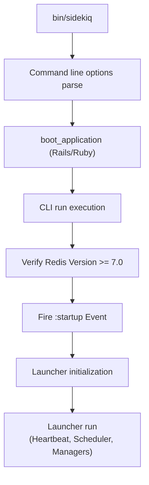

# Quick Start

<details>
<summary>Relevant source files</summary>

The following files were used as context for generating this wiki page:

- [lib/sidekiq/cli.rb](https://github.com/sidekiq/sidekiq/blob/main/lib/sidekiq/cli.rb)
- [lib/sidekiq/web/application.rb](https://github.com/sidekiq/sidekiq/blob/main/lib/sidekiq/web/application.rb)
- [lib/sidekiq/client.rb](https://github.com/sidekiq/sidekiq/blob/main/lib/sidekiq/client.rb)
- [lib/sidekiq/api.rb](https://github.com/sidekiq/sidekiq/blob/main/lib/sidekiq/api.rb)
- [lib/sidekiq/processor.rb](https://github.com/sidekiq/sidekiq/blob/main/lib/sidekiq/processor.rb)
- [README.md](https://github.com/sidekiq/sidekiq/blob/main/README.md)
- [myapp/config/initializers/sidekiq.rb](https://github.com/sidekiq/sidekiq/blob/main/myapp/config/initializers/sidekiq.rb)
- [lib/sidekiq/scheduled.rb](https://github.com/sidekiq/sidekiq/blob/main/lib/sidekiq/scheduled.rb)
- [myapp/app/controllers/job_controller.rb](https://github.com/sidekiq/sidekiq/blob/main/myapp/app/controllers/job_controller.rb)
- [lib/sidekiq.rb](https://github.com/sidekiq/sidekiq/blob/main/lib/sidekiq.rb)
- [lib/sidekiq/embedded.rb](https://github.com/sidekiq/sidekiq/blob/main/lib/sidekiq/embedded.rb)
- [lib/sidekiq/rails.rb](https://github.com/sidekiq/sidekiq/blob/main/lib/sidekiq/rails.rb)
- [docs/internals.md](https://github.com/sidekiq/sidekiq/blob/main/docs/internals.md)
- [bare/boot.rb](https://github.com/sidekiq/sidekiq/blob/main/bare/boot.rb)
- [myapp/app/jobs/post_updater.rb](https://github.com/sidekiq/sidekiq/blob/main/myapp/app/jobs/post_updater.rb)
- [lib/sidekiq/fetch.rb](https://github.com/sidekiq/sidekiq/blob/main/lib/sidekiq/fetch.rb)
- [myapp/app/jobs/post_creator.rb](https://github.com/sidekiq/sidekiq/blob/main/myapp/app/jobs/post_creator.rb)
- [myapp/app/sidekiq/lazy_job.rb](https://github.com/sidekiq/sidekiq/blob/main/myapp/app/sidekiq/lazy_job.rb)
- [myapp/app/models/post.rb](https://github.com/sidekiq/sidekiq/blob/main/myapp/app/models/post.rb)
- [myapp/app/sidekiq/exit_job.rb](https://github.com/sidekiq/sidekiq/blob/main/myapp/app/sidekiq/exit_job.rb)
- [myapp/app/jobs/exit_job.rb](https://github.com/sidekiq/sidekiq/blob/main/myapp/app/jobs/exit_job.rb)
- [myapp/app/jobs/some_job.rb](https://github.com/sidekiq/sidekiq/blob/main/myapp/app/jobs/some_job.rb)
- [myapp/config/routes.rb](https://github.com/sidekiq/sidekiq/blob/main/myapp/config/routes.rb)
- [myapp/app/models/exiter.rb](https://github.com/sidekiq/sidekiq/blob/main/myapp/app/models/exiter.rb)
- [myapp/config/application.rb](https://github.com/sidekiq/sidekiq/blob/main/myapp/config/application.rb)
- [myapp/app/jobs/application_job.rb](https://github.com/sidekiq/sidekiq/blob/main/myapp/app/jobs/application_job.rb)
- [myapp/app/sidekiq/hard_job.rb](https://github.com/sidekiq/sidekiq/blob/main/myapp/app/sidekiq/hard_job.rb)
- [myapp/config/puma.rb](https://github.com/sidekiq/sidekiq/blob/main/myapp/config/puma.rb)
- [docs/7.0-Upgrade.md](https://github.com/sidekiq/sidekiq/blob/main/docs/7.0-Upgrade.md)
</details>

## Overview

Sidekiq provides simple and efficient background job processing for Ruby applications by utilizing threads to execute multiple jobs concurrently within a single process. The Quick Start guide establishes the foundational runtime contract, dependencies, and code patterns required to get an application running. It addresses the architectural challenge of coordinating client-side payload enqueuing, Redis data structures, and server-side worker execution loops without saturating system resources.

The design relies on standard Redis data structures (lists for queues, sorted sets for schedules and retries) and integrates tightly with Ruby runtimes (MRI 3.2+ or JRuby 9.4+) and web frameworks like Rails 7.0+. By standardizing configuration blocks (`configure_client` and `configure_server`), Sidekiq enables predictable initialization, middleware chaining, and lifecycle event handling across both standalone CLI execution and embedded deployment topologies.

Sources: [README.md:1-20](https://github.com/sidekiq/sidekiq/blob/main/README.md#L1-L20)

Sources: [lib/sidekiq.rb:97-113](https://github.com/sidekiq/sidekiq/blob/main/lib/sidekiq.rb#L97-L113)

## Installation and Core Requirements

To integrate Sidekiq into a Ruby application, add the gem dependency to your project. Sidekiq enforces strict version requirements on its underlying data store and runtime environment to ensure protocol and threading compatibility.

Sources: [README.md:25-30](https://github.com/sidekiq/sidekiq/blob/main/README.md#L25-L30)

```bash
bundle add sidekiq
```

Sources: [README.md:27-29](https://github.com/sidekiq/sidekiq/blob/main/README.md#L27-L29)

The runtime environment must satisfy specific version floors for both Redis compatibility and Ruby execution.

| Dependency | Minimum Version | Recommended / Canonical |
| :--- | :--- | :--- |
| **Ruby** | MRI 3.2+ or JRuby 9.4+ | MRI 3.2+ with YJIT |
| **Data Store** | Redis 7.0+, Valkey 7.2+, Dragonfly 1.27+ | Redis 7.2.4 |
| **Rails / Active Job** | Rails 7.0+ | Rails 7.0+ |

Sources: [README.md:13-24](https://github.com/sidekiq/sidekiq/blob/main/README.md#L13-L24)

> [!WARNING]
> Your Redis instance must be configured with the `noeviction` maxmemory policy. Under heavy load, other policies will evict Sidekiq's queue or retry data, leading to lost background jobs.
> Sources: [lib/sidekiq/cli.rb:80-91](https://github.com/sidekiq/sidekiq/blob/main/lib/sidekiq/cli.rb#L80-L91)

Sources: [lib/sidekiq/cli.rb:80-91](https://github.com/sidekiq/sidekiq/blob/main/lib/sidekiq/cli.rb#L80-L91)

## Defining Jobs

Sidekiq jobs are plain Ruby classes that include the job module. The execution payload is defined inside the `perform` instance method. Options such as queue assignment, retry behavior, and backtrace tracking are declared using the `sidekiq_options` macro.

Sources: [myapp/app/sidekiq/hard_job.rb:1-5](https://github.com/sidekiq/sidekiq/blob/main/myapp/app/sidekiq/hard_job.rb#L1-L5)

```ruby
class HardJob
  include Sidekiq::Job

  sidekiq_options backtrace: 5, queue: 'default', retry: true

  def perform(name, count, salt)
    raise name if name == "crash"
    logger.info Time.now
    sleep count
  end
end
```

Sources: [myapp/app/sidekiq/hard_job.rb:1-11](https://github.com/sidekiq/sidekiq/blob/main/myapp/app/sidekiq/hard_job.rb#L1-L11)

When using Rails and Active Job, jobs inherit from `ApplicationJob` and configure their queue adapter to use Sidekiq directly in the application configuration.

Sources: [myapp/app/jobs/application_job.rb:1-7](https://github.com/sidekiq/sidekiq/blob/main/myapp/app/jobs/application_job.rb#L1-L7)

```ruby
# config/application.rb
module Myapp
  class Application < Rails::Application
    config.active_job.queue_adapter = :sidekiq
  end
end
```

Sources: [myapp/config/application.rb:36-37](https://github.com/sidekiq/sidekiq/blob/main/myapp/config/application.rb#L36-L37)

## Enqueuing Jobs

Jobs can be pushed to Redis asynchronously from controllers, models, or other background tasks using class-level asynchronous invocation methods. Sidekiq serializes arguments to JSON and pushes payloads into Redis lists or sorted sets.

Sources: [myapp/app/controllers/job_controller.rb:1-8](https://github.com/sidekiq/sidekiq/blob/main/myapp/app/controllers/job_controller.rb#L1-L8)

```ruby
class JobController < ApplicationController
  def index
    # Asynchronous background execution
    HardJob.perform_async("bubba", 0.01, 1)
  end

  def bulk
    # Bulk insertion bypassing individual network round-trips
    Sidekiq::Client.push_bulk(
      "class" => HardJob,
      "args" => [["bob", 1, 1], ["mike", 1, 2]]
    )
  end
end
```

Sources: [myapp/app/controllers/job_controller.rb:1-19](https://github.com/sidekiq/sidekiq/blob/main/myapp/app/controllers/job_controller.rb#L1-L19)

The client enqueuing call-chain flows from the worker class method down into pushing:
`HardJob.perform_async` → pushing client → normalization → raw push → atomic push.

Sources: [lib/sidekiq/client.rb:101-111](https://github.com/sidekiq/sidekiq/blob/main/lib/sidekiq/client.rb#L101-L111)

## Configuration and Initialization

Sidekiq allows fine-grained separation of client-side and server-side configurations via initialization hooks. These hooks configure Redis connectivity pools, middleware chains, capsule topology, and lifecycle event handlers.

Sources: [myapp/config/initializers/sidekiq.rb:1-3](https://github.com/sidekiq/sidekiq/blob/main/myapp/config/initializers/sidekiq.rb#L1-L3)

```ruby
Sidekiq.configure_client do |config|
  config.redis = { size: 2 }
end

Sidekiq.configure_server do |config|
  config.redis = { password: ->(u) { "foobar" } }
  
  # Lifecycle event hooks
  config.on(:startup) {}
  config.on(:quiet) {}
  config.on(:shutdown) {}
  config.on(:exit) {}

  config.reap_idle_redis_connections

  # Define custom execution capsules for isolating workloads
  config.capsule("single_threaded") do |cap|
    cap.concurrency = 1
    cap.queues = %w[single]
  end
end
```

Sources: [myapp/config/initializers/sidekiq.rb:1-21](https://github.com/sidekiq/sidekiq/blob/main/myapp/config/initializers/sidekiq.rb#L1-L21), [myapp/config/initializers/sidekiq.rb:62-70](https://github.com/sidekiq/sidekiq/blob/main/myapp/config/initializers/sidekiq.rb#L62-L70)

> [!NOTE]
> Sidekiq 7+ sets the default concurrency to `5` to match Rails default database connection pool limits. Ensure your `RAILS_MAX_THREADS` or database pool settings match your configured worker concurrency.
> Sources: [docs/7.0-Upgrade.md:44-52](https://github.com/sidekiq/sidekiq/blob/main/docs/7.0-Upgrade.md#L44-L52)

Sources: [docs/7.0-Upgrade.md:44-52](https://github.com/sidekiq/sidekiq/blob/main/docs/7.0-Upgrade.md#L44-L52)

## Booting and Server Execution

To process background jobs, start the Sidekiq engine using the command-line interface. The execution process parses configuration options, boots the application environment, sets up signal traps, validates the Redis connection version, and launches the execution launcher.

Sources: [lib/sidekiq/cli.rb:42-49](https://github.com/sidekiq/sidekiq/blob/main/lib/sidekiq/cli.rb#L42-L49)

```bash
bundle exec sidekiq -r ./config/environment.rb -c 5
```

Sources: [lib/sidekiq/cli.rb:367-372](https://github.com/sidekiq/sidekiq/blob/main/lib/sidekiq/cli.rb#L367-L372)



Sources: [lib/sidekiq/cli.rb:42-115](https://github.com/sidekiq/sidekiq/blob/main/lib/sidekiq/cli.rb#L42-L115), [docs/internals.md:15-27](https://github.com/sidekiq/sidekiq/blob/main/docs/internals.md#L15-L27)

## Monitoring via Web Application

Sidekiq provides a Rack application that can be mounted inside Rails routes to inspect real-time queues, process statistics, dead sets, and retry queues.

Sources: [myapp/config/routes.rb:4-13](https://github.com/sidekiq/sidekiq/blob/main/myapp/config/routes.rb#L4-L13)

```ruby
# config/routes.rb
require "sidekiq/web"

Sidekiq::Web.configure do |config|
  config[:csrf] = false
  config.app_url = "/"
end

Rails.application.routes.draw do
  mount Sidekiq::Web => "/sidekiq"
end
```

Sources: [myapp/config/routes.rb:4-13](https://github.com/sidekiq/sidekiq/blob/main/myapp/config/routes.rb#L4-L13)

The application fetches real-time cluster statistics, retrieving processed counters, failed job counts, retry set sizes, and queue latencies directly from Redis.

Sources: [lib/sidekiq/web/application.rb:348-368](https://github.com/sidekiq/sidekiq/blob/main/lib/sidekiq/web/application.rb#L348-L368), [lib/sidekiq/api.rb:44-90](https://github.com/sidekiq/sidekiq/blob/main/lib/sidekiq/api.rb#L44-L90)

## Related

- [[Overview]]
- [[Job Definition]]
- [[Process Lifecycle]]

