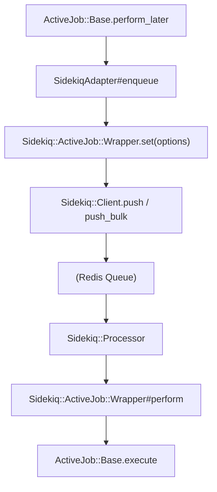
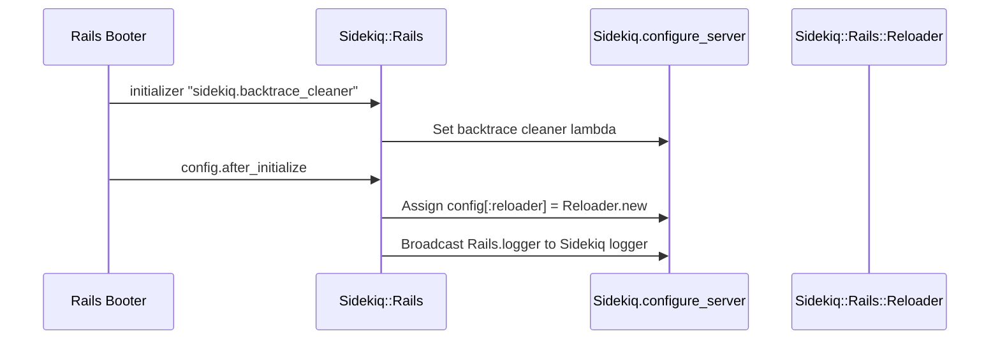

# Rails ActiveJob Integration

<details>
<summary>Relevant source files</summary>

The following files were used as context for generating this wiki page:

- [lib/sidekiq/job.rb](https://github.com/sidekiq/sidekiq/blob/main/lib/sidekiq/job.rb)
- [lib/sidekiq/web/application.rb](https://github.com/sidekiq/sidekiq/blob/main/lib/sidekiq/web/application.rb)
- [README.md](https://github.com/sidekiq/sidekiq/blob/main/README.md)
- [lib/active_job/queue_adapters/sidekiq_adapter.rb](https://github.com/sidekiq/sidekiq/blob/main/lib/active_job/queue_adapters/sidekiq_adapter.rb)
- [lib/sidekiq/api.rb](https://github.com/sidekiq/sidekiq/blob/main/lib/sidekiq/api.rb)
- [lib/sidekiq/processor.rb](https://github.com/sidekiq/sidekiq/blob/main/lib/sidekiq/processor.rb)
- [lib/sidekiq/rails.rb](https://github.com/sidekiq/sidekiq/blob/main/lib/sidekiq/rails.rb)
- [myapp/app/controllers/job_controller.rb](https://github.com/sidekiq/sidekiq/blob/main/myapp/app/controllers/job_controller.rb)
- [myapp/config/initializers/sidekiq.rb](https://github.com/sidekiq/sidekiq/blob/main/myapp/config/initializers/sidekiq.rb)
- [docs/internals.md](https://github.com/sidekiq/sidekiq/blob/main/docs/internals.md)
- [docs/8.0-Upgrade.md](https://github.com/sidekiq/sidekiq/blob/main/docs/8.0-Upgrade.md)
- [myapp/app/jobs/post_updater.rb](https://github.com/sidekiq/sidekiq/blob/main/myapp/app/jobs/post_updater.rb)
- [myapp/app/jobs/post_creator.rb](https://github.com/sidekiq/sidekiq/blob/main/myapp/app/jobs/post_creator.rb)
- [myapp/config/application.rb](https://github.com/sidekiq/sidekiq/blob/main/myapp/config/application.rb)
- [lib/generators/sidekiq/job_generator.rb](https://github.com/sidekiq/sidekiq/blob/main/lib/generators/sidekiq/job_generator.rb)
- [myapp/app/models/post.rb](https://github.com/sidekiq/sidekiq/blob/main/myapp/app/models/post.rb)
- [myapp/app/sidekiq/lazy_job.rb](https://github.com/sidekiq/sidekiq/blob/main/myapp/app/sidekiq/lazy_job.rb)
- [myapp/app/jobs/application_job.rb](https://github.com/sidekiq/sidekiq/blob/main/myapp/app/jobs/application_job.rb)
- [bare/boot.rb](https://github.com/sidekiq/sidekiq/blob/main/bare/boot.rb)
- [myapp/app/jobs/some_job.rb](https://github.com/sidekiq/sidekiq/blob/main/myapp/app/jobs/some_job.rb)
- [myapp/config/routes.rb](https://github.com/sidekiq/sidekiq/blob/main/myapp/config/routes.rb)
- [docs/7.0-Upgrade.md](https://github.com/sidekiq/sidekiq/blob/main/docs/7.0-Upgrade.md)
- [myapp/app/jobs/exit_job.rb](https://github.com/sidekiq/sidekiq/blob/main/myapp/app/jobs/exit_job.rb)
- [lib/sidekiq/test_api.rb](https://github.com/sidekiq/sidekiq/blob/main/lib/sidekiq/test_api.rb)
- [lib/sidekiq/iterable_job.rb](https://github.com/sidekiq/sidekiq/blob/main/lib/sidekiq/iterable_job.rb)
- [docs/menu.md](https://github.com/sidekiq/sidekiq/blob/main/docs/menu.md)
- [docs/5.0-Upgrade.md](https://github.com/sidekiq/sidekiq/blob/main/docs/5.0-Upgrade.md)
- [lib/sidekiq/worker_compatibility_alias.rb](https://github.com/sidekiq/sidekiq/blob/main/lib/sidekiq/worker_compatibility_alias.rb)
- [docs/Pro-2.0-Upgrade.md](https://github.com/sidekiq/sidekiq/blob/main/docs/Pro-2.0-Upgrade.md)
</details>

## Overview

The Rails ActiveJob Integration subsystem in Sidekiq bridges Ruby's standard framework-agnostic background processing model with Ruby on Rails' unified ActiveJob abstraction. It allows applications using `ActiveJob::Base` to leverage Sidekiq as their underlying job queue adapter while maintaining native support for Rails features such as GlobalID, ActiveModel argument serialization, transactional enqueuing, and framework reloader hooks.

Sources: [lib/active_job/queue_adapters/sidekiq_adapter.rb:3-33](https://github.com/sidekiq/sidekiq/blob/main/lib/active_job/queue_adapters/sidekiq_adapter.rb#L3-L33)

By implementing the `ActiveJob::QueueAdapters::SidekiqAdapter` interface, Sidekiq integrates seamlessly into standard Rails configurations via `config.active_job.queue_adapter = :sidekiq`. Instead of forcing ActiveJob instances to run directly as raw Sidekiq worker classes, the adapter marshals ActiveJob payloads into a dedicated wrapper class (`Sidekiq::ActiveJob::Wrapper`), ensuring that complex arguments and global IDs are correctly serialized and deserialized across Redis and executed safely within the Rails execution context.

Sources: [lib/active_job/queue_adapters/sidekiq_adapter.rb:35-80](https://github.com/sidekiq/sidekiq/blob/main/lib/active_job/queue_adapters/sidekiq_adapter.rb#L35-L80)

Furthermore, Sidekiq provides tight coupling with Rails engines, loggers, and backtrace cleaners via `Sidekiq::Rails`. When loaded inside a Rails environment, it automatically wires up database connection management, reloader wrapping (`Sidekiq::Rails::Reloader`), and log broadcasting to consolidate background execution logging into standard Rails log outputs.

Sources: [lib/sidekiq/rails.rb:10-62](https://github.com/sidekiq/sidekiq/blob/main/lib/sidekiq/rails.rb#L10-L62)

---

## Adapter Architecture and Queue Mechanics

The ActiveJob integration is anchored by `ActiveJob::QueueAdapters::SidekiqAdapter`, which implements the required interface methods mandated by Rails for queue adapters: `enqueue`, `enqueue_at`, and `enqueue_all`. When an ActiveJob instance is enqueued, the adapter extracts metadata (such as the wrapped job class and queue name) and delegates the push operation to `Sidekiq::ActiveJob::Wrapper`.

Sources: [lib/active_job/queue_adapters/sidekiq_adapter.rb:47-80](https://github.com/sidekiq/sidekiq/blob/main/lib/active_job/queue_adapters/sidekiq_adapter.rb#L47-L80)



Sources: [lib/active_job/queue_adapters/sidekiq_adapter.rb:10-16](https://github.com/sidekiq/sidekiq/blob/main/lib/active_job/queue_adapters/sidekiq_adapter.rb#L10-L16)

When `enqueue` or `enqueue_at` is invoked, the adapter constructs a wrapper specification containing the underlying job class name and queue, serializes the ActiveJob instance via `job.serialize`, and pushes the payload into Redis. Bulk enqueuing (`enqueue_all`) groups jobs by their class and queue name, partitioning them into immediate and scheduled sets to minimize Redis round trips.

Sources: [lib/active_job/queue_adapters/sidekiq_adapter.rb:63-111](https://github.com/sidekiq/sidekiq/blob/main/lib/active_job/queue_adapters/sidekiq_adapter.rb#L63-L111)

```ruby
# Example Rails configuration for Sidekiq ActiveJob adapter
Rails.application.config.active_job.queue_adapter = :sidekiq
```

Sources: [myapp/config/application.rb:36-37](https://github.com/sidekiq/sidekiq/blob/main/myapp/config/application.rb#L36-L37)

---

## Payload Wrapping and Execution Flow

To support ActiveJob's rich argument serialization (including GlobalID and complex ActiveModel types) without bloating Sidekiq's core worker semantics, all ActiveJob jobs are routed through `Sidekiq::ActiveJob::Wrapper`.

Sources: [lib/active_job/queue_adapters/sidekiq_adapter.rb:7-16](https://github.com/sidekiq/sidekiq/blob/main/lib/active_job/queue_adapters/sidekiq_adapter.rb#L7-L16)

```ruby
module Sidekiq
  module ActiveJob
    class Wrapper
      include Sidekiq::Job

      def perform(job_data)
        ::ActiveJob::Base.execute(job_data.merge("provider_job_id" => jid))
      end
    end
  end
end
```

Sources: [lib/active_job/queue_adapters/sidekiq_adapter.rb:10-16](https://github.com/sidekiq/sidekiq/blob/main/lib/active_job/queue_adapters/sidekiq_adapter.rb#L10-L16)

The execution flow proceeds through the following structured sequence:
1. **Fetch & Dispatch**: `Sidekiq::Processor` retrieves the serialized JSON payload for `Sidekiq::ActiveJob::Wrapper` from Redis.
2. **Reloader Wrapper**: The execution passes through `Sidekiq::Rails::Reloader`, which wraps the block in `Rails.application.reloader.wrap` to manage database connections and class reloading.
3. **Wrapper Execution**: `Sidekiq::ActiveJob::Wrapper#perform` is invoked with the serialized job hash.
4. **ActiveJob Execution**: The wrapper calls `::ActiveJob::Base.execute(job_data.merge("provider_job_id" => jid))`, injecting the Sidekiq `jid` into ActiveJob's `provider_job_id`.

Sources: [lib/sidekiq/processor.rb:142-155](https://github.com/sidekiq/sidekiq/blob/main/lib/sidekiq/processor.rb#L142-L155), [lib/sidekiq/rails.rb:16-21](https://github.com/sidekiq/sidekiq/blob/main/lib/sidekiq/rails.rb#L16-L21)

---

## Rails Engine Initialization and Reloader Integration

Sidekiq defines a Rails Engine (`Sidekiq::Rails`) that hooks directly into Rails initialization lifecycle events to configure server-side behaviors.

Sources: [lib/sidekiq/rails.rb:10-59](https://github.com/sidekiq/sidekiq/blob/main/lib/sidekiq/rails.rb#L10-L59)



Sources: [lib/sidekiq/rails.rb:32-58](https://github.com/sidekiq/sidekiq/blob/main/lib/sidekiq/rails.rb#L32-L58)

Key integration components initialized by `Sidekiq::Rails`:
- **Backtrace Cleaner**: Configures `config[:backtrace_cleaner]` to pipe exception backtraces through `Rails.backtrace_cleaner.clean`.
- **Reloader Hook**: Assigns an instance of `Sidekiq::Rails::Reloader` to `config[:reloader]`. This ensures that every background unit of work executes inside Rails' code-reloading and connection-management wrapper.
- **Logger Broadcasting**: Automatically bridges `Rails.logger` and Sidekiq's server logger (using `broadcast_to`, `ActiveSupport::Logger.broadcast`, or `ActiveSupport::BroadcastLogger`) so that all logging statements inside jobs appear in the console with proper context.

Sources: [lib/sidekiq/rails.rb:32-57](https://github.com/sidekiq/sidekiq/blob/main/lib/sidekiq/rails.rb#L32-L57)

---

## Native Job Configuration via `Sidekiq::Job::Options`

ActiveJob classes can directly configure Sidekiq-specific parameters (such as queue assignment, retry counts, and backtrace logging) by including `Sidekiq::Job::Options`. This is automatically injected into `ActiveSupport.on_load(:active_job)` when ActiveJob loads.

Sources: [lib/active_job/queue_adapters/sidekiq_adapter.rb:20-33](https://github.com/sidekiq/sidekiq/blob/main/lib/active_job/queue_adapters/sidekiq_adapter.rb#L20-L33)

```ruby
class SomeJob < ActiveJob::Base
  queue_as :default
  sidekiq_options retry: 3, backtrace: 10

  def perform
    # Job logic
  end
end
```

Sources: [lib/active_job/queue_adapters/sidekiq_adapter.rb:26-31](https://github.com/sidekiq/sidekiq/blob/main/lib/active_job/queue_adapters/sidekiq_adapter.rb#L26-L31)

> [!NOTE]
> Including `Sidekiq::Job::Options` allows ActiveJob classes to bypass ActiveJob's internal retry mechanism in favor of Sidekiq's robust retry subsystem, ensuring retries appear correctly in the Sidekiq Web UI Retries tab.

Sources: [lib/active_job/queue_adapters/sidekiq_adapter.rb:21-25](https://github.com/sidekiq/sidekiq/blob/main/lib/active_job/queue_adapters/sidekiq_adapter.rb#L21-L25), [lib/sidekiq/job.rb:46-54](https://github.com/sidekiq/sidekiq/blob/main/lib/sidekiq/job.rb#L46-L54)

---

## Web UI Inspector Integration for ActiveJob Wrappers

The Sidekiq Web UI data API (`Sidekiq::JobRecord`) provides specialized un-wrapping logic for ActiveJob payloads to display human-friendly class names and parameters rather than raw wrapper internals.

Sources: [lib/sidekiq/api.rb:434-471](https://github.com/sidekiq/sidekiq/blob/main/lib/sidekiq/api.rb#L434-L471)

| Wrapper Class / Job Type | Display Class Extraction | Argument Unwrapping Logic |
|----------------|--------------------------|---------------------------|
| `Sidekiq::ActiveJob::Wrapper` | `@item["wrapped"]` | Deserializes `ActiveJob::Arguments` from arguments array |
| `ActionMailer::DeliveryJob` | Derived from mailer class & method (`MailerClass#method`) | Drops first 3 execution arguments |
| `ActionMailer::MailDeliveryJob` | Derived from mailer class & method (`MailerClass#method`) | Extracts params and args hashes |
| Standard `Sidekiq::Job` | Raw job class string | Returns raw argument array |

Sources: [lib/sidekiq/api.rb:436-470](https://github.com/sidekiq/sidekiq/blob/main/lib/sidekiq/api.rb#L436-L470)

---

## Graceful Shutdown and Quieting Synchronization

The Sidekiq adapter coordinates process lifecycle states with Rails background workers by registering callback listeners for Sidekiq's quiet signal (`TSTP`).

Sources: [lib/active_job/queue_adapters/sidekiq_adapter.rb:47-54](https://github.com/sidekiq/sidekiq/blob/main/lib/active_job/queue_adapters/sidekiq_adapter.rb#L47-L54)

```ruby
@@stopping = false
callback = -> { @@stopping = true }

Sidekiq.configure_client { |config| config.on(:quiet, &callback) }
Sidekiq.configure_server { |config| config.on(:quiet, &callback) }
```

Sources: [lib/active_job/queue_adapters/sidekiq_adapter.rb:48-53](https://github.com/sidekiq/sidekiq/blob/main/lib/active_job/queue_adapters/sidekiq_adapter.rb#L48-L53)

When a Sidekiq process receives a quiet signal, the `@@stopping` class variable is set to `true`. The adapter exposes `stopping?` to query whether the background processing environment is currently draining or shutting down.

Sources: [lib/active_job/queue_adapters/sidekiq_adapter.rb:114](https://github.com/sidekiq/sidekiq/blob/main/lib/active_job/queue_adapters/sidekiq_adapter.rb#L114)

## Related

- [[Sample Application Setup]]
- [[Job Definition]]

