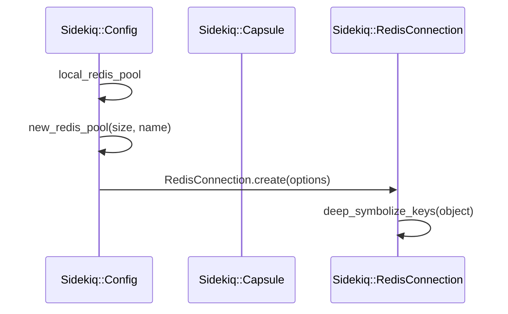
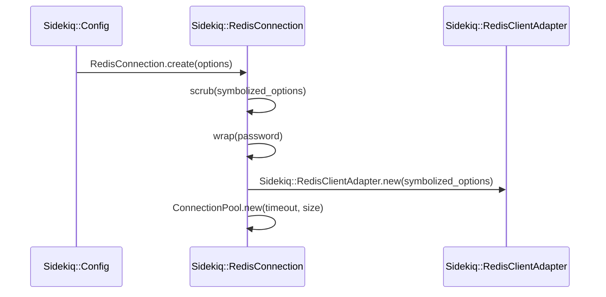

# Redis Connection Handling

<details>
<summary>Relevant source files</summary>

The following files were used as context for generating this wiki page:

- [lib/sidekiq/cli.rb](https://github.com/sidekiq/sidekiq/blob/main/lib/sidekiq/cli.rb)
- [lib/sidekiq/client.rb](https://github.com/sidekiq/sidekiq/blob/main/lib/sidekiq/client.rb)
- [docs/capsule.md](https://github.com/sidekiq/sidekiq/blob/main/docs/capsule.md)
- [lib/sidekiq/config.rb](https://github.com/sidekiq/sidekiq/blob/main/lib/sidekiq/config.rb)
- [lib/sidekiq/redis_connection.rb](https://github.com/sidekiq/sidekiq/blob/main/lib/sidekiq/redis_connection.rb)
- [README.md](https://github.com/sidekiq/sidekiq/blob/main/README.md)
- [lib/sidekiq/redis_client_adapter.rb](https://github.com/sidekiq/sidekiq/blob/main/lib/sidekiq/redis_client_adapter.rb)
- [lib/sidekiq/processor.rb](https://github.com/sidekiq/sidekiq/blob/main/lib/sidekiq/processor.rb)
- [lib/active_job/queue_adapters/sidekiq_adapter.rb](https://github.com/sidekiq/sidekiq/blob/main/lib/active_job/queue_adapters/sidekiq_adapter.rb)
- [docs/internals.md](https://github.com/sidekiq/sidekiq/blob/main/docs/internals.md)
- [docs/7.0-API-Migration.md](https://github.com/sidekiq/sidekiq/blob/main/docs/7.0-API-Migration.md)
- [docs/3.0-Upgrade.md](https://github.com/sidekiq/sidekiq/blob/main/docs/3.0-Upgrade.md)
- [lib/sidekiq/rails.rb](https://github.com/sidekiq/sidekiq/blob/main/lib/sidekiq/rails.rb)
- [lib/sidekiq/capsule.rb](https://github.com/sidekiq/sidekiq/blob/main/lib/sidekiq/capsule.rb)
- [lib/sidekiq/fetch.rb](https://github.com/sidekiq/sidekiq/blob/main/lib/sidekiq/fetch.rb)
- [lib/sidekiq/transaction_aware_client.rb](https://github.com/sidekiq/sidekiq/blob/main/lib/sidekiq/transaction_aware_client.rb)
- [lib/sidekiq/scheduled.rb](https://github.com/sidekiq/sidekiq/blob/main/lib/sidekiq/scheduled.rb)
- [lib/sidekiq/middleware/modules.rb](https://github.com/sidekiq/sidekiq/blob/main/lib/sidekiq/middleware/modules.rb)
- [docs/7.0-Upgrade.md](https://github.com/sidekiq/sidekiq/blob/main/docs/7.0-Upgrade.md)
- [docs/4.0-Upgrade.md](https://github.com/sidekiq/sidekiq/blob/main/docs/4.0-Upgrade.md)
- [myapp/config/initializers/sidekiq.rb](https://github.com/sidekiq/sidekiq/blob/main/myapp/config/initializers/sidekiq.rb)
- [bare/boot.rb](https://github.com/sidekiq/sidekiq/blob/main/bare/boot.rb)
- [docs/6.0-Upgrade.md](https://github.com/sidekiq/sidekiq/blob/main/docs/6.0-Upgrade.md)
- [docs/8.0-Upgrade.md](https://github.com/sidekiq/sidekiq/blob/main/docs/8.0-Upgrade.md)
- [docs/Pro-2.0-Upgrade.md](https://github.com/sidekiq/sidekiq/blob/main/docs/Pro-2.0-Upgrade.md)
</details>

## Overview

Redis connection handling governs how Sidekiq manages communication with Redis across client job pushing, server-side work fetching, background polling, and processor execution. By utilizing connection pools configured through `Sidekiq::Config` and `Sidekiq::Capsule`, Sidekiq ensures that threads across different components and concurrency levels share and access Redis safely and efficiently without manual connection management.

Sources: [lib/sidekiq/cli.rb:95-97](https://github.com/sidekiq/sidekiq/blob/main/lib/sidekiq/cli.rb#L95-L97), [lib/sidekiq/client.rb:260-282](https://github.com/sidekiq/sidekiq/blob/main/lib/sidekiq/client.rb#L260-L282), [lib/sidekiq/config.rb:153-167](https://github.com/sidekiq/sidekiq/blob/main/lib/sidekiq/config.rb#L153-L167), [lib/sidekiq/redis_connection.rb:10-39](https://github.com/sidekiq/sidekiq/blob/main/lib/sidekiq/redis_connection.rb#L10-L39), [lib/sidekiq/capsule.rb:95-125](https://github.com/sidekiq/sidekiq/blob/main/lib/sidekiq/capsule.rb#L95-L125)

At its core, this layer abstracts the underlying driver interactions through adapters like `Sidekiq::RedisClientAdapter`, wrapping connections in `ConnectionPool` instances while handling option sanitization, provider resolution via environment variables, and resilient retry logic for transient replication states such as `READONLY` or `NOREPLICAS`.

Sources: [lib/sidekiq/config.rb:185-205](https://github.com/sidekiq/sidekiq/blob/main/lib/sidekiq/config.rb#L185-L205), [lib/sidekiq/redis_connection.rb:10-113](https://github.com/sidekiq/sidekiq/blob/main/lib/sidekiq/redis_connection.rb#L10-L113), [lib/sidekiq/redis_client_adapter.rb:7-116](https://github.com/sidekiq/sidekiq/blob/main/lib/sidekiq/redis_client_adapter.rb#L7-L116)

## Connection Configuration and Pool Initialization

### Overview

Redis connection configuration and pool initialization are managed globally through `Sidekiq::Config` and component-level execution units via `Sidekiq::Capsule`. These classes establish how application options and connection pools are set up, allowing individual capsules and internal background housekeeping threads to maintain dedicated connection pools while sharing a unified global Redis configuration hash.

Sources: [lib/sidekiq/config.rb:63-69](https://github.com/sidekiq/sidekiq/blob/main/lib/sidekiq/config.rb#L63-L69), [lib/sidekiq/config.rb:144-167](https://github.com/sidekiq/sidekiq/blob/main/lib/sidekiq/config.rb#L144-L167), [lib/sidekiq/capsule.rb:32-39](https://github.com/sidekiq/sidekiq/blob/main/lib/sidekiq/capsule.rb#L32-L39), [lib/sidekiq/capsule.rb:99-103](https://github.com/sidekiq/sidekiq/blob/main/lib/sidekiq/capsule.rb#L99-L103)

### Call-Chain Execution Walkthrough

The creation of an internal connection pool follows an explicit call sequence when a component requests the local redis pool without an explicit thread-local override.

1. `local_redis_pool` — Invoked on `Sidekiq::Config` (or `Sidekiq::Capsule`), checking the memoized `@redis` instance and delegating to `new_redis_pool(10, "internal")`.
Sources: [lib/sidekiq/config.rb:157-161](https://github.com/sidekiq/sidekiq/blob/main/lib/sidekiq/config.rb#L157-L161), [lib/sidekiq/capsule.rb:99-103](https://github.com/sidekiq/sidekiq/blob/main/lib/sidekiq/capsule.rb#L99-L103)

2. `new_redis_pool` — Accepts a pool size and pool name, merging them with the global `@redis_config` hash before invoking `RedisConnection.create`.
Sources: [lib/sidekiq/config.rb:163-167](https://github.com/sidekiq/sidekiq/blob/main/lib/sidekiq/config.rb#L163-L167)

3. `create` — Entry point on `Sidekiq::RedisConnection` that initiates option sanitization and adapter wrapping.
Sources: [lib/sidekiq/redis_connection.rb:10-38](https://github.com/sidekiq/sidekiq/blob/main/lib/sidekiq/redis_connection.rb#L10-L38)

4. `deep_symbolize_keys` — Recursively processes the configuration hash keys to symbols.
Sources: [lib/sidekiq/redis_connection.rb:11](https://github.com/sidekiq/sidekiq/blob/main/lib/sidekiq/redis_connection.rb#L11), [lib/sidekiq/redis_connection.rb:52-63](https://github.com/sidekiq/sidekiq/blob/main/lib/sidekiq/redis_connection.rb#L52-L63)



Sources: [lib/sidekiq/config.rb:157-167](https://github.com/sidekiq/sidekiq/blob/main/lib/sidekiq/config.rb#L157-L167), [lib/sidekiq/redis_connection.rb:10-11](https://github.com/sidekiq/sidekiq/blob/main/lib/sidekiq/redis_connection.rb#L10-L11), [lib/sidekiq/redis_connection.rb:52-63](https://github.com/sidekiq/sidekiq/blob/main/lib/sidekiq/redis_connection.rb#L52-L63)

### Configuration Options and Capsule Integration

Global configuration defaults initialize an empty error handler array, a default concurrency of `5`, and empty lifecycle event hooks. Applications can assign Redis settings using `config.redis = { ... }`, which merges incoming parameters into `@redis_config`. All capsules share this underlying Redis configuration while maintaining independent thread pool sizes matching their concurrency settings.

Sources: [lib/sidekiq/config.rb:11-41](https://github.com/sidekiq/sidekiq/blob/main/lib/sidekiq/config.rb#L11-L41), [lib/sidekiq/config.rb:63-69](https://github.com/sidekiq/sidekiq/blob/main/lib/sidekiq/config.rb#L63-L69), [lib/sidekiq/config.rb:144-147](https://github.com/sidekiq/sidekiq/blob/main/lib/sidekiq/config.rb#L144-L147), [lib/sidekiq/capsule.rb:32-39](https://github.com/sidekiq/sidekiq/blob/main/lib/sidekiq/capsule.rb#L32-L39), [lib/sidekiq/capsule.rb:99-103](https://github.com/sidekiq/sidekiq/blob/main/lib/sidekiq/capsule.rb#L99-L103)

| Method / Attribute | Target Class | Default Value | Description |
| :--- | :--- | :--- | :--- |
| `concurrency` | `Sidekiq::Config` / `Sidekiq::Capsule` | `5` | Number of concurrent processing threads per capsule. |
| `redis=` | `Sidekiq::Config` | `{}` | Merges connection options into the global Redis configuration hash. |
| `reap_idle_redis_connections` | `Sidekiq::Config` | `nil` | Sets the `redis_idle_timeout` option (default timeout `60` seconds when enabled). |
| `local_redis_pool` | `Sidekiq::Config` | `10` size ("internal") | Internal housekeeping and client connection pool. |

Sources: [lib/sidekiq/config.rb:15](https://github.com/sidekiq/sidekiq/blob/main/lib/sidekiq/config.rb#L15), [lib/sidekiq/config.rb:87-93](https://github.com/sidekiq/sidekiq/blob/main/lib/sidekiq/config.rb#L87-L93), [lib/sidekiq/config.rb:145-151](https://github.com/sidekiq/sidekiq/blob/main/lib/sidekiq/config.rb#L145-L151), [lib/sidekiq/config.rb:157-161](https://github.com/sidekiq/sidekiq/blob/main/lib/sidekiq/config.rb#L157-L161), [lib/sidekiq/capsule.rb:37](https://github.com/sidekiq/sidekiq/blob/main/lib/sidekiq/capsule.rb#L37)

> [!WARNING]
> All capsules must use the exact same Redis configuration. Assigning `config.redis=` updates a shared `@redis_config` instance across the entire global configuration object and every registered capsule.
> Sources: [lib/sidekiq/config.rb:144-147](https://github.com/sidekiq/sidekiq/blob/main/lib/sidekiq/config.rb#L144-L147)

> [!NOTE]
> Connection pools are lazy and will not establish network sockets or create connections until an operation explicitly requests a connection from the pool.
> Sources: [lib/sidekiq/config.rb:164-165](https://github.com/sidekiq/sidekiq/blob/main/lib/sidekiq/config.rb#L164-L165), [lib/sidekiq/capsule.rb:100-101](https://github.com/sidekiq/sidekiq/blob/main/lib/sidekiq/capsule.rb#L100-L101)

### Design Trade-Offs

| Design Choice | Benefit | Cost |
| :--- | :--- | :--- |
| **Shared `@redis_config` with isolated pool instances** | Enforces consistent Redis topology across all capsules while avoiding cross-thread contention for connection handles. | Prevents connecting different capsules to separate Redis clusters or isolated database instances. |
| **Lazy connection pool initialization** | Avoids unnecessary network handshakes and socket allocations during initial application boot. | First-job execution latency can spike slightly while connection pools establish their initial sockets. |
| **Thread-local pool overrides (`Thread.current[:sidekiq_redis_pool]`)** | Enables temporary context-specific connection binding without rewriting global parameters. | Requires careful cleanup to prevent connection leaks across thread pool task reuse. |

Sources: [lib/sidekiq/config.rb:144-167](https://github.com/sidekiq/sidekiq/blob/main/lib/sidekiq/config.rb#L144-L167), [lib/sidekiq/config.rb:153-155](https://github.com/sidekiq/sidekiq/blob/main/lib/sidekiq/config.rb#L153-L155), [lib/sidekiq/capsule.rb:95-103](https://github.com/sidekiq/sidekiq/blob/main/lib/sidekiq/capsule.rb#L95-L103)

## Redis Connection Factory and Pool Wrapping

### Overview

The `Sidekiq::RedisConnection` module acts as the central factory for establishing, sanitizing, and wrapping Redis connections and connection pools. Within `Sidekiq::RedisConnection.create`, incoming configuration options undergo deep key symbolization, environment provider resolution, and password wrapping before being handed off to the `Sidekiq::RedisClientAdapter` and wrapped in a `ConnectionPool`.

Sources: [lib/sidekiq/redis_connection.rb:7-39](https://github.com/sidekiq/sidekiq/blob/main/lib/sidekiq/redis_connection.rb#L7-L39)

### Execution Call Walks and Sequence

The pool creation sequence flows through specific internal functions to prepare options and instantiate the connection wrapper. 

The first call trace `local_redis_pool` → `new_redis_pool` → `create` → `scrub` performs these steps:
1. `local_redis_pool` initializes the housekeeping pool via `Sidekiq::Config`.
Sources: [lib/sidekiq/config.rb:157-161](https://github.com/sidekiq/sidekiq/blob/main/lib/sidekiq/config.rb#L157-L161)
2. `new_redis_pool` delegates option merging to `Sidekiq::RedisConnection.create`.
Sources: [lib/sidekiq/config.rb:163-167](https://github.com/sidekiq/sidekiq/blob/main/lib/sidekiq/config.rb#L163-L167)
3. `create` processes the symbolized options and calls `scrub` for logging.
Sources: [lib/sidekiq/redis_connection.rb:10-18](https://github.com/sidekiq/sidekiq/blob/main/lib/sidekiq/redis_connection.rb#L10-L18)
4. `scrub` clones and redacts sensitive parameters like passwords and URIs before info logging.
Sources: [lib/sidekiq/redis_connection.rb:65-90](https://github.com/sidekiq/sidekiq/blob/main/lib/sidekiq/redis_connection.rb#L65-L90)

The second call trace `local_redis_pool` → `new_redis_pool` → `create` → `wrap` performs these steps:
1. `local_redis_pool` invokes `new_redis_pool`.
Sources: [lib/sidekiq/config.rb:157-161](https://github.com/sidekiq/sidekiq/blob/main/lib/sidekiq/config.rb#L157-L161)
2. `new_redis_pool` calls `RedisConnection.create`.
Sources: [lib/sidekiq/config.rb:163-167](https://github.com/sidekiq/sidekiq/blob/main/lib/sidekiq/config.rb#L163-L167)
3. `create` checks option keys and passes string passwords to `wrap`.
Sources: [lib/sidekiq/redis_connection.rb:10-14](https://github.com/sidekiq/sidekiq/blob/main/lib/sidekiq/redis_connection.rb#L10-L14)
4. `wrap` converts string passwords into a `Proc` returning the string to prevent plaintext logging leaks.
Sources: [lib/sidekiq/redis_connection.rb:43-50](https://github.com/sidekiq/sidekiq/blob/main/lib/sidekiq/redis_connection.rb#L43-L50)



Sources: [lib/sidekiq/config.rb:163-167](https://github.com/sidekiq/sidekiq/blob/main/lib/sidekiq/config.rb#L163-L167), [lib/sidekiq/redis_connection.rb:10-38](https://github.com/sidekiq/sidekiq/blob/main/lib/sidekiq/redis_connection.rb#L10-L38), [lib/sidekiq/redis_client_adapter.rb:62-76](https://github.com/sidekiq/sidekiq/blob/main/lib/sidekiq/redis_client_adapter.rb#L62-L76)

> [!WARNING]
> Sidekiq 7+ explicitly forbids Redis protocol version 2 and cluster configurations without explicit safety flags, raising a runtime error if `protocol: 2` or unsupported cluster nodes are detected.
> Sources: [lib/sidekiq/redis_connection.rb:19-22](https://github.com/sidekiq/sidekiq/blob/main/lib/sidekiq/redis_connection.rb#L19-L22)

> [!NOTE]
> The default network timeout in `redis-client` is overridden to `3` seconds in `RedisConnection.create` to prevent premature `ReadTimeoutError` exceptions during high CPU load on multi-threaded Sidekiq worker processes.
> Sources: [lib/sidekiq/redis_connection.rb:28-33](https://github.com/sidekiq/sidekiq/blob/main/lib/sidekiq/redis_connection.rb#L28-L33)

### Connection Factory Options and Parameters

| Option / Parameter | Default Value | Purpose / Behavior in `RedisConnection.create` |
| :--- | :--- | :--- |
| `url` | `determine_redis_provider` | Redis connection URI; resolves from `REDIS_PROVIDER` or `REDIS_URL` environment variables. |
| `password` / `sentinel_password` | `nil` | Authenticates connection; wrapped in a `Proc` if supplied as a String to prevent log exposure. |
| `protocol` | `nil` | Must not be `2`; Sidekiq 7+ enforces Protocol 3. |
| `cluster_safe` | `false` | Boolean flag permitting cluster node configurations when enabled. |
| `size` | `5` | Size of the wrapped `ConnectionPool`. |
| `pool_timeout` | `1` | Timeout in seconds when waiting for an available connection from the pool. |
| `timeout` | `3` | Network read/write timeout in seconds enforced by `redis-client`. |

Sources: [lib/sidekiq/redis_connection.rb:10-36](https://github.com/sidekiq/sidekiq/blob/main/lib/sidekiq/redis_connection.rb#L10-L36), [lib/sidekiq/redis_connection.rb:92-112](https://github.com/sidekiq/sidekiq/blob/main/lib/sidekiq/redis_connection.rb#L92-L112)

### Design Trade-Offs

| Design Choice | Benefit | Cost |
| :--- | :--- | :--- |
| **Password wrapping in `Proc` objects** | Prevents plaintext passwords from being dumped into logs during connection logging and error reporting. | Obscures the underlying password format type when inspected directly inside option hashes. |
| **Automatic provider resolution (`REDIS_PROVIDER`)** | Enables seamless integration with PaaS environments like Heroku without requiring custom initialization code. | Adds extra environment variable lookup overhead and potential error raising if misconfigured. |
| **Mandatory Protocol 3 enforcement** | Ensures compatibility with modern Redis server features and pipelining structures required by `redis-client`. | Breaks legacy deployments attempting to run Sidekiq 7+ against Redis protocol 2 servers. |

Sources: [lib/sidekiq/redis_connection.rb:12-14](https://github.com/sidekiq/sidekiq/blob/main/lib/sidekiq/redis_connection.rb#L12-L14), [lib/sidekiq/redis_connection.rb:19](https://github.com/sidekiq/sidekiq/blob/main/lib/sidekiq/redis_connection.rb#L19), [lib/sidekiq/redis_connection.rb:43-50](https://github.com/sidekiq/sidekiq/blob/main/lib/sidekiq/redis_connection.rb#L43-L50), [lib/sidekiq/redis_connection.rb:92-112](https://github.com/sidekiq/sidekiq/blob/main/lib/sidekiq/redis_connection.rb#L92-L112)

## Redis Client Adapter and Compatibility Layer

### Overview

`Sidekiq::RedisClientAdapter` wraps the `redis-client` gem, providing configuration translation, decorator creation, and compatibility methods for commands used across Sidekiq. When initialized with options, it inspects keys to determine whether to instantiate a standard configuration, a sentinel configuration via `RedisClient.sentinel`, or a cluster configuration via `RedisClient.cluster` when `nodes` are provided.

Sources: [lib/sidekiq/redis_client_adapter.rb:62-76](https://github.com/sidekiq/sidekiq/blob/main/lib/sidekiq/redis_client_adapter.rb#L62-L76)

### Adapter Configuration and Option Translation

`client_opts` sanitizes input parameters before passing them to `redis-client`. It rejects legacy namespaces, cleans up pool-specific settings, maps legacy timeouts, and sets default retry attempts and driver identification.

| Option Key | Transformation / Action in `client_opts` |
| :--- | :--- |
| `namespace` | Raises an `ArgumentError` because namespaces are not supported in Sidekiq 7+. |
| `size`, `pool_timeout` | Deleted from redis-client options as pool management is handled externally by `ConnectionPool`. |
| `network_timeout` | Converted and assigned to `timeout`. |
| `master_name` | Mapped to `name`. |
| `role`, `driver` | Converted to symbols (`to_sym`). |
| `reconnect_attempts` | Defaulted to `1` if omitted. |
| `driver_info` | Defaulted to `"sidekiq_v#{Sidekiq::VERSION}"` to identify client connections in `CLIENT LIST`. |

Sources: [lib/sidekiq/redis_client_adapter.rb:84-115](https://github.com/sidekiq/sidekiq/blob/main/lib/sidekiq/redis_client_adapter.rb#L84-L115)

> [!WARNING]
> Sidekiq explicitly prohibits the `redis-namespace` gem. If an options hash containing `:namespace` is passed to `RedisClientAdapter`, an `ArgumentError` is raised immediately during client option processing.
> Sources: [lib/sidekiq/redis_client_adapter.rb:87-90](https://github.com/sidekiq/sidekiq/blob/main/lib/sidekiq/redis_client_adapter.rb#L87-L90)

### Compatibility Methods and Method Missing Dispatch

`Sidekiq::RedisClientAdapter::CompatMethods` is wrapped around the underlying Redis client using `RedisClient::Decorator.create`. It defines explicit performance-enhancing methods for high-frequency commands and delegates others through `method_missing`, issuing deprecation warnings for deprecated Redis commands.

```ruby
client = Sidekiq::RedisClientAdapter.new(url: "redis://localhost:6379/0").new_client
client.ping
```

Sources: [lib/sidekiq/redis_client_adapter.rb:14-54](https://github.com/sidekiq/sidekiq/blob/main/lib/sidekiq/redis_client_adapter.rb#L14-L54), [lib/sidekiq/redis_client_adapter.rb:78-80](https://github.com/sidekiq/sidekiq/blob/main/lib/sidekiq/redis_client_adapter.rb#L78-L80)

### Design Trade-Offs

| Design Choice | Benefit | Cost |
| :--- | :--- | :--- |
| **Explicit `USED_COMMANDS` definitions** | Bypasses `method_missing` overhead for frequent Redis operations, improving command execution throughput. | Requires maintaining an explicit list of command names within the adapter code. |
| **`CompatClient` decorator pattern** | Encapsulates command translation and deprecation warnings without modifying core `redis-client` internals. | Introduces an extra delegation layer for every Redis command invocation. |
| **Forced command deprecation warnings** | Alerts developers immediately when executing deprecated Redis commands (`rpoplpush`, `setex`, etc.) via `method_missing`. | Incurs minor runtime overhead checking the `DEPRECATED_COMMANDS` set on unoptimized command calls. |

Sources: [lib/sidekiq/redis_client_adapter.rb:11-52](https://github.com/sidekiq/sidekiq/blob/main/lib/sidekiq/redis_client_adapter.rb#L11-L52)

## Client and Server Redis Usage Lifecycle

### Overview

Sidekiq executes Redis commands through distinct operational lifecycles: pushing jobs via the client API, retrieving and acknowledging work items in processors, handling transaction-aware pushes, and polling retry or scheduled sorted sets.

Sources: [lib/sidekiq/client.rb:33-304](https://github.com/sidekiq/sidekiq/blob/main/lib/sidekiq/client.rb#L33-L304), [lib/sidekiq/processor.rb:12-229](https://github.com/sidekiq/sidekiq/blob/main/lib/sidekiq/processor.rb#L12-L229), [lib/sidekiq/fetch.rb:8-50](https://github.com/sidekiq/sidekiq/blob/main/lib/sidekiq/fetch.rb#L8-L50), [lib/sidekiq/transaction_aware_client.rb:7-39](https://github.com/sidekiq/sidekiq/blob/main/lib/sidekiq/transaction_aware_client.rb#L7-L39), [lib/sidekiq/scheduled.rb:10-64](https://github.com/sidekiq/sidekiq/blob/main/lib/sidekiq/scheduled.rb#L10-L64)

### Job Pushing and Atomic Push Operations

The `Sidekiq::Client` class normalizes item payloads, runs client middleware chains, and dispatches items to Redis using `raw_push`. Within `raw_push`, connections are checked out from `@redis_pool`, and commands execute inside a `pipelined` block with automated retry handling for `READONLY`, `NOREPLICAS`, or `UNBLOCKED` errors.

```ruby
client = Sidekiq::Client.new(pool: Sidekiq::RedisConnection.create)
client.push('class' => 'SomeJob', 'args' => [1, 2, 3])
```

Sources: [lib/sidekiq/client.rb:101-111](https://github.com/sidekiq/sidekiq/blob/main/lib/sidekiq/client.rb#L101-L111), [lib/sidekiq/client.rb:260-282](https://github.com/sidekiq/sidekiq/blob/main/lib/sidekiq/client.rb#L260-L282)

The `atomic_push` method branches based on whether the payload contains an execution timestamp (`"at"`):
* **Scheduled Jobs:** Executes `conn.zadd("schedule", [at, json])` to add the job payload into the sorted set with its timestamp as the score.
* **Immediate Jobs:** Groups payloads by queue name, updates the global `"queues"` set via `conn.sadd("queues", grouped_queues.keys)`, assigns millisecond `enqueued_at` timestamps, and pushes serialized payloads into list keys via `conn.lpush("queue:#{queue}", to_push)`.

Sources: [lib/sidekiq/client.rb:284-304](https://github.com/sidekiq/sidekiq/blob/main/lib/sidekiq/client.rb#L284-L304)

### Work Fetching and Processor Execution Walkthrough

The `Sidekiq::Processor` lifecycle runs worker threads that pull jobs from Redis queues and execute them through middleware and reloader wrappers. The work-retrieval call chain flows through `fetch` → `get_one` → `retrieve_work`.

1. `fetch` calls `get_one` and checks if the processor is shutting down (`@done`). If stopping, it calls `j.requeue` to push the job back onto its Redis list.
Sources: [lib/sidekiq/processor.rb:104-112](https://github.com/sidekiq/sidekiq/blob/main/lib/sidekiq/processor.rb#L104-L112)
2. `get_one` invokes `capsule.fetcher.retrieve_work` to retrieve a `UnitOfWork` instance.
Sources: [lib/sidekiq/processor.rb:92-98](https://github.com/sidekiq/sidekiq/blob/main/lib/sidekiq/processor.rb#L92-L98)
3. `BasicFetch#retrieve_work` queries `queues_cmd` and invokes `conn.blocking_call(TIMEOUT, "brpop", *qs, TIMEOUT)` on Redis.
Sources: [lib/sidekiq/fetch.rb:39-48](https://github.com/sidekiq/sidekiq/blob/main/lib/sidekiq/fetch.rb#L39-L48)
4. `BasicFetch` returns a `UnitOfWork` struct wrapping the queue name, raw job JSON string, and configuration.
Sources: [lib/sidekiq/fetch.rb:14-29](https://github.com/sidekiq/sidekiq/blob/main/lib/sidekiq/fetch.rb#L14-L29)

Once fetched, `process` handles JSON parsing anomalies and dispatches valid jobs. If malformed JSON is encountered, the raw job string goes straight to the dead job set (`"dead"`) inside a `conn.multi` transaction before acknowledging the work unit.

Sources: [lib/sidekiq/processor.rb:167-186](https://github.com/sidekiq/sidekiq/blob/main/lib/sidekiq/processor.rb#L167-L186)

> [!WARNING]
> If a worker thread is forcefully interrupted by `Sidekiq::Shutdown` while executing a job, `process` captures the exception and skips calling `uow.acknowledge`. This leaves the uncompleted job un-acknowledged, relying on proactive server-side recovery mechanisms.
> Sources: [lib/sidekiq/processor.rb:197-200](https://github.com/sidekiq/sidekiq/blob/main/lib/sidekiq/processor.rb#L197-L200), [lib/sidekiq/processor.rb:220-223](https://github.com/sidekiq/sidekiq/blob/main/lib/sidekiq/processor.rb#L220-L223)

### Transaction-Aware Clients and Scheduled Polling

When `Sidekiq.transactional_push!` is enabled, `Sidekiq::TransactionAwareClient` wraps `Sidekiq::Client` and integrates with ActiveRecord or `after_commit_everywhere` to defer pushing jobs until database transactions successfully commit.

Sources: [lib/sidekiq/transaction_aware_client.rb:7-16](https://github.com/sidekiq/sidekiq/blob/main/lib/sidekiq/transaction_aware_client.rb#L7-L16), [lib/sidekiq/transaction_aware_client.rb:43-58](https://github.com/sidekiq/sidekiq/blob/main/lib/sidekiq/transaction_aware_client.rb#L43-L58)

The scheduled subsystem (`Sidekiq::Scheduled::Enq`) evaluates retry and schedule sorted sets using a Lua script (`LUA_ZPOPBYSCORE`) loaded via `conn.script(:load, LUA_ZPOPBYSCORE)`. During execution, `enqueue_jobs` iterates over `sorted_sets` and calls `zpopbyscore`, fetching jobs whose scores are less than or equal to `Time.now.to_f`, and pushes them back onto immediate queues via `Sidekiq::Client#push`.

Sources: [lib/sidekiq/scheduled.rb:10-44](https://github.com/sidekiq/sidekiq/blob/main/lib/sidekiq/scheduled.rb#L10-L44), [lib/sidekiq/scheduled.rb:52-63](https://github.com/sidekiq/sidekiq/blob/main/lib/sidekiq/scheduled.rb#L52-L63)

## Framework Integration and Upgrade Evolution

### Framework Integration and Rails Reloader

Sidekiq integrates with Ruby on Rails through the `Sidekiq::Rails` engine, which hooks into the Rails initialization and reloader lifecycle. When a Rails application boots, `Sidekiq::Rails` registers a backtrace cleaner initializer that wraps `config[:backtrace_cleaner]` using `::Rails.backtrace_cleaner.clean(backtrace)`. Furthermore, after initialization completes, `Sidekiq::Rails` configures the server instance by assigning a `Sidekiq::Rails::Reloader` instance to `config[:reloader]`. 

```ruby
class Reloader
  def initialize(app = ::Rails.application)
    @app = app
  end

  def call
    params = (::Rails::VERSION::STRING >= "7.1") ? {source: "job.sidekiq"} : {}
    @app.reloader.wrap(**params) do
      yield
    end
  end
end
```

Sources: [lib/sidekiq/rails.rb:10-21](https://github.com/sidekiq/sidekiq/blob/main/lib/sidekiq/rails.rb#L10-L21), [lib/sidekiq/rails.rb:32-44](https://github.com/sidekiq/sidekiq/blob/main/lib/sidekiq/rails.rb#L32-L44)

The reloader execution call chain executes around job execution to ensure code reloading semantics function correctly inside worker threads:
1. Processor invokes the execution block wrapped by the reloader.
Sources: [lib/sidekiq/processor.rb:146](https://github.com/sidekiq/sidekiq/blob/main/lib/sidekiq/processor.rb#L146)
2. `Sidekiq::Rails::Reloader#call` checks the Rails version (`::Rails::VERSION::STRING >= "7.1"`).
Sources: [lib/sidekiq/rails.rb:17](https://github.com/sidekiq/sidekiq/blob/main/lib/sidekiq/rails.rb#L17)
3. It calls `@app.reloader.wrap` with or without `source: "job.sidekiq"`.
Sources: [lib/sidekiq/rails.rb:18](https://github.com/sidekiq/sidekiq/blob/main/lib/sidekiq/rails.rb#L18)
4. The application reloader yields control to execute the job inside the reloaded environment.
Sources: [lib/sidekiq/rails.rb:19](https://github.com/sidekiq/sidekiq/blob/main/lib/sidekiq/rails.rb#L19)

Additionally, the integration hooks standard output logging so that messages directed to `Rails.logger` automatically broadcast into Sidekiq's structured logging infrastructure. If `::Rails.logger` does not match Sidekiq's logger and does not already output to standard output, it hooks via `broadcast_to`, `ActiveSupport::Logger.broadcast`, or instantiates a new `ActiveSupport::BroadcastLogger`.

Sources: [lib/sidekiq/rails.rb:48-56](https://github.com/sidekiq/sidekiq/blob/main/lib/sidekiq/rails.rb#L48-L56)

### Active Job Adapter and Wrapper

Sidekiq provides a native Active Job queue adapter (`Sidekiq::Adapter`) that serializes Active Job instances and routes them through Sidekiq's client push mechanisms. When an Active Job is enqueued, the adapter builds configuration options, wraps the job payload in `Sidekiq::ActiveJob::Wrapper`, and dispatches it immediately or at a scheduled timestamp.

| Method | Target Mechanism | Description |
| :--- | :--- | :--- |
| `enqueue(job)` | `wrapper.perform_async` | Wraps job metadata and pushes it to the immediate queue. |
| `enqueue_at(job, timestamp)` | `wrapper.perform_at` | Schedules the wrapped job execution for a specific UNIX timestamp. |
| `enqueue_all(jobs)` | `Sidekiq::Client.push_bulk` | Batch pushes groups of immediate and scheduled jobs efficiently. |

Sources: [lib/active_job/queue_adapters/sidekiq_adapter.rb:63-111](https://github.com/sidekiq/sidekiq/blob/main/lib/active_job/queue_adapters/sidekiq_adapter.rb#L63-L111)

Active Job instances can opt out of Active Job's internal retry mechanisms by including `Sidekiq::Job::Options`, allowing developers to declare `sidekiq_options retry: 3, backtrace: 10` directly on the job class. When `Sidekiq::ActiveJob::Wrapper#perform` executes, it invokes `::ActiveJob::Base.execute(job_data.merge("provider_job_id" => jid))` to hand execution back to Rails.

```ruby
class Wrapper
  include Sidekiq::Job

  def perform(job_data)
    ::ActiveJob::Base.execute(job_data.merge("provider_job_id" => jid))
  end
end
```

Sources: [lib/active_job/queue_adapters/sidekiq_adapter.rb:10-16](https://github.com/sidekiq/sidekiq/blob/main/lib/active_job/queue_adapters/sidekiq_adapter.rb#L10-L16), [lib/active_job/queue_adapters/sidekiq_adapter.rb:20-33](https://github.com/sidekiq/sidekiq/blob/main/lib/active_job/queue_adapters/sidekiq_adapter.rb#L20-L33)

> [!NOTE]
> Active Job retries do not show up in the Sidekiq UI Retries tab, do not store error data in Sidekiq's retry set, and cannot be manually retried through the Sidekiq Web UI unless managed natively via Sidekiq options.
> Sources: [lib/active_job/queue_adapters/sidekiq_adapter.rb:20-25](https://github.com/sidekiq/sidekiq/blob/main/lib/active_job/queue_adapters/sidekiq_adapter.rb#L20-L25)

### Upgrade Evolution and Connection Changes

Major releases of Sidekiq have progressively evolved connection handling, concurrency scaling, and global state management:
* **Sidekiq 3.0:** Introduced middleware connection passing where client-side middleware receives a `redis_pool` argument (`def call(worker_class, msg, queue, redis_pool)`), replacing global `Sidekiq.redis` calls in client middleware. It also decoupled Redis-to-Go initialization, requiring explicit `REDIS_PROVIDER` or `REDIS_URL` settings.
Sources: [docs/3.0-Upgrade.md:9-35](https://github.com/sidekiq/sidekiq/blob/main/docs/3.0-Upgrade.md#L9-L35)
* **Sidekiq 4.0:** Redesigned connection architecture to fetch jobs from Redis in parallel using multiple threads, increasing the minimum connection pool requirement to `concurrency + 2` connections per process.
Sources: [docs/4.0-Upgrade.md:23-26](https://github.com/sidekiq/sidekiq/blob/main/docs/4.0-Upgrade.md#L23-L26)
* **Sidekiq 6.0:** Enforced validation of the `REDIS_PROVIDER` environment variable (clarifying it must hold the *name* of the URL environment variable, not the URL itself) and increased the default shutdown timeout from 8 seconds to 25 seconds.
Sources: [docs/6.0-Upgrade.md:44-54](https://github.com/sidekiq/sidekiq/blob/main/docs/6.0-Upgrade.md#L44-L54)
* **Sidekiq 7.0:** Replaced global singletons with `Sidekiq::Config`, `Sidekiq::Capsule`, and `Sidekiq::Component`. Rather than sharing a single global pool, Sidekiq 7.0 provisions an internal pool of 10 connections for background components alongside dedicated pools sized to `concurrency` for each capsule's job processors.
Sources: [docs/capsule.md:20-97](https://github.com/sidekiq/sidekiq/blob/main/docs/capsule.md#L20-L97)

## Related

- [[Global Configuration]]
- [[Client Enqueueing]]

