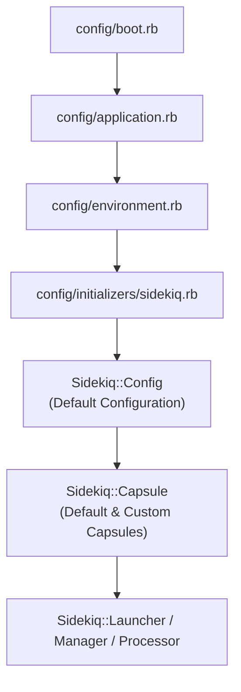
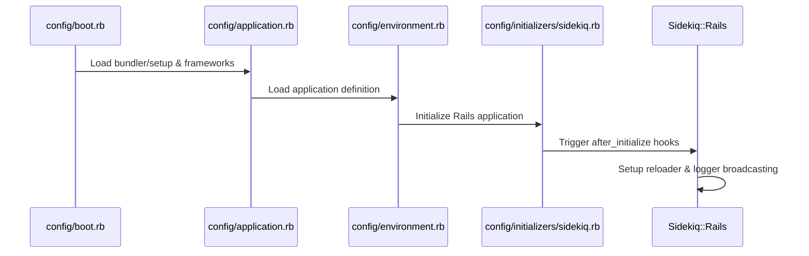

# Sample Application Setup

<details>
<summary>Relevant source files</summary>

The following files were used as context for generating this wiki page:

- [lib/sidekiq/cli.rb](https://github.com/sidekiq/sidekiq/blob/main/lib/sidekiq/cli.rb)
- [lib/sidekiq/web/application.rb](https://github.com/sidekiq/sidekiq/blob/main/lib/sidekiq/web/application.rb)
- [lib/sidekiq/web.rb](https://github.com/sidekiq/sidekiq/blob/main/lib/sidekiq/web.rb)
- [docs/capsule.md](https://github.com/sidekiq/sidekiq/blob/main/docs/capsule.md)
- [README.md](https://github.com/sidekiq/sidekiq/blob/main/README.md)
- [lib/sidekiq/launcher.rb](https://github.com/sidekiq/sidekiq/blob/main/lib/sidekiq/launcher.rb)
- [myapp/config/initializers/sidekiq.rb](https://github.com/sidekiq/sidekiq/blob/main/myapp/config/initializers/sidekiq.rb)
- [docs/internals.md](https://github.com/sidekiq/sidekiq/blob/main/docs/internals.md)
- [lib/sidekiq/rails.rb](https://github.com/sidekiq/sidekiq/blob/main/lib/sidekiq/rails.rb)
- [lib/sidekiq/embedded.rb](https://github.com/sidekiq/sidekiq/blob/main/lib/sidekiq/embedded.rb)
- [myapp/config/application.rb](https://github.com/sidekiq/sidekiq/blob/main/myapp/config/application.rb)
- [myapp/config/puma.rb](https://github.com/sidekiq/sidekiq/blob/main/myapp/config/puma.rb)
- [lib/sidekiq/config.rb](https://github.com/sidekiq/sidekiq/blob/main/lib/sidekiq/config.rb)
- [myapp/app/jobs/post_updater.rb](https://github.com/sidekiq/sidekiq/blob/main/myapp/app/jobs/post_updater.rb)
- [bare/boot.rb](https://github.com/sidekiq/sidekiq/blob/main/bare/boot.rb)
- [lib/sidekiq.rb](https://github.com/sidekiq/sidekiq/blob/main/lib/sidekiq.rb)
- [myapp/config/environment.rb](https://github.com/sidekiq/sidekiq/blob/main/myapp/config/environment.rb)
- [myapp/config/routes.rb](https://github.com/sidekiq/sidekiq/blob/main/myapp/config/routes.rb)
- [myapp/config/boot.rb](https://github.com/sidekiq/sidekiq/blob/main/myapp/config/boot.rb)
- [myapp/app/jobs/some_job.rb](https://github.com/sidekiq/sidekiq/blob/main/myapp/app/jobs/some_job.rb)
- [myapp/app/jobs/application_job.rb](https://github.com/sidekiq/sidekiq/blob/main/myapp/app/jobs/application_job.rb)
- [myapp/app/sidekiq/lazy_job.rb](https://github.com/sidekiq/sidekiq/blob/main/myapp/app/sidekiq/lazy_job.rb)
- [myapp/app/jobs/exit_job.rb](https://github.com/sidekiq/sidekiq/blob/main/myapp/app/jobs/exit_job.rb)
- [myapp/config/sidekiq.yml](https://github.com/sidekiq/sidekiq/blob/main/myapp/config/sidekiq.yml)
- [myapp/app/sidekiq/exit_job.rb](https://github.com/sidekiq/sidekiq/blob/main/myapp/app/sidekiq/exit_job.rb)
- [myapp/db/seeds.rb](https://github.com/sidekiq/sidekiq/blob/main/myapp/db/seeds.rb)
- [lib/sidekiq/web/config.rb](https://github.com/sidekiq/sidekiq/blob/main/lib/sidekiq/web/config.rb)
- [myapp/config/database.yml](https://github.com/sidekiq/sidekiq/blob/main/myapp/config/database.yml)
</details>

## Overview

### Overview Introduction
The Sample Application Setup (`myapp/`) defines the structural skeleton, boot sequences, configuration files, and initializers required to operate Sidekiq within a standard Ruby on Rails environment. It addresses the challenge of wiring background processing layers into application boot routines without relying on global mutable singletons, establishing a clean separation between client-side job pushing and server-side worker execution.
Sources: [myapp/config/application.rb:1-38](https://github.com/sidekiq/sidekiq/blob/main/myapp/config/application.rb#L1-L38)

The setup integrates deeply with Rails (`Rails::Application`, `Rails::Engine`, and Active Job), Puma web server embedding via `Sidekiq::Embedded`, and configuration management through `Sidekiq::Config` and `Sidekiq::CLI`. By structuring initializers in `config/initializers/sidekiq.rb` and environment files like `config/puma.rb`, the application manages multiple processing pools (capsules), custom server middleware chains, and lifecycle hooks (`:startup`, `:quiet`, `:shutdown`, `:exit`).
Sources: [myapp/config/initializers/sidekiq.rb:1-70](https://github.com/sidekiq/sidekiq/blob/main/myapp/config/initializers/sidekiq.rb#L1-L70), [myapp/config/puma.rb:44-57](https://github.com/sidekiq/sidekiq/blob/main/myapp/config/puma.rb#L44-L57)


Sources: [myapp/config/boot.rb:1-4](https://github.com/sidekiq/sidekiq/blob/main/myapp/config/boot.rb#L1-L4), [myapp/config/application.rb:1-15](https://github.com/sidekiq/sidekiq/blob/main/myapp/config/application.rb#L1-L15), [myapp/config/environment.rb:1-6](https://github.com/sidekiq/sidekiq/blob/main/myapp/config/environment.rb#L1-L6), [myapp/config/initializers/sidekiq.rb:1-70](https://github.com/sidekiq/sidekiq/blob/main/myapp/config/initializers/sidekiq.rb#L1-L70)

---

## Application Boot Sequence

The sample application boots through standard Rails entry points while explicitly injecting Sidekiq bindings. Execution begins at `config/boot.rb`, which configures Bundler via `Gemfile`. Following this, `config/application.rb` requires framework railties and sets Active Job's queue adapter to Sidekiq.
Sources: [myapp/config/boot.rb:1-4](https://github.com/sidekiq/sidekiq/blob/main/myapp/config/boot.rb#L1-L4), [myapp/config/application.rb:1-15](https://github.com/sidekiq/sidekiq/blob/main/myapp/config/application.rb#L1-L15)

```ruby
config.active_job.queue_adapter = :sidekiq
```
Sources: [myapp/config/application.rb:36-36](https://github.com/sidekiq/sidekiq/blob/main/myapp/config/application.rb#L36-L36)

The boot sequence concludes in `config/environment.rb`, which loads the application definition and invokes `Rails.application.initialize!`.
Sources: [myapp/config/environment.rb:1-6](https://github.com/sidekiq/sidekiq/blob/main/myapp/config/environment.rb#L1-L6)


Sources: [myapp/config/boot.rb:1-4](https://github.com/sidekiq/sidekiq/blob/main/myapp/config/boot.rb#L1-L4), [myapp/config/application.rb:1-15](https://github.com/sidekiq/sidekiq/blob/main/myapp/config/application.rb#L1-L15), [myapp/config/environment.rb:1-6](https://github.com/sidekiq/sidekiq/blob/main/myapp/config/environment.rb#L1-L6), [myapp/config/initializers/sidekiq.rb:1-21](https://github.com/sidekiq/sidekiq/blob/main/myapp/config/initializers/sidekiq.rb#L1-L21), [lib/sidekiq/rails.rb:38-58](https://github.com/sidekiq/sidekiq/blob/main/lib/sidekiq/rails.rb#L38-L58)

---

## Initializer Configuration (`config/initializers/sidekiq.rb`)

The Sidekiq initializer (`myapp/config/initializers/sidekiq.rb`) configures client and server connection pools, lifecycle callbacks, middleware, and multi-capsule processing topologies.
Sources: [myapp/config/initializers/sidekiq.rb:1-21](https://github.com/sidekiq/sidekiq/blob/main/myapp/config/initializers/sidekiq.rb#L1-L21)

Client configurations are wrapped in `Sidekiq.configure_client`, setting client-side connection parameters such as pool size:
```ruby
Sidekiq.configure_client do |config|
  config.redis = {size: 2}
end
```
Sources: [myapp/config/initializers/sidekiq.rb:1-3](https://github.com/sidekiq/sidekiq/blob/main/myapp/config/initializers/sidekiq.rb#L1-L3)

Server configurations use `Sidekiq.configure_server` to define password hooks, idle connection reaping, deploy markers, and custom processing capsules:
```ruby
Sidekiq.configure_server do |config|
  config.redis = {password: ->(u) { "foobar" }}
  config.on(:startup) {}
  config.on(:quiet) {}
  config.on(:shutdown) do
  end
  config.on(:exit) {}

  config.reap_idle_redis_connections
end
```
Sources: [myapp/config/initializers/sidekiq.rb:4-21](https://github.com/sidekiq/sidekiq/blob/main/myapp/config/initializers/sidekiq.rb#L4-L21)

> [!IMPORTANT]
> Git-based deploy markers should only be executed once during deployment scripts (such as Capistrano), rather than inside initializers booted across multiple concurrent worker processes, to prevent duplicate entries in Redis.
Sources: [myapp/config/initializers/sidekiq.rb:44-52](https://github.com/sidekiq/sidekiq/blob/main/myapp/config/initializers/sidekiq.rb#L44-L52)

---

## Capsule and Middleware Setup

Sidekiq 7.0 introduces `Sidekiq::Capsule` to represent the resources necessary to process a distinct set of queues. Within `myapp/config/initializers/sidekiq.rb`, custom capsules are defined with isolated concurrency levels, queues, and middleware chains.
Sources: [lib/docs/capsule.md:46-48](https://github.com/sidekiq/sidekiq/blob/main/docs/capsule.md#L46-L48), [myapp/config/initializers/sidekiq.rb:54-70](https://github.com/sidekiq/sidekiq/blob/main/myapp/config/initializers/sidekiq.rb#L54-L70)

```ruby
class Singler
  include Sidekiq::ServerMiddleware

  def call(w, j, q)
    puts "single-threaded #{w.class.name}!"
  end
end

Sidekiq.configure_server do |config|
  config.capsule("single_threaded") do |cap|
    cap.concurrency = 1
    cap.queues = %w[single]
    cap.server_middleware.add Singler
  end
end
```
Sources: [myapp/config/initializers/sidekiq.rb:54-70](https://github.com/sidekiq/sidekiq/blob/main/myapp/config/initializers/sidekiq.rb#L54-L70)

The default capsule configuration is stored in `config/sidekiq.yml`:
```yaml
---
:labels:
  - some_label
```
Sources: [myapp/config/sidekiq.yml:1-3](https://github.com/sidekiq/sidekiq/blob/main/myapp/config/sidekiq.yml#L1-L3)

---

## Embedded Mode with Puma (`config/puma.rb`)

When running in clustered web server environments like Puma, Sidekiq can be embedded directly into the worker process lifecycle using `Sidekiq.configure_embed`. This shares process execution while maintaining strict thread limits.
Sources: [myapp/config/puma.rb:44-57](https://github.com/sidekiq/sidekiq/blob/main/myapp/config/puma.rb#L44-L57)

```ruby
x = nil
on_worker_boot do
  x = Sidekiq.configure_embed do |config|
    config.queues = %w[critical default low]
    config.concurrency = 2
  end
  x&.run
end

on_worker_shutdown do
  x&.stop
end
```
Sources: [myapp/config/puma.rb:44-57](https://github.com/sidekiq/sidekiq/blob/main/myapp/config/puma.rb#L44-L57)

> [!WARNING]
> Setting embedded concurrency too high in Puma worker processes can easily saturate the Ruby Global Interpreter Lock (GIL) and exhaust CPU resources. Concurrency values above 2–3 should be avoided unless thoroughly benchmarked.
Sources: [lib/sidekiq.rb:131-133](https://github.com/sidekiq/sidekiq/blob/main/lib/sidekiq.rb#L131-L133)

---

## Web UI and Routing Integration (`config/routes.rb`)

The sample application mounts the Sidekiq Web UI dashboard inside Rails routing via `config/routes.rb`. It disables browser asset caching for development testing and mounts the engine at `/sidekiq`.
Sources: [myapp/config/routes.rb:1-20](https://github.com/sidekiq/sidekiq/blob/main/myapp/config/routes.rb#L1-L20)

```ruby
ENV["SIDEKIQ_WEB_TESTING"] = "1"

require "sidekiq/web"
Sidekiq::Web.configure do |config|
  config[:csrf] = false
  config.app_url = "/"
end
require "sidekiq-redis_info/web"

Rails.application.routes.draw do
  mount Sidekiq::Web => "/sidekiq"
  get "job" => "job#index"
  get "job/email" => "job#email"
  get "job/post" => "job#delayed_post"
  get "job/long" => "job#long"
  get "job/crash" => "job#crash"
  get "job/bulk" => "job#bulk"
end
```
Sources: [myapp/config/routes.rb:1-20](https://github.com/sidekiq/sidekiq/blob/main/myapp/config/routes.rb#L1-L20)

Additional routing helper configurations are managed through `Sidekiq::Web::Config` which handles extensions and asset paths.
Sources: [lib/sidekiq/web/config.rb:17-62](https://github.com/sidekiq/sidekiq/blob/main/lib/sidekiq/web/config.rb#L17-L62)

---

## Job Definitions and Execution Models

### Active Job Inheritors
Jobs within the sample application inherit from either Active Job (`ApplicationJob`) or include `Sidekiq::Job` directly. Standard Active Job classes declare queues using `queue_as`.
Sources: [myapp/app/jobs/application_job.rb:1-7](https://github.com/sidekiq/sidekiq/blob/main/myapp/app/jobs/application_job.rb#L1-L7), [myapp/app/jobs/some_job.rb:1-8](https://github.com/sidekiq/sidekiq/blob/main/myapp/app/jobs/some_job.rb#L1-L8)

```ruby
class SomeJob < ApplicationJob
  queue_as :default

  def perform(*args)
    puts "What's up?!?!"
  end
end
```
Sources: [myapp/app/jobs/some_job.rb:1-8](https://github.com/sidekiq/sidekiq/blob/main/myapp/app/jobs/some_job.rb#L1-L8)

### Native Sidekiq Jobs & Iterable Jobs
Native jobs include `Sidekiq::Job`. Additionally, iterable jobs implement batch enumeration workflows.
Sources: [myapp/app/sidekiq/exit_job.rb:1-11](https://github.com/sidekiq/sidekiq/blob/main/myapp/app/sidekiq/exit_job.rb#L1-L11), [myapp/app/jobs/post_updater.rb:1-23](https://github.com/sidekiq/sidekiq/blob/main/myapp/app/jobs/post_updater.rb#L1-L23)

```ruby
class PostUpdater
  include Sidekiq::IterableJob

  def build_enumerator(start_at, count, cursor:)
    logger.info { "Updating #{start_at}" }

    active_record_batches_enumerator(
      Post.where("id >= ? and id < ?", start_at, start_at + count),
      cursor: cursor,
      batch_size: 10
    )
  end

  def each_iteration(batch, *)
    Post.transaction do
      batch.each do |post|
        post.body = "Updated"
        post.save!
      end
    end
  end
end
```
Sources: [myapp/app/jobs/post_updater.rb:1-23](https://github.com/sidekiq/sidekiq/blob/main/myapp/app/jobs/post_updater.rb#L1-L23)

---

## Configuration Options Reference

The following table summarizes key configuration attributes defined across the sample application and framework defaults:
Sources: [lib/sidekiq/config.rb:11-41](https://github.com/sidekiq/sidekiq/blob/main/lib/sidekiq/config.rb#L11-L41)

| Option / Setting | Default Value | Target Component | Purpose |
| :--- | :--- | :--- | :--- |
| `concurrency` | `5` (Standalone) / `2` (Embedded) | `Sidekiq::Config` / `Capsule` | Number of concurrent processor threads. |
| `timeout` | `25` | `Sidekiq::Config` | Graceful shutdown timeout in seconds. |
| `redis` | `{}` | `Sidekiq::Config` | Redis connection parameters (pool size, password, URL). |
| `queues` | `["default"]` | `Sidekiq::Capsule` | Queues processed by the capsule with optional weights. |
| `max_iteration_runtime` | `nil` | `Sidekiq::IterableJob` | Maximum runtime before an iterable job is interrupted and re-enqueued. |

Sources: [lib/sidekiq/config.rb:11-41](https://github.com/sidekiq/sidekiq/blob/main/lib/sidekiq/config.rb#L11-L41), [lib/sidekiq.rb:141-141](https://github.com/sidekiq/sidekiq/blob/main/lib/sidekiq.rb#L141-L141)

## Related

- [[Rails ActiveJob Integration]]
- [[Quick Start]]

