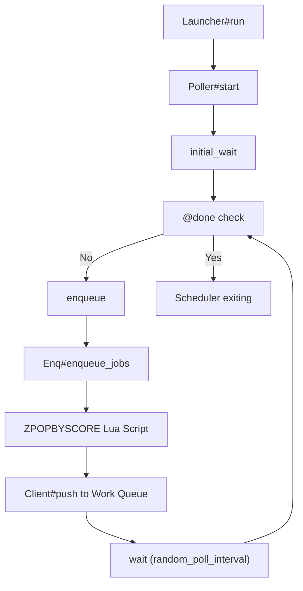

# Scheduled Job Polling

<details>
<summary>Relevant source files</summary>

The following files were used as context for generating this wiki page:

- [lib/sidekiq/api.rb](https://github.com/sidekiq/sidekiq/blob/main/lib/sidekiq/api.rb)
- [lib/sidekiq/cli.rb](https://github.com/sidekiq/sidekiq/blob/main/lib/sidekiq/cli.rb)
- [lib/sidekiq/scheduled.rb](https://github.com/sidekiq/sidekiq/blob/main/lib/sidekiq/scheduled.rb)
- [lib/sidekiq/web/application.rb](https://github.com/sidekiq/sidekiq/blob/main/lib/sidekiq/web/application.rb)
- [lib/sidekiq/client.rb](https://github.com/sidekiq/sidekiq/blob/main/lib/sidekiq/client.rb)
- [lib/sidekiq/tui/tabs/set_tab.rb](https://github.com/sidekiq/sidekiq/blob/main/lib/sidekiq/tui/tabs/set_tab.rb)
- [lib/sidekiq/launcher.rb](https://github.com/sidekiq/sidekiq/blob/main/lib/sidekiq/launcher.rb)
- [lib/sidekiq/metrics/query.rb](https://github.com/sidekiq/sidekiq/blob/main/lib/sidekiq/metrics/query.rb)
- [README.md](https://github.com/sidekiq/sidekiq/blob/main/README.md)
- [lib/sidekiq/processor.rb](https://github.com/sidekiq/sidekiq/blob/main/lib/sidekiq/processor.rb)
- [docs/internals.md](https://github.com/sidekiq/sidekiq/blob/main/docs/internals.md)
- [docs/Pro-2.0-Upgrade.md](https://github.com/sidekiq/sidekiq/blob/main/docs/Pro-2.0-Upgrade.md)
- [lib/sidekiq/fetch.rb](https://github.com/sidekiq/sidekiq/blob/main/lib/sidekiq/fetch.rb)
- [myapp/app/jobs/post_updater.rb](https://github.com/sidekiq/sidekiq/blob/main/myapp/app/jobs/post_updater.rb)
- [lib/sidekiq/tui/tabs/scheduled.rb](https://github.com/sidekiq/sidekiq/blob/main/lib/sidekiq/tui/tabs/scheduled.rb)
- [myapp/config/initializers/sidekiq.rb](https://github.com/sidekiq/sidekiq/blob/main/myapp/config/initializers/sidekiq.rb)
- [docs/capsule.md](https://github.com/sidekiq/sidekiq/blob/main/docs/capsule.md)
- [bare/boot.rb](https://github.com/sidekiq/sidekiq/blob/main/bare/boot.rb)
- [lib/sidekiq/paginator.rb](https://github.com/sidekiq/paginator.rb)
</details>

## Overview

### Overview
Scheduled Job Polling is the internal background subsystem responsible for monitoring, selecting, and migrating time-delayed or failed jobs back into active processing queues when their designated execution timestamps arrive. In Sidekiq, jobs scheduled for future execution (via `perform_in`, `perform_at`, or explicit timestamps) and jobs designated for retry after an execution failure reside inside Redis sorted sets (`schedule` and `retry`). Because traditional work queues are FIFO lists (`LPUSH`/`BRPOP`) incapable of time-based indexing, the polling subsystem acts as a bridge between temporal storage and immediate execution.

Sources: [lib/sidekiq/scheduled.rb:66-73](https://github.com/sidekiq/sidekiq/blob/main/lib/sidekiq/scheduled.rb#L66-L73)

The architecture centers around two primary components managed by the lifecycle launcher: `Sidekiq::Scheduled::Poller` and `Sidekiq::Scheduled::Enq`. The Poller runs on a dedicated background thread, sleeping for a calculated jittered interval before waking up to trigger the enqueuing loop. The Enq component interacts with Redis using atomic Lua scripting (`EVALSHA`) to safely extract and push ready jobs. This design prevents the thundering herd problem across clustered worker nodes while guaranteeing that jobs whose execution scores are less than or equal to the current epoch timestamp are never lost or double-processed.

Sources: [lib/sidekiq/scheduled.rb:71-115](https://github.com/sidekiq/sidekiq/blob/main/lib/sidekiq/scheduled.rb#L71-L115)

By dynamically scaling polling intervals based on active process cluster size and leveraging cluster-wide connection pools, Scheduled Job Polling balances Redis load with timing precision. It operates independently of the core processor capsules, ensuring that delayed workflows and retry queues continue to drain even when primary execution queues experience fluctuating throughput or partial network partitions.

Sources: [docs/internals.md:28-35](https://github.com/sidekiq/sidekiq/blob/main/docs/internals.md#L28-L35)

## Architecture and Control Flow

The scheduled job polling subsystem relies on a cooperative control loop executed by the `Sidekiq::Launcher` and `Sidekiq::Scheduled::Poller`. When a Sidekiq server process boots, `Sidekiq::Launcher#run` instantiates and starts the poller thread alongside capsule managers and the process heartbeat.

Sources: [lib/sidekiq/launcher.rb:38-44](https://github.com/sidekiq/sidekiq/blob/main/lib/sidekiq/launcher.rb#L38-L44)



Sources: [lib/sidekiq/scheduled.rb:71-115](https://github.com/sidekiq/sidekiq/blob/main/lib/sidekiq/scheduled.rb#L71-L115)

The control flow executes through the following named methods:
1. `Sidekiq::Launcher#run` -> Starts the scheduler thread via `safe_thread("scheduler", &method(:start))`.
2. `Sidekiq::Scheduled::Poller#start` -> Enters an active loop preceded by an `initial_wait` phase.
3. `Sidekiq::Scheduled::Poller#enqueue` -> Delegates to `Sidekiq::Scheduled::Enq#enqueue_jobs`.
4. `Sidekiq::Scheduled::Enq#enqueue_jobs` -> Iterates over target sorted sets (`retry`, `schedule`) and executes atomic popping.
5. `Sidekiq::Scheduled::Poller#wait` -> Pops from a `ConnectionPool::TimedStack` sleeper object using a dynamically calculated `random_poll_interval`.

Sources: [lib/sidekiq/scheduled.rb:71-115](https://github.com/sidekiq/sidekiq/blob/main/lib/sidekiq/scheduled.rb#L71-L115), [lib/sidekiq/launcher.rb:38-44](https://github.com/sidekiq/sidekiq/blob/main/lib/sidekiq/launcher.rb#L38-L44)

## Poller Lifecycle and Initialization

The `Sidekiq::Scheduled::Poller` lifecycle manages startup delays, shutdown synchronization, and periodic cluster cleanup. Upon initialization, the poller instantiates an enqueue handler, a thread-safe sleeper stack (`ConnectionPool::TimedStack`), and a random number generator.

Sources: [lib/sidekiq/scheduled.rb:77-85](https://github.com/sidekiq/sidekiq/blob/main/lib/sidekiq/scheduled.rb#L77-L85)

When `start` is invoked, the thread pauses during `initial_wait`. This method sleeps for a randomized duration combining an initial 10-second base wait (omitted if a custom `poll_interval_average` is configured) and a fractional random component (`5 * rand`). This design staggers concurrent worker process startups, preventing them from hammering Redis simultaneously.

Sources: [lib/sidekiq/scheduled.rb:96-105](https://github.com/sidekiq/sidekiq/blob/main/lib/sidekiq/scheduled.rb#L96-L105), [lib/sidekiq/scheduled.rb:218-226](https://github.com/sidekiq/sidekiq/blob/main/lib/sidekiq/scheduled.rb#L218-L226)

```ruby
def initial_wait
  total = 0
  total += INITIAL_WAIT unless @config[:poll_interval_average]
  total += (5 * rand)

  @sleeper.pop(timeout: total, exception: false)
ensure
  cleanup
end
```

Sources: [lib/sidekiq/scheduled.rb:218-232](https://github.com/sidekiq/scheduled.rb#L218-L232)

During shutdown via `terminate`, `@done` is set to `true`, `enq.terminate` halts active Enq loops, and `@sleeper << 0` instantly interrupts the sleeping thread. The launcher then joins the thread via `@thread&.value`.

Sources: [lib/sidekiq/scheduled.rb:87-94](https://github.com/sidekiq/sidekiq/blob/main/lib/sidekiq/scheduled.rb#L87-L94)

## Atomic Enqueuing via Lua Scripting

To move jobs from sorted sets (`schedule` or `retry`) back into active work queues without race conditions or data loss, Sidekiq executes an atomic Lua script (`LUA_ZPOPBYSCORE`) inside Redis.

Sources: [lib/sidekiq/scheduled.rb:13-20](https://github.com/sidekiq/sidekiq/blob/main/lib/sidekiq/scheduled.rb#L13-L20)

```lua
local key, now = KEYS[1], ARGV[1]
local jobs = redis.call("zrange", key, "-inf", now, "byscore", "limit", 0, 1)
if jobs[1] then
  redis.call("zrem", key, jobs[1])
  return jobs[1]
end
```

Sources: [lib/sidekiq/scheduled.rb:13-20](https://github.com/sidekiq/sidekiq/blob/main/lib/sidekiq/scheduled.rb#L13-L20)

The `Enq#zpopbyscore` method manages script evaluation using `EVALSHA`. If Redis returns a `NOSCRIPT` error indicating the script cache was flushed, the poller transparently re-loads the script hash and retries the command.

Sources: [lib/sidekiq/scheduled.rb:52-63](https://github.com/sidekiq/sidekiq/blob/main/lib/sidekiq/scheduled.rb#L52-L63)

> [!NOTE]
> The Lua script extracts and removes exactly one job at a time per iteration. Processing jobs one at a time minimizes the window of vulnerability where a job is popped from the sorted set but fails before being pushed to its work queue.

Sources: [lib/sidekiq/scheduled.rb:32-44](https://github.com/sidekiq/sidekiq/blob/main/lib/sidekiq/scheduled.rb#L32-L44)

## Cluster-Aware Polling Intervals and Jitter

To prevent the thundering herd problem in clusters with multiple Sidekiq processes, the poller calculates a randomized sleep interval between polls. Rather than hardcoding a static interval, Sidekiq dynamically scales polling frequency based on the number of active worker processes discovered in the `processes` Redis set.

Sources: [lib/sidekiq/scheduled.rb:129-160](https://github.com/sidekiq/sidekiq/blob/main/lib/sidekiq/scheduled.rb#L129-L160)

```ruby
def scaled_poll_interval(process_count)
  process_count * @config[:average_scheduled_poll_interval]
end
```

Sources: [lib/sidekiq/scheduled.rb:182-184](https://github.com/sidekiq/sidekiq/blob/main/lib/sidekiq/scheduled.rb#L182-L184)

The algorithm balances check-in frequency to ensure that across a multiplication timespan of process count and base interval, each process checks Redis once on average:

- Small Clusters (process count less than 10): Calculates a random interval bounded between plus-minus 50 percent of the desired average to prevent excessive check gaps.
- Large Clusters (process count 10 or greater): Applies broader randomization from zero up to double the interval since statistical distribution across numerous independent processes naturally smooths the polling load.

Sources: [lib/sidekiq/scheduled.rb:149-160](https://github.com/sidekiq/sidekiq/blob/main/lib/sidekiq/scheduled.rb#L149-L160)

## Configuration Options

The scheduled polling subsystem is configured via `Sidekiq::Config` parameters set during server initialization.

Sources: [lib/sidekiq/scheduled.rb:78-79](https://github.com/sidekiq/sidekiq/blob/main/lib/sidekiq/scheduled.rb#L78-L79)

| Option | Type | Default | Description |
| :--- | :--- | :--- | :--- |
| `:average_scheduled_poll_interval` | Integer | `15` | Base scalar multiplied by known process count to determine average poll wait. |
| `:poll_interval_average` | Integer | `nil` | Overrides dynamic scaling with a fixed average poll interval in seconds. |
| `:scheduled_enq` | Class | `Sidekiq::Scheduled::Enq` | Custom enqueuing strategy class injected into the Poller. |

Sources: [lib/sidekiq/scheduled.rb:78-79](https://github.com/sidekiq/sidekiq/blob/main/lib/sidekiq/scheduled.rb#L78-L79), [lib/sidekiq/scheduled.rb:175-177](https://github.com/sidekiq/sidekiq/blob/main/lib/sidekiq/scheduled.rb#L175-L177), [lib/sidekiq/scheduled.rb:182-184](https://github.com/sidekiq/sidekiq/blob/main/lib/sidekiq/scheduled.rb#L182-L184)

## Error Handling and Resilience

Network partitions and Redis unavailability are handled gracefully within the polling execution loop. Both the `enqueue` and `wait` methods rescue standard exceptions (`StandardError`), logging the error message and passing it to the configured error handlers (`handle_exception(ex)`).

Sources: [lib/sidekiq/scheduled.rb:108-116](https://github.com/sidekiq/sidekiq/blob/main/lib/sidekiq/scheduled.rb#L108-L116)

```ruby
def enqueue
  @enq.enqueue_jobs
rescue => ex
  logger.error ex.message
  handle_exception(ex)
end
```

Sources: [lib/sidekiq/scheduled.rb:108-115](https://github.com/sidekiq/sidekiq/blob/main/lib/sidekiq/scheduled.rb#L108-L115)

When a Redis connection drop occurs during `wait`, the sleeper catches the exception, logs it, and falls back to a hardcoded `sleep 5` safety buffer before retrying the loop iteration. This prevents CPU-spinning during prolonged database outages.

Sources: [lib/sidekiq/scheduled.rb:119-127](https://github.com/sidekiq/sidekiq/blob/main/lib/sidekiq/scheduled.rb#L119-L127)

## Related

- [[Client Enqueueing]]
- [[Job Retry Handling]]

