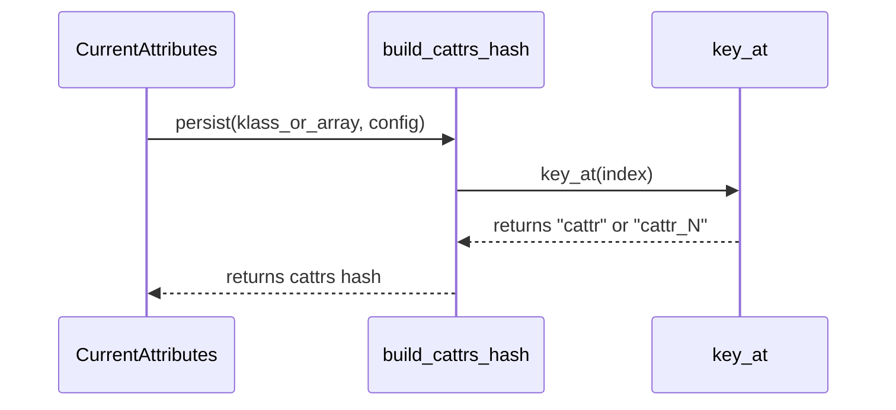

# Standard Middleware Plugins

<details>
<summary>Relevant source files</summary>

The following files were used as context for generating this wiki page:

- [lib/sidekiq/processor.rb](https://github.com/sidekiq/sidekiq/blob/main/lib/sidekiq/processor.rb)
- [lib/sidekiq/job.rb](https://github.com/sidekiq/sidekiq/blob/main/lib/sidekiq/job.rb)
- [lib/sidekiq/web/application.rb](https://github.com/sidekiq/sidekiq/blob/main/lib/sidekiq/web/application.rb)
- [lib/sidekiq/web/helpers.rb](https://github.com/sidekiq/sidekiq/blob/main/lib/sidekiq/web/helpers.rb)
- [lib/sidekiq/web.rb](https://github.com/sidekiq/sidekiq/blob/main/lib/sidekiq/web.rb)
- [lib/sidekiq/middleware/current_attributes.rb](https://github.com/sidekiq/sidekiq/blob/main/lib/sidekiq/middleware/current_attributes.rb)
- [lib/sidekiq/tui.rb](https://github.com/sidekiq/sidekiq/blob/main/lib/sidekiq/tui.rb)
- [lib/sidekiq/middleware/i18n.rb](https://github.com/sidekiq/sidekiq/blob/main/lib/sidekiq/middleware/i18n.rb)
- [lib/sidekiq/component.rb](https://github.com/sidekiq/sidekiq/blob/main/lib/sidekiq/component.rb)
- [lib/sidekiq/middleware/chain.rb](https://github.com/sidekiq/sidekiq/blob/main/lib/sidekiq/middleware/chain.rb)
- [lib/active_job/queue_adapters/sidekiq_adapter.rb](https://github.com/sidekiq/sidekiq/blob/main/lib/active_job/queue_adapters/sidekiq_adapter.rb)
- [lib/sidekiq/rails.rb](https://github.com/sidekiq/sidekiq/blob/main/lib/sidekiq/rails.rb)
- [myapp/config/initializers/sidekiq.rb](https://github.com/sidekiq/sidekiq/blob/main/myapp/config/initializers/sidekiq.rb)
- [docs/internals.md](https://github.com/sidekiq/sidekiq/blob/main/docs/internals.md)
- [docs/capsule.md](https://github.com/sidekiq/sidekiq/blob/main/docs/capsule.md)
- [lib/sidekiq/job_logger.rb](https://github.com/sidekiq/sidekiq/blob/main/lib/sidekiq/job_logger.rb)
- [lib/sidekiq/web/config.rb](https://github.com/sidekiq/sidekiq/blob/main/lib/sidekiq/web/config.rb)
- [README.md](https://github.com/sidekiq/sidekiq/blob/main/README.md)
- [lib/sidekiq/web/action.rb](https://github.com/sidekiq/sidekiq/blob/main/lib/sidekiq/web/action.rb)
- [lib/sidekiq/middleware/modules.rb](https://github.com/sidekiq/sidekiq/blob/main/lib/sidekiq/middleware/modules.rb)
- [myapp/app/lib/myapp/current.rb](https://github.com/sidekiq/sidekiq/blob/main/myapp/app/lib/myapp/current.rb)
- [docs/middleware.md](https://github.com/sidekiq/sidekiq/blob/main/docs/middleware.md)
- [docs/menu.md](https://github.com/sidekiq/sidekiq/blob/main/docs/menu.md)
- [lib/sidekiq/job/interrupt_handler.rb](https://github.com/sidekiq/sidekiq/blob/main/lib/sidekiq/job/interrupt_handler.rb)
- [web/locales/en.yml](https://github.com/sidekiq/sidekiq/blob/main/web/locales/en.yml)
- [myapp/app/jobs/some_job.rb](https://github.com/sidekiq/sidekiq/blob/main/myapp/app/jobs/some_job.rb)
</details>

## Overview

Middleware plugins in the system provide an extensible mechanism to intercept and modify execution flow around client-side job pushing and server-side job processing. Patterned after Rack middleware, these plugins allow developers to inject custom behavior, manage state boundaries, and integrate framework-level context into background jobs without altering core job logic. Standard middleware components manage crucial context propagation such as `ActiveSupport::CurrentAttributes` and locale settings across asynchronous boundaries, ensuring that application state established during web requests or enqueuing operations is correctly preserved and restored when jobs are executed by server workers. Sources: [docs/menu.md:10-12](https://github.com/sidekiq/sidekiq/blob/main/docs/menu.md#L10-L12)

Sources: [lib/sidekiq/middleware/chain.rb:5-15](https://github.com/sidekiq/sidekiq/blob/main/lib/sidekiq/middleware/chain.rb#L5-L15)

Sources: [lib/sidekiq/middleware/current_attributes.rb:7-11](https://github.com/sidekiq/sidekiq/blob/main/lib/sidekiq/middleware/current_attributes.rb#L7-L11)

Sources: [lib/sidekiq/middleware/i18n.rb:4-8](https://github.com/sidekiq/sidekiq/blob/main/lib/sidekiq/middleware/i18n.rb#L4-L8)

## Middleware Chain Architecture and Registration

### Overview

Middleware is organized through distinct chain data structures and individual entry links. Client middleware intercepts job pushing into Redis, while server middleware intercepts job execution around server workers. Each registered middleware class is wrapped in an entry instance holding initialization arguments. When a job is processed or pushed, the chain retrieves freshly instantiated copies of every middleware class to prevent shared instance state between concurrent job executions. Configuration blocks allow developers to add, prepend, insert before, insert after, or remove middleware classes from the chain. Sources: [lib/sidekiq/middleware/chain.rb:5-15](https://github.com/sidekiq/sidekiq/blob/main/lib/sidekiq/middleware/chain.rb#L5-L15)

Sources: [lib/sidekiq/middleware/chain.rb:79-122](https://github.com/sidekiq/sidekiq/blob/main/lib/sidekiq/middleware/chain.rb#L79-L122)

Sources: [lib/sidekiq/middleware/chain.rb:159-161](https://github.com/sidekiq/sidekiq/blob/main/lib/sidekiq/middleware/chain.rb#L159-L161)

Sources: [lib/sidekiq/middleware/chain.rb:191-205](https://github.com/sidekiq/sidekiq/blob/main/lib/sidekiq/middleware/chain.rb#L191-L205)

### Execution Flow and Traversal Walkthrough

The execution of a middleware chain is orchestrated by `invoke`, which delegates traversal to private helper methods. The execution path proceeds through the following methods in order:

`invoke` → checks if entries are empty, returning `yield` immediately if true, or calling `retrieve` to map entries to instantiated middleware objects and handing them to `traverse` at `index = 0` → `traverse` checks if `index` exceeds or equals the chain size; if true, it executes the underlying block (performing the job push or execution), and if false, it invokes the current middleware's `call` method, passing a block that recursively calls `traverse` with `index + 1` to advance to the next middleware link. Sources: [lib/sidekiq/middleware/chain.rb:167-186](https://github.com/sidekiq/sidekiq/blob/main/lib/sidekiq/middleware/chain.rb#L167-L186)

> [!NOTE]
> Brand-new objects are instantiated for every middleware class on every single job execution, guaranteeing that instance variables do not leak across asynchronous job boundaries. Sources: [lib/sidekiq/middleware/chain.rb:11-15](https://github.com/sidekiq/sidekiq/blob/main/lib/sidekiq/middleware/chain.rb#L11-L15)
> 
> Sources: [lib/sidekiq/middleware/chain.rb:200-204](https://github.com/sidekiq/sidekiq/blob/main/lib/sidekiq/middleware/chain.rb#L200-L204)

### Chain Management API Reference

Chains expose methods to modify and query registered middleware entries.

| Method | Parameters | Description | Sources |
| :--- | :--- | :--- | :--- |
| `add` | `klass, *args` | Removes existing matching class and appends a new entry to the end of the chain. | [lib/sidekiq/middleware/chain.rb:119-122](https://github.com/sidekiq/sidekiq/blob/main/lib/sidekiq/middleware/chain.rb#L119-L122) |
| `prepend` | `klass, *args` | Removes existing matching class and inserts a new entry at index 0 of the chain. | [lib/sidekiq/middleware/chain.rb:125-128](https://github.com/sidekiq/sidekiq/blob/main/lib/sidekiq/middleware/chain.rb#L125-L128) |
| `insert_before` | `oldklass, newklass, *args` | Inserts `newklass` immediately preceding `oldklass` in the chain. | [lib/sidekiq/middleware/chain.rb:132-137](https://github.com/sidekiq/sidekiq/blob/main/lib/sidekiq/middleware/chain.rb#L132-L137) |
| `insert_after` | `oldklass, newklass, *args` | Inserts `newklass` immediately following `oldklass` in the chain. | [lib/sidekiq/middleware/chain.rb:141-146](https://github.com/sidekiq/sidekiq/blob/main/lib/sidekiq/middleware/chain.rb#L141-L146) |
| `remove` | `klass` | Deletes all entries matching the specified class. | [lib/sidekiq/middleware/chain.rb:107-109](https://github.com/sidekiq/sidekiq/blob/main/lib/sidekiq/middleware/chain.rb#L107-L109) |
| `exists?` / `include?` | `klass` | Returns boolean indicating whether the class is present in the chain. | [lib/sidekiq/middleware/chain.rb:149-152](https://github.com/sidekiq/sidekiq/blob/main/lib/sidekiq/middleware/chain.rb#L149-L152) |
| `copy_for` | `capsule` | Duplicates the chain and its entries for a specific capsule configuration. | [lib/sidekiq/middleware/chain.rb:99-103](https://github.com/sidekiq/sidekiq/blob/main/lib/sidekiq/middleware/chain.rb#L99-L103) |

Sources: [lib/sidekiq/middleware/chain.rb:99-152](https://github.com/sidekiq/sidekiq/blob/main/lib/sidekiq/middleware/chain.rb#L99-L152)

## Propagating ActiveSupport CurrentAttributes Context

### Overview

Current attributes handling captures and restores `ActiveSupport::CurrentAttributes` state across asynchronous job enqueuing and execution boundaries, allowing request-scoped data like multi-tenancy parameters or time zones to flow seamlessly from application actions into background jobs. Sources: [lib/sidekiq/middleware/current_attributes.rb:1-12](https://github.com/sidekiq/sidekiq/blob/main/lib/sidekiq/middleware/current_attributes.rb#L1-L12)

### Initialization and Call Chain Walkthrough

When configuring current attributes via persistence helpers, the system builds a hash mapping payload keys to attribute class names and registers both client and server middleware entries. The registration process flows through the following call chain:

1. Persistence setup takes a class or array of classes and passes it to `build_cattrs_hash`. Sources: [lib/sidekiq/middleware/current_attributes.rb:92-94](https://github.com/sidekiq/sidekiq/blob/main/lib/sidekiq/middleware/current_attributes.rb#L92-L94)
2. `build_cattrs_hash` iterates over input classes and invokes `key_at(index)` to generate unique keys (`cattr`, `cattr_1`, etc.). Sources: [lib/sidekiq/middleware/current_attributes.rb:103-113](https://github.com/sidekiq/sidekiq/blob/main/lib/sidekiq/middleware/current_attributes.rb#L103-L113)
3. `key_at` returns `"cattr"` if the index is `0`, or `"cattr_#{index}"` for subsequent indices. Sources: [lib/sidekiq/middleware/current_attributes.rb:115-117](https://github.com/sidekiq/sidekiq/blob/main/lib/sidekiq/middleware/current_attributes.rb#L115-L117)



Sources: [lib/sidekiq/middleware/current_attributes.rb:92-117](https://github.com/sidekiq/sidekiq/blob/main/lib/sidekiq/middleware/current_attributes.rb#L92-L117)

> [!WARNING]
> The persistence save middleware guards against overwriting existing keys in job payloads so that job retries pushed multiple times do not overwrite or reset current attributes with stale runtime state. Sources: [lib/sidekiq/middleware/current_attributes.rb:33-41](https://github.com/sidekiq/sidekiq/blob/main/lib/sidekiq/middleware/current_attributes.rb#L33-L41)

### Middleware Execution Classes Reference

Current attributes functionality defines distinct components for saving and loading state.

| Component / Class | Type | Description | Sources |
| :--- | :--- | :--- | :--- |
| Serializer | Constant / Module | References `::ActiveJob::Arguments` to serialize and deserialize attribute hashes. | [lib/sidekiq/middleware/current_attributes.rb:24](https://github.com/sidekiq/sidekiq/blob/main/lib/sidekiq/middleware/current_attributes.rb#L24) |
| Save | Client Middleware | Captures attribute hashes from `ActiveSupport::CurrentAttributes` classes and stores them in the job payload. | [lib/sidekiq/middleware/current_attributes.rb:26-44](https://github.com/sidekiq/sidekiq/blob/main/lib/sidekiq/middleware/current_attributes.rb#L26-L44) |
| Load | Server Middleware | Deserializes job payload keys and restores them inside `ActiveSupport::CurrentAttributes` during execution. | [lib/sidekiq/middleware/current_attributes.rb:46-90](https://github.com/sidekiq/sidekiq/blob/main/lib/sidekiq/middleware/current_attributes.rb#L46-L90) |

Sources: [lib/sidekiq/middleware/current_attributes.rb:24-90](https://github.com/sidekiq/sidekiq/blob/main/lib/sidekiq/middleware/current_attributes.rb#L24-L90)

### Design Trade-Offs

| Design Choice | Benefit | Cost | Sources |
| :--- | :--- | :--- | :--- |
| Serializing attributes into job payload via `ActiveJob::Arguments` | Persists request context directly with the job across network boundaries without external storage dependencies. | Increases Redis memory footprint by storing duplicated attribute dictionaries inside every queued job hash. | [lib/sidekiq/middleware/current_attributes.rb:24](https://github.com/sidekiq/sidekiq/blob/main/lib/sidekiq/middleware/current_attributes.rb#L24), [lib/sidekiq/middleware/current_attributes.rb:39](https://github.com/sidekiq/sidekiq/blob/main/lib/sidekiq/middleware/current_attributes.rb#L39) |
| Guarding payload keys with `!job.has_key?(key)` on save | Prevents job retries from resetting current attributes to newer request values. | May preserve older attribute snapshots if a job is retried long after initial enqueuing. | [lib/sidekiq/middleware/current_attributes.rb:35-40](https://github.com/sidekiq/sidekiq/blob/main/lib/sidekiq/middleware/current_attributes.rb#L35-L40) |
| Fallback retry rescuing `NoMethodError` during load | Automatically filters out dropped attributes if attribute definitions change between enqueuing and execution. | Adds error handling overhead and recursive retry overhead to server middleware execution. | [lib/sidekiq/middleware/current_attributes.rb:71-88](https://github.com/sidekiq/sidekiq/blob/main/lib/sidekiq/middleware/current_attributes.rb#L71-L88) |

Sources: [lib/sidekiq/middleware/current_attributes.rb:24-88](https://github.com/sidekiq/sidekiq/blob/main/lib/sidekiq/middleware/current_attributes.rb#L24-L88)

### Configuration and Usage Example

To enable current attribute propagation for a custom tenant class in an application initializer:

```ruby
require "sidekiq/middleware/current_attributes"
Sidekiq::CurrentAttributes.persist("Myapp::Current")
```

Sources: [myapp/config/initializers/sidekiq.rb:39-40](https://github.com/sidekiq/sidekiq/blob/main/myapp/config/initializers/sidekiq.rb#L39-L40), [lib/sidekiq/middleware/current_attributes.rb:17-21](https://github.com/sidekiq/sidekiq/blob/main/lib/sidekiq/middleware/current_attributes.rb#L17-L21)

## Propagating I18n Locale Context

### Overview

I18n middleware modules provide a lightweight mechanism for capturing the active localization context when a job is enqueued on the client side and restoring that locale context during job execution on the server side. This ensures that localized messages, emails, and translations inside background workers honor the locale of the user or request that originated the job.

Sources: [lib/sidekiq/middleware/i18n.rb:3-11](https://github.com/sidekiq/sidekiq/blob/main/lib/sidekiq/middleware/i18n.rb#L3-L11)

### Execution Flow and Middleware Classes

The I18n middleware implementation consists of client and server classes:

* Client middleware intercepts the job hash before dispatch, checking whether a `"locale"` key is already present in the job payload and assigning `I18n.locale` if absent, before yielding control.
* Server middleware extracts the `"locale"` key from the job hash (falling back to `I18n.default_locale` if the key is absent) and wraps job execution using `I18n.with_locale`.

Sources: [lib/sidekiq/middleware/i18n.rb:12-28](https://github.com/sidekiq/sidekiq/blob/main/lib/sidekiq/middleware/i18n.rb#L12-L28)

```ruby
module Sidekiq::Middleware::I18n
  class Client
    include Sidekiq::ClientMiddleware

    def call(_jobclass, job, _queue, _redis)
      job["locale"] ||= I18n.locale
      yield
    end
  end

  class Server
    include Sidekiq::ServerMiddleware

    def call(_jobclass, job, _queue, &block)
      I18n.with_locale(job.fetch("locale", I18n.default_locale), &block)
    end
  end
end
```

Sources: [lib/sidekiq/middleware/i18n.rb:9-29](https://github.com/sidekiq/sidekiq/blob/main/lib/sidekiq/middleware/i18n.rb#L9-L29)

> [!NOTE]
> The client middleware uses conditional assignment (`||=`) when setting `job["locale"]` to preserve any pre-existing locale explicitly injected into the job payload during initial creation or retry lifecycles.
> Sources: [lib/sidekiq/middleware/i18n.rb:16](https://github.com/sidekiq/sidekiq/blob/main/lib/sidekiq/middleware/i18n.rb#L16)

### Configuration and Registration

To load and register I18n middleware plugins into client and server middleware chains, require the library file inside an initializer block or configuration file.

```ruby
require 'sidekiq/middleware/i18n'

Sidekiq.configure_client do |config|
  config.client_middleware do |chain|
    chain.add Sidekiq::Middleware::I18n::Client
  end
end

Sidekiq.configure_server do |config|
  config.client_middleware do |chain|
    chain.add Sidekiq::Middleware::I18n::Client
  end
  config.server_middleware do |chain|
    chain.add Sidekiq::Middleware::I18n::Server
  end
end
```

Sources: [lib/sidekiq/middleware/i18n.rb:5-8](https://github.com/sidekiq/sidekiq/blob/main/lib/sidekiq/middleware/i18n.rb#L5-L8), [lib/sidekiq/middleware/i18n.rb:31-44](https://github.com/sidekiq/sidekiq/blob/main/lib/sidekiq/middleware/i18n.rb#L31-L44)

## Related

- [[Middleware Processing]]
- [[Rails ActiveJob Integration]]

