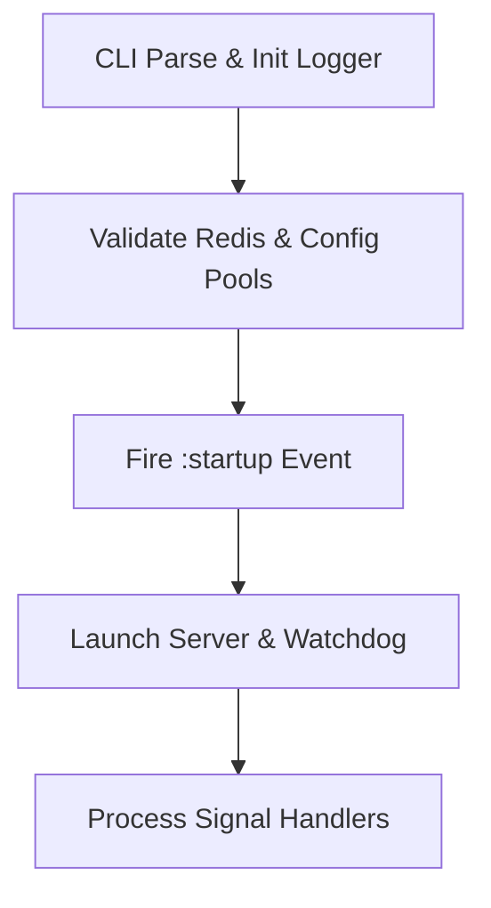

# Systemd Integration

<details>
<summary>Relevant source files</summary>

The following files were used as context for generating this wiki page:

- [lib/sidekiq/cli.rb](https://github.com/sidekiq/sidekiq/blob/main/lib/sidekiq/cli.rb)
- [lib/sidekiq/launcher.rb](https://github.com/sidekiq/launcher.rb#L1-L283)
- [lib/sidekiq/api.rb](https://github.com/sidekiq/sidekiq/blob/main/lib/sidekiq/api.rb)
- [lib/sidekiq/sd_notify.rb](https://github.com/sidekiq/sidekiq/blob/main/lib/sidekiq/sd_notify.rb)
- [lib/sidekiq/manager.rb](https://github.com/sidekiq/sidekiq/blob/main/lib/sidekiq/manager.rb)
- [docs/capsule.md](https://github.com/sidekiq/sidekiq/blob/main/docs/capsule.md)
- [lib/sidekiq/processor.rb](https://github.com/sidekiq/sidekiq/blob/main/lib/sidekiq/processor.rb)
- [docs/internals.md](https://github.com/sidekiq/sidekiq/blob/main/docs/internals.md)
- [lib/sidekiq/systemd.rb](https://github.com/sidekiq/sidekiq/blob/main/lib/sidekiq/systemd.rb)
- [docs/6.0-Upgrade.md](https://github.com/sidekiq/sidekiq/blob/main/docs/6.0-Upgrade.md)
- [myapp/config/initializers/sidekiq.rb](https://github.com/sidekiq/sidekiq/blob/main/myapp/config/initializers/sidekiq.rb)
- [README.md](https://github.com/sidekiq/sidekiq/blob/main/README.md)
- [lib/sidekiq/embedded.rb](https://github.com/sidekiq/sidekiq/blob/main/lib/sidekiq/embedded.rb)
- [lib/sidekiq/rails.rb](https://github.com/sidekiq/sidekiq/blob/main/lib/sidekiq/rails.rb)
- [lib/sidekiq/component.rb](https://github.com/sidekiq/sidekiq/blob/main/lib/sidekiq/component.rb)
- [lib/sidekiq/scheduled.rb](https://github.com/sidekiq/sidekiq/blob/main/lib/sidekiq/scheduled.rb)
- [myapp/app/sidekiq/exit_job.rb](https://github.com/sidekiq/sidekiq/blob/main/myapp/app/sidekiq/exit_job.rb)
- [myapp/app/jobs/exit_job.rb](https://github.com/sidekiq/sidekiq/blob/main/myapp/app/jobs/exit_job.rb)
- [docs/5.0-Upgrade.md](https://github.com/sidekiq/sidekiq/blob/main/docs/5.0-Upgrade.md)
- [bare/boot.rb](https://github.com/sidekiq/sidekiq/blob/main/bare/boot.rb)
</details>

## Overview

Sidekiq includes native integration with systemd to allow seamless process supervision, status reporting, and health monitoring in production environments. By leveraging a pure-Ruby implementation of `sd_notify(3)` via low-level datagram socket communication, Sidekiq communicates directly with the service manager to report state transitions, coordinate startup readiness, send periodic keep-alives, and signal graceful shutdown quiescence. Sources: [lib/sidekiq/sd_notify.rb:30-147](https://github.com/sidekiq/sidekiq/blob/main/lib/sidekiq/sd_notify.rb#L30-L147), [lib/sidekiq/systemd.rb:3-25](https://github.com/sidekiq/sidekiq/blob/main/lib/sidekiq/systemd.rb#L3-L25)

## Systemd Notification Protocol Implementation

### Overview

Sidekiq provides a pure-Ruby implementation of the `sd_notify(3)` protocol, enabling direct low-level communication with systemd via Unix domain datagram sockets. Methods in this module act as no-ops on non-systemd systems and map closely to standard systemd notification commands. Sources: [lib/sidekiq/sd_notify.rb:30-36](https://github.com/sidekiq/sidekiq/blob/main/lib/sidekiq/sd_notify.rb#L30-L36)

### Protocol Constants and Wrapper Methods

The implementation defines core protocol message strings and corresponding class-level wrapper methods that invoke notification logic with optional environment variable clearing.

| Constant | Value | Purpose |
| :--- | :--- | :--- |
| `READY` | `"READY=1"` | Signals that service startup is complete. Sources: [lib/sidekiq/sd_notify.rb:43-43](https://github.com/sidekiq/sidekiq/blob/main/lib/sidekiq/sd_notify.rb#L43-L43) |
| `RELOADING` | `"RELOADING=1"` | Signals that the service is reloading its configuration. Sources: [lib/sidekiq/sd_notify.rb:44-44](https://github.com/sidekiq/sidekiq/blob/main/lib/sidekiq/sd_notify.rb#L44-L44) |
| `STOPPING` | `"STOPPING=1"` | Signals that the service is beginning shutdown. Sources: [lib/sidekiq/sd_notify.rb:45-45](https://github.com/sidekiq/sidekiq/blob/main/lib/sidekiq/sd_notify.rb#L45-L45) |
| `STATUS` | `"STATUS="` | Prefix for custom status description strings. Sources: [lib/sidekiq/sd_notify.rb:46-46](https://github.com/sidekiq/sidekiq/blob/main/lib/sidekiq/sd_notify.rb#L46-L46) |
| `ERRNO` | `"ERRNO="` | Prefix for reporting C-style error numbers. Sources: [lib/sidekiq/sd_notify.rb:47-47](https://github.com/sidekiq/sidekiq/blob/main/lib/sidekiq/sd_notify.rb#L47-L47) |
| `MAINPID` | `"MAINPID="` | Prefix for reporting the main process ID. Sources: [lib/sidekiq/sd_notify.rb:48-48](https://github.com/sidekiq/sidekiq/blob/main/lib/sidekiq/sd_notify.rb#L48-L48) |
| `WATCHDOG` | `"WATCHDOG=1"` | Sends a periodic watchdog keep-alive ping. Sources: [lib/sidekiq/sd_notify.rb:49-49](https://github.com/sidekiq/sidekiq/blob/main/lib/sidekiq/sd_notify.rb#L49-L49) |
| `FDSTORE` | `"FDSTORE=1"` | Stores file descriptors in the service manager. Sources: [lib/sidekiq/sd_notify.rb:50-50](https://github.com/sidekiq/sidekiq/blob/main/lib/sidekiq/sd_notify.rb#L50-L50) |

Sources: [lib/sidekiq/sd_notify.rb:43-50](https://github.com/sidekiq/sidekiq/blob/main/lib/sidekiq/sd_notify.rb#L43-L50)

### Low-Level Socket Communication

The transport mechanism relies on checking the `NOTIFY_SOCKET` environment variable and transmitting state strings over an abstract or pathname Unix datagram socket.

```ruby
def self.notify(state, unset_env = false)
  sock = ENV["NOTIFY_SOCKET"]

  return nil unless sock

  ENV.delete("NOTIFY_SOCKET") if unset_env

  begin
    Addrinfo.unix(sock, :DGRAM).connect do |s|
      s.close_on_exec = true
      s.write(state)
    end
  rescue => e
    raise NotifyError, "#{e.class}: #{e.message}", e.backtrace
  end
end
```

Sources: [lib/sidekiq/sd_notify.rb:132-147](https://github.com/sidekiq/sidekiq/blob/main/lib/sidekiq/sd_notify.rb#L132-L147)

> [!WARNING]
> If `NOTIFY_SOCKET` is unset (such as when running outside of systemd supervision), notification methods immediately return `nil` without performing any socket operations or raising errors. Sources: [lib/sidekiq/sd_notify.rb:133-135](https://github.com/sidekiq/sidekiq/blob/main/lib/sidekiq/sd_notify.rb#L133-L135)

### Watchdog Verification Logic

Watchdog validation inspects environmental configuration to determine if watchdog keep-alive messages are expected by the service manager.

```ruby
def self.watchdog?
  wd_usec = ENV["WATCHDOG_USEC"]
  wd_pid = ENV["WATCHDOG_PID"]

  return false unless wd_usec

  begin
    wd_usec = Integer(wd_usec)
  rescue
    return false
  end

  return false if wd_usec <= 0
  return true if !wd_pid || wd_pid == $$.to_s

  false
end
```

Sources: [lib/sidekiq/sd_notify.rb:97-113](https://github.com/sidekiq/sidekiq/blob/main/lib/sidekiq/sd_notify.rb#L97-L113)

## Systemd Event Lifecycle Middleware Hooks

### Overview

The high-level integration between Sidekiq's runtime initialization and systemd relies on event-driven hooks executed during boot and shutdown phases. Rather than intertwining notification calls directly inside core execution logic, Sidekiq wires lifecycle events through its component event system and signal handlers. Sources: [lib/sidekiq/cli.rb:107-115](https://github.com/sidekiq/sidekiq/blob/main/lib/sidekiq/cli.rb#L107-L115), [lib/sidekiq/cli.rb:199-202](https://github.com/sidekiq/sidekiq/blob/main/lib/sidekiq/cli.rb#L199-L202)

### Lifecycle Event Wiring and Boot Sequence

Process initialization prepares configuration, validates limits, fires startup hooks, and initializes the launcher loop. Sources: [lib/sidekiq/cli.rb:42-115](https://github.com/sidekiq/sidekiq/blob/main/lib/sidekiq/cli.rb#L42-L115)



Sources: [lib/sidekiq/cli.rb:23-115](https://github.com/sidekiq/sidekiq/blob/main/lib/sidekiq/cli.rb#L23-L115)

The chronological execution walkthrough from boot to runtime processing proceeds through these exact methods:
1. Application booting and option parsing initializes the CLI environment, checks Redis version compatibility (`@config.redis_info`), verifies memory policies, validates capsule connection pool sizes, caches process identity, and pre-loads server middleware. Sources: [lib/sidekiq/cli.rb:42-104](https://github.com/sidekiq/sidekiq/blob/main/lib/sidekiq/cli.rb#L42-L104)
2. `Process.warmup` — Invoked if enabled to optimize memory before multithreading begins. Sources: [lib/sidekiq/cli.rb:105-105](https://github.com/sidekiq/sidekiq/blob/main/lib/sidekiq/cli.rb#L105-L105)
3. `fire_event(:startup, reverse: false, reraise: true)` — Triggers all registered startup hooks just before transitioning from single-threaded initialization to multi-threaded execution. Sources: [lib/sidekiq/cli.rb:107-109](https://github.com/sidekiq/sidekiq/blob/main/lib/sidekiq/cli.rb#L107-L109)
4. Launcher execution instantiates `Sidekiq::Launcher`, calls run methods, and enters the signal-handling loop waiting on the IO pipe. Sources: [lib/sidekiq/cli.rb:117-130](https://github.com/sidekiq/sidekiq/blob/main/lib/sidekiq/cli.rb#L117-L130)

Sources: [lib/sidekiq/cli.rb:42-130](https://github.com/sidekiq/sidekiq/blob/main/lib/sidekiq/cli.rb#L42-L130)

### Signal-Driven State Transitions

Runtime signals received by the CLI process dispatcher map directly to operational state changes that correspond to systemd expectations. Sources: [lib/sidekiq/cli.rb:193-224](https://github.com/sidekiq/sidekiq/blob/main/lib/sidekiq/cli.rb#L193-L224)

| Signal | Target Handler / Action | Operational Meaning |
| :--- | :--- | :--- |
| `INT` | `->(cli) { raise Interrupt }` | Triggers immediate graceful shutdown sequence. Sources: [lib/sidekiq/cli.rb:195-195](https://github.com/sidekiq/sidekiq/blob/main/lib/sidekiq/cli.rb#L195-L195) |
| `TERM` | `->(cli) { raise Interrupt }` | Service stop request sent by orchestrators like Heroku or systemd. Sources: [lib/sidekiq/cli.rb:196-198](https://github.com/sidekiq/sidekiq/blob/main/lib/sidekiq/cli.rb#L196-L198) |
| `TSTP` | `->(cli) { cli.launcher.quiet }` | Stops accepting new work, entering quiet state before exit. Sources: [lib/sidekiq/cli.rb:199-202](https://github.com/sidekiq/sidekiq/blob/main/lib/sidekiq/cli.rb#L199-L202) |
| `TTIN` | Logs thread backtraces | Dumps backtraces for all active threads to diagnostic logs. Sources: [lib/sidekiq/cli.rb:203-212](https://github.com/sidekiq/sidekiq/blob/main/lib/sidekiq/cli.rb#L203-L212) |
| `INFO` | Logs thread backtraces (Deprecated on Linux) | Legacy diagnostic signal for thread inspection. Sources: [lib/sidekiq/cli.rb:213-223](https://github.com/sidekiq/sidekiq/blob/main/lib/sidekiq/cli.rb#L213-L223) |

Sources: [lib/sidekiq/cli.rb:193-224](https://github.com/sidekiq/sidekiq/blob/main/lib/sidekiq/cli.rb#L193-L224)

> [!NOTE]
> The `TSTP` signal acts as the primary hook for quiescence, invoking quiet mode on the launcher so that processor threads finish current jobs without fetching new work from Redis queues. Sources: [lib/sidekiq/cli.rb:199-202](https://github.com/sidekiq/sidekiq/blob/main/lib/sidekiq/cli.rb#L199-L202)

## Process Readiness and Startup Flow

### Overview

The startup flow governing Sidekiq's initialization bridges the command-line interface boot sequence and systemd readiness notification protocol. The initialization lifecycle transitions the process from single-threaded configuration loading and application booting to multi-threaded job processing, culminating in watchdog initialization and runtime signal management. Sources: [lib/sidekiq/cli.rb:42-115](https://github.com/sidekiq/sidekiq/blob/main/lib/sidekiq/cli.rb#L42-L115), [lib/sidekiq/systemd.rb:10-25](https://github.com/sidekiq/sidekiq/blob/main/lib/sidekiq/systemd.rb#L10-L25)

### Initialization Sequence and Call-Chain Execution

The startup execution path begins when the CLI process boots its application environment, verifies external dependencies, and fires lifecycle events. The exact chronological call chain proceeds through these steps:

1. CLI execution boots the application, parses options, establishes signal traps, checks Redis version compatibility (`@config.redis_info`), validates maxmemory eviction policies, and verifies capsule connection pool sizes against concurrency limits. Sources: [lib/sidekiq/cli.rb:42-104](https://github.com/sidekiq/sidekiq/blob/main/lib/sidekiq/cli.rb#L42-L104)
2. `Process.warmup` — Invoked when available and not disabled by environment variables to optimize memory allocation prior to multi-threaded execution. Sources: [lib/sidekiq/cli.rb:105-105](https://github.com/sidekiq/sidekiq/blob/main/lib/sidekiq/cli.rb#L105-L105)
3. `fire_event(:startup, reverse: false, reraise: true)` — Fires registered startup event hooks right before switching from single-threaded initialization to multi-threading. Sources: [lib/sidekiq/cli.rb:107-109](https://github.com/sidekiq/sidekiq/blob/main/lib/sidekiq/cli.rb#L107-L109)
4. Launcher initialization instantiates `Sidekiq::Launcher` and enters the runtime launcher loop. Sources: [lib/sidekiq/cli.rb:117-123](https://github.com/sidekiq/sidekiq/blob/main/lib/sidekiq/cli.rb#L117-L123)
5. Launcher execution freezes configuration state, spawns the heartbeat thread if requested, starts the scheduled poller, and boots capsule managers. Sources: [lib/sidekiq/launcher.rb:38-44](https://github.com/sidekiq/sidekiq/blob/main/lib/sidekiq/launcher.rb#L38-L44)
6. `Sidekiq.start_watchdog` — Reads the `WATCHDOG_USEC` environment variable, validates that the interval is at least 1,000,000 microseconds, computes the ping interval as half of the watchdog timeout, and spawns a background thread that periodically invokes watchdog notifications. Sources: [lib/sidekiq/systemd.rb:10-25](https://github.com/sidekiq/sidekiq/blob/main/lib/sidekiq/systemd.rb#L10-L25)

Sources: [lib/sidekiq/cli.rb:42-115](https://github.com/sidekiq/sidekiq/blob/main/lib/sidekiq/cli.rb#L42-L115), [lib/sidekiq/launcher.rb:38-44](https://github.com/sidekiq/sidekiq/blob/main/lib/sidekiq/launcher.rb#L38-L44), [lib/sidekiq/systemd.rb:10-25](https://github.com/sidekiq/sidekiq/blob/main/lib/sidekiq/systemd.rb#L10-L25)

> [!WARNING]
> If `WATCHDOG_USEC` is set below 1,000,000 microseconds (1 second), the watchdog startup logic logs an error and refuses to start the watchdog ping thread, preventing excessive socket traffic with systemd. Sources: [lib/sidekiq/systemd.rb:10-13](https://github.com/sidekiq/sidekiq/blob/main/lib/sidekiq/systemd.rb#L10-L13)

### Startup Validation and Configuration Rules

During the pre-launch phase, strict validation checks ensure the runtime environment meets minimum requirements before workers start fetching jobs. Sources: [lib/sidekiq/cli.rb:76-104](https://github.com/sidekiq/sidekiq/blob/main/lib/sidekiq/cli.rb#L76-L104)

| Check / Parameter | Condition / Requirement | Failure Behavior |
| :--- | :--- | :--- |
| Redis Version | Gem version `>= 7.0.0` | Raises runtime exception requiring Redis 7.0.0+. Sources: [lib/sidekiq/cli.rb:76-78](https://github.com/sidekiq/sidekiq/blob/main/lib/sidekiq/cli.rb#L76-L78) |
| Maxmemory Policy | Policy equals `"noeviction"` (warns if otherwise) | Logs a prominent warning regarding potential data eviction under load. Sources: [lib/sidekiq/cli.rb:80-91](https://github.com/sidekiq/sidekiq/blob/main/lib/sidekiq/cli.rb#L80-L91) |
| Capsule Pool Size | `cap.redis_pool.size >= cap.concurrency` | Raises `ArgumentError` if pool size is too small for concurrency. Sources: [lib/sidekiq/cli.rb:95-97](https://github.com/sidekiq/sidekiq/blob/main/lib/sidekiq/cli.rb#L95-L97) |
| Validation Options | `:concurrency` and `:timeout` `.to_i > 0` | Raises `ArgumentError` for invalid non-positive integer values. Sources: [lib/sidekiq/cli.rb:336-338](https://github.com/sidekiq/sidekiq/blob/main/lib/sidekiq/cli.rb#L336-L338) |

Sources: [lib/sidekiq/cli.rb:76-104](https://github.com/sidekiq/sidekiq/blob/main/lib/sidekiq/cli.rb#L76-L104), [lib/sidekiq/cli.rb:336-338](https://github.com/sidekiq/sidekiq/blob/main/lib/sidekiq/cli.rb#L336-L338)

## Watchdog Heartbeats and Status Updates

### Overview

During process execution, Sidekiq maintains liveness through periodic watchdog signaling and status message updates directed to the systemd service manager. The watchdog mechanism relies on environment variables supplied by systemd to schedule background keep-alive pings at regular intervals. Sources: [lib/sidekiq/sd_notify.rb:88-113](https://github.com/sidekiq/sidekiq/blob/main/lib/sidekiq/sd_notify.rb#L88-L113), [lib/sidekiq/systemd.rb:10-25](https://github.com/sidekiq/sidekiq/blob/main/lib/sidekiq/systemd.rb#L10-L25)

### Watchdog Execution Walkthrough

The background watchdog signaling loop operates via a dedicated thread created upon startup when systemd watchdog parameters are active. The exact execution path follows these steps:

1. `Sidekiq.start_watchdog` — Reads the `WATCHDOG_USEC` environment variable as an integer representing microseconds. Sources: [lib/sidekiq/systemd.rb:10-11](https://github.com/sidekiq/sidekiq/blob/main/lib/sidekiq/systemd.rb#L10-L11)
2. Interval validation branch — Verifies that `usec >= 1_000_000`. If the configured watchdog interval is less than one second, an error is logged and thread creation is aborted; otherwise, execution proceeds. Sources: [lib/sidekiq/systemd.rb:12-12](https://github.com/sidekiq/sidekiq/blob/main/lib/sidekiq/systemd.rb#L12-L12)
3. Ping interval calculation — Converts the microsecond duration to floating-point seconds (`sec_f = usec / 1_000_000.0`) and divides by two (`ping_f = sec_f / 2`), following systemd's recommendation to send keep-alive notifications every half of the watchdog timeout. Sources: [lib/sidekiq/systemd.rb:14-17](https://github.com/sidekiq/sidekiq/blob/main/lib/sidekiq/systemd.rb#L14-L17)
4. Background thread loop — Spawns a thread running an infinite loop that sleeps for `ping_f` seconds and subsequently invokes watchdog notification methods. Sources: [lib/sidekiq/systemd.rb:19-24](https://github.com/sidekiq/sidekiq/blob/main/lib/sidekiq/systemd.rb#L19-L24)
5. Watchdog notification execution — Calls `notify(WATCHDOG, unset_env)`, which retrieves the `NOTIFY_SOCKET` environment variable, connects to the Unix datagram socket via `Addrinfo.unix(sock, :DGRAM)`, and writes the `WATCHDOG=1` payload. Sources: [lib/sidekiq/sd_notify.rb:80-82](https://github.com/sidekiq/sidekiq/blob/main/lib/sidekiq/sd_notify.rb#L80-L82), [lib/sidekiq/sd_notify.rb:133-143](https://github.com/sidekiq/sidekiq/blob/main/lib/sidekiq/sd_notify.rb#L133-L143)

Sources: [lib/sidekiq/sd_notify.rb:80-82](https://github.com/sidekiq/sidekiq/blob/main/lib/sidekiq/sd_notify.rb#L80-L82), [lib/sidekiq/sd_notify.rb:133-143](https://github.com/sidekiq/sidekiq/blob/main/lib/sidekiq/sd_notify.rb#L133-L143), [lib/sidekiq/systemd.rb:10-25](https://github.com/sidekiq/systemd.rb#L10-L25)

> [!NOTE]
> Watchdog verification checks whether watchdog keep-alive messages are expected by confirming that `WATCHDOG_USEC` is set, greater than zero, and that `WATCHDOG_PID` is either unset or matches the current process ID (`$$`). Sources: [lib/sidekiq/sd_notify.rb:97-113](https://github.com/sidekiq/sidekiq/blob/main/lib/sidekiq/sd_notify.rb#L97-L113)

### SdNotify Constants and Methods

The notification module provides underlying protocol constants and static wrapper methods used for reporting process states and watchdog signals to systemd. Sources: [lib/sidekiq/sd_notify.rb:43-86](https://github.com/sidekiq/sd_notify.rb#L43-L86)

| Constant / Method | Payload / Parameter | Purpose |
| :--- | :--- | :--- |
| `READY` | `"READY=1"` | Signals service startup completion. Sources: [lib/sidekiq/sd_notify.rb:43-53](https://github.com/sidekiq/sidekiq/blob/main/lib/sidekiq/sd_notify.rb#L43-L53) |
| `RELOADING` | `"RELOADING=1"` | Signals that the service is reloading configuration. Sources: [lib/sidekiq/sd_notify.rb:44-56](https://github.com/sidekiq/sidekiq/blob/main/lib/sidekiq/sd_notify.rb#L44-L56) |
| `STOPPING` | `"STOPPING=1"` | Signals that the service is beginning shutdown. Sources: [lib/sidekiq/sd_notify.rb:45-60](https://github.com/sidekiq/sd_notify.rb#L45-L60) |
| `STATUS` | `"STATUS="` | Prefix for custom status description strings. Sources: [lib/sidekiq/sd_notify.rb:46-66](https://github.com/sidekiq/sd_notify.rb#L46-L66) |
| `WATCHDOG` | `"WATCHDOG=1"` | Sends liveness keep-alive ping to systemd watchdog. Sources: [lib/sidekiq/sd_notify.rb:49-80](https://github.com/sidekiq/sidekiq/blob/main/lib/sidekiq/sd_notify.rb#L49-L80) |
| `FDSTORE` | `"FDSTORE=1"` | Stores file descriptors in the service manager. Sources: [lib/sidekiq/sd_notify.rb:50-84](https://github.com/sidekiq/sd_notify.rb#L50-L84) |
| `status(status, unset_env)` | `status [String]` | Sends a custom status string describing current execution state. Sources: [lib/sidekiq/sd_notify.rb:64-68](https://github.com/sidekiq/sd_notify.rb#L64-L68) |

Sources: [lib/sidekiq/sd_notify.rb:43-86](https://github.com/sidekiq/sd_notify.rb#L43-L86)

## Graceful Termination and Quiescence Notifications

### Overview

Sidekiq coordinates process shutdown by transitioning through a two-phase lifecycle: entering a quiet state where job fetching ceases while active threads complete their current work, followed by a complete stop up to a configured timeout deadline. When integrated with systemd, this sequence notifies the service manager that the process is shutting down. Sources: [lib/sidekiq/launcher.rb:46-72](https://github.com/sidekiq/sidekiq/blob/main/lib/sidekiq/launcher.rb#L46-L72), [lib/sidekiq/sd_notify.rb:60-62](https://github.com/sidekiq/sidekiq/blob/main/lib/sidekiq/sd_notify.rb#L60-L62)

### Shutdown and Quiescence Call-Chain Walkthrough

The termination sequence follows a precise execution path across the launcher, manager, and processor components:

1. Launcher quiet execution sets `@done = true`, stops capsule managers from accepting new work, terminates the scheduled poller, and fires the reverse-ordered `:quiet` lifecycle event. Sources: [lib/sidekiq/launcher.rb:47-54](https://github.com/sidekiq/sidekiq/blob/main/lib/sidekiq/launcher.rb#L47-L54)
2. Manager quiet execution sets `@done = true` on the manager and terminates all worker threads to stop picking up new jobs. Sources: [lib/sidekiq/manager.rb:43-49](https://github.com/sidekiq/manager.rb#L43-L49)
3. Launcher stop execution calculates a monotonic deadline (`clock_gettime + @config[:timeout]`), invokes quiet mode, spawns threads to stop each capsule manager concurrently, fires `:shutdown`, joins the stopper threads, flushes remaining statistics, removes process keys from Redis, and fires `:exit`. Sources: [lib/sidekiq/launcher.rb:56-72](https://github.com/sidekiq/sidekiq/blob/main/lib/sidekiq/launcher.rb#L56-L72), [lib/sidekiq/launcher.rb:102-113](https://github.com/sidekiq/sidekiq/blob/main/lib/sidekiq/launcher.rb#L102-L113)
4. Manager stop execution pauses briefly (`PAUSE_TIME`), waits for active worker threads to drain until the deadline is reached via `wait_for(deadline) { @workers.empty? }`, and falls back to hard shutdown if busy workers remain. Sources: [lib/sidekiq/manager.rb:51-67](https://github.com/sidekiq/manager.rb#L51-L67)
5. Hard shutdown captures remaining busy processors, extracts their active jobs, bulk-requeues unfinished work back to Redis via `capsule.fetcher.bulk_requeue(jobs)`, and raises a `Sidekiq::Shutdown` exception in stuck threads. Sources: [lib/sidekiq/manager.rb:87-119](https://github.com/sidekiq/manager.rb#L87-L119)

Sources: [lib/sidekiq/launcher.rb:46-72](https://github.com/sidekiq/sidekiq/blob/main/lib/sidekiq/launcher.rb#L46-L72), [lib/sidekiq/manager.rb:43-119](https://github.com/sidekiq/manager.rb#L43-L119)

> [!WARNING]
> If a job does not complete within the shutdown timeout window, hard shutdown pushes unfinished work back to Redis before killing the thread to guarantee at-least-once execution semantics, avoiding job loss at the cost of potential duplicate execution. Sources: [lib/sidekiq/manager.rb:101-106](https://github.com/sidekiq/sidekiq/blob/main/lib/sidekiq/manager.rb#L101-L106)

### Lifecycle Hooks and Process State Design Choices

Sidekiq provides extension hooks and process title updates during shutdown transitions, which can be hooked into systemd notifications.

| Hook / Attribute | Target Component | Purpose & Behavior |
| :--- | :--- | :--- |
| `config.on(:quiet)` | `Sidekiq::Config` | Executes user-defined blocks when the launcher enters the quiet state. Sources: [myapp/config/initializers/sidekiq.rb:7-7](https://github.com/sidekiq/sidekiq/blob/main/myapp/config/initializers/sidekiq.rb#L7-L7) |
| `config.on(:shutdown)` | `Sidekiq::Config` | Executes user-defined blocks during process shutdown before thread join. Sources: [myapp/config/initializers/sidekiq.rb:8-17](https://github.com/sidekiq/sidekiq/blob/main/myapp/config/initializers/sidekiq.rb#L8-L17) |
| `config.on(:exit)` | `Sidekiq::Config` | Executes user-defined blocks immediately before final process exit. Sources: [myapp/config/initializers/sidekiq.rb:18-18](https://github.com/sidekiq/sidekiq/blob/main/myapp/config/initializers/sidekiq.rb#L18-L18) |
| `PROCTITLES` | `Sidekiq::Launcher` | Appends `"stopping"` to `$0` when `me.stopping?` returns true. Sources: [lib/sidekiq/launcher.rb:15-21](https://github.com/sidekiq/sidekiq/blob/main/lib/sidekiq/launcher.rb#L15-L21) |
| Stopping notification | `Sidekiq::SdNotify` | Sends `STOPPING=1` over the systemd notification socket. Sources: [lib/sidekiq/sd_notify.rb:60-62](https://github.com/sidekiq/sidekiq/blob/main/lib/sidekiq/sd_notify.rb#L60-L62) |

Sources: [lib/sidekiq/launcher.rb:15-21](https://github.com/sidekiq/sidekiq/blob/main/lib/sidekiq/launcher.rb#L15-L21), [lib/sidekiq/sd_notify.rb:60-62](https://github.com/sidekiq/sidekiq/blob/main/lib/sidekiq/sd_notify.rb#L60-L62), [myapp/config/initializers/sidekiq.rb:7-18](https://github.com/sidekiq/sidekiq/blob/main/myapp/config/initializers/sidekiq.rb#L7-L18)

## Related

- [[Process Lifecycle]]

