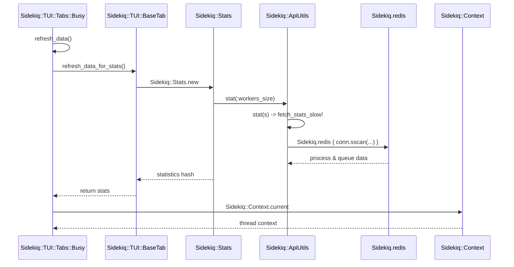

# Tab Data Refresh Flow

<details>
<summary>Relevant source files</summary>

The following files were used as context for generating this wiki page:

- [lib/sidekiq/tui/tabs/busy.rb](https://github.com/sidekiq/sidekiq/blob/main/lib/sidekiq/tui/tabs/busy.rb)
- [lib/sidekiq/tui/tabs/base_tab.rb](https://github.com/sidekiq/sidekiq/blob/main/lib/sidekiq/tui/tabs/base_tab.rb)
- [lib/sidekiq/api.rb](https://github.com/sidekiq/sidekiq/blob/main/lib/sidekiq/api.rb)
- [lib/sidekiq.rb](https://github.com/sidekiq/sidekiq/blob/main/lib/sidekiq/redis.rb)
- [lib/sidekiq/logger.rb](https://github.com/sidekiq/sidekiq/blob/main/lib/sidekiq/logger.rb)
</details>

## Overview

The `refresh_data` execution flow powers Sidekiq's Terminal User Interface (TUI) inside the `Busy` tab. When triggered, it aggregates cluster statistics, fetches process states, and queries runtime metrics from Redis. This ensures that the TUI presents up-to-date data on active processes, thread allocations, and memory consumption.

> [!NOTE]
> The TUI data-refresh cycle bridges high-level terminal views with low-level Redis metrics via Sidekiq's Data API.

---

### Step 1: refresh_data

The flow begins in the `Sidekiq::TUI::Tabs::Busy` tab component by calling `refresh_data`. This method coordinates updating both general statistics and process-specific table rows.

```ruby
def refresh_data
  refresh_data_for_stats

  busy = []
  table_row_ids = []

  Sidekiq::ProcessSet.new.each do |p|
    # ... process mapping ...
  end

  @data[:busy] = busy
  @data[:table] = {row_ids: table_row_ids}
end
```

Sources: [lib/sidekiq/tui/tabs/busy.rb:30-53](https://github.com/sidekiq/sidekiq/blob/main/lib/sidekiq/tui/tabs/busy.rb#L30-L53)

---

### Step 2: refresh_data_for_stats

Inside `refresh_data`, `refresh_data_for_stats` is invoked from `BaseTab` to fetch high-level cluster metrics like processed jobs, failed jobs, and active workers. It instantiates a `Sidekiq::Stats` object and populates `@data[:stats]`.

```ruby
def refresh_data_for_stats
  stats = Sidekiq::Stats.new
  @data[:stats] = {
    processed: stats.processed,
    failed: stats.failed,
    busy: stats.workers_size,
    enqueued: stats.enqueued,
    retries: stats.retry_size,
    scheduled: stats.scheduled_size,
    dead: stats.dead_size
  }
end
```

Sources: [lib/sidekiq/tui/tabs/base_tab.rb:104-115](https://github.com/sidekiq/sidekiq/blob/main/lib/sidekiq/tui/tabs/base_tab.rb#L104-L115)

---

### Step 3: workers_size

When `Sidekiq::Stats#initialize` evaluates `workers_size`, it queries the slow stats fetcher, which delegates to `workers_size`. This extracts active worker counts across registered processes from Redis.

```ruby
def workers_size
  stat :workers_size
end
```

Sources: [lib/sidekiq/api.rb:83-85](https://github.com/sidekiq/sidekiq/blob/main/lib/sidekiq/api.rb#L83-L85)

---

### Step 4: stat

The `stat` helper method checks whether a specific metric exists in the local `@stats cache`. If the value is `nil` (such as on initial population), it invokes `fetch_stats_slow!` to populate missing metrics.

```ruby
def stat(s)
  fetch_stats_slow! if @stats[s].nil?
  @stats[s] || raise(ArgumentError, "Unknown stat #{s}")
end
```

Sources: [lib/sidekiq/api.rb:231-234](https://github.com/sidekiq/sidekiq/blob/main/lib/sidekiq/api.rb#L231-L234)

---

### Step 5: fetch_stats_slow!

`fetch_stats_slow!` performs batch O(N) operations against Redis, scanning the `processes` and `queues` sets and piping commands to calculate total active workers and enqueued jobs.

```ruby
def fetch_stats_slow!
  processes = Sidekiq.redis { |conn|
    conn.sscan("processes").to_a
  }
  # ... pipeline execution ...
  @stats[:workers_size] = workers_size
  @stats[:enqueued] = enqueued
  @stats
end
```

Sources: [lib/sidekiq/api.rb:183-206](https://github.com/sidekiq/sidekiq/blob/main/lib/sidekiq/api.rb#L183-L206)

---

### Step 6: redis

Every Redis operation in Sidekiq's API and client layers wraps calls through `Sidekiq.redis`, borrowing a connection from the configured connection pool to execute commands safely across threads.

```ruby
def self.redis(&block)
  (Thread.current[:sidekiq_capsule] || default_configuration).redis(&block)
end
```

Sources: [lib/sidekiq.rb:81-83](https://github.com/sidekiq/sidekiq/blob/main/lib/sidekiq.rb#L81-L83)

---

### Step 7: current

Concurrently, logging and execution contexts rely on thread-local variables managed by `Sidekiq::Context`. The `current` method retrieves or initializes the active thread's context hash.

```ruby
def self.current
  Thread.current[:sidekiq_context] ||= {}
end
```

Sources: [lib/sidekiq/logger.rb:16-18](https://github.com/sidekiq/logger.rb#L16-L18)

---

## Execution Diagrams

### Sequence Diagram



Sources: [lib/sidekiq/tui/tabs/busy.rb:30-53](https://github.com/sidekiq/tui/blob/main/lib/sidekiq/tui/tabs/busy.rb#L30-L53), [lib/sidekiq/tui/tabs/base_tab.rb:104-115](https://github.com/sidekiq/sidekiq/blob/main/lib/sidekiq/tui/tabs/base_tab.rb#L104-L115), [lib/sidekiq/api.rb:83-85](https://github.com/sidekiq/sidekiq/blob/main/lib/sidekiq/api.rb#L83-L85), [lib/sidekiq/api.rb:183-234](https://github.com/sidekiq/sidekiq/blob/main/lib/sidekiq/api.rb#L183-L234), [lib/sidekiq.rb:81-83](https://github.com/sidekiq/sidekiq/blob/main/lib/sidekiq.rb#L81-L83), [lib/sidekiq/logger.rb:16-18](https://github.com/sidekiq/logger.rb#L16-L18)

### Flowchart

```mermaid
flowchart TD
    A[refresh_data] --> B[refresh_data_for_stats]
    B --> C[Sidekiq::Stats.new]
    C --> D{Stat cached?}
    D -- No --> E[fetch_stats_slow!]
    D -- Yes --> F[Return Stats]
    E --> G[Sidekiq.redis Pipeline]
    G --> F
    F --> H[Populate @data[:busy]]
    H --> I[End Refresh]
```

Sources: [lib/sidekiq/tui/tabs/busy.rb:30-53](https://github.com/sidekiq/tui/blob/main/lib/sidekiq/tui/tabs/busy.rb#L30-L53), [lib/sidekiq/tui/tabs/base_tab.rb:104-115](https://github.com/sidekiq/sidekiq/blob/main/lib/sidekiq/tui/tabs/base_tab.rb#L104-L115), [lib/sidekiq/api.rb:144-206](https://github.com/sidekiq/sidekiq/blob/main/lib/sidekiq/api.rb#L144-L206)

---

## Key Observations

- **Cross-Module Boundaries:** The execution flow moves seamlessly from the presentation layer (`Sidekiq::TUI`) down to the data access layer (`Sidekiq::Stats`, `Sidekiq::ProcessSet`) and finally into connection management (`Sidekiq.redis`).
- **Performance Considerations:** `fetch_stats_slow!` executes O(N) operations over Redis keys (`sscan` and pipelined `hget`/`llen`). While batched using pipelining to reduce round trips, frequent polling in high-throughput environments should be monitored.
- **Thread Safety:** Context lookups via `Sidekiq::Context.current` leverage thread-local storage (`Thread.current[:sidekiq_context]`), ensuring concurrent tab refreshes or worker threads do not collide.
