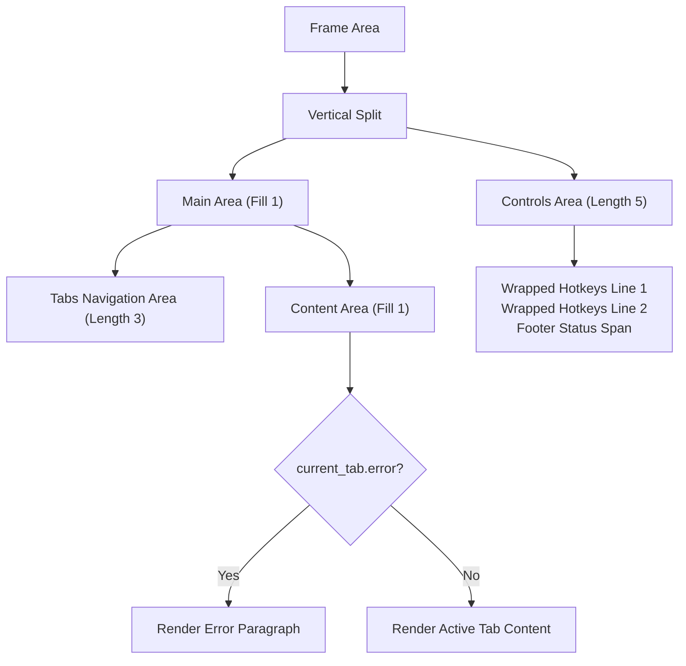
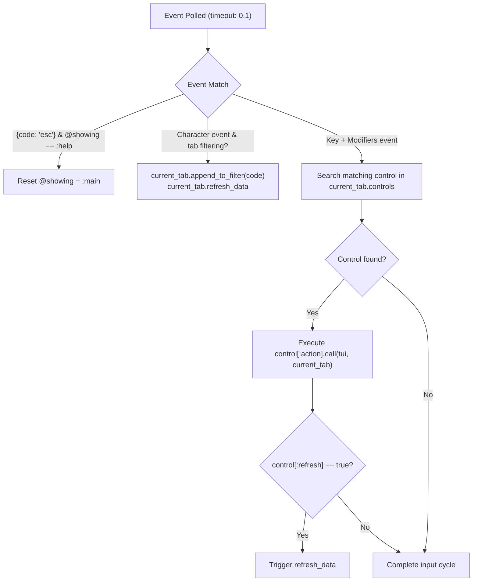

# Terminal UI Layout

<details>
<summary>Relevant source files</summary>

The following files were used as context for generating this wiki page:

- [lib/sidekiq/cli.rb](https://github.com/sidekiq/sidekiq/blob/main/lib/sidekiq/cli.rb)
- [lib/sidekiq/tui.rb](https://github.com/sidekiq/sidekiq/blob/main/lib/sidekiq/tui.rb)
- [lib/sidekiq/tui/tabs/set_tab.rb](https://github.com/sidekiq/sidekiq/blob/main/lib/sidekiq/tui/tabs/set_tab.rb)
- [lib/sidekiq/tui/tabs/busy.rb](https://github.com/sidekiq/sidekiq/blob/main/lib/sidekiq/tui/tabs/busy.rb)
- [lib/sidekiq/tui/tabs/base_tab.rb](https://github.com/sidekiq/sidekiq/blob/main/lib/sidekiq/tui/tabs/base_tab.rb)
- [lib/sidekiq/tui/tabs/queues.rb](https://github.com/sidekiq/sidekiq/blob/main/lib/sidekiq/tui/tabs/queues.rb)
- [lib/sidekiq/web/application.rb](https://github.com/sidekiq/sidekiq/blob/main/lib/sidekiq/web/application.rb)
- [lib/sidekiq/tui/tabs/home.rb](https://github.com/sidekiq/sidekiq/blob/main/lib/sidekiq/tui/tabs/home.rb)
- [lib/sidekiq/monitor.rb](https://github.com/sidekiq/sidekiq/blob/main/lib/sidekiq/monitor.rb)
- [lib/sidekiq/tui/tabs/metrics.rb](https://github.com/sidekiq/sidekiq/blob/main/lib/sidekiq/tui/tabs/metrics.rb)
- [web/assets/javascripts/dashboard-charts.js](https://github.com/sidekiq/sidekiq/blob/main/web/assets/javascripts/dashboard-charts.js)
- [web/assets/stylesheets/style.css](https://github.com/sidekiq/sidekiq/blob/main/web/assets/stylesheets/style.css)
- [lib/sidekiq/tui/filtering.rb](https://github.com/sidekiq/sidekiq/blob/main/lib/sidekiq/tui/filtering.rb)
- [lib/sidekiq/tui/controls.rb](https://github.com/sidekiq/sidekiq/blob/main/lib/sidekiq/tui/controls.rb)
- [lib/sidekiq/tui/tabs.rb](https://github.com/sidekiq/sidekiq/blob/main/lib/sidekiq/tui/tabs.rb)
- [lib/sidekiq/tui/tabs/dead.rb](https://github.com/sidekiq/sidekiq/blob/main/lib/sidekiq/tui/tabs/dead.rb)
- [lib/sidekiq/tui/tabs/scheduled.rb](https://github.com/sidekiq/sidekiq/blob/main/lib/sidekiq/tui/tabs/scheduled.rb)
- [web/assets/javascripts/dashboard.js](https://github.com/sidekiq/sidekiq/blob/main/web/assets/javascripts/dashboard.js)
- [lib/sidekiq/tui/tabs/retries.rb](https://github.com/sidekiq/sidekiq/blob/main/lib/sidekiq/tui/tabs/retries.rb)
- [web/locales/en.yml](https://github.com/sidekiq/sidekiq/blob/main/web/locales/en.yml)
- [docs/internals.md](https://github.com/sidekiq/sidekiq/blob/main/docs/internals.md)
- [web/locales/tr.yml](https://github.com/sidekiq/sidekiq/blob/main/web/locales/tr.yml)
- [web/locales/ta.yml](https://github.com/sidekiq/sidekiq/blob/main/web/locales/ta.yml)
</details>

## Overview

### Overview
The Terminal UI (TUI) layout subsystem implements an interactive terminal interface using the `ratatui_ruby` gem. It allows operators to monitor, inspect, and manage Sidekiq background jobs, active process sets, queues, retry sets, scheduled jobs, dead jobs, and metrics directly from the terminal without needing a web browser or HTTP server.

Sources: [lib/sidekiq/tui.rb:1-14](https://github.com/sidekiq/sidekiq/blob/main/lib/sidekiq/tui.rb#L1-L14)

The architecture revolves around `Sidekiq::TUI`, which sets up a continuous event loop (`run_loop`) that polls for input events, updates statistics and job collections at periodic intervals, and draws the user interface using terminal constraints and widgets. The subsystem isolates file logging to `tui.log` while active so as not to disrupt the terminal terminal screen buffers managed by `ratatui_ruby`.

Sources: [lib/sidekiq/tui.rb:48-57](https://github.com/sidekiq/sidekiq/blob/main/lib/sidekiq/tui.rb#L48-L57)

The layout architecture coordinates `Sidekiq::TUI::BaseTab`, individual tab implementations (`Home`, `Busy`, `Queues`, `Scheduled`, `Retries`, `Dead`, `Metrics`), and shared behavioral modules such as `Sidekiq::TUI::Controls`, `Sidekiq::TUI::Filtering`, and `Sidekiq::TUI::Tabs::SetTab`.

Sources: [lib/sidekiq/tui/tabs/base_tab.rb:1-5](https://github.com/sidekiq/sidekiq/blob/main/lib/sidekiq/tui/tabs/base_tab.rb#L1-L5), [lib/sidekiq/tui/tabs.rb:1-15](https://github.com/sidekiq/sidekiq/blob/main/lib/sidekiq/tui/tabs.rb#L1-L15)

---

## Terminal Screen Spatial Partitioning

The `Sidekiq::TUI#render` method defines the screen spatial allocation when `@showing == :main`. It uses `ratatui_ruby` layout constraint primitives (`@tui.layout_split`) to partition the display area vertically into two macro regions: a main area (`constraint_fill(1)`) and a controls footer area (`constraint_length(5)`).



Sources: [lib/sidekiq/tui.rb:61-96](https://github.com/sidekiq/sidekiq/blob/main/lib/sidekiq/tui.rb#L61-L96)

The `main_area` is split vertically into a navigation bar area (`constraint_length(3)`) and a main content area (`constraint_fill(1)`). The navigation bar renders a tab selection widget listing translated titles for all tab classes in `Sidekiq::TUI::Tabs::All`.

Sources: [lib/sidekiq/tui.rb:72-92](https://github.com/sidekiq/sidekiq/blob/main/lib/sidekiq/tui.rb#L72-L92), [lib/sidekiq/tui/tabs.rb:12-14](https://github.com/sidekiq/sidekiq/blob/main/lib/sidekiq/tui/tabs.rb#L12-L14)

> [!NOTE]
> When `current_tab.error` contains an unhandled exception, `render_content_area` catches the state and routes to `render_error` instead of invoking `current_tab.render`. This draws a red bordered box containing the exception message and backtrace without crashing the application.

Sources: [lib/sidekiq/tui.rb:157-161](https://github.com/sidekiq/sidekiq/blob/main/lib/sidekiq/tui.rb#L157-L161), [lib/sidekiq/tui.rb:282-297](https://github.com/sidekiq/sidekiq/blob/main/lib/sidekiq/tui.rb#L282-L297)

---

## Tab Hierarchy and Layout Architecture

Tab components inherit from `Sidekiq::TUI::BaseTab`, which encapsulates shared rendering methods (`render_stats_section`, `render_kv_section`, `render_table`, `striped_rows`) and row selection state.

| Tab Component | Inherits / Mixins | Declarative Features | Visual Layout Division |
|---|---|---|---|
| `Home` | `Sidekiq::TUI::BaseTab` | `[]` | Top Stats (length 4), Middle Graph Chart (fill 1), Bottom Redis Info (length 4) |
| `Busy` | `Sidekiq::TUI::BaseTab` | `%i[selectable]` | Top Stats (length 4), Middle Process Status (length 4), Bottom Processes Table (fill 1) |
| `Queues` | `Sidekiq::TUI::BaseTab` | `%i[selectable]` | Top Stats (length 4), Bottom Queues Table (fill 1) |
| `Metrics` | `Sidekiq::TUI::BaseTab`, `Filtering` | `%i[filterable]` | Top Stats (length 4), Bottom Metrics Line Chart (fill 1) |
| `Retries` | `Sidekiq::TUI::BaseTab`, `SetTab` | `%i[selectable pageable filterable]` | Top Stats (length 4), Bottom Sorted Set Table (fill 1) |
| `Scheduled` | `Sidekiq::TUI::BaseTab`, `SetTab` | `%i[selectable pageable filterable]` | Top Stats (length 4), Bottom Sorted Set Table (fill 1) |
| `Dead` | `Sidekiq::TUI::BaseTab`, `SetTab` | `%i[selectable pageable filterable]` | Top Stats (length 4), Bottom Sorted Set Table (fill 1) |

Sources: [lib/sidekiq/tui/tabs/base_tab.rb:1-5](https://github.com/sidekiq/sidekiq/blob/main/lib/sidekiq/tui/tabs/base_tab.rb#L1-L5), [lib/sidekiq/tui/tabs/home.rb:6-60](https://github.com/sidekiq/sidekiq/blob/main/lib/sidekiq/tui/tabs/home.rb#L6-L60), [lib/sidekiq/tui/tabs/busy.rb:6-65](https://github.com/sidekiq/sidekiq/blob/main/lib/sidekiq/tui/tabs/busy.rb#L6-L65), [lib/sidekiq/tui/tabs/queues.rb:6-68](https://github.com/sidekiq/sidekiq/blob/main/lib/sidekiq/tui/tabs/queues.rb#L6-L68), [lib/sidekiq/tui/tabs/metrics.rb:6-40](https://github.com/sidekiq/sidekiq/blob/main/lib/sidekiq/tui/tabs/metrics.rb#L6-L40), [lib/sidekiq/tui/tabs/set_tab.rb:1-10](https://github.com/sidekiq/sidekiq/blob/main/lib/sidekiq/tui/tabs/set_tab.rb#L1-L10)

The `Sidekiq::TUI::Tabs::SetTab` module provides unified handling for paginated and filterable Redis sets (`RetrySet`, `ScheduledSet`, `DeadSet`). It mixes in `Sidekiq::TUI::Filtering` and uses pagination methods to construct sorted job entry tables.

Sources: [lib/sidekiq/tui/tabs/set_tab.rb:1-10](https://github.com/sidekiq/sidekiq/blob/main/lib/sidekiq/tui/tabs/set_tab.rb#L1-L10), [lib/sidekiq/tui/tabs/retries.rb:7-11](https://github.com/sidekiq/sidekiq/blob/main/lib/sidekiq/tui/tabs/retries.rb#L7-L11), [lib/sidekiq/tui/tabs/scheduled.rb:7-11](https://github.com/sidekiq/sidekiq/blob/main/lib/sidekiq/tui/tabs/scheduled.rb#L7-L11), [lib/sidekiq/tui/tabs/dead.rb:7-11](https://github.com/sidekiq/sidekiq/blob/main/lib/sidekiq/tui/tabs/dead.rb#L7-L11)

---

## Controls Execution Flow and Rendering Pipeline

The sequence of rendering hotkey controls flows from `run_loop` down to the tab's dynamic control definitions: `run_loop` → `render` → `render_controls` → `controls`.

```mermaid
sequenceDiagram
    participant Loop as Sidekiq::TUI#run_loop
    participant Render as Sidekiq::TUI#render
    participant Controls as Sidekiq::TUI#render_controls
    participant Tab as Sidekiq::TUI::BaseTab#controls

    Loop->>Render: render()
    Render->>Controls: render_controls(frame, area)
    Controls->>Tab: current_tab.controls
    Tab-->>Controls: returns Array of control hashes (GLOBAL + SHARED + tab specific)
    Note over Controls: Calculate available_width = area.width - 4<br>Wrap items into text_line spans
    Controls->>Frame: render_widget(controls_block, area)
```

Sources: [lib/sidekiq/tui.rb:48-57](https://github.com/sidekiq/sidekiq/blob/main/lib/sidekiq/tui.rb#L48-L57), [lib/sidekiq/tui.rb:61-96](https://github.com/sidekiq/sidekiq/blob/main/lib/sidekiq/tui.rb#L61-L96), [lib/sidekiq/tui.rb:163-218](https://github.com/sidekiq/sidekiq/blob/main/lib/sidekiq/tui.rb#L163-L218), [lib/sidekiq/tui/controls.rb:48-50](https://github.com/sidekiq/sidekiq/blob/main/lib/sidekiq/tui/controls.rb#L48-L50)

In `render_controls`, the available horizontal width is calculated (`available_width = area.width - 4`) to account for border padding. Controls are wrapped dynamically into separate text lines based on string length estimates.

Sources: [lib/sidekiq/tui.rb:168-191](https://github.com/sidekiq/sidekiq/blob/main/lib/sidekiq/tui.rb#L168-L191)

LIFT THE LOAD-BEARING LINE:
To ensure stable visual heights across rendering updates, `render_controls` enforces a minimum 2-line structure using a guard loop:
```ruby
while lines.length < 2
  lines << @tui.text_line(spans: [])
end
```
This guard prevents visual jitter in the main content box when switching between tabs with varying numbers of registered hotkey controls.

Sources: [lib/sidekiq/tui.rb:193-196](https://github.com/sidekiq/sidekiq/blob/main/lib/sidekiq/tui.rb#L193-L196)

---

## Input Processing and Key Matching Logic

User input events are polled inside `Sidekiq::TUI#handle_input` with a `0.1` second timeout threshold to throttle CPU consumption down to approximately 10 FPS.



Sources: [lib/sidekiq/tui.rb:236-260](https://github.com/sidekiq/sidekiq/blob/main/lib/sidekiq/tui.rb#L236-L260)

RESOLUTION, NOT JUST REGISTRATION:
When a key event is received, `handle_input` searches `current_tab.controls` to select the winning handler. The tie-break comparator matches both key code and modifier arrays explicitly:

```ruby
control = current_tab.controls.find { |ctrl|
  ctrl[:code] == code &&
    (ctrl[:modifiers] || []) == (modifiers || [])
}
```

If a match is found, its associated lambda is executed (`control[:action].call(self, current_tab)`), and if `control[:refresh]` is true, `refresh_data` is invoked immediately.

Sources: [lib/sidekiq/tui.rb:245-253](https://github.com/sidekiq/sidekiq/blob/main/lib/sidekiq/tui.rb#L245-L253)

> [!TIP]
> Navigation between tabs uses modulo arithmetic to wrap around seamlessly at boundary edges: `@current = @all[(@all.index(current_tab) + index_change) % @all.size]`. Row index navigation in tables uses an identical wrapping strategy: `@data[:selected_row_index] = (@data[:selected_row_index] + index_change) % ids.count`.

Sources: [lib/sidekiq/tui.rb:313-317](https://github.com/sidekiq/sidekiq/blob/main/lib/sidekiq/tui/tabs/base_tab.rb#L59-L67)

---

## Data Refresh Cycle and Exception Boundaries

Data polling occurs in `run_loop` guarded by `should_refresh?`, which evaluates whether at least 2 seconds (`REFRESH_INTERVAL_SECONDS = 2`) have elapsed since `@last_refresh`.

```ruby
def refresh_data
  current_tab.refresh_data
  @last_refresh = Time.now
rescue => e
  handle_exception(e)
  current_tab.error = e
end
```

Sources: [lib/sidekiq/tui.rb:21-21](https://github.com/sidekiq/sidekiq/blob/main/lib/sidekiq/tui.rb#L21-L21), [lib/sidekiq/tui.rb:269-280](https://github.com/sidekiq/sidekiq/blob/main/lib/sidekiq/tui.rb#L269-L280)

> [!CAUTION]
> If a Redis connectivity error or runtime exception occurs during `refresh_data`, the exception object is assigned directly to `current_tab.error`. The render loop catches this flag during `render_content_area` and displays a dedicated error panel, preventing the TUI loop from crashing or leaving the terminal in a raw, unresponsive terminal state.

Sources: [lib/sidekiq/tui.rb:157-161](https://github.com/sidekiq/sidekiq/blob/main/lib/sidekiq/tui.rb#L157-L161), [lib/sidekiq/tui.rb:277-280](https://github.com/sidekiq/sidekiq/blob/main/lib/sidekiq/tui.rb#L277-L280)

---

## Keyboard Hotkeys and Feature Mixin Matrix

Hotkeys are registered centrally in `Sidekiq::TUI::Controls::GLOBAL` and `Sidekiq::TUI::Controls::SHARED` and aggregated according to each tab's `features` array.

Sources: [lib/sidekiq/tui/controls.rb:13-50](https://github.com/sidekiq/sidekiq/blob/main/lib/sidekiq/tui/controls.rb#L13-L50)

| Key Code | Modifiers | Scope / Feature | Action Executed |
|---|---|---|---|
| `?` | none | Global | Opens Help window (`show_help`) |
| `left` | none | Global | Navigates to previous tab (`navigate(:left)`) |
| `right` | none | Global | Navigates to next tab (`navigate(:right)`) |
| `q` | none | Global | Quits application loop (`:quit`) |
| `c` | `["ctrl"]` | Global | Quits application loop (`:quit`) |
| `h` | none | `:pageable` | Navigates to previous page (`prev_page`) |
| `l` | none | `:pageable` | Navigates to next page (`next_page`) |
| `k` | none | `:selectable` | Moves row highlight up (`navigate_row(:up)`) |
| `j` | none | `:selectable` | Moves row highlight down (`navigate_row(:down)`) |
| `x` | none | `:selectable` | Toggles selection of current row (`toggle_select`) |
| `A` | `["shift"]` | `:selectable` | Selects or deselects all rows (`toggle_select(:all)`) |
| `/` | none | `:filterable` | Activates interactive filter mode (`start_filtering`) |
| `backspace`| none | `:filterable` | Removes last filter character (`remove_last_char_from_filter`) |
| `enter` | none | `:filterable` | Confirms and stops filtering (`stop_filtering`) |
| `esc` | none | `:filterable` | Clears filter and exits filter mode (`stop_and_clear_filtering`) |
| `D` | `["shift"]` | `SetTab` / `Queues` | Deletes selected jobs or clears queue |
| `R` | `["shift"]` | `SetTab` | Retries selected jobs (`alter_rows!(:retry)`) |
| `E` | `["shift"]` | `SetTab` | Enqueues selected jobs (`alter_rows!(:add_to_queue)`) |
| `K` | `["shift"]` | `SetTab` | Kills selected jobs (`alter_rows!(:kill)`) |
| `T` | `["shift"]` | `Busy` tab | Terminates selected processes (`terminate!`) |
| `Q` | `["shift"]` | `Busy` tab | Quiets selected processes (`quiet!`) |
| `p` | none | `Queues` tab | Pauses or unpauses queue (Sidekiq Pro) |

Sources: [lib/sidekiq/tui/controls.rb:13-41](https://github.com/sidekiq/sidekiq/blob/main/lib/sidekiq/tui/controls.rb#L13-L41), [lib/sidekiq/tui/tabs/set_tab.rb:12-21](https://github.com/sidekiq/sidekiq/blob/main/lib/sidekiq/tui/tabs/set_tab.rb#L12-L21), [lib/sidekiq/tui/tabs/busy.rb:11-16](https://github.com/sidekiq/sidekiq/blob/main/lib/sidekiq/tui/tabs/busy.rb#L11-L16), [lib/sidekiq/tui/tabs/queues.rb:11-18](https://github.com/sidekiq/sidekiq/blob/main/lib/sidekiq/tui/tabs/queues.rb#L11-L18)

---

## System Design Trade-Offs

| Design Choice | Benefit | Cost |
|---|---|---|
| **Immediate-mode rendering (`ratatui_ruby`)** | Eliminates complex DOM trees and visual layout state synchronization, guaranteeing minimal memory usage. | Requires full terminal redraws on event loop ticks, necessitating event polling throttling (10 FPS) to prevent high CPU usage. |
| **Synchronous 2-second refresh throttling** | Protects Redis instances from query flooding when multiple operators keep terminal dashboards open. | UI metrics and process states can lag up to 2 seconds behind actual Redis state changes. |
| **File-based logger redirection (`tui.log`)** | Prevents process log output from writing to stdout/stderr and corrupting `ratatui_ruby` terminal escape sequences. | Standard logger entries are invisible in the terminal view and require inspecting `tui.log` separately. |
| **Composition via feature symbols (`:selectable`, `:filterable`)** | Allows tab components to declare features concisely without duplicating keyboard handling logic. | Increases method lookup indirection through module inclusions (`Controls`, `Filtering`, `SetTab`). |

Sources: [lib/sidekiq/tui.rb:21-57](https://github.com/sidekiq/sidekiq/blob/main/lib/sidekiq/tui.rb#L21-L57), [lib/sidekiq/tui/controls.rb:48-50](https://github.com/sidekiq/sidekiq/blob/main/lib/sidekiq/tui/controls.rb#L48-L50), [lib/sidekiq/tui/tabs/set_tab.rb:1-10](https://github.com/sidekiq/sidekiq/blob/main/lib/sidekiq/tui/tabs/set_tab.rb#L1-L10)

---

## Usable Code Example

The following executable snippet shows how `Sidekiq::TUI` is instantiated and initialized within a CLI command context:

```ruby
require "sidekiq"
require "sidekiq/tui"

# Obtain configuration object
config = Sidekiq.default_configuration

# Instantiate the Terminal UI with default or explicit locale
tui_app = Sidekiq::TUI.new(config, language: ENV["LANG"] || "en")

# RatatuiRuby manages the terminal buffer initialization pass
RatatuiRuby.run do |tui|
  tui_app.prepare(tui)
  
  # Starts the interactive loop (refreshes data, renders frame, handles input)
  tui_app.run_loop
end
```

Sources: [lib/sidekiq/tui.rb:28-57](https://github.com/sidekiq/sidekiq/blob/main/lib/sidekiq/tui.rb#L28-L57)

## Related

- [[Terminal UI Tabs]]

