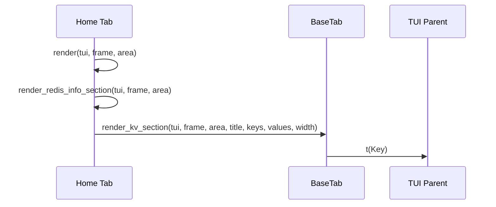
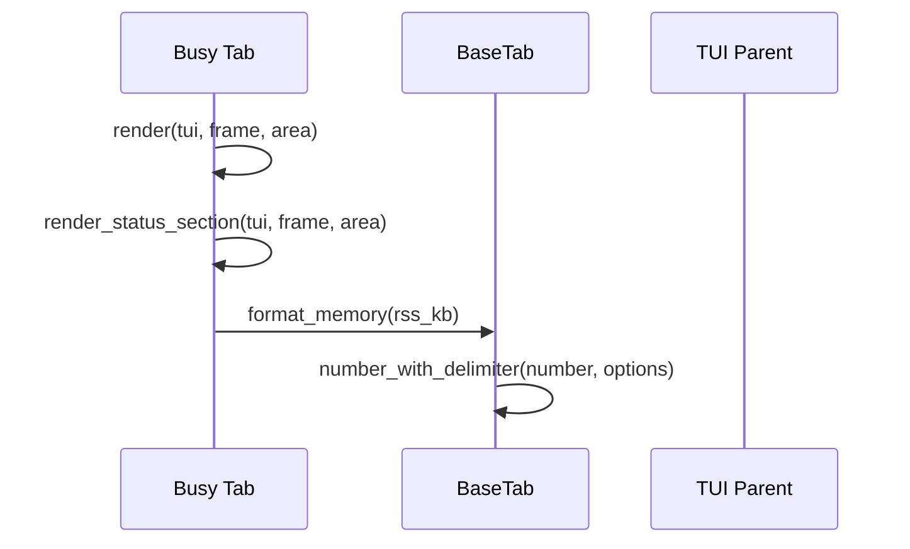
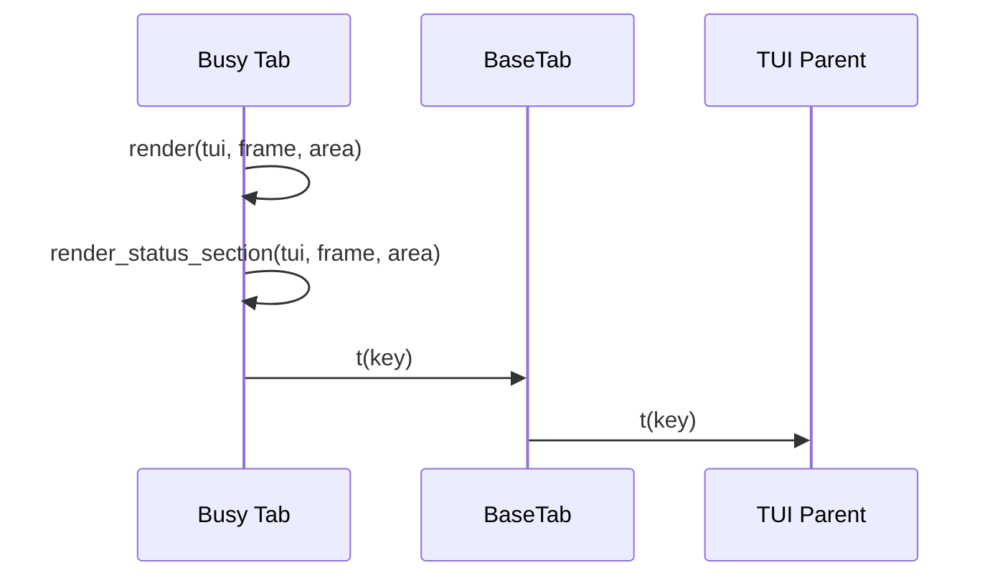
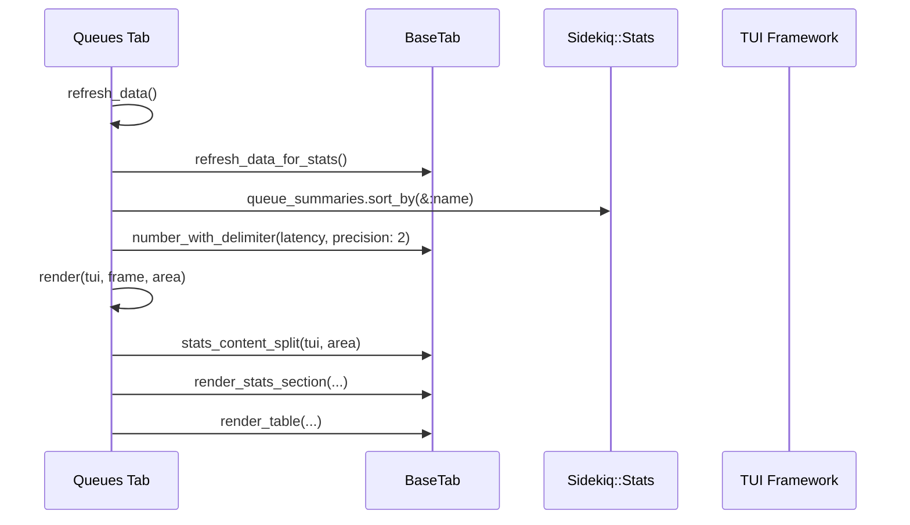
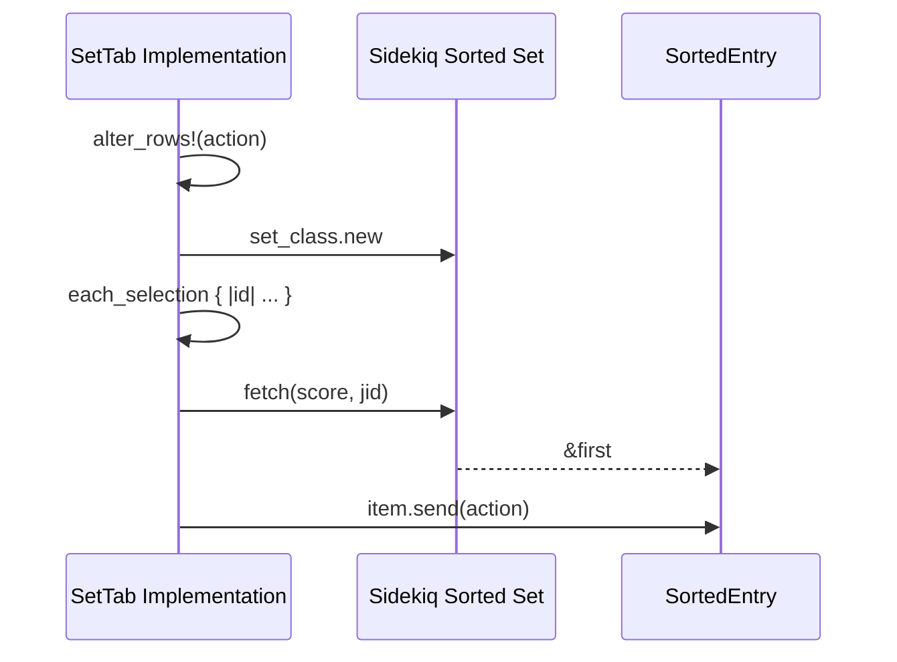
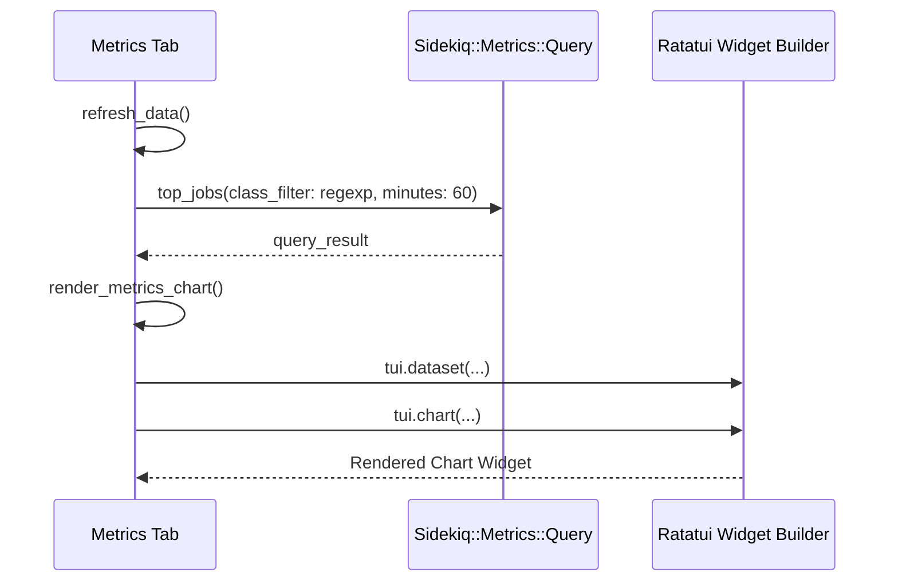

# Terminal UI Tabs

<details>
<summary>Relevant source files</summary>

The following files were used as context for generating this wiki page:

- [lib/sidekiq/web/application.rb](https://github.com/sidekiq/sidekiq/blob/main/lib/sidekiq/web/application.rb)
- [lib/sidekiq/tui.rb](https://github.com/sidekiq/sidekiq/blob/main/lib/sidekiq/tui.rb)
- [lib/sidekiq/tui/tabs/set_tab.rb](https://github.com/sidekiq/sidekiq/blob/main/lib/sidekiq/tui/tabs/set_tab.rb)
- [lib/sidekiq/tui/tabs/busy.rb](https://github.com/sidekiq/sidekiq/blob/main/lib/sidekiq/tui/tabs/busy.rb)
- [lib/sidekiq/tui/tabs/base_tab.rb](https://github.com/sidekiq/sidekiq/blob/main/lib/sidekiq/tui/tabs/base_tab.rb)
- [lib/sidekiq/tui/tabs/queues.rb](https://github.com/sidekiq/sidekiq/blob/main/lib/sidekiq/tui/tabs/queues.rb)
- [lib/sidekiq/monitor.rb](https://github.com/sidekiq/sidekiq/blob/main/lib/sidekiq/monitor.rb)
- [lib/sidekiq/tui/tabs/home.rb](https://github.com/sidekiq/sidekiq/blob/main/lib/sidekiq/tui/tabs/home.rb)
- [lib/sidekiq/tui/tabs/metrics.rb](https://github.com/sidekiq/sidekiq/blob/main/lib/sidekiq/tui/tabs/metrics.rb)
- [web/assets/javascripts/dashboard-charts.js](https://github.com/sidekiq/sidekiq/blob/main/web/assets/javascripts/dashboard-charts.js)
- [lib/sidekiq/tui/tabs.rb](https://github.com/sidekiq/sidekiq/blob/main/lib/sidekiq/tui/tabs.rb)
- [lib/sidekiq/tui/tabs/dead.rb](https://github.com/sidekiq/sidekiq/blob/main/lib/sidekiq/tui/tabs/dead.rb)
- [lib/sidekiq/tui/tabs/scheduled.rb](https://github.com/sidekiq/sidekiq/blob/main/lib/sidekiq/tui/tabs/scheduled.rb)
- [lib/sidekiq/tui/tabs/retries.rb](https://github.com/sidekiq/sidekiq/blob/main/lib/sidekiq/tui/tabs/retries.rb)
- [web/locales/en.yml](https://github.com/sidekiq/sidekiq/blob/main/web/locales/en.yml)
- [web/locales/tr.yml](https://github.com/sidekiq/sidekiq/blob/main/web/locales/tr.yml)
- [web/locales/pt-BR.yml](https://github.com/sidekiq/sidekiq/blob/main/web/locales/pt-BR.yml)
- [web/locales/zh-TW.yml](https://github.com/sidekiq/sidekiq/blob/main/web/locales/zh-TW.yml)
- [web/locales/uk.yml](https://github.com/sidekiq/sidekiq/blob/main/lib/sidekiq/web/application.rb)
- [web/locales/ta.yml](https://github.com/sidekiq/sidekiq/blob/main/web/locales/ta.yml)
</details>

## Overview

The Terminal UI Tabs component provides an interactive, terminal-based interface built on `ratatui_ruby` for monitoring and managing Sidekiq instances directly from the command line. It solves the challenge of real-time observability in headless or terminal-centric environments by offering structured navigation, live telemetry refreshing, and direct operational controls for processes, queues, and background job sets. Key design decisions include a modular tab architecture with shared layout abstractions, centralized metrics querying, and responsive rendering loops optimized for low CPU overhead. It integrates closely with Sidekiq's core API classes and localization infrastructure to deliver localized, multi-tab operational visibility alongside the web application interface.

Sources: [lib/sidekiq/tui.rb#L1-L390](https://github.com/sidekiq/sidekiq/blob/main/lib/sidekiq/tui.rb#L1-L390), [lib/sidekiq/tui/tabs/base_tab.rb#L1-L228](https://github.com/sidekiq/sidekiq/blob/main/lib/sidekiq/tui/tabs/base_tab.rb#L1-L228)

## Base Tab Architecture and Navigation

### Overview

The `BaseTab` class serves as the foundational architectural parent for all interactive views within the Sidekiq Terminal UI. It encapsulates core state initialization, row selection mechanics, pagination handling, bulk item iteration, telemetry fetching, and widget layout rendering. Subclasses inherit these shared abstractions to manage data tables, key-value statistics panels, and visual formatting without duplicating boilerplate rendering or navigation logic.

Sources: [lib/sidekiq/tui/tabs/base_tab.rb#L1-L228](https://github.com/sidekiq/sidekiq/blob/main/lib/sidekiq/tui/tabs/base_tab.rb#L1-L228)

### Tab Collection and Registry

The Sidekiq terminal interface defines its available view tabs as a registered set of subclasses inheriting from the base architecture. The `Sidekiq::TUI::Tabs::All` constant aggregates every concrete tab implementation into a unified collection used for tab switching and layout registration.

| Tab Constant | Subclass File | Purpose |
| :--- | :--- | :--- |
| `Sidekiq::TUI::Tabs::Home` | `tabs/home.rb` | System overview and global Redis telemetry |
| `Sidekiq::TUI::Tabs::Busy` | `tabs/busy.rb` | Real-time process thread tracking and worker control |
| `Sidekiq::TUI::Tabs::Queues` | `tabs/queues.rb` | Queue depth monitoring and latency management |
| `Sidekiq::TUI::Tabs::Scheduled` | `tabs/scheduled.rb` | Scheduled job inspection and manipulation |
| `Sidekiq::TUI::Tabs::Retries` | `tabs/retries.rb` | Retry queue monitoring and failure handling |
| `Sidekiq::TUI::Tabs::Dead` | `tabs/dead.rb` | Dead job set inspection and cleanup |
| `Sidekiq::TUI::Tabs::Metrics` | `tabs/metrics.rb` | Historical performance charts and event telemetry |

Sources: [lib/sidekiq/tui/tabs.rb#L1-L15](https://github.com/sidekiq/sidekiq/blob/main/lib/sidekiq/tui/tabs.rb#L1-L15)

### Core Layout Abstractions and Table Rendering

`BaseTab` provides helper routines to partition terminal areas and render structured tables or statistics sections. The layout split routine divides a frame area into a fixed-height metrics header and a flexible content fill area using vertical constraints.

```ruby
def stats_content_split(tui, area)
  tui.layout_split(
    area,
    direction: :vertical,
    constraints: [
      tui.constraint_length(4), # Stats
      tui.constraint_fill(1) # Content
    ]
  )
end
```

Sources: [lib/sidekiq/tui/tabs/base_tab.rb#L165-L174](https://github.com/sidekiq/sidekiq/blob/main/lib/sidekiq/tui/tabs/base_tab.rb#L165-L174)

When rendering tables, `render_table` constructs dynamic footers tracking pagination state, row counts, and active multi-row selections. If a tab includes the `:selectable` feature flag, row highlighting styles and selection symbols are automatically injected into the table defaults.

```ruby
def render_table(tui, frame, area)
  page = @data.dig(:table, :current_page) || 1
  rows = @data.dig(:table, :rows) || []
  total = @data.dig(:table, :total) || 0
  footer = ["", "Page: #{page}", "Count: #{rows.size}", "Total: #{total}"]
  footer << "Selected: #{@data[:selected].size}" unless @data[:selected].empty?

  defaults = {
    title: "TableName",
    footer: footer
  }
  if features.include?(:selectable)
    defaults.merge!({
      highlight_symbol: "➡️",
      selected_row: @data[:selected_row_index],
      row_highlight_style: tui.style(fg: :white, bg: :blue)
    })
  end
  hash = defaults.merge(yield)
  hash[:block] ||= tui.block(title: hash.delete(:title), borders: :all)
  table = tui.table(**hash)
  frame.render_widget(table, area)
end
```

Sources: [lib/sidekiq/tui/tabs/base_tab.rb#L117-L139](https://github.com/sidekiq/sidekiq/blob/main/lib/sidekiq/tui/tabs/base_tab.rb#L117-L139)

> [!NOTE]
> Selection indexing checks row identifiers via `selected?(entry)` against the internal `@data[:selected]` array, which stores active row IDs rather than volatile array indices.

Sources: [lib/sidekiq/tui/tabs/base_tab.rb#L31-L33](https://github.com/sidekiq/sidekiq/blob/main/lib/sidekiq/tui/tabs/base_tab.rb#L31-L33)

### Shared Metrics Calculations and Formatting

Tabs gather global Redis metrics through `refresh_data_for_stats`, querying `Sidekiq::Stats` to populate worker sizes, queue depths, and failure counters.

```ruby
def refresh_data_for_stats
  stats = Sidekiq::Stats.new
  @data[:stats] = {
    processed: stats.processed,
    failed: stats.failed,
    busy: stats.workers_size,
    enqueued: stats.enqueued,
    retries: stats.retry_size,
    scheduled: stats.scheduled_size,
    dead: stats.dead_size
  }
end
```

Sources: [lib/sidekiq/tui/tabs/base_tab.rb#L104-L115](https://github.com/sidekiq/sidekiq/blob/main/lib/sidekiq/tui/tabs/base_tab.rb#L104-L115)

Numerical outputs are localized according to the parent interface language configuration. The `NUMERIC_SEPARATORS` constant maps localized locale codes to specific thousands and decimal delimiter pairs.

| Locales | Separators (Thousands, Decimal) |
| :--- | :--- |
| `da`, `de`, `el`, `es`, `it`, `nl`, `pt`, `pt-BR`, `tr`, `vi` | `[".", ","]` |
| `cs`, `fr`, `lt`, `nb`, `pl`, `ru`, `sv`, `uk` | `[" ", ","]` |
| Default (English / Unlisted) | `[",", "."]` |

Sources: [lib/sidekiq/tui/tabs/base_tab.rb#L196-L206](https://github.com/sidekiq/sidekiq/blob/main/lib/sidekiq/tui/tabs/base_tab.rb#L196-L206)

Memory figures are formatted via `format_memory`, applying scale-dependent thresholds to resident set size values:
- Values below 100,000 KB are formatted in kilobytes (`KB`).
- Values between 100,000 KB and 10,000,000 KB are converted and formatted in megabytes (`MB`).
- Values exceeding 10,000,000 KB are expressed in gigabytes (`GB`) with single-digit precision.

Sources: [lib/sidekiq/tui/tabs/base_tab.rb#L217-L227](https://github.com/sidekiq/sidekiq/blob/main/lib/sidekiq/tui/tabs/base_tab.rb#L217-L227)

## Home Tab and Redis Statistics

### Overview

The `Home` tab class inherits from `BaseTab` and manages system telemetry display, rendering top-level statistics, a rolling delta chart, and key-value Redis configuration properties.

Sources: [lib/sidekiq/tui/tabs/home.rb#L6-L44](https://github.com/sidekiq/sidekiq/blob/main/lib/sidekiq/tui/tabs/home.rb#L6-L44)

### Data Refresh and Telemetry Collection

During data refresh cycles, the home tab queries `Sidekiq::Stats` to compute rolling historical deltas for processed and failed jobs across a fixed buffer size of 50 samples. Concurrently, it fetches default configuration Redis server metadata to populate telemetry attributes.

```ruby
def refresh_data
  refresh_data_for_stats

  stats = Sidekiq::Stats.new
  @data[:chart] ||= {
    previous_stats: {
      processed: stats.processed,
      failed: stats.failed
    },
    deltas: {
      processed: Array.new(50, 0),
      failed: Array.new(50, 0)
    }
  }

  processed_delta = stats.processed - @data[:chart][:previous_stats][:processed]
  failed_delta = stats.failed - @data[:chart][:previous_stats][:failed]

  @data[:chart][:deltas][:processed].shift
  @data[:chart][:deltas][:processed].push(processed_delta)
  @data[:chart][:deltas][:failed].shift
  @data[:chart][:deltas][:failed].push(failed_delta)

  @data[:chart][:previous_stats] = {
    processed: stats.processed,
    failed: stats.failed
  }

  redis_info = Sidekiq.default_configuration.redis_info

  @data[:redis_info] = {
    version: redis_info["redis_version"] || "N/A",
    uptime_days: redis_info["uptime_in_days"] || "N/A",
    connected_clients: redis_info["connected_clients"] || "N/A",
    used_memory: redis_info["used_memory_human"] || "N/A",
    peak_memory: redis_info["used_memory_peak_human"] || "N/A"
  }
end
```

Sources: [lib/sidekiq/tui/tabs/home.rb#L7-L44](https://github.com/sidekiq/sidekiq/blob/main/lib/sidekiq/tui/tabs/home.rb#L7-L44)

> [!NOTE]
> If specific Redis info fields such as `redis_version` or `used_memory_human` are missing from the server response, the tab falls back to `"N/A"` strings to maintain UI structural stability.

Sources: [lib/sidekiq/tui/tabs/home.rb#L38-L42](https://github.com/sidekiq/sidekiq/blob/main/lib/sidekiq/tui/tabs/home.rb#L38-L42)

### Call-Chain Execution Walkthrough

The home tab rendering process executes through a nested sequence of widget layout splits, section generators, and localization lookups. 

1. `render` — Partitions the main tab area into three vertical constraints (length 4 for stats, fill 1 for the graph, length 4 for Redis info) and delegates section rendering. Sources: [lib/sidekiq/tui/tabs/home.rb#L46-L60](https://github.com/sidekiq/sidekiq/blob/main/lib/sidekiq/tui/tabs/home.rb#L46-L60)
2. `render_redis_info_section` — Extracts stored Redis metadata from `@data[:redis_info]`, formats the uptime string, and prepares the key and value arrays. Sources: [lib/sidekiq/tui/tabs/home.rb#L96-L111](https://github.com/sidekiq/sidekiq/blob/main/lib/sidekiq/tui/tabs/home.rb#L96-L111)
3. `render_kv_section` — Combines the provided keys and values into uniformly ljustified padded columns inside a bordered paragraph container. Sources: [lib/sidekiq/tui/tabs/base_tab.rb#L150-L161](https://github.com/sidekiq/sidekiq/blob/main/lib/sidekiq/tui/tabs/base_tab.rb#L150-L161)
4. `t` — Translates individual label keys according to the active interface locale dictionary. Sources: [lib/sidekiq/tui/tabs/base_tab.rb#L15-L17](https://github.com/sidekiq/sidekiq/blob/main/lib/sidekiq/tui/tabs/base_tab.rb#L15-L17)



Sources: [lib/sidekiq/tui/tabs/home.rb#L46-L60](https://github.com/sidekiq/sidekiq/blob/main/lib/sidekiq/tui/tabs/home.rb#L46-L60), [lib/sidekiq/tui/tabs/home.rb#L96-L111](https://github.com/sidekiq/sidekiq/blob/main/lib/sidekiq/tui/tabs/home.rb#L96-L111), [lib/sidekiq/tui/tabs/base_tab.rb#L15-L17](https://github.com/sidekiq/sidekiq/blob/main/lib/sidekiq/tui/tabs/base_tab.rb#L15-L17), [lib/sidekiq/tui/tabs/base_tab.rb#L150-L161](https://github.com/sidekiq/sidekiq/blob/main/lib/sidekiq/tui/tabs/base_tab.rb#L150-L161)

### Redis Information Structure

The Redis telemetry display renders key-value metrics extracted from the server info payload.

| Label / Key | Source Hash Field | Default Fallback | Purpose |
| :--- | :--- | :--- | :--- |
| `Version` | `redis_version` | `"N/A"` | Connected Redis server software version |
| `Uptime` | `uptime_in_days` | `"N/A"` | Server run duration formatted with suffixing days |
| `Connected Clients` | `connected_clients` | `"N/A"` | Active client connection count |
| `Memory Usage` | `used_memory_human` | `"N/A"` | Current resident memory footprint |
| `Peak Memory` | `used_memory_peak_human` | `"N/A"` | Historical maximum memory allocation |

Sources: [lib/sidekiq/tui/tabs/home.rb#L38-L43](https://github.com/sidekiq/sidekiq/blob/main/lib/sidekiq/tui/tabs/home.rb#L38-L43), [lib/sidekiq/tui/tabs/home.rb#L99-L108](https://github.com/sidekiq/sidekiq/blob/main/lib/sidekiq/tui/tabs/home.rb#L99-L108)

## Busy Worker Status and Formatting

### Overview

The `Sidekiq::TUI::Tabs::Busy` tab tracks real-time process thread status, memory consumption, and active workload distribution across Sidekiq worker nodes. It inherits from `BaseTab` and declares the `:selectable` feature, enabling individual or bulk row operations. Users can inspect process flags such as cluster leadership or stopping states, format resident set size (RSS) memory into human-readable units, and trigger lifecycle management actions via keyboard shortcuts.

Sources: [lib/sidekiq/tui/tabs/busy.rb#L1-L9](https://github.com/sidekiq/sidekiq/blob/main/lib/sidekiq/tui/tabs/busy.rb#L1-L9)

### Control Bindings and Lifecycle Actions

The busy tab exposes shift-modified keyboard controls to manage process states across selected rows or the current cursor position.

| Code | Modifiers | Description | Action Implementation |
| :--- | :--- | :--- | :--- |
| `T` | `["shift"]` | Terminate | `tab.terminate!` (invokes `Sidekiq::Process.new("identity" => id).stop!`) |
| `Q` | `["shift"]` | Quiet | `tab.quiet!` (invokes `Sidekiq::Process.new("identity" => id).quiet!`) |

Sources: [lib/sidekiq/tui/tabs/busy.rb#L11-L28](https://github.com/sidekiq/sidekiq/blob/main/lib/sidekiq/tui/tabs/busy.rb#L11-L28)

> [!NOTE]
> When executing `quiet!` or `terminate!`, `each_selection` iterates over explicitly selected row IDs. If no rows are selected, it falls back to the currently highlighted row index in the table. Successfully processed items are automatically unselected to prevent redundant execution if later items fail.

Sources: [lib/sidekiq/tui/tabs/base_tab.rb#L39-L57](https://github.com/sidekiq/sidekiq/blob/main/lib/sidekiq/tui/tabs/base_tab.rb#L39-L57)

### Memory Formatting and Scaling Logic

The `format_memory` method converts raw RSS byte or kilobyte quantities into localized, human-readable strings based on magnitude thresholds.

| RSS Threshold (KB) | Formatting Rule | Example Output |
| :--- | :--- | :--- |
| `nil` or `0` | Returns literal string `"0"` | `"0"` |
| `< 100,000` KB | Formats with delimiter and appends `" KB"` | `"95,000 KB"` |
| `< 10,000,000` KB | Divides by `1024.0`, converts to integer, appends `" MB"` | `"450 MB"` |
| `>= 10,000,000` KB | Divides by `1024.0 * 1024.0`, rounds with precision 1, appends `" GB"` | `"1.2 GB"` |

Sources: [lib/sidekiq/tui/tabs/base_tab.rb#L217-L227](https://github.com/sidekiq/sidekiq/blob/main/lib/sidekiq/tui/tabs/base_tab.rb#L217-L227)

### Call-Chain Execution Walkthroughs

The busy tab executes layout rendering, telemetry collection, and localization through precise call chains.

1. `render` — Partitions the active area into three vertical constraints (stats length 4, status length 4, graph/table fill 1) and calls rendering handlers. Sources: [lib/sidekiq/tui/tabs/busy.rb#L55-L100](https://github.com/sidekiq/sidekiq/blob/main/lib/sidekiq/tui/tabs/busy.rb#L55-L100)
2. `render_status_section` — Queries `Sidekiq::ProcessSet` and `Sidekiq::WorkSet` to compute global metrics, utilization percentages, and memory aggregates. Sources: [lib/sidekiq/tui/tabs/busy.rb#L55-L100](https://github.com/sidekiq/sidekiq/blob/main/lib/sidekiq/tui/tabs/busy.rb#L55-L100)
3. `format_memory` — Converts the aggregated total RSS integer into a scaled string. Sources: [lib/sidekiq/tui/tabs/base_tab.rb#L217-L227](https://github.com/sidekiq/sidekiq/blob/main/lib/sidekiq/tui/tabs/base_tab.rb#L217-L227)
4. `number_with_delimiter` — Applies localized thousands separators and precision formatting to numeric metrics. Sources: [lib/sidekiq/tui/tabs/base_tab.rb#L208-L215](https://github.com/sidekiq/sidekiq/blob/main/lib/sidekiq/tui/tabs/base_tab.rb#L208-L215)



Sources: [lib/sidekiq/tui/tabs/busy.rb#L55-L100](https://github.com/sidekiq/sidekiq/blob/main/lib/sidekiq/tui/tabs/busy.rb#L55-L100), [lib/sidekiq/tui/tabs/base_tab.rb#L217-L227](https://github.com/sidekiq/sidekiq/blob/main/lib/sidekiq/tui/tabs/base_tab.rb#L217-L227), [lib/sidekiq/tui/tabs/base_tab.rb#L208-L215](https://github.com/sidekiq/sidekiq/blob/main/lib/sidekiq/tui/tabs/base_tab.rb#L208-L215)

1. `render` — Partitions the layout area and triggers section generators. Sources: [lib/sidekiq/tui/tabs/busy.rb#L55-L100](https://github.com/sidekiq/sidekiq/blob/main/lib/sidekiq/tui/tabs/busy.rb#L55-L100)
2. `render_status_section` — Gathers metrics and generates the key-value display pairs. Sources: [lib/sidekiq/tui/tabs/busy.rb#L55-L100](https://github.com/sidekiq/sidekiq/blob/main/lib/sidekiq/tui/tabs/busy.rb#L55-L100)
3. `t` — Translates status keys using the active locale dictionary via the parent application instance. Sources: [lib/sidekiq/tui/tabs/base_tab.rb#L15-L17](https://github.com/sidekiq/sidekiq/blob/main/lib/sidekiq/tui/tabs/base_tab.rb#L15-L17)



Sources: [lib/sidekiq/tui/tabs/busy.rb#L55-L100](https://github.com/sidekiq/sidekiq/blob/main/lib/sidekiq/tui/tabs/busy.rb#L55-L100), [lib/sidekiq/tui/tabs/base_tab.rb#L15-L17](https://github.com/sidekiq/sidekiq/blob/main/lib/sidekiq/tui/tabs/base_tab.rb#L15-L17)

### Design Trade-Offs

| Design Choice | Benefit | Cost |
| :--- | :--- | :--- |
| Dynamic `ProcessSet` polling on every `refresh_data` pass | Reflects immediate node additions, terminations, and status modifications in real time | Increases Redis round-trip queries and CPU overhead during frequent UI redraw cycles |
| Conditional leader (`⭐️`) and stopping (`🛑`) process string suffixes | Provides instant visual feedback on cluster roles and shutdown states directly inside the table row | Mutates display name strings dynamically, complicating raw string comparison tests |
| Bulk selection unselection tracking during iteration | Prevents loops from retrying previously succeeded operations if a later item failure halts batch execution | Requires tracking an auxiliary `finished` array state within the iterator block |

Sources: [lib/sidekiq/tui/tabs/busy.rb#L30-L53](https://github.com/sidekiq/sidekiq/blob/main/lib/sidekiq/tui/tabs/busy.rb#L30-L53), [lib/sidekiq/tui/tabs/base_tab.rb#L39-L57](https://github.com/sidekiq/sidekiq/blob/main/lib/sidekiq/tui/tabs/base_tab.rb#L39-L57)

## Queue Summaries and Latency Control

### Overview

The `Sidekiq::TUI::Tabs::Queues` class inherits from `BaseTab` and manages queue metrics display, queue depth listing, latency calculations, and administrative actions such as pausing and deletion.

Sources: [lib/sidekiq/tui/tabs/queues.rb#L6-L10](https://github.com/sidekiq/sidekiq/blob/main/lib/sidekiq/tui/tabs/queues.rb#L6-L10)

### Queue Control and Operational Actions

The `Queues` tab exposes selectable features and maps keyboard controls for queue management. Pressing Shift+D triggers `delete_queue!`, which iterates over selected queues or the current row via `each_selection` and invokes `Sidekiq::Queue.new(qname).clear`. Pressing `p` triggers `toggle_pause_queue!`, which checks `Sidekiq.pro?` before toggling the paused state on each selected queue.

Sources: [lib/sidekiq/tui/tabs/queues.rb#L7-L37](https://github.com/sidekiq/sidekiq/blob/main/lib/sidekiq/tui/tabs/queues.rb#L7-L37)

| Control Key | Modifiers | Description | Action Method | Refresh Triggered |
| :--- | :--- | :--- | :--- | :--- |
| `D` | `shift` | Delete | `tab.delete_queue!` | Yes (`refresh: true`) |
| `p` | None | Pause/Unpause Queue | `tab.toggle_pause_queue!` | No |

Sources: [lib/sidekiq/tui/tabs/queues.rb#L11-L18](https://github.com/sidekiq/sidekiq/blob/main/lib/sidekiq/tui/tabs/queues.rb#L11-L18)

> [!WARNING]
> Queue pause and unpause operations guarded by `Sidekiq.pro?` will silently fail or return early if executed under Sidekiq Open Source editions where Pro features are unavailable.

Sources: [lib/sidekiq/tui/tabs/queues.rb#L26-L28](https://github.com/sidekiq/sidekiq/blob/main/lib/sidekiq/tui/tabs/queues.rb#L26-L28)

### Data Refresh and Rendering Call Chain

The data refresh and UI rendering workflow follows a precise execution sequence to fetch statistics, assemble rows, and draw layout chunks.

1. `refresh_data` — Invokes `refresh_data_for_stats` from `BaseTab` and retrieves sorted queue summaries from `Sidekiq::Stats.new.queue_summaries.sort_by(&:name)`. Sources: [lib/sidekiq/tui/tabs/queues.rb#L39-L42](https://github.com/sidekiq/sidekiq/blob/main/lib/sidekiq/tui/tabs/queues.rb#L39-L42), [lib/sidekiq/tui/tabs/base_tab.rb#L104-L115](https://github.com/sidekiq/sidekiq/blob/main/lib/sidekiq/tui/tabs/base_tab.rb#L104-L115)
2. `refresh_data` (mapping loop) — Maps each `queue_summary` into row cells containing selection status, queue name, size string, formatted latency with 2 decimal precision, and an optional Pro pause indicator. Sources: [lib/sidekiq/tui/tabs/queues.rb#L44-L54](https://github.com/sidekiq/sidekiq/blob/main/lib/sidekiq/tui/tabs/queues.rb#L44-L54)
3. `render` — Splits the active terminal area via `stats_content_split` into stats and table chunks, rendering the key-value statistics block on the top chunk and the dynamic queue table on the content chunk. Sources: [lib/sidekiq/tui/tabs/queues.rb#L62-L79](https://github.com/sidekiq/sidekiq/blob/main/lib/sidekiq/tui/tabs/queues.rb#L62-L79), [lib/sidekiq/tui/tabs/base_tab.rb#L165-L174](https://github.com/sidekiq/sidekiq/blob/main/lib/sidekiq/tui/tabs/base_tab.rb#L165-L174)
4. `render_table` — Applies striped row formatting and length constraints (width 60 for the queue name column, 10 for others) before rendering via the TUI framework. Sources: [lib/sidekiq/tui/tabs/queues.rb#L69-L78](https://github.com/sidekiq/sidekiq/blob/main/lib/sidekiq/tui/tabs/queues.rb#L69-L78)



Sources: [lib/sidekiq/tui/tabs/queues.rb#L39-L79](https://github.com/sidekiq/sidekiq/blob/main/lib/sidekiq/tui/tabs/queues.rb#L39-L79), [lib/sidekiq/tui/tabs/base_tab.rb#L104-L115](https://github.com/sidekiq/sidekiq/blob/main/lib/sidekiq/tui/tabs/base_tab.rb#L104-L115), [lib/sidekiq/tui/tabs/base_tab.rb#L165-L174](https://github.com/sidekiq/sidekiq/blob/main/lib/sidekiq/tui/tabs/base_tab.rb#L165-L174)

## Sorted Sets for Scheduled Jobs

### Overview

The `Sidekiq::TUI::Tabs::SetTab` module provides shared pagination, filtering, and row alteration mechanics for Sidekiq sorted job sets. It is included by three concrete tab classes: `Sidekiq::TUI::Tabs::Dead`, `Sidekiq::TUI::Tabs::Scheduled`, and `Sidekiq::TUI::Tabs::Retries`, which map to `Sidekiq::DeadSet`, `Sidekiq::ScheduledSet`, and `Sidekiq::RetrySet` respectively.

Sources: [lib/sidekiq/tui/tabs/set_tab.rb#L4-L10](https://github.com/sidekiq/sidekiq/blob/main/lib/sidekiq/tui/tabs/set_tab.rb#L4-L10), [lib/sidekiq/tui/tabs/dead.rb#L7-L11](https://github.com/sidekiq/sidekiq/blob/main/lib/sidekiq/tui/tabs/dead.rb#L7-L11), [lib/sidekiq/tui/tabs/scheduled.rb#L7-L11](https://github.com/sidekiq/sidekiq/blob/main/lib/sidekiq/tui/tabs/scheduled.rb#L7-L11), [lib/sidekiq/tui/tabs/retries.rb#L7-L11](https://github.com/sidekiq/sidekiq/blob/main/lib/sidekiq/tui/tabs/retries.rb#L7-L11)

### Features and Keyboard Controls

`SetTab` declares its active features as `%i[selectable pageable filterable]` and registers four shift-modified keyboard controls for bulk or single-row operations.

Sources: [lib/sidekiq/tui/tabs/set_tab.rb#L8-L21](https://github.com/sidekiq/sidekiq/blob/main/lib/sidekiq/tui/tabs/set_tab.rb#L8-L21)

| Code Key | Modifiers | Description | Action Method / Proc | Refresh Triggered |
| :--- | :--- | :--- | :--- | :--- |
| `D` | `shift` | Delete | `tab.alter_rows!(:delete)` | Yes (`refresh: true`) |
| `R` | `shift` | Retry | `tab.alter_rows!(:retry)` | Yes (`refresh: true`) |
| `E` | `shift` | Enqueue | `tab.alter_rows!(:add_to_queue)` | Yes (`refresh: true`) |
| `K` | `shift` | Kill | `tab.alter_rows!(:kill)` | Yes (`refresh: true`) |

Sources: [lib/sidekiq/tui/tabs/set_tab.rb#L12-L20](https://github.com/sidekiq/sidekiq/blob/main/lib/sidekiq/tui/tabs/set_tab.rb#L12-L20)

### Row Alteration Execution Call Chain

When an action control is invoked, `alter_rows!(action)` processes selected row identifiers or falls back to the currently highlighted row through `each_selection`.

1. `alter_rows!` — Instantiates the set via `set_class.new` and loops over each identifier using `each_selection`. Sources: [lib/sidekiq/tui/tabs/set_tab.rb#L23-L26](https://github.com/sidekiq/sidekiq/blob/main/lib/sidekiq/tui/tabs/set_tab.rb#L23-L26)
2. `id.split("|")` — Splits the composite row identifier string into its constituent `score` and `jid` parts. Sources: [lib/sidekiq/tui/tabs/set_tab.rb#L27](https://github.com/sidekiq/sidekiq/blob/main/lib/sidekiq/tui/tabs/set_tab.rb#L27)
3. `set.fetch(score, jid)` — Queries the underlying sorted set for matching items. Sources: [lib/sidekiq/tui/tabs/set_tab.rb#L28](https://github.com/sidekiq/sidekiq/blob/main/lib/sidekiq/tui/tabs/set_tab.rb#L28)
4. `item&.first` — Retrieves the first matching sorted entry object. Sources: [lib/sidekiq/tui/tabs/set_tab.rb#L28](https://github.com/sidekiq/sidekiq/blob/main/lib/sidekiq/tui/tabs/set_tab.rb#L28)
5. `item&.send(action)` — Dispatches the target action symbol (`:delete`, `:retry`, `:add_to_queue`, or `:kill`) to the entry. Sources: [lib/sidekiq/tui/tabs/set_tab.rb#L29](https://github.com/sidekiq/sidekiq/blob/main/lib/sidekiq/tui/tabs/set_tab.rb#L29)



Sources: [lib/sidekiq/tui/tabs/set_tab.rb#L23-L31](https://github.com/sidekiq/sidekiq/blob/main/lib/sidekiq/tui/tabs/set_tab.rb#L23-L31)

> [!WARNING]
> When `each_selection` processes multiple selected rows, successfully handled items are automatically removed from the active selection array inside an `ensure` block. This prevents the UI from re-processing already completed rows if a later batch operation fails halfway through.

Sources: [lib/sidekiq/tui/tabs/base_tab.rb#L39-L57](https://github.com/sidekiq/sidekiq/blob/main/lib/sidekiq/tui/tabs/base_tab.rb#L39-L57)

### Data Refresh and Pager Branching

The `refresh_data_for_set` method updates the tab's data store by branching between filtered scanning and paginated record retrieval.

1. `refresh_data` — Calls `refresh_data_for_stats` followed by `refresh_data_for_set`. Sources: [lib/sidekiq/tui/tabs/set_tab.rb#L33-L36](https://github.com/sidekiq/sidekiq/blob/main/lib/sidekiq/tui/tabs/set_tab.rb#L33-L36)
2. `current_filter` — Evaluates active filtering criteria. If `f` is present and has a size greater than 2, `set.scan(f).to_a` fetches all matching rows, wrapping them in a single-page `Sidekiq::TUI::PageOptions` instance. Sources: [lib/sidekiq/tui/tabs/set_tab.rb#L38-L45](https://github.com/sidekiq/sidekiq/blob/main/lib/sidekiq/tui/tabs/set_tab.rb#L38-L45)
3. Default Paging — If no filter or a short filter is active, it retrieves or defaults to `Sidekiq::TUI::PageOptions.new(1, 25)` via `@data.dig(:table, :pager)`. Sources: [lib/sidekiq/tui/tabs/set_tab.rb#L46](https://github.com/sidekiq/sidekiq/blob/main/lib/sidekiq/tui/tabs/set_tab.rb#L46)
4. `page(set.name, pager.page, pager.size)` — Fetches paginated items, mapping each raw message and score into `Sidekiq::SortedEntry.new(nil, score, msg)`. Sources: [lib/sidekiq/tui/tabs/set_tab.rb#L47-L49](https://github.com/sidekiq/sidekiq/blob/main/lib/sidekiq/tui/tabs/set_tab.rb#L47-L49)
5. Data Merge — Updates `@data` with table metrics including `current_page`, `total`, `next_page`, and `row_ids` formatted as `[job.score, job["jid"]].join("|")`. Sources: [lib/sidekiq/tui/tabs/set_tab.rb#L52-L56](https://github.com/sidekiq/sidekiq/blob/main/lib/sidekiq/tui/tabs/set_tab.rb#L52-L56)

## Real Time Metrics and Filtering

### Overview

The `Metrics` tab combines real-time statistics monitoring with historical job query rendering, supporting text-based class name filtering and timed background data fetching. It extends `BaseTab` and includes the `Filtering` module, declaring the `%i[filterable]` feature flag.

Sources: [lib/sidekiq/tui/tabs/metrics.rb#L6-L13](https://github.com/sidekiq/sidekiq/blob/main/lib/sidekiq/tui/tabs/metrics.rb#L6-L13)

### Event Filtering and Refresh Loops

When filter text changes, `on_filter_change` clears the `@data[:metrics_refresh]` timestamp to force an immediate query execution on the next loop cycle. The `regexp` method builds a case-insensitive regular expression from `current_filter` when filtering is active, or returns `nil` otherwise.

1. `refresh_data` — Invokes `refresh_data_for_stats` to update aggregate system counters. Sources: [lib/sidekiq/tui/tabs/metrics.rb#L23-L24](https://github.com/sidekiq/sidekiq/blob/main/lib/sidekiq/tui/tabs/metrics.rb#L23-L24)
2. TTL Check — Checks if `!@data[:metrics_refresh] || @data[:metrics_refresh] < Time.now`. Sources: [lib/sidekiq/tui/tabs/metrics.rb#L27](https://github.com/sidekiq/sidekiq/blob/main/lib/sidekiq/tui/tabs/metrics.rb#L27)
3. Query Execution — When the timer expires, `Sidekiq::Metrics::Query.new` executes `q.top_jobs(class_filter: regexp, minutes: 60)`. Sources: [lib/sidekiq/tui/tabs/metrics.rb#L28-L29](https://github.com/sidekiq/sidekiq/blob/main/lib/sidekiq/tui/tabs/metrics.rb#L28-L29)
4. State Update — Stores the resulting query object in `@data[:metrics]` and sets `@data[:metrics_refresh]` to 60 seconds in the future. Sources: [lib/sidekiq/tui/tabs/metrics.rb#L30-L31](https://github.com/sidekiq/sidekiq/blob/main/lib/sidekiq/tui/tabs/metrics.rb#L30-L31)

> [!NOTE]
> The metrics query result is cached in `@data[:metrics]` with a 60-second TTL. Changing the active filter resets this timer immediately via `on_filter_change`, bypassing the stale cache and fetching filtered top jobs right away.

Sources: [lib/sidekiq/tui/tabs/metrics.rb#L15-L18](https://github.com/sidekiq/sidekiq/blob/main/lib/sidekiq/tui/tabs/metrics.rb#L15-L18), [lib/sidekiq/tui/tabs/metrics.rb#L27-L32](https://github.com/sidekiq/sidekiq/blob/main/lib/sidekiq/tui/tabs/metrics.rb#L27-L32)

### Historical Metrics Chart Rendering

The `render_metrics_chart` method processes job execution results from the metrics query and builds a multi-series line chart widget using Ratatui.

1. Job Sorting — Extracts `job_results` from the query, sorts them by total execution time (`jr.totals["s"]`) in descending order, and limits them to the size of the `COLORS` palette. Sources: [lib/sidekiq/tui/tabs/metrics.rb#L49-L50](https://github.com/sidekiq/sidekiq/blob/main/lib/sidekiq/tui/tabs/metrics.rb#L49-L50)
2. Dataset Mapping — Iterates over each job class and its metric data, extracting the series data for `"s"`. Sources: [lib/sidekiq/tui/tabs/metrics.rb#L63-L65](https://github.com/sidekiq/sidekiq/blob/main/lib/sidekiq/tui/tabs/metrics.rb#L63-L65)
3. Bucket Alignment — Aligns timestamps to 60-second UTC boundaries, generating 60 data points where newer data occupies higher bucket indexes (`59 - bucket_idx`). Sources: [lib/sidekiq/tui/tabs/metrics.rb#L66-L76](https://github.com/sidekiq/sidekiq/blob/main/lib/sidekiq/tui/tabs/metrics.rb#L66-L76)
4. Axis Configuration — Formats start and end ISO timestamps for X-axis labels and computes dynamic Y-axis bounds via `chart_y_axis`. Sources: [lib/sidekiq/tui/tabs/metrics.rb#L88-L102](https://github.com/sidekiq/sidekiq/blob/main/lib/sidekiq/tui/tabs/metrics.rb#L88-L102)
5. Widget Rendering — Constructs the chart widget with `tui.chart` and renders it into the assigned frame area. Sources: [lib/sidekiq/tui/tabs/metrics.rb#L95-L109](https://github.com/sidekiq/sidekiq/blob/main/lib/sidekiq/tui/tabs/metrics.rb#L95-L109)



Sources: [lib/sidekiq/tui/tabs/metrics.rb#L23-L33](https://github.com/sidekiq/sidekiq/blob/main/lib/sidekiq/tui/tabs/metrics.rb#L23-L33), [lib/sidekiq/tui/tabs/metrics.rb#L46-L110](https://github.com/sidekiq/sidekiq/blob/main/lib/sidekiq/tui/tabs/metrics.rb#L46-L110)

### Palette and Color Constants

| Constant Name | Value / Definition | Purpose |
| :--- | :--- | :--- |
| `COLORS` | `%i[light_blue light_cyan light_yellow light_red light_green white gray]` | Foreground styling palette assigned to chart series datasets by index modulo. |
| `REFRESH_INTERVAL_SECONDS` | `2` | Global application loop poll throttling interval. |

Sources: [lib/sidekiq/tui/tabs/metrics.rb#L9](https://github.com/sidekiq/sidekiq/blob/main/lib/sidekiq/tui/tabs/metrics.rb#L9), [lib/sidekiq/tui.rb#L21](https://github.com/sidekiq/sidekiq/blob/main/lib/sidekiq/tui.rb#L21)

## Related

- [[Terminal UI Layout]]
- [[Queue Management API]]

