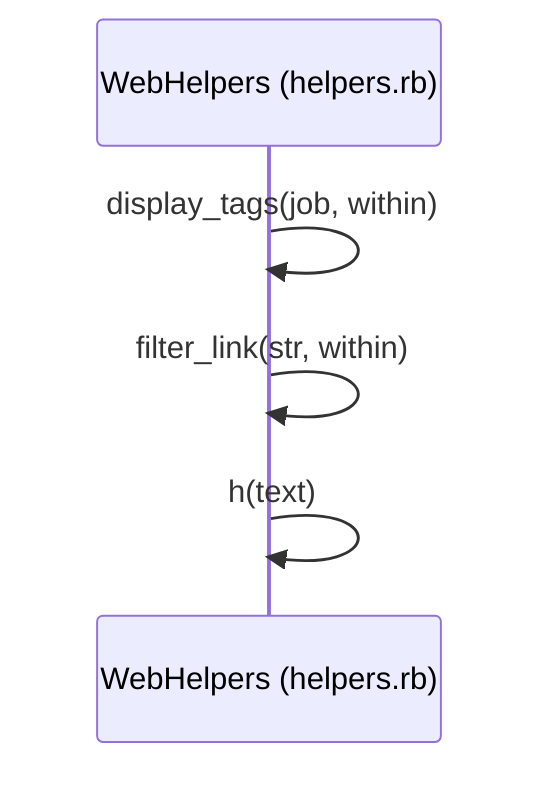
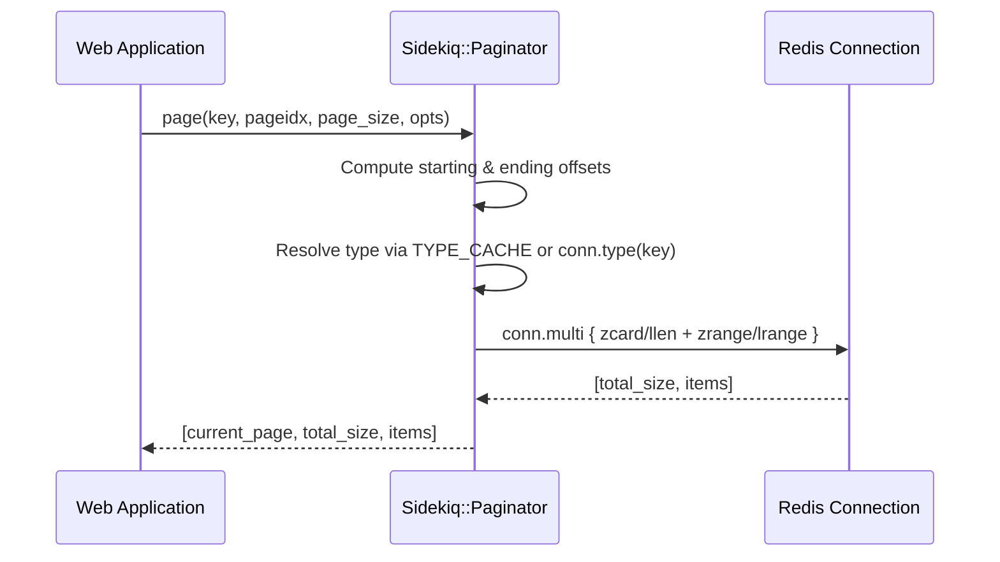
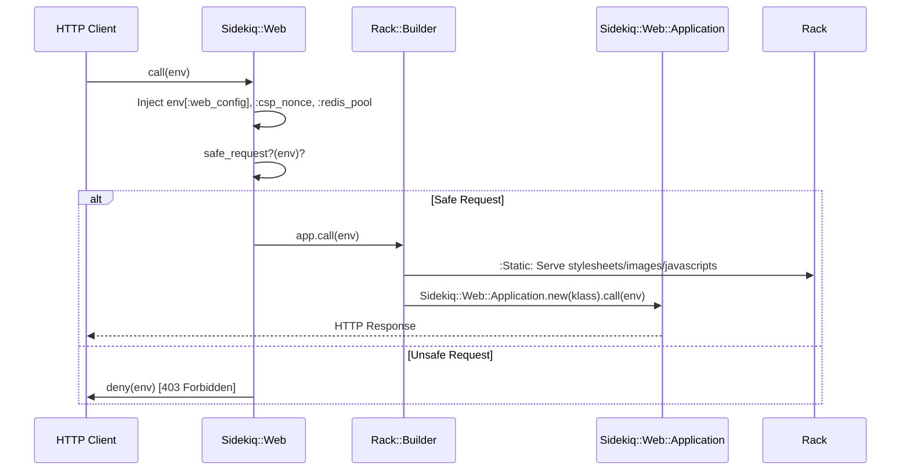
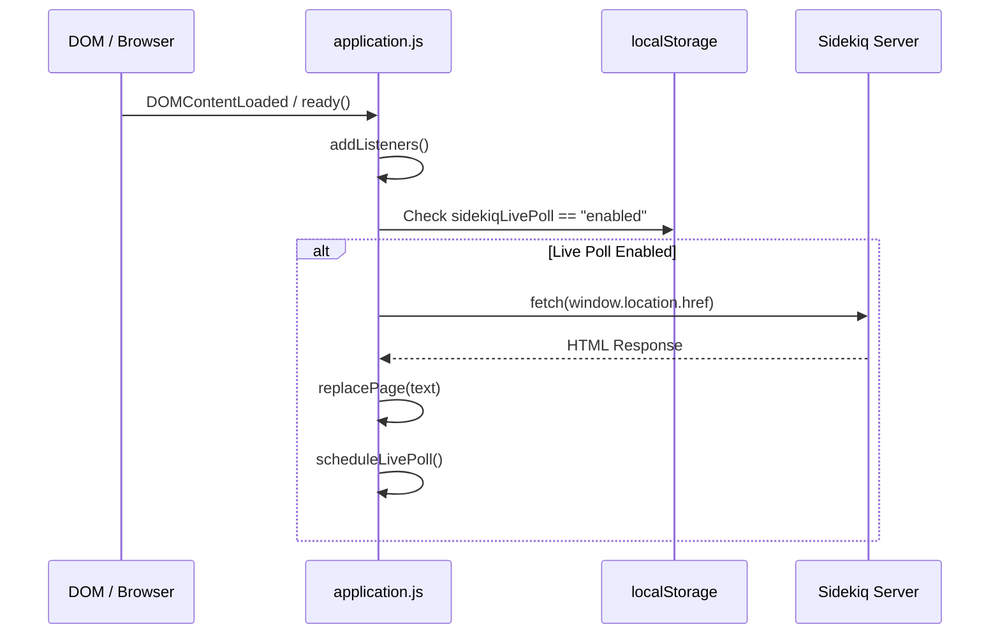

# Web Request Processing

<details>
<summary>Relevant source files</summary>

The following files were used as context for generating this wiki page:

- [lib/sidekiq/web/application.rb](https://github.com/sidekiq/sidekiq/blob/main/lib/sidekiq/web/application.rb)
- [lib/sidekiq/web/helpers.rb](https://github.com/sidekiq/sidekiq/blob/main/lib/sidekiq/web/helpers.rb)
- [lib/sidekiq/web.rb](https://github.com/sidekiq/sidekiq/blob/main/lib/sidekiq/web.rb)
- [lib/sidekiq/tui/tabs/set_tab.rb](https://github.com/sidekiq/sidekiq/blob/main/lib/sidekiq/tui/tabs/set_tab.rb)
- [web/assets/stylesheets/style.css](https://github.com/sidekiq/sidekiq/blob/main/web/assets/stylesheets/style.css)
- [lib/sidekiq/tui.rb](https://github.com/sidekiq/sidekiq/blob/main/lib/sidekiq/tui.rb)
- [lib/sidekiq/web/action.rb](https://github.com/sidekiq/sidekiq/blob/main/lib/sidekiq/web/action.rb)
- [lib/sidekiq/tui/tabs/base_tab.rb](https://github.com/sidekiq/sidekiq/blob/main/lib/sidekiq/tui/tabs/base_tab.rb)
- [web/assets/javascripts/application.js](https://github.com/sidekiq/sidekiq/blob/main/web/assets/javascripts/application.js)
- [lib/sidekiq/web/config.rb](https://github.com/sidekiq/sidekiq/blob/main/lib/sidekiq/web/config.rb)
- [lib/sidekiq/web/router.rb](https://github.com/sidekiq/sidekiq/blob/main/lib/sidekiq/web/router.rb)
- [docs/webui.md](https://github.com/sidekiq/sidekiq/blob/main/docs/webui.md)
- [myapp/config/routes.rb](https://github.com/sidekiq/sidekiq/blob/main/myapp/config/routes.rb)
- [lib/sidekiq/paginator.rb](https://github.com/sidekiq/sidekiq/blob/main/lib/sidekiq/paginator.rb)
</details>

## Overview

Sidekiq web request processing handles incoming HTTP traffic through a modular Rack application and router infrastructure that maps endpoints to specific actions, verifies request safety, and enforces secure content policies. It bridges low-level Rack environments with high-level ERB template rendering, localized view helpers, and robust data pagination to provide a secure and responsive administrative interface.

Sources: [lib/sidekiq/web.rb:81-110](https://github.com/sidekiq/sidekiq/blob/main/lib/sidekiq/web.rb#L81-L110), [lib/sidekiq/web/application.rb:435-463](https://github.com/sidekiq/sidekiq/blob/main/lib/sidekiq/web/application.rb#L435-L463)

By separating query parameters from route parameters and enforcing per-request cryptographic nonces, the processing pipeline prevents parameter tampering and cross-site scripting attacks. This architecture allows developers to mount the management interface seamlessly into Rack or Rails applications while configuring custom middleware stacks and UI extensions.

Sources: [lib/sidekiq/web/action.rb:52-62](https://github.com/sidekiq/sidekiq/blob/main/lib/sidekiq/web/action.rb#L52-L62), [lib/sidekiq/web/application.rb:443-446](https://github.com/sidekiq/sidekiq/blob/main/lib/sidekiq/web/application.rb#L443-L446), [lib/sidekiq/web/config.rb:66-113](https://github.com/sidekiq/sidekiq/blob/main/lib/sidekiq/web/config.rb#L66-L113)

## Rack Application and Request Routing

### Overview

The Sidekiq Web UI processes incoming Rack HTTP requests by passing them through a top-level Rack entry point that initializes request state, verifies request safety against cross-site request forgery, and delegates execution through a configurable middleware stack. Requests ultimately reach `Sidekiq::Web::Application`, where a custom routing engine matches HTTP methods and URI paths to specific endpoint blocks.

Sources: [lib/sidekiq/web.rb:81-97](https://github.com/sidekiq/sidekiq/blob/main/lib/sidekiq/web.rb#L81-L97), [lib/sidekiq/web/application.rb:435-463](https://github.com/sidekiq/sidekiq/blob/main/lib/sidekiq/web/application.rb#L435-L463)

### Request Lifecycle and Call Chain

The execution path for an incoming HTTP request traverses several classes and methods from the initial Rack call down to the executed route action:

1. `Sidekiq::Web.call(env)` — Instantiates or retrieves the singleton web instance and invokes `call(env)`.
2. `Sidekiq::Web#call(env)` — Populates `env[:web_config]`, generates a cryptographic CSP nonce via `SecureRandom.hex(8)`, sets `env[:redis_pool]`, and evaluates `safe_request?(env)`.
3. `Sidekiq::Web#safe_request?(env)` — Returns `true` if `safe_methods?(env)` is true (checking for `GET`, `HEAD`, `OPTIONS`, `TRACE`), or checks whether `env["HTTP_SEC_FETCH_SITE"] == "same-origin"` for state-changing requests; invokes `deny(env)` if safety checks fail.
4. `Rack::Builder#call(env)` — Passes the request through static asset serving (`Rack::Static`) and any user-configured middleware from `cfg.middlewares`.
5. `Sidekiq::Web::Application#call(env)` — Executes `match(env)` to resolve the request against registered routes.
6. `Sidekiq::Web::Router#match(env)` — Downcases the `REQUEST_METHOD`, unescapes `PATH_INFO` using `URI::RFC2396_PARSER.unescape`, and iterates through cached routes.
7. `Sidekiq::Web::Route#match(request_method, path)` — Compares the request path against string patterns or compiled regular expressions, returning named parameter captures as symbol-keyed hashes via `named_captures`.
8. `Sidekiq::Web::Application#call(env)` — If an action matches, assigns route parameters to `env["rack.route_params"]`, sets up thread-local Redis connection pools, and evaluates the action block using `action.instance_exec env, &action.block`.

Sources: [lib/sidekiq/web.rb:81-110](https://github.com/sidekiq/sidekiq/blob/main/lib/sidekiq/web.rb#L81-L110), [lib/sidekiq/web/application.rb:435-463](https://github.com/sidekiq/sidekiq/blob/main/lib/sidekiq/web/application.rb#L435-L463), [lib/sidekiq/web/router.rb:29-46](https://github.com/sidekiq/sidekiq/blob/main/lib/sidekiq/web/router.rb#L29-L46), [lib/sidekiq/web/router.rb:80-88](https://github.com/sidekiq/sidekiq/blob/main/lib/sidekiq/web/router.rb#L80-L88)

> [!WARNING]
> Servers that supply an empty string for root requests (`PATH_INFO == ""`) are normalized to `"/"` during routing evaluation to prevent matching failures.
> Sources: [lib/sidekiq/web/router.rb:33-35](https://github.com/sidekiq/sidekiq/blob/main/lib/sidekiq/web/router.rb#L33-L35)

### Router Methods and HTTP Verbs

The `Router` module provides declarative methods for registering endpoints across supported HTTP request methods. Each method registers a `Route` instance into `route_cache`.

| HTTP Method | Router Helper | Description |
| :--- | :--- | :--- |
| `GET` | `get(path, &block)` | Registers a route for fetching resources or rendering views. |
| `POST` | `post(path, &block)` | Registers a route for submitting form data or triggering state changes. |
| `PUT` | `put(path, &block)` | Registers a route for replacing resources. |
| `PATCH` | `patch(path, &block)` | Registers a route for partial resource updates. |
| `DELETE` | `delete(path, &block)` | Registers a route for removing resources. |
| `HEAD` | `head(path, &block)` | Registers a route for lightweight header checks and connectivity validation. |

Sources: [lib/sidekiq/web/router.rb:10-21](https://github.com/sidekiq/sidekiq/blob/main/lib/sidekiq/web/router.rb#L10-L21), [lib/sidekiq/web/router.rb:48-50](https://github.com/sidekiq/sidekiq/blob/main/lib/sidekiq/web/router.rb#L48-L50)

### Route Compilation and Named Segments

Routes containing dynamic path segments (such as `/queues/:name` or `/morgue/:key`) are compiled into regular expressions. The router detects named segments using the pattern `\/([^\/]*):([^.:$\/]+)`, converting them into named capture groups of the form `/(?<name>[^$/]+)`. When a request path matches a compiled route, captured variables are exposed to the action context as route parameters.

Sources: [lib/sidekiq/web/router.rb:56-76](https://github.com/sidekiq/sidekiq/blob/main/lib/sidekiq/web/router.rb#L56-L76)

```ruby
get "/queues/:name" do
  @name = route_params(:name)
  halt(404) if !@name || @name !~ QUEUE_NAME
  @count = (url_params("count") || 25).to_i
  @queue = Sidekiq::Queue.new(@name)
  (@current_page, @total_size, @jobs) = page("queue:#{@name}", url_params("page"), @count, reverse: url_params("direction") == "asc")
  @jobs = @jobs.map { |msg| Sidekiq::JobRecord.new(msg, @name) }
  erb(:queue)
end
```
Sources: [lib/sidekiq/web/application.rb:135-146](https://github.com/sidekiq/sidekiq/blob/main/lib/sidekiq/web/application.rb#L135-L146)

## Action Context and ERB Template Rendering

### Action Lifecycle and Parameter Handling

When a web route executes, Sidekiq instantiates `Sidekiq::Web::Action` with the current Rack environment and action block. The `Action` class provides helper methods to inspect parameters, manage request halts or redirects, manipulate response headers, and render ERB templates. Parameters are strictly segregated into URL query or form parameters accessed via string keys and path route parameters accessed via symbol keys.

| Parameter Helper | Key Type | Source / Behavior |
| :--- | :--- | :--- |
| `url_params(key)` | String | Accesses query string or form data (`request.params`). Emits a warning if a symbol key is supplied. |
| `route_params(key)` | Symbol | Accesses dynamic path variables from `env["rack.route_params"]`. Emits a warning if a string key is supplied. |
| `params` | Hash | Direct access to `request.params`. Emits a warning discouraging direct usage in favor of `url_params` or `route_params`. |

Sources: [lib/sidekiq/web/action.rb:13-17](https://github.com/sidekiq/sidekiq/blob/main/lib/sidekiq/web/action.rb#L13-L17), [lib/sidekiq/web/action.rb:50-67](https://github.com/sidekiq/sidekiq/blob/main/lib/sidekiq/web/action.rb#L50-L67)

> [!WARNING]
> Accessing `route_params` with a String key or `url_params` with a Symbol key triggers a warning logger call pointing to the caller frame, enforcing parameter type safety across security boundaries.
> Sources: [lib/sidekiq/web/action.rb:50-62](https://github.com/sidekiq/sidekiq/blob/main/lib/sidekiq/web/action.rb#L50-L62)

### ERB Template Rendering Walkthrough

The rendering subsystem processes view templates through `Sidekiq::Web::Action#erb`. The call sequence dynamically compiles template files into action methods and wraps them in the master application layout.

1. `Sidekiq::Web::Action#erb(content, options)` — Inspects whether the content identifier is a Symbol (e.g., `:queue` or `:dashboard`).
2. `Action.class_eval` — If a compiled method `_erb_<content>` is not already defined, reads the file from `views/content.html.erb`, compiles it with `ERB`, and defines `_erb_<content>` dynamically on the `Action` class.
3. `_erb(file, locals)` — Defines singleton methods for any passed local variables on the action instance, then evaluates the ERB template string against the current binding.
4. `_render` — On the initial template rendering pass (`@_erb` is false), sets `@_erb = true`, captures the inner view content, and evaluates the master layout defined at `Sidekiq::Web::LAYOUT` (`views/layout.html.erb`).

Sources: [lib/sidekiq/web/action.rb:116-141](https://github.com/sidekiq/sidekiq/blob/main/lib/sidekiq/web/action.rb#L116-L141), [lib/sidekiq/web/action.rb:161-175](https://github.com/sidekiq/sidekiq/blob/main/lib/sidekiq/web/action.rb#L161-L175)

> [!NOTE]
> The engine parameter for `render` is strictly validated; calling `render` with any engine other than `:erb` raises an immediate runtime error.
> Sources: [lib/sidekiq/web/action.rb:143-147](https://github.com/sidekiq/sidekiq/blob/main/lib/sidekiq/web/action.rb#L143-L177)

## View Helpers and HTML Sanitization

### Overview

The `Sidekiq::WebHelpers` module provides internal helper methods accessible to Web UI pages and extensions. These methods handle asset tagging with CSP nonces, string localization and parsing, safe query generation, and HTML sanitization.

Sources: [lib/sidekiq/web/helpers.rb:6-9](https://github.com/sidekiq/sidekiq/blob/main/lib/sidekiq/web/helpers.rb#L6-L9)

### Call-Chain Execution Walkthrough (`Display_tags -> H`)

Job tags rendered in the UI traverse a precise, verified helper invocation chain from tag formatting down to HTML escaping:

1. `display_tags(job, within)` — Maps over `job.tags`, generating HTML label spans that wrap each generated filter link by invoking `filter_link(tag, within)`.
Sources: [lib/sidekiq/web/helpers.rb:161-165](https://github.com/sidekiq/sidekiq/blob/main/lib/sidekiq/web/helpers.rb#L161-L165)
2. `filter_link(str, within)` — Receives the tag string, sanitizes it via `h(str)`, and constructs an HTML anchor element pointing to the filtered view path.
Sources: [lib/sidekiq/web/helpers.rb:152-159](https://github.com/sidekiq/sidekiq/blob/main/lib/sidekiq/web/helpers.rb#L152-L159)
3. `h(text)` — Escapes special HTML characters via `::CGI.escapeHTML(text.to_s)`. If an invalid byte sequence error is raised, it attempts UTF-16 conversion fallback before retrying.
Sources: [lib/sidekiq/web/helpers.rb:416-422](https://github.com/sidekiq/sidekiq/blob/main/lib/sidekiq/web/helpers.rb#L416-L422)


Sources: [lib/sidekiq/web/helpers.rb:152-165](https://github.com/sidekiq/sidekiq/blob/main/lib/sidekiq/web/helpers.rb#L152-L165), [lib/sidekiq/web/helpers.rb:416-422](https://github.com/sidekiq/sidekiq/blob/main/lib/sidekiq/web/helpers.rb#L416-L422)

> [!WARNING]
> The `html_tag` private helper explicitly documents that keys and values are not escaped during attribute stringification; user input must never be passed directly into attribute hashes.
> Sources: [lib/sidekiq/web/helpers.rb:50-66](https://github.com/sidekiq/sidekiq/blob/main/lib/sidekiq/web/helpers.rb#L50-L66)

### Localization and Asset Tagging

The helper suite includes custom YAML file parsing and preference resolution to support localized UI strings. `strings(lang)` caches parsed locale dictionaries by invoking `parse_yaml(file)` across configured locale paths. User language preference is determined by inspecting the `HTTP_ACCEPT_LANGUAGE` header via `user_preferred_languages`, sorting entries by quality values, and matching against available locales.

Asset helpers inject Content Security Policy nonces automatically. `style_tag` and `script_tag` incorporate `csp_nonce` into generated HTML tag attributes for stylesheets and scripts.

| Helper Method | Arguments | Purpose / Return Value |
| :--- | :--- | :--- |
| `style_tag` | `location, **kwargs` | Generates a stylesheet link tag including CSP nonce and app root path resolution. |
| `script_tag` | `location, **kwargs` | Generates a JavaScript script tag with CSP nonce and source location. |
| `t` | `msg, options = {}` | Translates key `msg` using current locale dictionary with optional string interpolation. |
| `qparams` | `options` | Merges options with request parameters, filtering against `SAFE_QPARAMS`, and serializes to query string. |

Sources: [lib/sidekiq/web/helpers.rb:24-48](https://github.com/sidekiq/sidekiq/blob/main/lib/sidekiq/web/helpers.rb#L24-L48), [lib/sidekiq/web/helpers.rb:68-79](https://github.com/sidekiq/sidekiq/blob/main/lib/sidekiq/web/helpers.rb#L68-L79), [lib/sidekiq/web/helpers.rb:250-257](https://github.com/sidekiq/sidekiq/blob/main/lib/sidekiq/web/helpers.rb#L250-L257), [lib/sidekiq/web/helpers.rb:338-348](https://github.com/sidekiq/sidekiq/blob/main/lib/sidekiq/web/helpers.rb#L338-L348)

## Item Pagination and Page Navigation

### Overview

Pagination logic within the Sidekiq Web UI is centralized in the `Sidekiq::Paginator` module, which is included as a helper in `Sidekiq::Web::Application`. It exposes two primary methods—`page` and `page_items`—to handle data slicing, offset computation, and retrieval across both Redis-backed structures and in-memory collections.
Sources: [lib/sidekiq/web/application.rb:477-477](https://github.com/sidekiq/sidekiq/blob/main/lib/sidekiq/web/application.rb#L477-L477), [lib/sidekiq/paginator.rb:4-76](https://github.com/sidekiq/sidekiq/blob/main/lib/sidekiq/paginator.rb#L4-L76)

### Offset Calculation and Collection Slicing

The pagination engine calculates starting and ending boundaries based on the requested page index and page size. In `page_items`, collections are converted to arrays, and negative page sizes are caught and coerced to prevent slicing crashes.
Sources: [lib/sidekiq/paginator.rb:61-75](https://github.com/sidekiq/paginator.rb#L61-L75)

> [!WARNING]
> A negative `page_size` passed to `page_items` causes `Array#[]` to return `nil` instead of an empty slice, crashing callers iterating over the result (such as the Web UI Busy page). The paginator explicitly guards against this by forcing `page_size = 0` if it falls below zero.
> Sources: [lib/sidekiq/paginator.rb:63-65](https://github.com/sidekiq/paginator.rb#L63-L65)

### Call-Chain Execution Walkthrough

When fetching paginated items from Redis, the `page` method follows a strict execution path to resolve the storage type, execute a multi-command transaction, and return the pagination metadata.

1. `page(key, pageidx, page_size, opts)` — Normalizes `pageidx` to a 1-indexed minimum of `1`, and computes 0-indexed `starting` (`pageidx * page_size`) and `ending` (`starting + page_size - 1`) offsets.
Sources: [lib/sidekiq/paginator.rb:11-18](https://github.com/sidekiq/paginator.rb#L11-L18)
2. `TYPE_CACHE` lookup — Checks the local cache for key types (`dead`, `retry`, `schedule` default to `"zset"`). If uncached and starting with `queue:`, it caches and assigns `"list"` type; otherwise, it queries Redis via `conn.type(key)`.
Sources: [lib/sidekiq/paginator.rb:5-28](https://github.com/sidekiq/paginator.rb#L5-L28)
3. `conn.multi` transaction block — Executes a Redis transaction combining a size retrieval command (`zcard` or `llen`) with a range fetch command (`zrange` or `lrange`), taking into account the `:reverse` option.
Sources: [lib/sidekiq/paginator.rb:33-50](https://github.com/sidekiq/paginator.rb#L33-L50)
4. Array post-processing and return — For lists with reverse ordering, items are reversed in place, and an array containing `[current_page, total_size, items]` is returned.
Sources: [lib/sidekiq/paginator.rb:51-52](https://github.com/sidekiq/paginator.rb#L51-L52)


Sources: [lib/sidekiq/paginator.rb:11-58](https://github.com/sidekiq/sidekiq/blob/main/lib/sidekiq/paginator.rb#L11-L58)

### Paginator Methods and Storage Types

| Method / Constant | Arguments | Purpose / Return Value |
| :--- | :--- | :--- |
| `TYPE_CACHE` | Hash | Caches Redis data types for known keys (`dead`, `retry`, `schedule` as `zset`, queues as `list`). |
| `page` | `key, pageidx = 1, page_size = 25, opts = nil` | Fetches a paginated slice from Redis for zsets or lists, returning `[current_page, total_size, items]`. |
| `page_items` | `items, pageidx = 1, page_size = 25` | Slices an in-memory enumerable collection, returning `[current_page, total_size, sliced_items]`. |

Sources: [lib/sidekiq/paginator.rb:5-59](https://github.com/sidekiq/paginator.rb#L5-L59), [lib/sidekiq/paginator.rb:61-75](https://github.com/sidekiq/paginator.rb#L61-L75)

## Web Configuration and Mount Options

### Overview

The Sidekiq Web UI exposes configuration primitives and mounting options that let developers customize assets, register extensions, adjust middleware stacks, and integrate the dashboard into Rack or Rails applications. Configuration is centralized through `Sidekiq::Web::Config` and managed via a block-based configuration API on `Sidekiq::Web`.
Sources: [lib/sidekiq/web.rb:30-39](https://github.com/sidekiq/sidekiq/blob/main/lib/sidekiq/web.rb#L30-L39), [lib/sidekiq/web/config.rb:17-62](https://github.com/sidekiq/sidekiq/blob/main/lib/sidekiq/web/config.rb#L17-L62)

### Configuration and Extension Registration

The `Sidekiq::Web::Config` class initializes default options such as Firefox Profiler URLs, locale directories, view paths, asset paths, and default navigation tabs. Developers customize these settings by passing a block to `Sidekiq::Web.configure`.
Sources: [lib/sidekiq/web/config.rb:20-62](https://github.com/sidekiq/sidekiq/blob/main/lib/sidekiq/web/config.rb#L20-L62)

> [!NOTE]
> Web UI configuration should be performed inside route definitions (`config/routes.rb`) rather than application initializers. This ensures configuration code is omitted from background worker processes where the Web UI components are never loaded.
> Sources: [lib/sidekiq/web/config.rb:13-16](https://github.com/sidekiq/sidekiq/blob/main/lib/sidekiq/web/config.rb#L13-L16)

Extensions integrate into the Web UI by calling `config.register` (or `config.register_extension`), which maps custom tabs to index routes, adds asset directories to static file serving middleware, and registers the extension class against `Sidekiq::Web::Application`.
Sources: [lib/sidekiq/web/config.rb:83-114](https://github.com/sidekiq/sidekiq/blob/main/lib/sidekiq/web/config.rb#L83-L114)

### Call-Chain Execution Walkthrough

When mounting the Web application, the `Sidekiq::Web` class builds a Rack builder application through a deterministic sequence of initialization steps.

1. `Sidekiq::Web#call(env)` — Injects web configuration, a per-request Content-Security-Policy nonce (`SecureRandom.hex(8)`), and the Redis pool into the Rack environment hash before evaluating request safety.
Sources: [lib/sidekiq/web.rb:92-97](https://github.com/sidekiq/sidekiq/blob/main/lib/sidekiq/web.rb#L92-L97)
2. `Sidekiq::Web#safe_request?(env)` — Inspects request methods and headers; permits safe HTTP methods (`GET`, `HEAD`, `OPTIONS`, `TRACE`) or requests where `HTTP_SEC_FETCH_SITE` equals `"same-origin"`, otherwise invoking `deny(env)`.
Sources: [lib/sidekiq/web.rb:103-115](https://github.com/sidekiq/sidekiq/blob/main/lib/sidekiq/web.rb#L103-L115)
3. `Sidekiq::Web#build(cfg)` — Freezes the configuration object, retrieves custom middleware, and sets up static asset rules with private caching unless `SIDEKIQ_WEB_TESTING` is enabled.
Sources: [lib/sidekiq/web.rb:119-125](https://github.com/sidekiq/sidekiq/blob/main/lib/sidekiq/web.rb#L119-L125)
4. `Rack::Builder#new` — Appends the static asset middleware, iterates over registered custom middlewares using `m.each`, and executes the underlying `Sidekiq::Web::Application`.
Sources: [lib/sidekiq/web.rb:126-133](https://github.com/sidekiq/sidekiq/blob/main/lib/sidekiq/web.rb#L126-L133)


Sources: [lib/sidekiq/web.rb:92-133](https://github.com/sidekiq/sidekiq/blob/main/lib/sidekiq/web.rb#L92-L133)

### Configuration Options and Default Navigation Tabs

| Option / Constant | Default Value / Type | Purpose |
| :--- | :--- | :--- |
| `profile_view_url` | `"https://profiler.firefox.com/public/%s"` | URL template used for viewing performance profiles. |
| `profile_store_url` | `"https://api.profiler.firefox.com/compressed-store"` | Endpoint for storing compressed performance profiles. |
| `DEFAULT_TABS` | Hash (Dashboard, Busy, Queues, Retries, Scheduled, Dead, Metrics, Profiles) | Defines the default navigation tabs displayed in the Web UI header. |
| `custom_job_info_rows` | Array (`[]`) | Container for custom row helper objects added to job tables. |
| `middlewares` | Array (`[]`) | Stores custom Rack middleware entries added via `config.use`. |

Sources: [lib/sidekiq/web.rb:19-28](https://github.com/sidekiq/sidekiq/blob/main/lib/sidekiq/web.rb#L19-L28), [lib/sidekiq/web/config.rb:20-26](https://github.com/sidekiq/sidekiq/blob/main/lib/sidekiq/web/config.rb#L20-L26), [lib/sidekiq/web/config.rb:54-62](https://github.com/sidekiq/sidekiq/blob/main/lib/sidekiq/web/config.rb#L54-L62)

### Application Mounting Example

Sidekiq::Web can be mounted directly inside Rails routing files by passing the Rack application to the `mount` DSL method alongside block-level configuration adjustments.
Sources: [myapp/config/routes.rb:1-13](https://github.com/sidekiq/sidekiq/blob/main/myapp/config/routes.rb#L1-L13)

```ruby
ENV["SIDEKIQ_WEB_TESTING"] = "1"

require "sidekiq/web"
Sidekiq::Web.configure do |config|
  config[:csrf] = false
  config.app_url = "/"
end

Rails.application.routes.draw do
  mount Sidekiq::Web => "/sidekiq"
end
```
Sources: [myapp/config/routes.rb:1-13](https://github.com/sidekiq/sidekiq/blob/main/myapp/config/routes.rb#L1-L13)

## Client Scripts and Asset Management

### Overview

Client-side behavior in Sidekiq is managed through bundled JavaScript and stylesheet definitions that handle DOM event binding, dynamic time formatting, number formatting, live polling, and CSS custom property theming.
Sources: [web/assets/stylesheets/style.css:1-777](https://github.com/sidekiq/sidekiq/blob/main/web/assets/stylesheets/style.css#L1-L777), [web/assets/javascripts/application.js:1-204](https://github.com/sidekiq/sidekiq/blob/main/web/assets/javascripts/application.js#L1-L204)

### Call-Chain Execution Walkthrough

When the browser document finishes loading, initialization routines execute sequentially to configure interactivity, rendering helpers, and background polling loops.

1. `ready(callback)` — Evaluates `document.readyState`. If the document is already interactive or complete, it executes the callback immediately; otherwise, it registers a listener for the `DOMContentLoaded` event.
Sources: [web/assets/javascripts/application.js:7-10](https://github.com/sidekiq/sidekiq/blob/main/web/assets/javascripts/application.js#L7-L10)
2. `addListeners()` — Binds global click handlers for bulk selection checkboxes and data toggles, then initializes shift-clicking, fuzzy timestamps, number precision formatting, progress bars, and live polling states.
Sources: [web/assets/javascripts/application.js:14-45](https://github.com/sidekiq/sidekiq/blob/main/web/assets/javascripts/application.js#L14-L45)
3. `scheduleLivePoll()` — Reads `localStorage.sidekiqTimeInterval` (defaulting to `5000` milliseconds with a strict 2000ms minimum threshold) and schedules the next polling request using `setTimeout`.
Sources: [web/assets/javascripts/application.js:162-166](https://github.com/sidekiq/sidekiq/blob/main/web/assets/javascripts/application.js#L162-L166)
4. `livePollCallback()` — Executes a `fetch` request against `window.location.href`, passes the response through `checkResponse`, extracts text, and hands it to `replacePage` for DOM updating.
Sources: [web/assets/javascripts/application.js:144-153](https://github.com/sidekiq/sidekiq/blob/main/web/assets/javascripts/application.js#L144-L153)
5. `replacePage(text)` — Parses the response markup using `DOMParser`, replaces the `#page` element in the live document, and re-invokes `addListeners()` to re-bind interactive elements.
Sources: [web/assets/javascripts/application.js:168-176](https://github.com/sidekiq/sidekiq/blob/main/web/assets/javascripts/application.js#L168-L176)


Sources: [web/assets/javascripts/application.js:7-176](https://github.com/sidekiq/sidekiq/blob/main/web/assets/javascripts/application.js#L7-L176)

### CSS Variables and Theming Reference

| CSS Variable | Light Mode Default (OKLCH) | Purpose |
| :--- | :--- | :--- |
| `--color-primary` | `oklch(48% 0.2 13)` | Primary brand color used for buttons, active indicators, and borders. |
| `--color-bg` | `oklch(99% 0.005 256)` | Main application background color. |
| `--color-elevated` | `oklch(100% 0 256)` | Background color for cards, tables, headers, and elevated containers. |
| `--color-border` | `oklch(95% 0.005 256)` | Border color for structural elements and table separators. |
| `--color-text` | `oklch(27% 0.005 256)` | Primary text color across body elements. |
| `--color-text-light` | `oklch(52% 0.005 256)` | Secondary muted text color for metadata and labels. |

Sources: [web/assets/stylesheets/style.css:1-15](https://github.com/sidekiq/sidekiq/blob/main/web/assets/stylesheets/style.css#L1-L15), [web/assets/stylesheets/style.css:563-580](https://github.com/sidekiq/sidekiq/blob/main/web/assets/stylesheets/style.css#L563-L580)

> [!NOTE]
> The timeago rendering engine parses localized date tokens across dozens of registered language modules and automatically schedules recursive timeout updates based on the magnitude of elapsed time.
Sources: [web/assets/javascripts/application.js:1-3](https://github.com/sidekiq/sidekiq/blob/main/web/assets/javascripts/application.js#L1-L3)

## Related

- [[Web UI Routing]]
- [[Queue Management API]]

