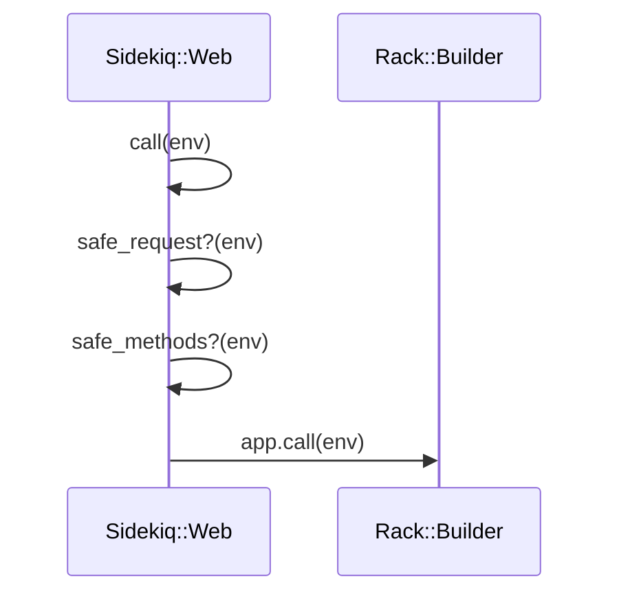
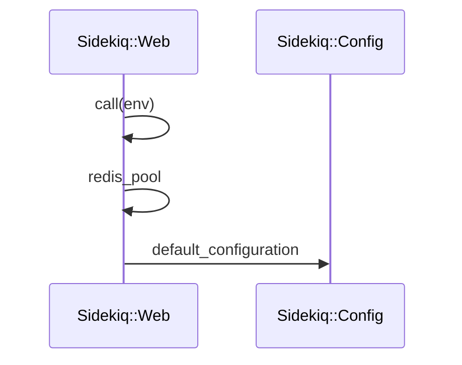
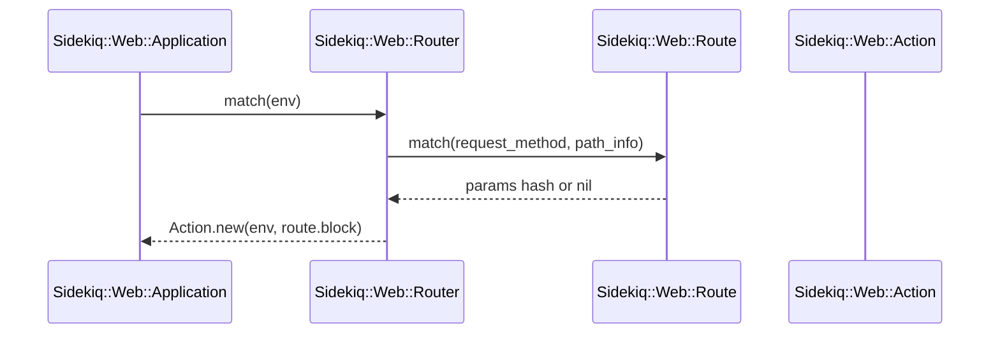

# Web UI Routing

<details>
<summary>Relevant source files</summary>

The following files were used as context for generating this wiki page:

- [lib/sidekiq/web/application.rb](https://github.com/sidekiq/sidekiq/blob/main/lib/sidekiq/web/application.rb)
- [lib/sidekiq/tui.rb](https://github.com/sidekiq/sidekiq/blob/main/lib/sidekiq/tui.rb)
- [lib/sidekiq/web/helpers.rb](https://github.com/sidekiq/sidekiq/blob/main/lib/sidekiq/web/helpers.rb)
- [lib/sidekiq/web.rb](https://github.com/sidekiq/sidekiq/blob/main/lib/sidekiq/web.rb)
- [lib/sidekiq/web/action.rb](https://github.com/sidekiq/sidekiq/blob/main/lib/sidekiq/web/action.rb)
- [lib/sidekiq/tui/tabs/home.rb](https://github.com/sidekiq/sidekiq/blob/main/lib/sidekiq/tui/tabs/home.rb)
- [lib/sidekiq/web/config.rb](https://github.com/sidekiq/sidekiq/blob/main/lib/sidekiq/web/config.rb)
- [lib/sidekiq/web/router.rb](https://github.com/sidekiq/sidekiq/blob/main/lib/sidekiq/web/router.rb)
- [myapp/config/routes.rb](https://github.com/sidekiq/sidekiq/blob/main/myapp/config/routes.rb)
- [docs/webui.md](https://github.com/sidekiq/sidekiq/blob/main/docs/webui.md)
- [myapp/app/controllers/application_controller.rb](https://github.com/sidekiq/sidekiq/blob/main/myapp/app/controllers/application_controller.rb)
- [lib/sidekiq/tui/tabs.rb](https://github.com/sidekiq/sidekiq/blob/main/lib/sidekiq/tui/tabs.rb)
- [docs/menu.md](https://github.com/sidekiq/sidekiq/blob/main/docs/menu.md)
- [myapp/config/application.rb](https://github.com/sidekiq/sidekiq/blob/main/myapp/config/application.rb)
- [bare/boot.rb](https://github.com/sidekiq/sidekiq/blob/main/bare/boot.rb)
- [myapp/config/puma.rb](https://github.com/sidekiq/sidekiq/blob/main/myapp/config/puma.rb)
- [myapp/config/environment.rb](https://github.com/sidekiq/sidekiq/blob/main/myapp/config/environment.rb)
- [myapp/config/boot.rb](https://github.com/sidekiq/sidekiq/blob/main/myapp/config/boot.rb)
- [myapp/app/helpers/application_helper.rb](https://github.com/sidekiq/sidekiq/blob/main/myapp/app/helpers/application_helper.rb)
- [docs/internals.md](https://github.com/sidekiq/sidekiq/blob/main/docs/internals.md)
- [lib/sidekiq.rb](https://github.com/sidekiq/sidekiq/blob/main/lib/sidekiq.rb)
</details>

## Overview

Sidekiq provides an interactive administrative environment through its Rack-based Web interface and complementary Terminal User Interface (TUI), enabling real-time monitoring and management of background job queues, processes, and worker sets directly from Redis data structures. Web UI routing handles HTTP request dispatching, verb matching, parameter separation, and security verification within a modular Sinatra-like action and routing architecture.
Sources: [lib/sidekiq/web/application.rb](https://github.com/sidekiq/sidekiq/blob/main/lib/sidekiq/web/application.rb#L435-L463), [lib/sidekiq/web/router.rb](https://github.com/sidekiq/sidekiq/blob/main/lib/sidekiq/web/router.rb#L9-L46), [lib/sidekiq/tui.rb](https://github.com/sidekiq/sidekiq/blob/main/lib/sidekiq/tui.rb#L48-L57)

This system establishes clear boundaries for framework integration, routing patterns, and view rendering helpers, ensuring that administrative dashboards and terminal views can safely query operational state, execute job lifecycle actions, and maintain secure content policies across diverse deployment contexts.
Sources: [lib/sidekiq/web/application.rb](https://github.com/sidekiq/sidekiq/blob/main/lib/sidekiq/web/application.rb#L439-L446), [lib/sidekiq/web/action.rb](https://github.com/sidekiq/web/action.rb#L116-L141), [lib/sidekiq/tui.rb](https://github.com/sidekiq/sidekiq/blob/main/lib/sidekiq/tui.rb#L59-L155)

## Rack Application and Dispatch Entry

### Overview

The Sidekiq Web UI operates as a standard Rack application, providing a modular interface for request dispatching, security verification, and middleware integration. The request lifecycle begins when the Rack server invokes the main entry point, where per-request environmental configuration, CSP nonces, and Redis connection pools are initialized before evaluating request safety.
Sources: [lib/sidekiq/web.rb](https://github.com/sidekiq/sidekiq/blob/main/lib/sidekiq/web.rb#L81-L116)

### Request Dispatch and Safety Verification

The request dispatch entry chain coordinates request validation and thread-local state binding through the exact verified call chain: `call` → `safe_request?` → `safe_methods?`. When a request arrives, `call(env)` initializes web configuration, sets CSP nonces and Redis pools, and delegates to `safe_request?(env)`. `safe_request?` evaluates whether the request is safe by calling `safe_methods?(env)` and verifying the `HTTP_SEC_FETCH_SITE` header.
Sources: [lib/sidekiq/web.rb](https://github.com/sidekiq/sidekiq/blob/main/lib/sidekiq/web.rb#L91-L110)

The primary execution walkthrough follows this sequence, exactly matching the verified call chain:
1. `call(env)` (`lib/sidekiq/web.rb#L91-L96`) — Initializes `env[:web_config]`, generates an 8-byte hexadecimal CSP nonce via `SecureRandom.hex(8)`, fetches the Redis pool via `redis_pool`, and passes the environment to `safe_request?`.
   Sources: [lib/sidekiq/web.rb](https://github.com/sidekiq/sidekiq/blob/main/lib/sidekiq/web.rb#L91-L96)
2. `safe_request?(env)` (`lib/sidekiq/web.rb#L106-L109`) — Evaluates request safety by invoking `safe_methods?` and checking same-origin constraints.
   Sources: [lib/sidekiq/web.rb](https://github.com/sidekiq/sidekiq/blob/main/lib/sidekiq/web.rb#L106-L109)
3. `safe_methods?(env)` (`lib/sidekiq/web.rb#L102-L104`) — Inspects the request method against allowed read-only verbs (`GET`, `HEAD`, `OPTIONS`, `TRACE`).
   Sources: [lib/sidekiq/web.rb](https://github.com/sidekiq/sidekiq/blob/main/lib/sidekiq/web.rb#L102-L104)


Sources: [lib/sidekiq/web.rb](https://github.com/sidekiq/sidekiq/blob/main/lib/sidekiq/web.rb#L91-L96), [lib/sidekiq/web.rb](https://github.com/sidekiq/sidekiq/blob/main/lib/sidekiq/web.rb#L102-L109)

> [!WARNING]
> Non-safe HTTP methods (such as `POST`, `PUT`, or `DELETE`) that lack a matching `HTTP_SEC_FETCH_SITE` header set to `same-origin` are rejected with a `403 Forbidden` response and trigger a warning log entry.
Sources: [lib/sidekiq/web.rb](https://github.com/sidekiq/sidekiq/blob/main/lib/sidekiq/web.rb#L107-L115)

### Redis Pool Resolution and Middleware Stack

The second critical call chain resolves the Redis connection pool and constructs the Rack middleware stack for the web application. 
Sources: [lib/sidekiq/web.rb](https://github.com/sidekiq/sidekiq/blob/main/lib/sidekiq/web.rb#L58-L60), [lib/sidekiq/web.rb](https://github.com/sidekiq/sidekiq/blob/main/lib/sidekiq/web.rb#L119-L134)

The resolution walkthrough proceeds as follows:
1. `call(env)` (`lib/sidekiq/web.rb#L91-L96`) — References `self.class.redis_pool` to retrieve the active connection pool for the request environment.
   Sources: [lib/sidekiq/web.rb](https://github.com/sidekiq/sidekiq/blob/main/lib/sidekiq/web.rb#L91-L96)
2. `redis_pool` (`lib/sidekiq/web.rb#L58-L60`) — Checks instance variable `@pool`; if nil, falls back to `Sidekiq.default_configuration.redis_pool`.
   Sources: [lib/sidekiq/web.rb](https://github.com/sidekiq/sidekiq/blob/main/lib/sidekiq/web.rb#L58-L60)
3. `default_configuration` (`lib/sidekiq.rb#L96-L98`) — Accesses the global `Sidekiq::Config` instance to obtain default operational parameters and connection settings.
   Sources: [lib/sidekiq.rb](https://github.com/sidekiq/sidekiq/blob/main/lib/sidekiq.rb#L96-L98)


Sources: [lib/sidekiq/web.rb](https://github.com/sidekiq/sidekiq/blob/main/lib/sidekiq/web.rb#L58-L60, L91-L96), [lib/sidekiq.rb](https://github.com/sidekiq/sidekiq/blob/main/lib/sidekiq.rb#L96-L98)

> [!NOTE]
> Thread-local storage (`Thread.current[:sidekiq_redis_pool]`) is assigned per request during application execution to ensure thread-safe Redis access across concurrent worker threads and application actions.
Sources: [lib/sidekiq/web/application.rb](https://github.com/sidekiq/sidekiq/blob/main/lib/sidekiq/web/application.rb#L431-L433, L447-L452)

### Rack Middleware and Asset Configuration

The web application builder constructs a `Rack::Builder` pipeline incorporating static asset serving, custom user-defined middlewares, and the underlying `Sidekiq::Web::Application` endpoint.
Sources: [lib/sidekiq/web.rb](https://github.com/sidekiq/sidekiq/blob/main/lib/sidekiq/web.rb#L119-L134)

| Component / Setting | Default Value / Rule | Purpose |
| :--- | :--- | :--- |
| `Rack::Static` URLs | `["/stylesheets", "/images", "/javascripts"]` | Mounts static web UI asset paths from the configured assets directory. |
| Cache Control Rules | `[:all, {"cache-control" => "private, max-age=86400"}]` | Applies browser caching rules to static assets when testing mode is disabled. |
| Safe HTTP Methods | `%w[GET HEAD OPTIONS TRACE]` | Defines request methods permitted without origin header verification. |
| Content Security Policy | `CSP_HEADER_TEMPLATE` | Mandates strict execution policies using per-request cryptographic nonces. |
Sources: [lib/sidekiq/web/application.rb](https://github.com/sidekiq/sidekiq/blob/main/lib/sidekiq/web/application.rb#L14-L28), [lib/sidekiq/web.rb](https://github.com/sidekiq/sidekiq/blob/main/lib/sidekiq/web.rb#L102-L104), [lib/sidekiq/web.rb](https://github.com/sidekiq/sidekiq/blob/main/lib/sidekiq/web.rb#L123-L130)

## Web Router and Method Matching

### Overview

The `Sidekiq::Web::Router` module provides a lightweight DSL for declaring endpoints across HTTP verbs and dynamically matching incoming requests to registered routes. `Sidekiq::Web::Application` extends and includes `Router`, allowing HTTP methods such as `get`, `post`, `put`, `patch`, `delete`, and `head` to map route patterns to execution blocks.
Sources: [lib/sidekiq/web/application.rb](https://github.com/sidekiq/sidekiq/blob/main/lib/sidekiq/web/application.rb#L8-L10), [lib/sidekiq/web/router.rb](https://github.com/sidekiq/sidekiq/blob/main/lib/sidekiq/web/router.rb#L9-L21)

### Route Registration and Compilation

Endpoints are registered via verb-specific methods like `get(path, &block)` or `post(path, &block)`, which delegate to `route(*methods, path, &block)`. This method validates that the target request method exists within `route_cache`, instantiates a `Sidekiq::Route`, and pushes it onto the respective method's route array.
Sources: [lib/sidekiq/web/router.rb](https://github.com/sidekiq/sidekiq/blob/main/lib/sidekiq/web/router.rb#L10-L27)

Route compilation handles static paths as well as dynamic path segments defined using the colon syntax (e.g., `/queues/:name`). The `NAMED_SEGMENTS_PATTERN` constant matches patterns like `/([^\/]*):([^.:$\/]+)`, translating them into named capture groups in a compiled regular expression:

```ruby
NAMED_SEGMENTS_PATTERN = /\/([^\/]*):([^.:$\/]+)/
```
Sources: [lib/sidekiq/web/router.rb](https://github.com/sidekiq/sidekiq/blob/main/lib/sidekiq/web/router.rb#L56-L76)

| HTTP Verb Method | Underlying Method Call | Route Cache Key | Target Action Handling |
| :--- | :--- | :--- | :--- |
| `head(path, &block)` | `route(:head, path, &block)` | `:head` | Executes lightweight health-check or heartbeat actions. |
| `get(path, &block)` | `route(:get, path, &block)` | `:get` | Handles data retrieval, page rendering, and JSON stats APIs. |
| `post(path, &block)` | `route(:post, path, &block)` | `:post` | Processes mutations, retries, deletions, and queue commands. |
| `put(path, &block)` | `route(:put, path, &block)` | `:put` | Reserved for resource updates. |
| `patch(path, &block)` | `route(:patch, path, &block)` | `:patch` | Reserved for partial resource updates. |
| `delete(path, &block)` | `route(:delete, path, &block)` | `:delete` | Reserved for resource removal endpoints. |
Sources: [lib/sidekiq/web/router.rb](https://github.com/sidekiq/sidekiq/blob/main/lib/sidekiq/web/router.rb#L10-L21, L48-L50)

### Request Matching and Dispatch Execution

When an HTTP request arrives, `Sidekiq::Web::Application#call(env)` invokes `match(env)` to resolve the request against compiled routes. 
Sources: [lib/sidekiq/web/application.rb](https://github.com/sidekiq/sidekiq/blob/main/lib/sidekiq/web/application.rb#L435-L436), [lib/sidekiq/web/router.rb](https://github.com/sidekiq/sidekiq/blob/main/lib/sidekiq/web/router.rb#L29-L46)

The execution call chain proceeds as follows:
1. `call(env)` (`lib/sidekiq/web/application.rb#L435-L436`) — Receives the Rack environment and delegates to `match(env)`.
   Sources: [lib/sidekiq/web/application.rb](https://github.com/sidekiq/sidekiq/blob/main/lib/sidekiq/web/application.rb#L435-L436)
2. `match(env)` (`lib/sidekiq/web/router.rb#L29-L46`) — Extracts and downcases `REQUEST_METHOD`, unescapes `PATH_INFO` using `URI::RFC2396_PARSER`, and searches `route_cache[request_method]`.
   Sources: [lib/sidekiq/web/router.rb](https://github.com/sidekiq/sidekiq/blob/main/lib/sidekiq/web/router.rb#L29-L46)
3. `route.match(request_method, path)` (`lib/sidekiq/web/router.rb#L80-L88`) — Evaluates the compiled matcher against the request path; if matched, transforms named captures into symbol-keyed parameters.
   Sources: [lib/sidekiq/web/router.rb](https://github.com/sidekiq/sidekiq/blob/main/lib/sidekiq/web/router.rb#L80-L88)
4. `Action.new(env, route.block)` (`lib/sidekiq/web/router.rb#L41`) — Instantiates a new action context with the request environment and matched block if a route match succeeds, returning `nil` otherwise.
   Sources: [lib/sidekiq/web/router.rb](https://github.com/sidekiq/sidekiq/blob/main/lib/sidekiq/web/router.rb#L39-L45)


Sources: [lib/sidekiq/web/application.rb](https://github.com/sidekiq/sidekiq/blob/main/lib/sidekiq/web/application.rb#L435-L436), [lib/sidekiq/web/router.rb](https://github.com/sidekiq/sidekiq/blob/main/lib/sidekiq/web/router.rb#L29-L46, L80-L88)

> [!WARNING]
> Servers that provide an empty string for the root path are explicitly normalized to `"/"` within `match(env)` before route lookup occurs.
Sources: [lib/sidekiq/web/router.rb](https://github.com/sidekiq/sidekiq/blob/main/lib/sidekiq/web/router.rb#L33-L36)

Once an `Action` is returned, `Application#call` sets up response headers, assigns the thread-local Redis pool, and executes the action block via `action.instance_exec env, &action.block`.
Sources: [lib/sidekiq/web/application.rb](https://github.com/sidekiq/sidekiq/blob/main/lib/sidekiq/web/application.rb#L439-L453)

## Framework Mounting and Web Configuration

### Framework Mounting and Web Configuration

Sidekiq integrates directly with Ruby on Web frameworks such as Ruby on Rails by mounting its Rack application inside routing definitions via `mount Sidekiq::Web => "/sidekiq"`. Configuration of the web interface occurs through a dedicated block on `Sidekiq::Web.configure`, which yields a `Sidekiq::Web::Config` instance. This design avoids global class-level mutations, making it safe to specify options, register extensions, and insert custom Rack middleware directly within route declaration files.
Sources: [lib/sidekiq/web/config.rb](https://github.com/sidekiq/sidekiq/blob/main/lib/sidekiq/web/config.rb#L3-L16), [myapp/config/routes.rb](https://github.com/sidekiq/sidekiq/blob/main/myapp/config/routes.rb#L4-L13)

The `Sidekiq::Web::Config` initialization routine populates default settings, localizations, views, assets paths, and tabs, while establishing delegators for hash operations against its internal options store. 
Sources: [lib/sidekiq/web/config.rb](https://github.com/sidekiq/sidekiq/blob/main/lib/sidekiq/web/config.rb#L17-L68)

| Option / Attribute | Type | Default Value | Purpose |
| :--- | :--- | :--- | :--- |
| `profile_view_url` | String | `"https://profiler.firefox.com/public/%s"` | Target URL for viewing performance profiles directly in the UI. |
| `profile_store_url` | String | `"api.profiler.firefox.com/compressed-store"` | Endpoint used for compressed profile uploads. |
| `custom_job_info_rows` | Array | `[]` | Allows registering custom row helpers to inject external links into job tables. |
| `tabs` | Hash | `DEFAULT_TABS.dup` | Maps UI tab labels to their respective index routes. |
| `locales` | Array | `LOCALES` | Collection of directory paths containing translation files. |
| `views` | Array | `VIEWS` | Collection of directory paths containing ERB template views. |
| `middlewares` | Array | `[]` | Storage list for custom Rack middleware inserted via `use`. |
| `app_url` | String / nil | `nil` | Configures the "Back to App" link target URL displayed in the header. |
| `assets_path` | String | `ASSETS` | Root asset path for the web application interface. |
Sources: [lib/sidekiq/web/config.rb](https://github.com/sidekiq/sidekiq/blob/main/lib/sidekiq/web/config.rb#L20-L62)

> [!NOTE]
> Web configuration should be placed within route files like `config/routes.rb` rather than initializers, because `Sidekiq::Web` should not be loaded in background worker processes where the web UI is unnecessary.
Sources: [lib/sidekiq/web/config.rb](https://github.com/sidekiq/sidekiq/blob/main/lib/sidekiq/web/config.rb#L13-L16)

Custom third-party extensions and Rack middleware are registered using configuration methods on the config instance. The execution chain for extension registration proceeds as follows:
1. `register_extension(extclass, name:, tab:, index:, ...)` (`lib/sidekiq/web/config.rb#L83-L84`) — Accepts the extension class, namespace name, tab labels, route paths, and optional asset parameters.
   Sources: [lib/sidekiq/web/config.rb](https://github.com/sidekiq/sidekiq/blob/main/lib/sidekiq/web/config.rb#L83-L84)
2. `tab.zip(index)` (`lib/sidekiq/web/config.rb#L85-L88`) — Iterates over corresponding tab labels and index paths, populating the `tabs` hash.
   Sources: [lib/sidekiq/web/config.rb](https://github.com/sidekiq/sidekiq/blob/main/lib/sidekiq/web/config.rb#L85-L88)
3. Asset mounting check (`lib/sidekiq/web/config.rb#L89-L108`) — If `root_dir` and `asset_paths` are provided, compiles static asset properties and pushes a `Rack::Static` middleware tuple onto the `middlewares` stack with caching header rules.
   Sources: [lib/sidekiq/web/config.rb](https://github.com/sidekiq/sidekiq/blob/main/lib/sidekiq/web/config.rb#L89-L108)
4. `extclass.registered(Web::Application)` (`lib/sidekiq/web/config.rb#L112`) — Invokes the registration callback on the target extension class to mount its HTTP actions into the application.
   Sources: [lib/sidekiq/web/config.rb](https://github.com/sidekiq/sidekiq/blob/main/lib/sidekiq/web/config.rb#L112)

```ruby
require "sidekiq/web"
Sidekiq::Web.configure do |config|
  config[:csrf] = false
  config.app_url = "/"
  config.register(MyExtension, name: "myext", tab: "TabName", index: "tabpage/")
  config.use Some::Rack::Middleware
end
```
Sources: [lib/sidekiq/web/config.rb](https://github.com/sidekiq/sidekiq/blob/main/lib/sidekiq/web/config.rb#L8-L11, L34-L38), [myapp/config/routes.rb](https://github.com/sidekiq/sidekiq/blob/main/myapp/config/routes.rb#L4-L9), [docs/webui.md](https://github.com/sidekiq/sidekiq/blob/main/docs/webui.md#L35-L40)

## Action Execution and View Helpers

### Overview

The `Sidekiq::Web::Action` class provides execution context and instance methods for executing ERB templates and handling HTTP requests. When an action executes, it maintains request state through `env`, wraps the underlying Rack request, manages response headers, and offers helpers for parameter access and redirection. Concurrently, module `Sidekiq::WebHelpers` extends views and actions with localization utilities, datastore version detection, tag filtering, asset tag builders, and Redis metric collectors.
Sources: [lib/sidekiq/web/helpers.rb](https://github.com/sidekiq/sidekiq/blob/main/lib/sidekiq/web/helpers.rb#L6-L15), [lib/sidekiq/web/action.rb](https://github.com/sidekiq/sidekiq/blob/main/lib/sidekiq/web/action.rb#L5-L25)

### Action Context and Parameter Handling

`Sidekiq::Web::Action` exposes helpers to inspect incoming parameters while enforcing strict separation between query parameters and route parameters. Query parameters are retrieved via `url_params(key)` using string keys, while route parameters from URL paths (such as `/metrics/:name`) are retrieved via `route_params(key)` using symbol keys. Direct access to `params` raises a warning encouraging developers to use the specific parameter accessors.
Sources: [lib/sidekiq/web/action.rb](https://github.com/sidekiq/sidekiq/blob/main/lib/sidekiq/web/action.rb#L50-L68)

| Parameter Method | Key Type | Source | Warning Condition |
| :--- | :--- | :--- | :--- |
| `url_params(key)` | String | `request.params` | Warns if `key` is passed as a Symbol. |
| `route_params(key)` | Symbol | `env["rack.route_params"]` | Warns if `key` is passed as a String. |
| `params` | Hash | `request.params` | Always warns against direct Rack parameter access. |
Sources: [lib/sidekiq/web/action.rb](https://github.com/sidekiq/sidekiq/blob/main/lib/sidekiq/web/action.rb#L50-L68)

> [!WARNING]
> Session storage requires a valid Rack session middleware. If `session` is accessed when no session middleware is present, it raises a descriptive error outlining how to mount `Sidekiq::Web` inside Rails application routes or how to configure `Rack::Session::Cookie` in a bare Rack application.
Sources: [lib/sidekiq/web/action.rb](https://github.com/sidekiq/sidekiq/blob/main/lib/sidekiq/web/action.rb#L69-L95)

### Template Rendering and Execution

Template rendering and action execution follow an explicit lifecycle managed within `Sidekiq::Web::Action`. The rendering process compiles ERB templates into methods and wraps them in the layout template.
Sources: [lib/sidekiq/web/action.rb](https://github.com/sidekiq/sidekiq/blob/main/lib/sidekiq/web/action.rb#L116-L147)

The call-chain execution walkthrough for rendering an ERB template proceeds through the following steps:
1. `erb(content, options = {})` (`lib/sidekiq/web/action.rb#L116-L131`) — Evaluates whether the content is a Symbol; if uncompiled, it reads the template file from `options[:views] || Web.views`, compiles its source via `ERB.new`, and dynamically defines a helper method `_erb_#{content}` via class evaluation.
   Sources: [lib/sidekiq/web/action.rb](https://github.com/sidekiq/sidekiq/blob/main/lib/sidekiq/web/action.rb#L116-L131)
2. `_erb(file, locals)` (`lib/sidekiq/web/action.rb#L161-L169`) — Assigns local variables to singleton methods on the action instance and invokes `send(:"_erb_#{file}")` or renders string content using `ERB.new(file).result(binding)`.
   Sources: [lib/sidekiq/web/action.rb](https://github.com/sidekiq/sidekiq/blob/main/lib/sidekiq/web/action.rb#L161-L169)
3. `_render` (`lib/sidekiq/web/action.rb#L171-L175`) — If `i@_erb` is false, wraps the rendered content block within the main layout file loaded from `::Sidekiq::Web::LAYOUT`.
   Sources: [lib/sidekiq/web/action.rb](https://github.com/sidekiq/sidekiq/blob/main/lib/sidekiq/web/action.rb#L133-L141, L171-L175)

### View and UI Utility Helpers

`Sidekiq::WebHelpers` provides helper methods for formatting memory, localizing text, building HTML tags with content security policy nonces, and querying Redis metadata. Datastore version detection inspects `redis_info` keys to distinguish between Dragonfly, Valkey, and Redis.
Sources: [lib/sidekiq/web/helpers.rb](https://github.com/sidekiq/sidekiq/blob/main/lib/sidekiq/web/helpers.rb#L6-L22, L40-L48, L400-L415)

Asset builders incorporate CSP nonces automatically: `style_tag` and `script_tag` accept location paths and kwargs, resolving relative paths against `root_path` and injecting attributes including `nonce: csp_nonce`.
Sources: [lib/sidekiq/web/helpers.rb](https://github.com/sidekiq/sidekiq/blob/main/lib/sidekiq/web/helpers.rb#L24-L48)

```ruby
class CustomAction < Sidekiq::Web::Action
  def dispatch
    json({ status: "ok", version: product_version, store: store_name })
  end
end
```
Sources: [lib/sidekiq/web/action.rb](https://github.com/sidekiq/sidekiq/blob/main/lib/sidekiq/web/action.rb#L149-L153), [lib/sidekiq/web/helpers.rb](https://github.com/sidekiq/sidekiq/blob/main/lib/sidekiq/web/helpers.rb#L10-L15, L443-L445)

## Terminal Interface Navigation and Views

### Overview

Sidekiq provides an interactive terminal user interface (TUI) built on top of `ratatui_ruby` (`gem "ratatui_ruby", ">=1.4.0"`), allowing operators to inspect queues, jobs, metrics, and redis health directly from the console. Managed centrally by `Sidekiq::TUI`, the application handles internationalization via YAML locale files, frame-rate tracking, tab routing, and event polling.
Sources: [lib/sidekiq/tui.rb](https://github.com/sidekiq/sidekiq/blob/main/lib/sidekiq/tui.rb#L1-L36)

### Tab Management and Navigation

The terminal UI organizes views into distinct navigational tabs defined in `Sidekiq::TUI::Tabs::All`. The registered tab classes include `Home`, `Busy`, `Queues`, `Scheduled`, `Retries`, `Dead`, and `Metrics`.
Sources: [lib/sidekiq/tui/tabs.rb](https://github.com/sidekiq/sidekiq/blob/main/lib/sidekiq/tui/tabs.rb#L1-L15)

Users navigate horizontally across tabs or interact with table rows using keyboard controls. The tab switching and event handling lifecycle executes through specific controller operations:
1. `handle_input` (`lib/sidekiq/tui.rb#L236-L259`) — Polls incoming terminal events via `@tui.poll_event(timeout: 0.1)` to throttle CPU usage.
   Sources: [lib/sidekiq/tui.rb](https://github.com/sidekiq/sidekiq/blob/main/lib/sidekiq/tui.rb#L236-L259)
2. `navigate(direction)` (`lib/sidekiq/tui.rb#L313-L317`) — Computes the new active tab index using `(index_change = (direction == :right) ? 1 : -1)`, updates `@current`, and calls `@current.reset_data` to reset state.
   Sources: [lib/sidekiq/tui.rb](https://github.com/sidekiq/sidekiq/blob/main/lib/sidekiq/tui.rb#L313-L317)
3. Control matching (`lib/sidekiq/tui.rb#L245-L253`) — Evaluates matching keyboard codes and modifiers against `current_tab.controls`, executing the bound action block and conditionally refreshing data if `control[:refresh]` is set.
   Sources: [lib/sidekiq/tui.rb](https://github.com/sidekiq/sidekiq/blob/main/lib/sidekiq/tui.rb#L245-L253)

> [!WARNING]
> Terminal logging must be redirected to a dedicated log file (`tui.log`) because standard output and terminal control are entirely managed by the `Ratatui` rendering engine during execution loops.
Sources: [lib/sidekiq/tui.rb](https://github.com/sidekiq/sidekiq/blob/main/lib/sidekiq/tui.rb#L48-L51)

### Console Data Display and Metrics Rendering

The `Sidekiq::TUI::Tabs::Home` tab renders real-time execution statistics, delta charts, and Redis instance information. Data updates occur periodically via `refresh_data`, tracking processed and failed job counts alongside delta shifts across a 50-item rolling window.
Sources: [lib/sidekiq/tui/tabs/home.rb](https://github.com/sidekiq/sidekiq/blob/main/lib/sidekiq/tui/tabs/home.rb#L7-L44)

| Tab Class | Purpose / Display Content | Sources |
| :--- | :--- | :--- |
| `Sidekiq::TUI::Tabs::Home` | Dashboard statistics, rolling line charts for processed/failed deltas, and Redis metadata. | [lib/sidekiq/tui/tabs/home.rb](https://github.com/sidekiq/sidekiq/blob/main/lib/sidekiq/tui/tabs/home.rb#L6-L111) |
| `Sidekiq::TUI::Tabs::Busy` | Inspects currently executing jobs across threads and capsules. | [lib/sidekiq/tui/tabs.rb](https://github.com/sidekiq/sidekiq/blob/main/lib/sidekiq/tui/tabs.rb#L1-L15) |
| `Sidekiq::TUI::Tabs::Queues` | Displays queue sizes, latencies, and priority metrics. | [lib/sidekiq/tui/tabs.rb](https://github.com/sidekiq/sidekiq/blob/main/lib/sidekiq/tui/tabs.rb#L1-L15) |
| `Sidekiq::TUI::Tabs::Scheduled` | Manages jobs queued for future execution. | [lib/sidekiq/tui/tabs.rb](https://github.com/sidekiq/sidekiq/blob/main/lib/sidekiq/tui/tabs.rb#L1-L15) |
| `Sidekiq::TUI::Tabs::Retries` | Inspects failed jobs awaiting retry attempts. | [lib/sidekiq/tui/tabs.rb](https://github.com/sidekiq/sidekiq/blob/main/lib/sidekiq/tui/tabs.rb#L1-L15) |
| `Sidekiq::TUI::Tabs::Dead` | Manages dead job sets (exhausted retries). | [lib/sidekiq/tui/tabs.rb](https://github.com/sidekiq/sidekiq/blob/main/lib/sidekiq/tui/tabs.rb#L1-L15) |
| `Sidekiq::TUI::Tabs::Metrics` | Displays system and worker performance metrics. | [lib/sidekiq/tui/tabs.rb](https://github.com/sidekiq/sidekiq/blob/main/lib/sidekiq/tui/tabs.rb#L1-L15) |

> [!TIP]
> When debugging layout rendering performance or event polling rates, enabling the `DEBUG=1` environment variable activates `RatatuiRuby.debug_mode!` and appends frame-rate (FPS) counters directly to the TUI footer.
Sources: [lib/sidekiq/tui.rb](https://github.com/sidekiq/sidekiq/blob/main/lib/sidekiq/tui.rb#L3-L6, L212, L386-L388)

## Related

- [[Web Request Processing]]
- [[Web Assets Dashboard]]

