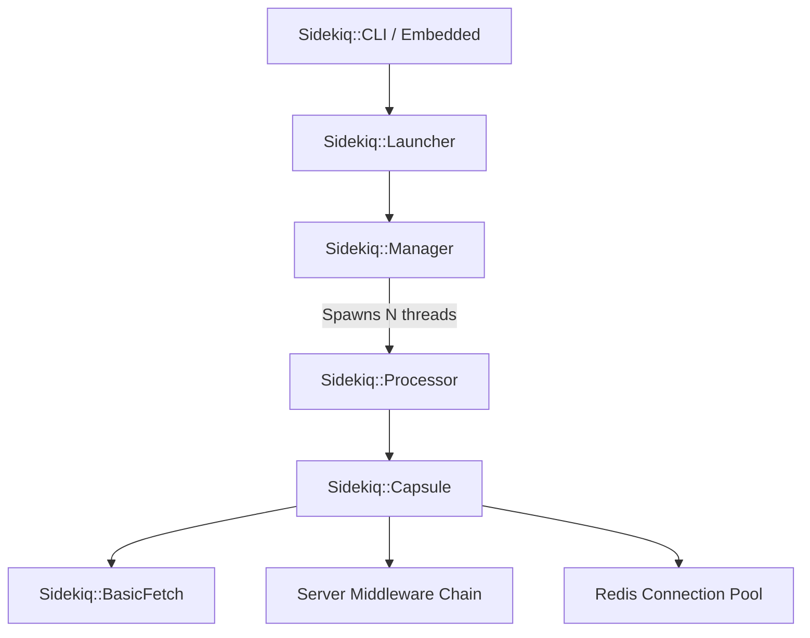
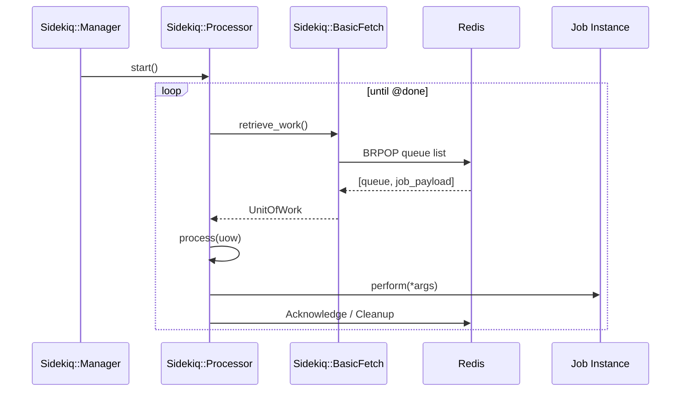

# Worker Processing

<details>
<summary>Relevant source files</summary>

The following files were used as context for generating this wiki page:

- [lib/sidekiq/cli.rb](https://github.com/sidekiq/sidekiq/blob/main/lib/sidekiq/cli.rb)
- [lib/sidekiq/processor.rb](https://github.com/sidekiq/sidekiq/blob/main/lib/sidekiq/processor.rb)
- [lib/sidekiq/api.rb](https://github.com/sidekiq/sidekiq/blob/main/lib/sidekiq/api.rb)
- [lib/sidekiq/client.rb](https://github.com/sidekiq/sidekiq/blob/main/lib/sidekiq/client.rb)
- [lib/sidekiq/web/application.rb](https://github.com/sidekiq/sidekiq/blob/main/lib/sidekiq/web/application.rb)
- [docs/capsule.md](https://github.com/sidekiq/sidekiq/blob/main/docs/capsule.md)
- [lib/sidekiq/scheduled.rb](https://github.com/sidekiq/sidekiq/blob/main/lib/sidekiq/scheduled.rb)
- [README.md](https://github.com/sidekiq/sidekiq/blob/main/README.md)
- [docs/internals.md](https://github.com/sidekiq/sidekiq/blob/main/docs/internals.md)
- [lib/sidekiq/manager.rb](https://github.com/sidekiq/sidekiq/blob/main/lib/sidekiq/manager.rb)
- [lib/sidekiq/capsule.rb](https://github.com/sidekiq/sidekiq/blob/main/lib/sidekiq/capsule.rb)
- [lib/sidekiq/fetch.rb](https://github.com/sidekiq/sidekiq/blob/main/lib/sidekiq/fetch.rb)
- [docs/7.0-Upgrade.md](https://github.com/sidekiq/sidekiq/blob/main/docs/7.0-Upgrade.md)
- [lib/sidekiq/embedded.rb](https://github.com/sidekiq/sidekiq/blob/main/lib/sidekiq/embedded.rb)
- [myapp/app/jobs/post_updater.rb](https://github.com/sidekiq/sidekiq/blob/main/myapp/app/jobs/post_updater.rb)
- [bare/boot.rb](https://github.com/sidekiq/sidekiq/blob/main/bare/boot.rb)
- [docs/Pro-2.0-Upgrade.md](https://github.com/sidekiq/sidekiq/blob/main/docs/Pro-2.0-Upgrade.md)
- [docs/4.0-Upgrade.md](https://github.com/sidekiq/sidekiq/blob/main/docs/4.0-Upgrade.md)
- [myapp/config/initializers/sidekiq.rb](https://github.com/sidekiq/sidekiq/blob/main/myapp/config/initializers/sidekiq.rb)
- [docs/8.0-Upgrade.md](https://github.com/sidekiq/sidekiq/blob/main/docs/8.0-Upgrade.md)
- [docs/menu.md](https://github.com/sidekiq/sidekiq/blob/main/docs/menu.md)
</details>

## Overview

Worker processing in Sidekiq forms the core runtime engine responsible for retrieving jobs from Redis queues, coordinating thread concurrency, executing server-side middleware, and invoking job performance methods. Rather than delegating background processing to external worker managers or heavy process pools, Sidekiq embeds a robust multi-threaded architecture inside each OS process, driven by the `Sidekiq::Manager` and executed via standalone `Sidekiq::Processor` threads.

Sources: [lib/sidekiq/processor.rb:10-24](https://github.com/sidekiq/sidekiq/blob/main/lib/sidekiq/processor.rb#L10-L24)

The system solves the high-overhead and serialization bottlenecks common in traditional background job frameworks by maintaining a dedicated connection pool per execution container (`Sidekiq::Capsule`) and utilizing blocking Redis operations (`BRPOP`) to fetch jobs concurrently. Design decisions prioritize at-least-once execution guarantees, strict thread isolation to prevent cross-contamination between failing jobs, and rapid shutdown mechanisms that safely push interrupted jobs back to Redis before thread termination.

Sources: [lib/sidekiq/manager.rb:6-19](https://github.com/sidekiq/sidekiq/blob/main/lib/sidekiq/manager.rb#L6-L19)

Worker processing integrates tightly with adjacent components such as `Sidekiq::Fetcher` for queue polling strategies, `Sidekiq::JobRetry` for failure handling and retries, and `Sidekiq::ServerMiddleware` for request-lifecycle hooks. Understanding its internal control flow reveals how Sidekiq manages thread lifecycles, handles malformed JSON payloads, and interfaces with application frameworks like Rails via code reloaders.

Sources: [docs/internals.md:35-41](https://github.com/sidekiq/sidekiq/blob/main/docs/internals.md#L35-L41)

## Architecture and Component Hierarchy

The worker processing subsystem is structured hierarchically, descending from application initialization down to individual thread execution units. At the top level, `Sidekiq::CLI` or `Sidekiq::Embedded` boots the configuration and launches a `Sidekiq::Launcher`, which subsequently instantiates a `Sidekiq::Manager` for each configured `Sidekiq::Capsule`.

Sources: [lib/sidekiq/cli.rb:122-125](https://github.com/sidekiq/sidekiq/blob/main/lib/sidekiq/cli.rb#L122-L125)

Each `Sidekiq::Capsule` defines a set of queues, an execution concurrency level, server middleware chains, and a dedicated Redis connection pool sized to match its concurrency. The `Sidekiq::Manager` is the central coordination point that spawns and oversees N `Sidekiq::Processor` instances, corresponding directly to the configured concurrency limit.

Sources: [lib/sidekiq/manager.rb:26-37](https://github.com/sidekiq/sidekiq/blob/main/lib/sidekiq/manager.rb#L26-L37)



Sources: [lib/sidekiq/capsule.rb:6-20](https://github.com/sidekiq/sidekiq/blob/main/lib/sidekiq/capsule.rb#L6-L20)

## The Processor Lifecycle and Execution Flow

A `Sidekiq::Processor` operates as a standalone Ruby thread dedicated to fetching units of work, processing job payloads, handling exceptions, and coordinating callbacks with its parent manager. When started via `Sidekiq::Processor#start`, the processor sets its thread-local capsule context and enters a processing loop until a shutdown signal is received.

Sources: [lib/sidekiq/processor.rb:67-69](https://github.com/sidekiq/sidekiq/blob/main/lib/sidekiq/processor.rb#L67-L69)

The execution walkthrough for a single iteration of work proceeds through the following named methods:
1. `Sidekiq::Manager#initialize` instantiates `Processor` instances with a callback pointing to `Sidekiq::Manager#processor_result`.
2. `Sidekiq::Processor#start` wraps `run` in a safe thread named after the capsule (`#{capsule.name}/processor`).
3. `Sidekiq::Processor#run` sets `Thread.current[:sidekiq_capsule]` and loops over `process_one until @done`.
4. `Sidekiq::Processor#process_one` invokes `fetch`, which calls `get_one` on the capsule's fetcher (`Sidekiq::BasicFetch#retrieve_work`).
5. `Sidekiq::Processor#process` takes the unit of work (`uow`), parses the JSON payload, executes server middleware, and invokes the job instance method.

Sources: [lib/sidekiq/processor.rb:73-90](https://github.com/sidekiq/sidekiq/blob/main/lib/sidekiq/processor.rb#L73-L90), [lib/sidekiq/fetch.rb:39-50](https://github.com/sidekiq/sidekiq/blob/main/lib/sidekiq/fetch.rb#L39-L50)



Sources: [lib/sidekiq/manager.rb:34-37](https://github.com/sidekiq/sidekiq/blob/main/lib/sidekiq/manager.rb#L34-L37)

## Job Dispatch, Deletion, and Unit of Work Processing

Once a job payload string is retrieved from Redis via `Sidekiq::BasicFetch`, `Sidekiq::Processor#process` parses the job string and passes control to `dispatch`. Malformed JSON payloads bypass normal execution, going straight to the dead set.

Sources: [lib/sidekiq/processor.rb:167-186](https://github.com/sidekiq/sidekiq/blob/main/lib/sidekiq/processor.rb#L167-L186)

The verified call chain for processing and completing a job follows: `process` → `dispatch` → `stats` → `delete`. Inside `dispatch`, the job runs through global retries, loggers, stats tracking blocks, profiling, and reloaders. The `stats` method updates `WORK_STATE`, executes the performance block, increments failure counts if an exception occurs, and in its `ensure` block deletes work state and calls `PROCESSED.incr`. Once execution finishes successfully, `process` ensures `uow.acknowledge` is invoked, which calls `delete` to remove the job from its queue when applicable.

Sources: [lib/sidekiq/processor.rb:166-224](https://github.com/sidekiq/sidekiq/blob/main/lib/sidekiq/processor.rb#L166-L224), [lib/sidekiq/processor.rb:284-296](https://github.com/sidekiq/sidekiq/blob/main/lib/sidekiq/processor.rb#L284-L296)

```ruby
      job_hash = nil
      begin
        job_hash = Sidekiq.load_json(jobstr)
      rescue => ex
        now = Time.now.to_f
        redis do |conn|
          conn.multi do |xa|
            xa.zadd("dead", now.to_s, jobstr)
            xa.zremrangebyscore("dead", "-inf", now - @capsule.config[:dead_timeout_in_seconds])
            xa.zremrangebyrank("dead", 0, - @capsule.config[:dead_max_jobs])
          end
        end
        handle_exception(ex, {context: "Invalid JSON for job", jobstr: jobstr})
        return uow.acknowledge
      end
```

Sources: [lib/sidekiq/processor.rb:171-186](https://github.com/sidekiq/sidekiq/blob/main/lib/sidekiq/processor.rb#L171-L186)

Inside `Sidekiq::Processor#dispatch`, the job execution wraps around global and local retry handlers, metrics stats, code reloader execution blocks, constantization of the job class, instantiation, and middleware invocation:

Sources: [lib/sidekiq/processor.rb:127-160](https://github.com/sidekiq/sidekiq/blob/main/lib/sidekiq/processor.rb#L127-L160)

```ruby
    def dispatch(job_hash, queue, jobstr)
      @job_logger.prepare(job_hash) do
        @retrier.global(jobstr, queue) do
          @job_logger.call(job_hash, queue) do
            stats(jobstr, queue) do
              profile(job_hash) do
                @reloader.call do
                  klass = Object.const_get(job_hash["class"])
                  instance = klass.new
                  instance.jid = job_hash["jid"]
                  instance._context = self
                  @retrier.local(instance, jobstr, queue) do
                    yield instance
                  end
                end
              end
            end
          end
        end
      end
    end
```

Sources: [lib/sidekiq/processor.rb:127-160](https://github.com/sidekiq/sidekiq/blob/main/lib/sidekiq/processor.rb#L127-L160)

## Concurrency, Thread Safety, and Work State Tracking

Sidekiq tracks active worker threads and their payloads using process-local thread-safe data structures inside `Sidekiq::Processor`. Two primary classes manage thread synchronization: `Counter` for atomic integer increments and `SharedWorkState` for tracking active thread assignments across Ruby runtimes (such as JRuby where standard Hashes are not thread-safe).

Sources: [lib/sidekiq/processor.rb:234-252](https://github.com/sidekiq/sidekiq/blob/main/lib/sidekiq/processor.rb#L234-L252)

```ruby
    class Counter
      def initialize
        @value = 0
        @lock = Mutex.new
      end

      def incr(amount = 1)
        @lock.synchronize { @value += amount }
      end

      def reset
        @lock.synchronize {
          val = @value
          @value = 0
          val
        }
      end
    end
```

Sources: [lib/sidekiq/processor.rb:234-251](https://github.com/sidekiq/sidekiq/blob/main/lib/sidekiq/processor.rb#L234-L251)

```ruby
    class SharedWorkState
      def initialize
        @work_state = {}
        @lock = Mutex.new
      end

      def set(tid, hash)
        @lock.synchronize { @work_state[tid] = hash }
      end

      def delete(tid)
        @lock.synchronize { @work_state.delete(tid) }
      end

      def dup
        @lock.synchronize { @work_state.dup }
      end

      def size
        @lock.synchronize { @work_state.size }
      end

      def clear
        @lock.synchronize { @work_state.clear }
      end
    end
```

Sources: [lib/sidekiq/processor.rb:253-279](https://github.com/sidekiq/sidekiq/blob/main/lib/sidekiq/processor.rb#L253-L279)

## Manager Coordination and Failure Isolation

The `Sidekiq::Manager` oversees the lifecycle of all processors belonging to a specific capsule. When a processor encounters an unhandled exception or exits abnormally, its callback invokes `Sidekiq::Manager#processor_result`. The manager synchronizes access, removes the dead processor, and—if the manager is not shutting down and current worker count is below concurrency limits—immediately instantiates and starts a replacement processor.

Sources: [lib/sidekiq/manager.rb:6-19](https://github.com/sidekiq/sidekiq/blob/main/lib/sidekiq/manager.rb#L6-L19)

```ruby
    def processor_result(processor, reason = nil)
      @plock.synchronize do
        @workers.delete(processor)
        if !@done && @count > @workers.size
          p = Processor.new(@config, &method(:processor_result))
          @workers << p
          p.start
        end
      end
      nil
    end
```

Sources: [lib/sidekiq/manager.rb:69-79](https://github.com/sidekiq/sidekiq/blob/main/lib/sidekiq/manager.rb#L69-L79)

> [!NOTE]
> Processor replacement guarantees that a faulty job or memory corruption within a single thread execution context does not degrade the overall process concurrency pool, ensuring continuous throughput for subsequent jobs.

Sources: [lib/sidekiq/manager.rb:12-16](https://github.com/sidekiq/sidekiq/blob/main/lib/sidekiq/manager.rb#L12-L16)

## Shutdown Handling and Graceful Draining

When a Sidekiq process receives a shutdown signal (`TERM` or `INT`), `Sidekiq::Manager#stop` initiates a phased shutdown procedure:

Sources: [lib/sidekiq/manager.rb:51-67](https://github.com/sidekiq/sidekiq/blob/main/lib/sidekiq/manager.rb#L51-L67)

1. **Quiet Phase:** `quiet` sets `@done = true` and invokes `Processor#terminate` on all active worker threads. Processors stop fetching new work from Redis.
2. **Grace Period:** The manager pauses for `PAUSE_TIME` and waits up to the configured shutdown deadline (`deadline`) for busy worker threads to complete their current jobs.
3. **Hard Shutdown:** If the deadline expires and busy threads remain, `hard_shutdown` extracts unfinished units of work, bulk-requeues them back to their respective Redis queues, and calls `Processor#kill` to raise `Sidekiq::Shutdown` on stubborn threads.

Sources: [lib/sidekiq/manager.rb:87-119](https://github.com/sidekiq/sidekiq/blob/main/lib/sidekiq/manager.rb#L87-L119)

```ruby
        # Re-enqueue unfinished jobs
        # NOTE: You may notice that we may push a job back to redis before
        # the thread is terminated. This is ok because Sidekiq's
        # contract says that jobs are run AT LEAST once. Process termination
        # is delayed until we're certain the jobs are back in Redis because
        # it is worse to lose a job than to run it twice.
        capsule.fetcher.bulk_requeue(jobs)
```

Sources: [lib/sidekiq/manager.rb:101-107](https://github.com/sidekiq/sidekiq/blob/main/lib/sidekiq/manager.rb#L101-L107)

> [!IMPORTANT]
> Sidekiq guarantees **at-least-once** execution. Jobs are explicitly pushed back to Redis *before* hard-killing the worker thread to prevent job loss during abrupt container or process termination.

Sources: [lib/sidekiq/manager.rb:101-107](https://github.com/sidekiq/sidekiq/blob/main/lib/sidekiq/manager.rb#L101-L107)

## Configuration Options and Constants

The worker processing subsystem behavior is governed by several configuration parameters and interrupt handling constants defined across CLI, Manager, and Processor modules.

Sources: [lib/sidekiq/cli.rb:289-298](https://github.com/sidekiq/sidekiq/blob/main/lib/sidekiq/cli.rb#L289-L298)

| Option / Constant | Type | Default | Description |
| :--- | :--- | :--- | :--- |
| `concurrency` | Integer | `5` (Default Capsule) | Number of concurrent processor threads per capsule |
| `timeout` | Integer | `25` | Shutdown timeout in seconds before hard-killing busy threads |
| `dead_timeout_in_seconds` | Integer | `15552000` (6 months) | Retention period for dead jobs in the morgue |
| `dead_max_jobs` | Integer | `10000` | Maximum number of dead jobs retained in Redis |
| `IGNORE_SHUTDOWN_INTERRUPTS` | Hash | `{Sidekiq::Shutdown => :never}` | Thread interrupt mask during critical dispatch sections |
| `ALLOW_SHUTDOWN_INTERRUPTS` | Hash | `{Sidekiq::Shutdown => :immediate}` | Thread interrupt mask during standard job execution |

Sources: [lib/sidekiq/processor.rb:162-165](https://github.com/sidekiq/sidekiq/blob/main/lib/sidekiq/processor.rb#L162-L165)

## Related

- [[Execution Capsules]]
- [[Job Retry Handling]]
- [[Middleware Processing]]

